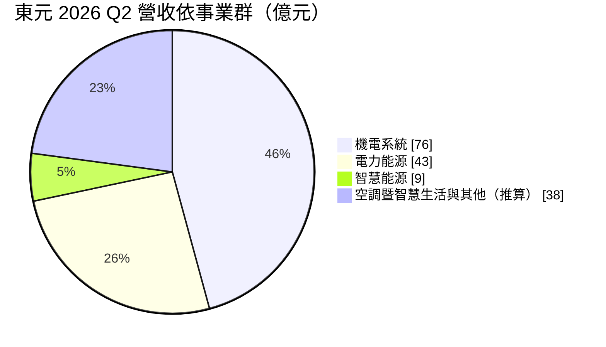
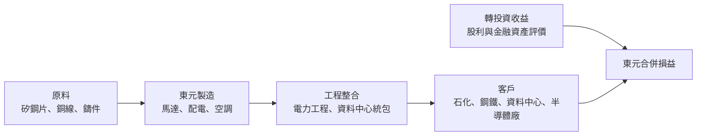
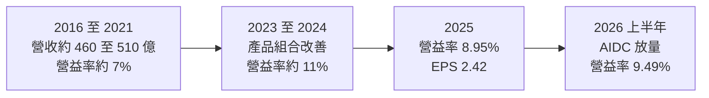
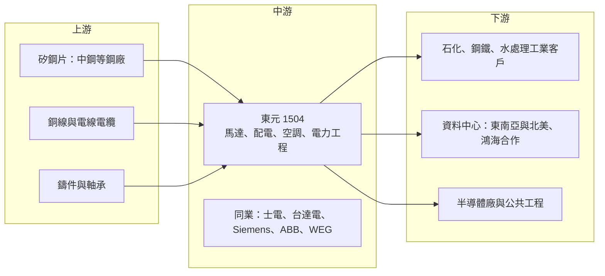

# 1504 東元

> 上市｜[[產業索引-電機機械|電機機械]]｜上市（櫃）日期 1973/11/05

# 第一章：企業模式與商業藍圖

> [!info] 撰寫說明
> 本文由 Claude 依公開資料整理，架構比照 [[2330台積電]] 的四章研究，資料截至 2026-10-08。財務數字來源：Goodinfo 年度經營績效頁、證交所開放資料（基本資料、綜合損益、資產負債、營益分析、股利、本益比殖利率）、富果研究 2026 年 8 月法說會整理、優分析法說報導；產業描述為整理性內容，尚未逐條比對原始文件。#待校對

評估一家老牌機電集團的長期價值，要同時看它的本業競爭力，以及它如何運用累積的資產與人脈開創新事業。本章針對東元電機（股票代號：1504，以下簡稱東元）的商業模式進行定性分析，說明它如何從馬達與家電製造商，轉型為以工業馬達與資料中心電力為核心的機電整合公司。

## 一、核心定位：以大型馬達為核心的機電整合集團

東元成立於 1956 年，1973 年上市，是台灣最具代表性的電機製造商之一，早期以馬達起家，後來擴展到家電、空調與電力工程。東元目前的組織分為四大事業群：機電系統（工業馬達與驅動）、電力能源（配電、電力工程與資料中心相關業務，2026 年由原智慧能源事業群改組而來）、智慧能源（自動化產品）以及空調暨智慧生活（商用與家用空調、家電）。

東元的核心競爭力在於大型工業馬達。這類馬達用於石化廠的幫浦與壓縮機、鋼廠、水處理廠與發電廠，每台都需要依現場條件客製，且一旦故障會造成整條生產線停擺，客戶非常重視可靠度與售後服務。東元在美國、中國與台灣都有大型馬達的銷售與服務網絡，這是它和一般電機廠最大的差異。

這個定位帶來兩個重要的商業意義：

* **工業馬達是穩定的現金來源：** 工業馬達的需求與全球製造業、石化與能源投資連動，雖有週期，但不像消費性電子那樣劇烈。2026 年法說會指出，美國 1 至 7 月大馬達接單年增近 30%，主要受資料中心與石化產業帶動。
* **電力工程經驗是轉型的基礎：** 東元長期以[[統包工程]]方式承攬工廠與公共工程的機電專案，累積了從能源診斷到系統整合的工程能力。這讓它能在 AI 資料中心建設潮中，從單純的設備供應商升級為提供配電、[[匯流排]]、[[模組化資料中心]]等整體方案的整合商。

## 二、終端應用板塊：機電系統與電力能源為主

依 2026 年第二季法說會揭露的事業群營收如下：

註：機電系統、電力能源、智慧能源為法說會揭露數字，空調與其他的 38 億元為合併營收 166 億元減去前三項的推算值。

* **機電系統：** 工業馬達、大型馬達與驅動器，是東元最大的事業群。2026 年第二季營收 76 億元、年增 12.9%，中國、台灣與北美都有雙位數成長。法說會也提到 800 至 1,000 馬力的大型幫浦馬達需求至少倍增。
* **電力能源：** 包括配電設備、電力工程、[[離岸風電]]工程與資料中心相關業務。2026 年第二季營收 43 億元、年增 11.1%，是整體毛利率提升的關鍵。法人估計 AI 資料中心（[[AIDC]]）相關營收占此事業群的比重，將從 2025 年的高個位數提高到三成以上。
* **智慧能源：** 自動化產品，如[[變頻器]]、伺服器與控制器，2026 年第二季營收 9 億元、年增 21%。
* **空調暨智慧生活：** 東元正在減少家用空調，聚焦毛利較高的商用空調，因此這個事業群營收年減約一成，但商用空調維持雙位數成長。

## 三、資本轉化邏輯：製造、工程與轉投資三條腿

東元的獲利來源可以分成三部分：

* **製造業務：** 工業馬達、配電設備與空調的製造毛利，是東元最主要的營業利益來源。2026 年上半年毛利率 24.37%、營業利益率 9.49%（證交所營益分析），屬於成熟製造業的穩健水準。
* **工程整合：** 從單一設備延伸到配電盤、匯流排、模組化資料中心與電力工程，可以提高每個專案的金額與客戶黏著度。法說會提到馬來西亞匯流排廠在 2026 年 7 月接到首筆資料中心訂單，吉隆坡 2.7MW 模組化資料中心概念驗證專案預計 2026 年 9 至 10 月完成。
* **轉投資收益：** 東元持有多家上市櫃與非上市公司股權，這些投資每年帶來股利與評價收益。2026 年上半年營業外收支約 17.9 億元（證交所資料），相當於營業利益 29.3 億元的六成左右，說明業外收益對東元的稅後淨利影響很大。分析東元時必須區分本業與業外。

## 四、企業長期藍圖：綠能、電氣化與重點區域市場

東元把長期策略歸納為四大主軸：綠能[[儲能]]、電氣化、節能減碳、重點區域市場。具體布局包括：

* **東南亞資料中心：** 透過併購泰國 Danasai 團隊（2026 年 8 月底交割）成立資料中心專責子公司，並在馬來西亞設立匯流排廠。法說會指出東南亞資料中心訂單約占整體接單三成。
* **海外製造據點：** 在印尼啟動變壓器建廠計畫，目標爭取美國市場訂單；在中國無錫啟動大型冰水主機的暖通廠建廠計畫。
* **綠電與儲能：** 與半導體大廠簽訂綠電轉供合約（[[PPA]]），預計轉供裝置容量超過 30MW；在澳洲維多利亞州推動太陽能與儲能專案。
* **新事業：** 礦用卡車電動動力系統、重載型無人機、機器人關鍵模組等，目前仍在樣機與早期階段。

這些布局顯示東元正在從「賣馬達的公司」轉向「提供電氣化解決方案的公司」，但新事業的規模仍小，能否成功轉型需要長期觀察。

# 第二章：護城河深度與競爭優勢

護城河分析的核心問題是：這家公司的優勢能否在十年後依然存在？本章針對東元的競爭優勢進行拆解，並與國內外機電同業比較，評估它在電氣化與資料中心浪潮中的位置。

## 一、護城河的核心組成要素

* **大型馬達的技術與服務網絡：** 大型工業馬達需要依現場條件客製，且停機成本極高，客戶重視品牌信譽與售後服務。東元在美國、中國與台灣累積了數十年的大型馬達安裝實績與服務據點，這是新進者難以在短時間內複製的。
* **一站式機電整合能力：** 從馬達、配電、空調到電力工程，東元能提供工廠或資料中心大部分的機電設備與施工。這讓它在大型專案中可以爭取較大的份額，也是它能從設備商升級為資料中心整合商的基礎。
* **財務實力與轉投資組合：** 東元權益總計超過 1,000 億元，持有多項轉投資，財務穩健，能承受新事業的長期投入與海外擴張的風險。
* **品牌與政府、大企業關係：** 作為台灣老牌電機廠，東元長期參與公共工程與大型企業專案，在國內市場有穩固的關係網絡。

## 二、全球主要競爭對手格局

| 公司 | 所在地 | 定位與強項 | 與東元的關係 |
|---|---|---|---|
| Siemens、ABB | 歐洲 | 全球工業馬達、驅動與電力設備龍頭 | 大型馬達與驅動的主要國際對手 |
| WEG | 巴西 | 全球大型電機廠，價格與規模具競爭力 | 北美與新興市場馬達的競爭者 |
| Nidec（日本電產） | 日本 | 馬達大廠，積極併購工業馬達事業 | 工業馬達的競爭者 |
| 臥龍電驅 | 中國 | 中國大型電機廠，成本優勢明顯 | 中國與新興市場的價格競爭者 |
| [[2308台達電]] | 台灣 | 資料中心電源與自動化龍頭 | 資料中心電力與自動化的競爭者 |
| [[1503士電]] | 台灣 | 變壓器與配電設備龍頭 | 配電設備與工程的國內競爭者 |
| 大金、開利 | 日本、美國 | 全球空調龍頭 | 商用空調的主要對手 |

從格局來看，東元在大型工業馬達具有區域性的領先地位，但規模不及 Siemens、ABB 等國際巨頭。在資料中心電力領域，它是相對新的參與者，需要與台達電及國際電氣大廠競爭。

## 三、優勢轉化：守得住、守不住與觀察重點

* **守得住：** 美國與台灣的大型工業馬達市場。這個市場重視可靠度與服務，東元的安裝實績與服務網絡構成實質門檻，加上美國石化與資料中心投資帶動需求，這是東元最穩固的基本盤。
* **守不住：** 家用空調與一般家電。這個市場品牌競爭激烈、價格壓力大，東元已主動縮減家用空調，代表管理層也認為這部分不具長期優勢。
* **觀察重點：** 第一，東南亞資料中心業務能否在 2027 年後成為穩定的營收來源；第二，印尼變壓器廠能否打入美國市場；第三，業外收益占稅前淨利的比重能否逐步下降，讓本業成為主要獲利來源。

# 第三章：財務體質與盈利規模

資料日期：2026-10-08。數字取自 Goodinfo 年度經營績效頁與證交所開放資料，表格是撰寫當時的快照；最新月營收、毛利率、累計 EPS 由自動排程寫在本筆記的屬性欄位（月營收、毛利率、累計EPS 等）。#待校對

財務報表是檢驗護城河是否真實存在的最終標準。本章用多年度的三率、ROE 與資本報酬，檢視東元本業與轉投資的獲利結構。

## 一、獲利能力的基石：三率

| 年度 | 營收（新台幣） | [[毛利率]] | [[營業利益率]] | EPS（元） | [[ROE]] |
|---|---|---|---|---|---|
| 2016 | 499 億 | 26.3% | 8.39% | 1.76 | 7.53% |
| 2017 | 509 億 | 23.9% | 6.86% | 1.56 | 6.24% |
| 2018 | 501 億 | 24.1% | 7.03% | 1.59 | 5.97% |
| 2019 | 479 億 | 24.0% | 7.38% | 1.65 | 5.86% |
| 2020 | 458 億 | 23.5% | 7.71% | 1.81 | 5.89% |
| 2021 | 512 億 | 22.3% | 7.34% | 2.38 | 6.74% |
| 2022 | 583 億 | 22.6% | 8.7% | 1.64 | 4.39% |
| 2023 | 594 億 | 25.2% | 11.2% | 2.76 | 7.33% |
| 2024 | 552 億 | 25.6% | 11.3% | 2.73 | 7.43% |
| 2025 | 591 億 | 23.8% | 8.95% | 2.42 | 6.25% |
| 2026 上半年 | 308.4 億 | 24.37% | 9.49% | 1.63 | 未查得 |

註：2016 至 2025 年取自 Goodinfo；2026 上半年取自證交所綜合損益與營益分析開放資料。證交所股利資料中 2025 年度本期淨利約 52.4 億元，與 Goodinfo EPS 2.42 元換算的金額略有差異，以年報為準。

* **[[毛利率]]：** 東元的毛利率長期穩定在 22% 至 26% 之間，十年間變化不大，反映工業馬達與機電產品的成熟特性。
* **[[營業利益率]]：** 長期在 7% 至 11% 之間，2023 至 2024 年因產品組合改善曾升到 11% 以上，2025 年回落到 8.95%。營業費用率長期約 14% 至 16%，代表東元有龐大的銷售與服務網絡成本。
* **業外收益的重要性：** 2026 年上半年營業利益約 29.3 億元，營業外收支約 17.9 億元，稅後純益率 12.81% 遠高於營業利益率 9.49%（證交所資料）。東元的 EPS 有相當比例來自轉投資的股利與金融資產評價，波動也因此較大。
* **營收趨勢：** 2020 年至 2025 年營收從 458 億元成長到 591 億元，年複合成長率約 5.2%（推算），屬於成熟企業的溫和成長。

## 二、[[ROE]]：資本效率

東元的 ROE 長期偏低，2021 至 2025 年平均約 6.4%（推算），十年間從未超過 8%。主要原因是權益基礎龐大：2026 年第二季底歸屬母公司權益約 962 億元，每股淨值 41.02 元（證交所資料），其中其他權益約 137 億元，代表大量的金融資產與轉投資未實現收益。這些資產雖然提供股利與評價收益，但報酬率不高，拉低了整體 ROE。股價淨值比約 1.73 倍（2026 年 10 月初，證交所資料），反映市場對東元轉型前景的部分期待。

## 三、資本支出、自由現金流與股利

東元的資本支出以維護既有工廠與新建海外據點為主，印尼變壓器廠、無錫暖通廠與配電盤產能擴充將在 2026 至 2028 年增加支出（具體金額未查得）。工業製造業的營運現金流通常穩定，加上轉投資股利收入，東元的自由現金流長期為正的可能性高（推估）。

股利方面，2025 年度配發現金股利 2 元，以 EPS 2.42 元計算配發率約 83%（推算）。公司章程規定以發放當年度可分配盈餘的 80% 為原則，現金股利比例以 50% 為原則、最少不低於 5%。實際上近年以現金股利為主，配發率穩定在八成左右。Goodinfo 統計長期一般平均現金股利約 0.96 元，近年股利水準已明顯提高。

## 四、[[ROIC]] 與 [[WACC]]：價值創造利差

**ROIC 推算：** 2025 年營收 591 億元乘以營業利益率 8.95%，營業利益約 52.9 億元，扣除 20% 稅率後約 42.3 億元。2026 年第二季底權益總計約 1,036 億元，總負債約 529 億元，假設其中約四成為有息負債（推估，約 212 億元），投入資本約 1,248 億元，ROIC 約 3.4%（推算）。這個數字偏低，主因是投入資本中包含大量轉投資與金融資產；若扣除其他權益約 137 億元，ROIC 約 3.8%（推算）。若把業外的轉投資收益也計入報酬，整體資本報酬約與 ROE 相近，約 6% 至 7%。

**WACC 推算：** 假設台灣 10 年期公債殖利率 1.75%、市場風險溢酬 6%、β 取傳產電機股常見值 0.8，股東權益成本約 6.55%。負債成本假設 2.5%，稅後約 2.0%。以帳面價值計，權益約占 83%、負債約占 17%，WACC 約 5.8%（推算）。

**結論：** 以本業營業利益計算，東元的 ROIC 長期低於資金成本；把轉投資收益計入後，整體報酬大約與資金成本打平。這代表東元長期處於「穩定經營、但沒有明顯創造價值」的狀態，核心問題在於龐大的資產中有相當部分未投入高報酬的本業。資料中心與電氣化業務若能持續成長，並逐步提高本業的資本報酬率，東元才有機會從資產股轉為成長股。

# 第四章：總體風險與地緣政治

任何企業都無法脫離宏觀環境獨立存在。本章分析東元未來必須面對的地緣政治、產業週期、營運與技術風險。

## 一、地緣政治

* **美國關稅與在地化：** 東元在美國的大型馬達需求強勁，但美國的關稅政策與「美國製造」要求可能影響進口馬達的競爭力。印尼變壓器廠的設立，部分目的就是分散生產據點以因應美國市場。
* **中國市場：** 東元在中國有生產與銷售據點，並計畫在無錫建暖通廠。中國經濟放緩、價格競爭與兩岸關係變化，都會影響這部分業務。
* **東南亞擴張的執行風險：** 泰國、馬來西亞與印尼的布局是東元未來成長的重點，但海外併購與新廠需要時間整合，當地的政治、法規與勞動環境也增加不確定性。

## 二、產業週期與市場結構

* **工業資本支出週期：** 工業馬達需求與石化、鋼鐵、水處理等產業的投資連動，全球製造業景氣下滑時，大型馬達訂單會延後或取消。
* **資料中心投資的持續性：** 東元的新成長動能高度依賴東南亞與北美的資料中心建設，若 AI 投資放緩，相關訂單可能大幅減少。
* **空調市場的價格競爭：** 中國與日本品牌在空調市場的價格與技術競爭激烈，東元縮減家用空調後，商用空調仍面臨大金、開利等大廠的競爭。

## 三、營運環境的隱性風險

* **業外收益的波動：** 東元的稅後淨利有相當比例來自轉投資的股利與金融資產評價，股市下跌時評價損失會直接衝擊 EPS，使獲利波動大於本業。
* **原物料成本：** 矽鋼片、銅線等原物料價格上漲時，若無法即時轉嫁，會壓縮馬達與配電設備的毛利。
* **組織轉型：** 從製造商轉型為解決方案整合商，需要不同的人才與管理模式。新事業如無人機、電動礦卡、機器人模組的投資回收期長，若管理不當可能拖累整體報酬。

## 四、科技演進風險

工業馬達正朝高效率、[[永磁馬達]]與變頻化發展，各國能效法規不斷提高最低效率標準，落後的產品可能被淘汰。資料中心則朝 [[HVDC]] 供電與液冷散熱發展，配電與空調的規格都在改變。東元需要持續投入研發，才能在高效率馬達、資料中心電力與冷卻系統等領域維持競爭力。另一個長期變數是電動車與機器人帶來的新型馬達需求，這些市場的主要玩家與傳統工業馬達不同，東元能否成功切入仍待觀察。

# 專有名詞解析

## 金融

- **[[ROIC]]**：投入資本報酬率，衡量公司每投入一元營運資本能賺回多少稅後營業利益。
- **[[WACC]]**：加權平均資金成本，股東與債權人要求報酬的加權平均，ROIC 高於 WACC 才代表創造價值。

## 產業

- **[[匯流排]]**：以金屬導體排取代電纜來傳輸大電流的配電設備，資料中心與半導體廠常用來提高配電彈性。
- **[[AIDC]]**：AI 資料中心，耗電量遠高於傳統資料中心，帶動變壓器、配電與備援電力設備需求。
- **[[模組化資料中心]]**：在工廠預先組裝好機櫃、配電與冷卻設備，運到現場快速安裝的資料中心形式。
- **[[離岸風電]]**：在海上設置風力發電機組，台灣西部海峽是重要的離岸風場，需要大量電力工程與海纜設備。
- **[[PPA]]**：購售電合約，企業與發電業者簽訂長期合約購買綠電，用來達成減碳目標。
- **[[儲能]]**：以電池等設備儲存電力，在用電尖峰或停電時放電，用於電網調度與企業備援。
- **[[統包工程]]**：由單一廠商負責設計、採購、施工到完工的工程發包模式，承包商承擔較多風險。
- **[[HVDC]]**：高壓直流供電或輸電，在資料中心用於提高供電效率，在電網用於長距離輸電。
- **[[永磁馬達]]**：轉子使用永久磁鐵的馬達，效率高於傳統感應馬達，廣泛用於電動車與高效率工業設備。
- **[[變頻器]]**：調整馬達供電頻率以控制轉速的設備，可大幅降低馬達耗電。

# 核心供應鏈

## 1. 上游：原物料與零組件
- 矽鋼片：[[2002中鋼]]（推估，待校對）
- 銅線與電線電纜：[[1605華新]]、[[1608華榮]]（推估，未查得實際供應關係）

## 2. 中游：東元本身與同業
- 國內同業：[[1503士電]]、[[2308台達電]]、[[1513中興電]]
- 國際同業：Siemens、ABB、WEG、Nidec

## 3. 下游：工業與公共工程客戶
- 石化、鋼鐵、水處理與發電廠（美國、中國、台灣）
- 半導體廠綠電轉供客戶（法說會未具名）

## 4. 下游：資料中心
- 合作夥伴：[[2317鴻海]]
- 東南亞資料中心客戶：馬來西亞、泰國既有客戶（未具名）

## 最新新聞
<!-- news:start（自動產生，請勿手動編輯此範圍） -->
- 2026-10-07 📰 媒體 12:09｜〈焦點股〉東元續攻東南亞AIDC基建商機砸20億元擴大投資 價量齊揚｜[鉅亨網](https://news.cnyes.com/news/id/6623537)

完整紀錄：[[1504東元 新聞]]
<!-- news:end -->

## 相關連結
- [公開資訊觀測站](https://mopsov.twse.com.tw/mops/web/t05st03?step=1&firstin=1&co_id=1504)
- [Goodinfo](https://goodinfo.tw/tw/StockDetail.asp?STOCK_ID=1504)
- [Yahoo 股市](https://tw.stock.yahoo.com/quote/1504)
- [鉅亨網新聞](https://www.cnyes.com/twstock/1504/news)
