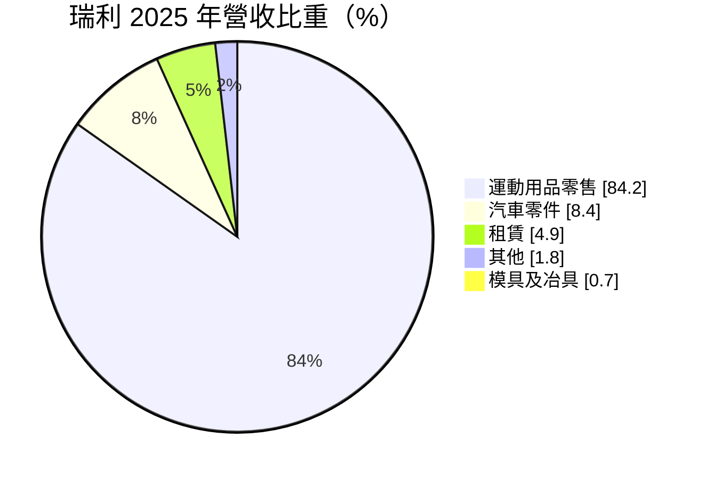
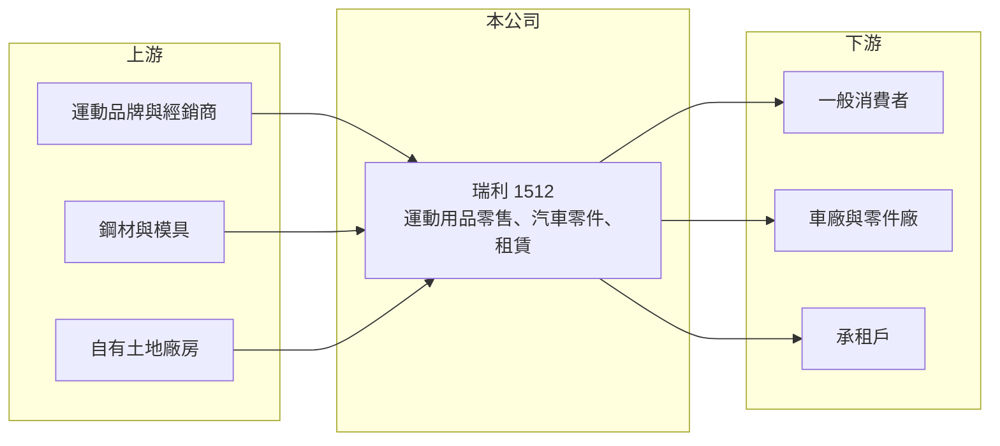

# 1512 瑞利

> 上市｜[[產業索引-汽車工業|汽車工業]]｜上市（櫃）日期 1994/01/28

# 第一章：企業模式與商業藍圖

> [!info] 撰寫說明
> 精簡版，由 Claude 依公開資料整理，架構比照 [[2330台積電]] 的四章研究，資料截至 2026-10-08。財務數字來源：Goodinfo 年度經營績效頁、MoneyDJ 個股基本資料（2025 年營收比重）、證交所開放資料（基本資料、2026 年第二季資產負債與綜合損益、營益分析、股利、本益比）。零售通路品牌與轉型過程本文未查得完整資料。公開資料有限。#待校對

在評估單一個股的長期價值時，首要步驟是拆解企業的獲利來源。本章說明瑞利企業（股票代號：1512，以下簡稱瑞利）如何從汽車零件製造商，轉變成以運動用品零售為主的公司。這是一個典型的「本業萎縮、另闢新業」的[[轉型]]案例。

- **核心業務：** 瑞利成立於 1970 年，1994 年上市，總部位於高雄市仁武區，董事長為吳明燦，實收資本額約 9.82 億元。依 MoneyDJ 的 2025 年營收比重，運動用品零售占 84.2%、汽車零件占 8.4%、租賃占 4.9%、其他占 1.8%、模具及冶具占 0.7%。雖然證交所仍把它歸在汽車工業類，但營收主體已經是零售業。
- **轉型的背景：** 瑞利營收在 2016 年約 41.9 億元，2022 年只剩 7.75 億元（Goodinfo），汽車零件業務大幅萎縮；2023 年後營收回到 10 億至 12 億元，毛利率從 2021 年的 0.24% 提升到 2025 年的 32.1%。毛利率的跳升符合零售業的特性：零售商買進商品再加價賣出，毛利率通常在三成以上，但需要負擔門市租金與人事等高額營業費用。運動用品零售的具體通路品牌與門市數本文未查得。#待校對
- **租賃業務：** 瑞利持有土地與廠房，汽車零件產能縮減後，部分資產轉為出租，提供穩定但規模小的收入。
- **長期方向：** 瑞利的長期價值取決於零售業務能否達到足以支撐費用的規模。2025 年營業利益率已縮小到 -2.38%，接近損益兩平，若能持續改善，公司可能逐步擺脫多年的虧損。

# 第二章：護城河深度與競爭優勢

本章分析瑞利的競爭優勢與限制。坦白說，以目前的規模與財務狀況，瑞利尚未建立明確的護城河。

- **競爭優勢：** 零售業的優勢來自品牌代理權、門市地點與會員經營。瑞利若取得特定運動品牌的代理或經銷權，就能在該品牌的通路上享有一定的保護，但具體情況本文未查得。另一項資產是自有土地，可以降低部分營運成本或提供租金收入。
- **限制：** 運動用品零售是高度競爭的市場，國際品牌直營店、大型連鎖通路與電商平台都在搶同一批消費者。瑞利的零售營收約 10 億元，規模有限，在採購議價與行銷資源上處於劣勢。
- **主要對手：** 國際運動品牌直營門市、大型運動用品連鎖通路、百貨與電商平台；汽車零件方面則與其他車體零件廠競爭。
- **觀察重點：** 第一，零售業務的營業利益率能否轉正並穩定；第二，門市展店或關店的策略；第三，累積虧損何時能彌補，因為這決定公司何時能恢復配發股利。

# 第三章：財務體質與盈利規模

資料日期：2026-10-08，表格是撰寫當時的快照；最新月營收、毛利率、累計 EPS 由自動排程寫在本筆記的屬性欄位（月營收、毛利率、累計EPS 等）。#待校對

本章用多年度的三率、ROE 與資本報酬，檢視瑞利的轉型成果。

| 年度 | 營收（新台幣） | [[毛利率]] | [[營業利益率]] | EPS（元） | [[ROE]] |
|---|---|---|---|---|---|
| 2021 | 10.0 億 | 0.24% | -16.3% | -0.65 | -94.5% |
| 2022 | 7.75 億 | 6.07% | -19.3% | -1.98 | -71.5% |
| 2023 | 11.5 億 | 20.9% | -10.9% | 0.04 | 0.98% |
| 2024 | 10.6 億 | 23.6% | -10.7% | -0.68 | -13.1% |
| 2025 | 11.5 億 | 32.1% | -2.38% | 0.19 | 2.84% |
| 2026 上半年 | 5.52 億 | 33.36% | -4.05% | 0.02 | 未查得 |

註：2021 至 2025 年取自 Goodinfo，2026 上半年取自證交所營益分析；2025 年 EPS 與證交所股利資料的本期淨利 0.19 億元換算結果一致。ROE 的極端數字是因為股東權益很小，波動被放大。

- **營收規模：** 2016 至 2022 年營收從 41.9 億元萎縮到 7.75 億元，2023 年後穩定在 10 億至 12 億元，轉型後的新規模大致成形。
- **獲利結構：** 毛利率逐年提升，但營業費用仍高於毛利，營業利益多年為負。2025 年與 2026 年上半年的小額盈餘都來自業外收益，2026 年上半年營業外收入約 0.25 億元，抵銷了約 0.22 億元的營業虧損（證交所開放資料）。
- **長期指標：** 2016 至 2025 年十年間有八年虧損（Goodinfo），平均 ROE 為大幅負值，2025 年度未配發股利。
- **財務特色：** 2026 年第二季底總負債約 20.6 億元，其中非流動負債約 16.6 億元，權益總計僅約 6.7 億元，負債比約 75%。保留盈餘為 -8.79 億元，其他權益約 5.69 億元（證交所開放資料），每股淨值約 6.84 元，已低於面額 10 元。非流動負債偏高，推估包含門市租約認列的[[租賃負債]]與長期借款。#待校對

**[[ROIC]] 與 [[WACC]]：** 2025 年營業利益約 11.5 億元 ×（-2.38%）≈ -0.27 億元，稅後營業利益為負，ROIC 約 -1.1%（推算；投入資本以權益 6.7 億元加上假設占總負債六成的有息負債約 12.4 億元，合計約 19.1 億元）。WACC 以 CAPM 推估：無風險利率 1.75%、市場風險溢酬 6%，因負債比高、獲利不穩，β 取 1.2，股東權益成本約 8.95%；負債成本 2.5%、稅後 2.0%；權益約占 35%，WACC 約 4.4%（推算）。結論是瑞利長期處於價值流失狀態，轉型讓虧損收斂，但 ROIC 仍為負值，距離創造價值還有一段距離。

# 第四章：總體風險與地緣政治

本章分析瑞利長期面對的風險。

- **產業週期：** 運動用品消費與景氣、運動風氣及品牌流行趨勢相關。消費降溫時零售業的庫存壓力會迅速轉為降價求售，壓縮毛利率。
- **營運風險：** 零售業的固定費用高，門市租金與人事成本占比大，營收若無法成長，營業利益很難轉正。品牌代理關係若生變，對營收的衝擊會很直接。
- **財務風險：** 股東權益薄、負債比高、每股淨值低於面額，財務緩衝有限。若再出現虧損，可能需要減資彌補虧損或增資充實資本，對既有股東不利。
- **其他風險：** 電商平台持續分食實體零售；殘存的汽車零件業務面臨車廠訂單萎縮；轉型方向若再改變，公司策略的可預測性低。

# 專有名詞解析

## 金融

- **[[租賃負債]]**：依國際財務報導準則第 16 號，企業把長期租約未來應付的租金折現後列為負債，零售業門市多時金額會很大。
- **[[毛利率]]**：營業毛利占營收的比例，反映產品定價能力與生產成本控制。
- **[[營業利益率]]**：扣除營業費用後的營業利益占營收的比例，衡量本業整體獲利能力。
- **[[ROE]]**：股東權益報酬率，稅後淨利除以股東權益，衡量公司運用股東資金的效率。
- **[[ROIC]]**：投入資本報酬率，稅後營業利益除以股東權益與有息負債的合計，衡量本業對所有資金提供者的報酬。
- **[[WACC]]**：加權平均資金成本，依股東權益與負債的比重加權計算的資金成本，ROIC 高於它才代表創造價值。

## 產業

- **[[轉型]]**：企業因原有本業萎縮，把資源移往新事業的過程，成敗取決於新事業能否達到損益兩平以上的規模。

# 核心供應鏈

- 上游：運動品牌與經銷商、汽車零件所需的鋼材與模具、自有土地與廠房。
- 下游／客戶：一般消費者、車廠與汽車零件廠、不動產承租戶。
- 同業：運動用品零售通路業者；汽車零件同業 [[1525江申]]、[[1524耿鼎]]。

## 最新新聞
<!-- news:start -->
<!-- news:end -->

## 相關連結
- [公開資訊觀測站](https://mopsov.twse.com.tw/mops/web/t05st03?step=1&firstin=1&co_id=1512)
- [Goodinfo](https://goodinfo.tw/tw/StockDetail.asp?STOCK_ID=1512)
- [Yahoo 股市](https://tw.stock.yahoo.com/quote/1512)
- [鉅亨網新聞](https://www.cnyes.com/twstock/1512/news)
