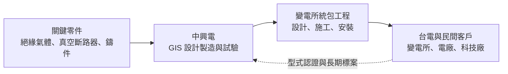
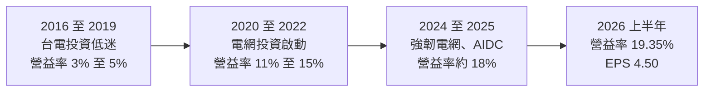
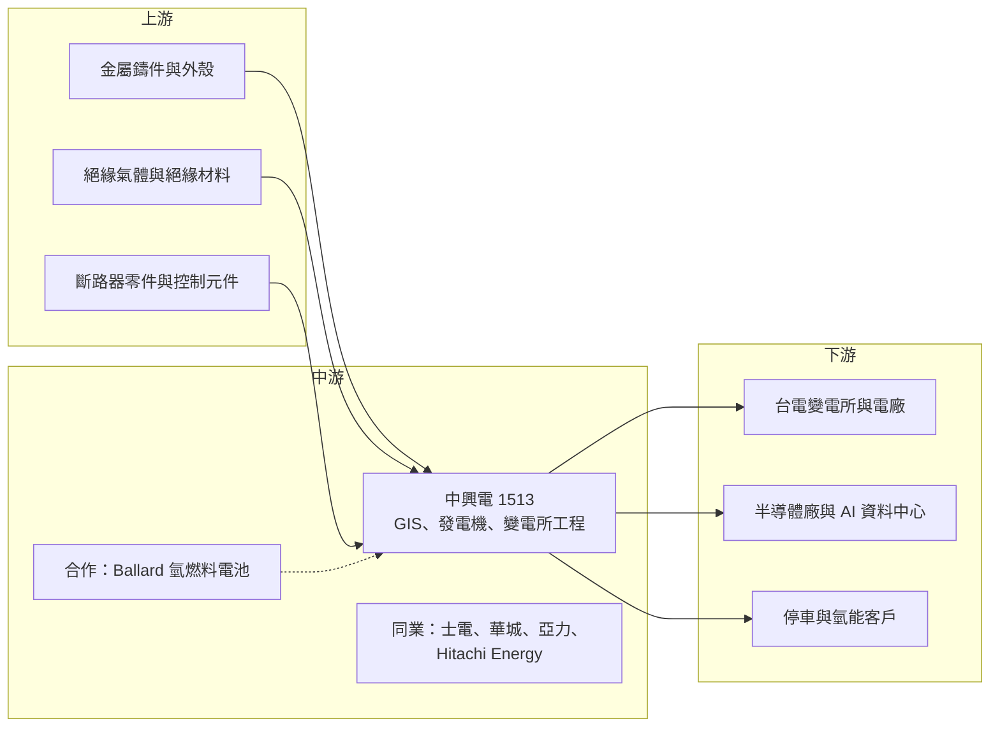

# 1513 中興電

> 上市｜[[產業索引-電機機械|電機機械]]｜上市（櫃）日期 1994/03/08

# 第一章：企業模式與商業藍圖

> [!info] 撰寫說明
> 本文由 Claude 依公開資料整理，架構比照 [[2330台積電]] 的四章研究，資料截至 2026-10-08。財務數字來源：Goodinfo 年度經營績效頁、證交所開放資料（基本資料、綜合損益、資產負債、營益分析、股利、本益比殖利率）、永豐金證券 2026 年 4 月法說會整理、優分析與經濟日報報導；產業描述為整理性內容，尚未逐條比對原始文件。#待校對

評估重電股的長期價值，關鍵在於它在電網中掌握哪一個環節，以及這個環節的進入門檻有多高。本章針對中興電工機械（股票代號：1513，以下簡稱中興電）的商業模式進行定性分析，說明它如何以[[變電所]]核心設備 GIS 建立在台電體系中的關鍵地位，並嘗試以氫能等新事業開拓第二成長曲線。

## 一、核心定位：台電變電所 GIS 的主要供應商

中興電成立於 1956 年，1994 年上市，核心業務是重電設備與電力工程，主要產品是[[GIS]]（氣體絕緣開關設備）、發電機與變電所建置。GIS 是把斷路器、隔離開關、比流器等變電所設備封裝在充滿絕緣氣體的金屬外殼中，佔地只有傳統空氣絕緣變電所的一小部分，因此特別適合都市與工業區等土地昂貴的地方。

優分析整理的資料指出，中興電的 GIS 在台灣市占率約七成，並且是台灣唯一取得台電 345kV GIS 認證的廠商，相關標案幾乎都由它承攬。345kV 是台灣輸電網最高的電壓等級，這類設備的技術門檻與認證要求最高。換句話說，中興電在台電的超高壓變電所建設中，扮演近乎獨家供應商的角色。

這個定位帶來兩個重要的商業意義：

* **與台電長期投資計畫綁定：** 台電在 2022 年大停電後提出[[強韌電網計畫]]，加上未來十年規劃的多項能源開發計畫，帶來大量變電所新建與汰換需求。中興電作為主要 GIS 供應商，營收能見度與台電的投資計畫直接連動。
* **用電需求成長是長期驅動力：** 中興電總經理曾表示「只要用電就需要 GIS」。AI 資料中心（[[AIDC]]）、半導體廠與電氣化都讓用電量增加，而新增的用電需要新的變電所，這為 GIS 提供了長期穩定的需求基礎。

## 二、終端應用板塊：重電為主，新事業為輔

本文查得的公開資料未揭露中興電各事業的營收比重，因此這裡不畫圓餅圖，改以文字說明各業務的相對位置。

* **重電設備與工程：** 包括 GIS、配電盤、發電機與變電所統包工程，是中興電營收與獲利的絕大部分。客戶以台電為主，也包括民間發電廠、半導體廠與 AI 資料中心。2025 年報導指出，台電近年多採[[統包工程]]發包，工程比重上升，而工程毛利率低於 GIS 設備本身，使毛利率略為下滑。
* **停車事業：** 「中興嘟嘟房」在全台約有 340 個停車據點，提供穩定的現金收入，2026 年法說會提到停車事業整併的效益。這是一項與重電無關、但現金流穩定的業務。
* **氫能：** 與加拿大 Ballard 合作[[氫燃料電池]]，並與弘鉅汽車合作開發氫燃料電池巴士，另布局加氫站與備援電力用的燃料電池。報導指出氫能事業目標為損益兩平，短期仍在投入階段。
* **其他：** 航太用動力底盤及發動機零件、磁浮冷卻系統與[[儲能]]案場，規模仍小。

## 三、資本轉化邏輯：認證門檻加上長期標案

中興電的獲利邏輯可以從三個面向理解：

* **認證門檻帶來寡占地位：** 電力公司對 GIS 的型式試驗與認證非常嚴格，345kV 等級更是需要長時間驗證。一旦取得認證，在後續的標案中就具有極大優勢。這種「認證壁壘」是中興電毛利率能長期維持在 25% 以上的原因。
* **[[在手訂單]]提供多年能見度：** 2026 年法說會資料顯示，中興電 2026 年第一季接單 63 億元，累計在手訂單 431 億元，約為 2025 年營收 274.5 億元的 1.6 倍。報導指出訂單能見度約三至五年。
* **擴產以提升效率為主：** 中興電改建嘉義廠房、在林口廠增設倉儲空間，報導指出 2025 年產能提升約 20%，2026 年計畫導入自動化焊接與 AI 報價系統，再增加 15% 至 20% 產能。中興電的擴產規模相對溫和，以提升既有廠房效率為主。

## 四、企業長期藍圖：深耕台電、拓展海外與發展氫能

中興電的長期策略可以歸納為三條主線。第一是深耕台電強韌電網與能源開發計畫的長期訂單，這是公司未來五到十年的基本盤。第二是拓展海外市場，2026 年法說會提到日本、越南與印度市場的布局，報導指出公司希望在未來三至五年擴展國際市場。第三是以氫能、航太等新事業分散營收來源，降低對台電單一客戶的依賴。

從資本配置的角度，中興電的股利政策明訂每年發放可分配盈餘的 50% 至 80% 作為現金股利，屬於穩定配息型的公司。新事業的投入規模目前仍在可控範圍內，不至於影響本業的現金流。

# 第二章：護城河深度與競爭優勢

護城河分析的核心問題是：這家公司的優勢能否在十年後依然存在？本章針對中興電的競爭優勢進行拆解，並與國內外重電同業比較，評估它在台灣 GIS 市場的地位能否持續。

## 一、護城河的核心組成要素

* **345kV GIS 認證：** 中興電是台灣唯一取得台電 345kV GIS 認證的廠商，這是最核心的護城河。超高壓設備的認證需要長期試驗與運轉實績，新進者即使具備技術，也需要多年時間才能取得同等資格。
* **本土製造與服務：** GIS 安裝後需要長期維護，變電所出問題時要能快速搶修。中興電在台灣有工廠與工程團隊，相較於國際大廠的在台代理，能提供更快的回應，這對台電而言是重要的考量。
* **統包工程能力：** 台電近年改採統包發包，要求廠商同時負責設備與施工。中興電同時具備 GIS 製造與變電所工程能力，能在統包標案中提供完整方案。
* **長期客戶關係：** 數十年與台電合作的經驗，讓中興電熟悉台電的規格、流程與驗收標準，這種關係性的優勢不易被取代。

## 二、全球主要競爭對手格局

| 公司 | 所在地 | 定位與強項 | 與中興電的關係 |
|---|---|---|---|
| Hitachi Energy | 瑞士／日本 | 全球 GIS 與輸變電龍頭，超高壓技術領先 | 國際標案與高階 GIS 的主要對手 |
| Siemens Energy | 德國 | 全球輸變電大廠 | 國際 GIS 市場的主要對手 |
| 三菱電機、東芝 | 日本 | 日本 GIS 大廠 | 日本與亞洲市場的競爭者 |
| [[1503士電]] | 台灣 | 變壓器與配電設備龍頭 | 台電統包工程與科技廠配電的競爭者 |
| [[1519華城]] | 台灣 | 電力變壓器專業廠 | 變電所設備的互補與競爭者 |
| [[1514亞力]] | 台灣 | 配電盤、變壓器與電力電子 | 中低壓配電設備的競爭者 |

從格局來看，中興電在台灣高壓與超高壓 GIS 市場具有接近寡占的地位，但在國際市場上，它的規模與技術資源遠不及 Hitachi Energy、Siemens Energy 等巨頭。海外拓展需要面對這些對手的直接競爭。

## 三、優勢轉化：守得住、守不住與觀察重點

* **守得住：** 台電高壓與超高壓 GIS 的主要供應商地位。認證門檻與本土服務優勢，讓這塊市場在未來十年內很難被撼動。
* **守不住：** 統包工程的毛利率。台電改採統包發包後，工程比重上升，而工程的利潤率低於設備，且承包商需承擔施工風險。2025 年第二季毛利率年減 1.3 個百分點，報導指出主因就是工程比重提高。
* **觀察重點：** 第一，台電強韌電網計畫的預算執行與發包進度；第二，海外市場（日本、越南、印度）能否取得具規模的訂單；第三，氫能事業能否如目標達到損益兩平，而不是長期侵蝕本業獲利。

# 第三章：財務體質與盈利規模

資料日期：2026-10-08。數字取自 Goodinfo 年度經營績效頁與證交所開放資料，表格是撰寫當時的快照；最新月營收、毛利率、累計 EPS 由自動排程寫在本筆記的屬性欄位（月營收、毛利率、累計EPS 等）。#待校對

財務報表是檢驗護城河是否真實存在的最終標準。本章用多年度的三率、ROE 與資本報酬，檢視中興電在台電投資週期中的獲利品質。

## 一、獲利能力的基石：三率

| 年度 | 營收（新台幣） | [[毛利率]] | [[營業利益率]] | EPS（元） | [[ROE]] |
|---|---|---|---|---|---|
| 2016 | 127 億 | 14.8% | 3.47% | 1.22 | 6.61% |
| 2017 | 114 億 | 16.0% | 3.66% | 1.19 | 6.81% |
| 2018 | 122 億 | 15.9% | 4.75% | 1.33 | 7.42% |
| 2019 | 124 億 | 16.7% | 5.29% | 1.55 | 8.28% |
| 2020 | 154 億 | 21.3% | 11.2% | 3.59 | 16.6% |
| 2021 | 180 億 | 23.8% | 14.9% | 4.19 | 18.1% |
| 2022 | 185 億 | 25.6% | 15.4% | 5.21 | 20.3% |
| 2023 | 221 億 | 29.0% | 19.8% | 3.25 | 10.8% |
| 2024 | 256 億 | 26.2% | 17.7% | 7.33 | 22.7% |
| 2025 | 274 億 | 25.7% | 18.1% | 8.07 | 21.7% |
| 2026 上半年 | 140.2 億 | 27.30% | 19.35% | 4.50 | 未查得 |

註：2016 至 2025 年取自 Goodinfo；2026 上半年取自證交所綜合損益與營益分析開放資料。2023 年營業利益率為歷年最高，但 EPS 與 ROE 明顯下滑，推估為業外或一次性損失所致，原因未查得。

* **[[毛利率]]：** 2016 至 2019 年中興電毛利率只有 15% 至 17%，2020 年起台電電網投資擴大，毛利率升到 25% 以上，2023 年達 29%。這說明 GIS 等高壓設備在需求旺盛時有很強的定價能力。
* **[[營業利益率]]：** 從 2016 年的 3.47% 升到 2026 年上半年的 19.35%，十年間增加五倍以上。重電業的營業費用相對固定，營收與毛利率同時提升時，營業利益率擴張非常明顯。
* **營收趨勢：** 2020 年至 2025 年營收從 154 億元成長到 274 億元，年複合成長率約 12.2%（推算），成長動能主要來自台電電網投資與民間用電需求。

## 二、[[ROE]]：資本效率

2021 至 2025 年平均 ROE 約 18.7%（推算），若排除 2023 年的異常低點，其餘年度都在 18% 至 23% 之間。2026 年第二季底歸屬母公司權益約 208 億元，每股淨值 42.14 元（證交所資料）。中興電的 ROE 遠高於士電與東元，主因是它在 GIS 市場的寡占地位帶來較高的利潤率，以及較少的閒置資產。

## 三、資本支出、自由現金流與股利

中興電的擴產以改建既有廠房與導入自動化為主，資本支出規模相對溫和（具體金額未查得）。重電業的客戶通常會支付預收款與分期工程款，2026 年第二季底中興電總負債約 273 億元，其中相當部分應為合約負債與應付款（推估），這讓公司在承接大量訂單時不需要大量舉債。

股利方面，2025 年度配發現金股利 6 元，以 EPS 8.07 元計算配發率約 74%（推算）；2024 年 EPS 7.33 元、現金股利 4.6 元，配發率約 63%。公司章程規定每年依可分配盈餘的 50% 至 80% 發放現金股利，政策明確且穩定。

## 四、[[ROIC]] 與 [[WACC]]：價值創造利差

**ROIC 推算：** 2025 年營收 274 億元乘以營業利益率 18.1%，營業利益約 49.7 億元，扣除 20% 稅率後約 39.8 億元。2026 年第二季底權益總計約 212 億元，總負債約 273 億元，其中大部分為合約負債與應付款，假設有息負債約占四分之一（推估，約 68 億元），投入資本約 280 億元，ROIC 約 14.2%（推算）。以 2026 年上半年營業利益 27.1 億元年化計算，ROIC 約 15.5%（推算）。

**WACC 推算：** 假設台灣 10 年期公債殖利率 1.75%、市場風險溢酬 6%、β 取重電股常見值 0.9，股東權益成本約 7.15%。負債成本假設 2.5%，稅後約 2.0%。以帳面價值計，權益約占 76%、負債約占 24%，WACC 約 5.9%（推算）。

**結論：** 2016 至 2019 年台電投資低迷期，中興電的 ROIC 低於資金成本；2020 年以後隨電網投資擴大，ROIC 長期高於 WACC，利差約 8 個百分點（推算）。這代表中興電在本輪電網投資週期中持續創造價值，且價值來源是 GIS 認證帶來的定價能力。長期觀察重點是台電投資週期結束後，ROIC 能否維持在資金成本之上。

# 第四章：總體風險與地緣政治

任何企業都無法脫離宏觀環境獨立存在。本章分析中興電未來必須面對的政策、產業週期、營運與技術風險。

## 一、地緣政治與政策

* **對台電的高度依賴：** 台電是中興電最主要的客戶，台電的投資計畫受政府能源政策、電價政策與立法院預算審議影響。若台電財務壓力導致投資延後，中興電的訂單與出貨都可能受影響。
* **海外擴張的風險：** 日本、越南與印度市場都有各自的電力公司認證制度與本土供應商，中興電需要時間建立信任。報導也指出海外市場受匯率與關稅影響。
* **兩岸風險：** 中興電的生產與客戶都集中在台灣，與其他台灣企業一樣面臨兩岸情勢的長期不確定性。

## 二、產業週期與市場結構

* **電網投資週期：** 中興電的獲利高度依賴台電的電網投資週期。2016 至 2019 年台電投資低迷時，營業利益率只有 3% 至 5%；2020 年以後投資擴大，獲利大幅提升。強韌電網計畫是十年期計畫，但計畫結束後需求可能回落。
* **國內競爭：** 報導提到國內競爭激烈，在中低壓 GIS 與配電設備方面，士電、亞力等同業都有競爭力，價格壓力可能增加。
* **燃氣機組建置放緩：** 報導指出燃氣機組建置趨緩是風險之一，電廠相關的發電機與升壓站訂單可能減少。

## 三、營運環境的隱性風險

* **統包工程的執行風險：** 統包工程需要承擔施工進度、缺工與成本超支的風險。報導指出台電工地缺工曾造成拉貨延宕，移工投入後才改善。工程比重上升也會壓低整體毛利率。
* **新事業的資金消耗：** 氫能、航太等新事業仍在投入期，若長期無法獲利，會持續侵蝕本業的報酬。
* **原物料與關鍵零件：** GIS 的金屬外殼、絕緣材料與斷路器零件價格上漲時，若合約未充分反映，會壓縮毛利。

## 四、科技演進與法規風險

GIS 傳統上使用六氟化硫（[[SF6]]）作為絕緣氣體，但 SF6 是溫室效應極強的氣體，歐盟已立法逐步限制其在新設備中的使用。全球主要 GIS 廠商正在開發無 SF6 的替代方案。若台灣或中興電的海外市場跟進限制，中興電必須在替代氣體技術上跟上國際大廠，否則認證優勢可能被削弱。此外，電網數位化與智慧變電所的發展，也要求 GIS 整合更多感測與監控功能。

# 專有名詞解析

## 金融

- **[[ROIC]]**：投入資本報酬率，衡量公司每投入一元營運資本能賺回多少稅後營業利益。
- **[[WACC]]**：加權平均資金成本，股東與債權人要求報酬的加權平均，ROIC 高於 WACC 才代表創造價值。

## 產業

- **[[GIS]]**：氣體絕緣開關設備，把斷路器等變電所設備封裝在絕緣氣體中，體積小，適合都市與工業區變電所。
- **[[SF6]]**：六氟化硫，GIS 常用的絕緣氣體，絕緣性能優異但溫室效應極強，正逐步被各國限制。
- **[[強韌電網計畫]]**：台電在 2022 年大停電後提出的十年電網強化計畫，投入大量預算更新輸變電設備。
- **[[在手訂單]]**：已簽約但尚未交貨認列營收的訂單金額，是重電業判斷未來營收能見度的指標。
- **[[統包工程]]**：由單一廠商負責設計、採購、施工到完工的工程發包模式，承包商承擔較多風險。
- **[[AIDC]]**：AI 資料中心，耗電量遠高於傳統資料中心，帶動變壓器、配電與備援電力設備需求。
- **[[儲能]]**：以電池等設備儲存電力，在用電尖峰或停電時放電，用於電網調度與企業備援。
- **[[氫燃料電池]]**：以氫氣與氧氣產生化學反應來發電的裝置，只排放水，可用於車輛與備援電力。
- **[[變電所]]**：把輸電網的高電壓轉換成配電用電壓的設施，是電網的關鍵節點。

# 核心供應鏈

## 1. 上游：原物料與零組件
- 金屬外殼、絕緣材料與斷路器零件（具體供應商未查得）

## 2. 中游：中興電本身與合作夥伴
- 氫燃料電池技術合作：Ballard Power Systems
- 氫燃料電池巴士合作：弘鉅汽車
- 國內同業：[[1503士電]]、[[1519華城]]、[[1514亞力]]、[[1504東元]]

## 3. 下游：電力公司
- 台灣電力公司（變電所、電廠、強韌電網計畫）

## 4. 下游：民間客戶
- 半導體廠與科技廠、AI 資料中心（具體客戶未查得）
- 停車事業：中興嘟嘟房使用者

## 最新新聞
<!-- news:start -->
<!-- news:end -->

## 相關連結
- [公開資訊觀測站](https://mopsov.twse.com.tw/mops/web/t05st03?step=1&firstin=1&co_id=1513)
- [Goodinfo](https://goodinfo.tw/tw/StockDetail.asp?STOCK_ID=1513)
- [Yahoo 股市](https://tw.stock.yahoo.com/quote/1513)
- [鉅亨網新聞](https://www.cnyes.com/twstock/1513/news)
