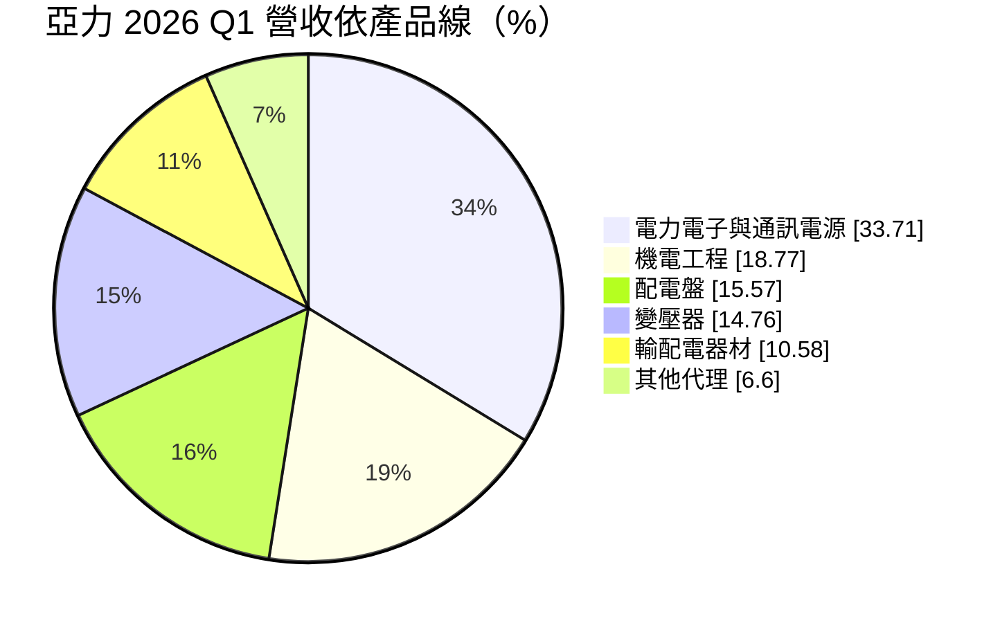
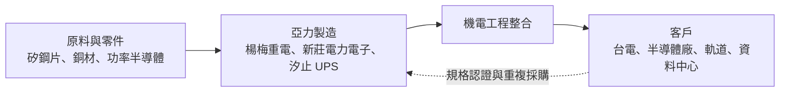
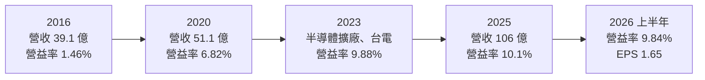
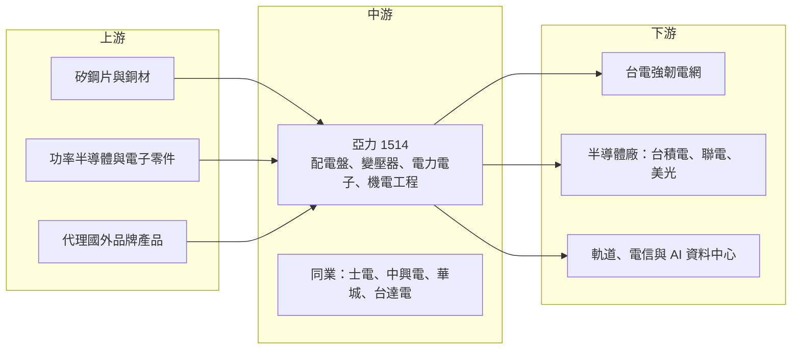

# 1514 亞力

> 上市｜[[產業索引-電機機械|電機機械]]｜上市（櫃）日期 1994/03/26

# 第一章：企業模式與商業藍圖

> [!info] 撰寫說明
> 本文由 Claude 依公開資料整理，架構比照 [[2330台積電]] 的四章研究，資料截至 2026-10-08。財務數字來源：Goodinfo 年度經營績效頁、證交所開放資料（基本資料、綜合損益、資產負債、營益分析、股利、本益比殖利率）、富果研究 2026 年 5 月法說會整理、優分析報導；產業描述為整理性內容，尚未逐條比對原始文件。#待校對

評估中型重電廠的長期價值，關鍵在於它的產品組合與客戶結構能否讓它在大廠環伺下找到自己的位置。本章針對亞力電機（股票代號：1514，以下簡稱亞力）的商業模式進行定性分析，說明它如何以多元產品線同時服務台電、半導體廠與軌道交通，並在電力電子領域建立差異化。

## 一、核心定位：產品線多元的中型重電與電力電子廠

亞力成立於 1968 年，1994 年上市，是台灣重電四雄之一，但規模小於士電、中興電與華城。亞力的特色是產品線非常多元，涵蓋[[配電盤]]、[[電力變壓器]]、輸配電器材、電力電子設備（包括不斷電系統 [[UPS]]、通訊電源與 [[STATCOM]] 靜態同步補償器），以及機電工程。

依 2026 年第一季法說會資料，電力電子與通訊電源是亞力最大的產品線，占營收約三分之一。這和其他重電廠以變壓器或 GIS 為主的結構不同。電力電子設備用半導體元件控制電力，負責穩壓、補償與備援，在半導體廠、資料中心與電網中的重要性愈來愈高。亞力在這個領域的布局，是它與其他重電廠最主要的差異。

這個定位帶來兩個重要的商業意義：

* **客戶分散，降低單一客戶風險：** 亞力的客戶包括台電、半導體廠、軌道交通與電信業者。2026 年第一季台電約占營收 35%，半導體相關客戶的占比則從約 25% 提升到接近 40%，已略超過台電。主要半導體客戶包括台積電、聯電與 Micron。
* **跟隨半導體客戶擴廠：** 半導體廠對電力品質的要求極高，電壓瞬間跌落就可能造成晶圓報廢。亞力提供的 UPS、STATCOM 與配電設備，正好解決這類電力品質問題。公司將「跟隨半導體客戶海外擴廠」列為長期策略之一。

## 二、終端應用板塊：電力電子、工程與配電設備

依 2026 年第一季法說會揭露的產品線營收比重如下：

* **電力電子與通訊電源：** 包括 UPS、通訊電源與 STATCOM 等設備。STATCOM 是用來穩定電網電壓與補償虛功率的設備，2025 年亞力認列台電一項約 20 億元 STATCOM 大案的約六成。旗下汐止廠（雅瑞科技）專門生產特殊用途 UPS。
* **機電工程：** 工廠與公共設施的機電統包，2026 年第一季占比由前一年同期的 13.22% 升到 18.77%。工程毛利率較低，比重上升會拉低整體毛利率。
* **配電盤與變壓器：** 中低壓配電設備與變壓器，主要用於半導體廠、科技廠與台電。
* **輸配電器材與其他代理：** 包括台電配電網路使用的器材，以及代理國外品牌產品。

除了上述產品，亞力也參與軌道交通市場，台鐵第三代行控中心標案約 46 億元，亞力可提供約 30% 的產品與服務；另外接獲電信與電子大廠約 10 億元的 [[AIDC]] 相關訂單。

## 三、資本轉化邏輯：多元產品加上工程整合

亞力的獲利邏輯可以從三個面向理解：

* **產品組合決定毛利：** 電力電子與配電設備的毛利率高於機電工程。2026 年第一季毛利率 17.57%，較去年同期的 18.73% 下降，主因就是工程營收占比上升。亞力的毛利率長期落在 17% 至 19%，低於中興電與華城，反映它的產品以中低壓設備與工程為主，定價能力相對有限。
* **產能有限，擴產溫和：** 亞力的主要廠區包括楊梅廠（約 11,000 坪，生產重電產品）、新莊廠（約 3,600 坪，電力電子產品）與汐止廠（特殊用途 UPS）。公司已購入約 4,500 坪土地，並租賃近 4,000 坪廠房，預計提升產值 15% 至 20%。
* **漲價與急單：** 2026 年第一季公司已調漲部分產品售價 10% 至 15%，以因應原物料上漲；另外約 2 億元價格較佳的急單，占營收近一成。在電力設備供不應求的環境下，亞力也有一定的議價空間。

## 四、企業長期藍圖：半導體、AIDC 與綠能

亞力在法說會中列出的長期策略包括：深耕半導體並跟隨客戶海外擴廠、把握 AI 資料中心所需的高規格電力設備、配合台電[[強韌電網計畫]]、推廣太陽能、[[儲能]]與電動車充電樁等綠能產品、鞏固軌道市場、開拓歐美、東南亞與中南美市場，以及提供 0.5MW 至 5MW 的[[微電網]]服務。公司已開發 20 呎與 40 呎貨櫃型儲能系統，並與國內知名電子大廠結盟拓展儲能市場。

這些策略顯示亞力的方向是「多元布局、跟著客戶走」。優點是不依賴單一市場，缺點是資源分散，在每個領域都要面對規模更大的對手。

# 第二章：護城河深度與競爭優勢

護城河分析的核心問題是：這家公司的優勢能否在十年後依然存在？本章針對亞力的競爭優勢進行拆解，並與國內外同業比較，評估它在重電與電力電子市場的位置。

## 一、護城河的核心組成要素

* **半導體客戶的認證與信任：** 半導體廠選擇電力設備時，重視可靠度與過去的實績。亞力打入台積電、聯電、Micron 等客戶，代表它的產品通過了嚴格的驗證。只要持續穩定供貨，這些客戶在新廠擴建時通常會延續既有供應商。
* **電力電子的技術能力：** STATCOM、特殊用途 UPS 等設備需要電力電子與控制技術，與傳統的變壓器、配電盤不同。亞力在這個領域累積的技術，讓它在電網穩定與電力品質的需求中有差異化的產品。
* **多元產品線與工程整合：** 從變壓器、配電盤到 UPS 與機電工程，亞力能提供一個廠房或變電所大部分的電力設備。這對客戶而言降低了協調成本。
* **台電供應商資格：** 長期作為台電的設備與器材供應商，亞力熟悉台電的規格與流程，能持續參與強韌電網等計畫。

## 二、全球主要競爭對手格局

| 公司 | 所在地 | 定位與強項 | 與亞力的關係 |
|---|---|---|---|
| [[1503士電]] | 台灣 | 高科技廠變壓器與配電設備龍頭 | 半導體廠配電設備的主要競爭者 |
| [[1513中興電]] | 台灣 | 台電 GIS 主要供應商 | 台電標案與[[統包工程]]的競爭者 |
| [[1519華城]] | 台灣 | 電力變壓器專業廠 | 變壓器的競爭者 |
| [[1504東元]] | 台灣 | 馬達與機電整合 | 配電與機電工程的競爭者 |
| [[2308台達電]] | 台灣 | 全球電源與 UPS 大廠 | UPS 與資料中心電力的競爭者 |
| Schneider Electric、ABB、Eaton | 歐美 | 全球配電、UPS 與電力品質設備龍頭 | 高階配電與 UPS 的國際對手 |

從格局來看，亞力在台灣重電四雄中規模最小，在個別產品線上都面對更大的對手。它的生存之道在於產品線的廣度與對半導體客戶的深度服務，而不是單一產品的規模優勢。

## 三、優勢轉化：守得住、守不住與觀察重點

* **守得住：** 半導體客戶的配電與電力品質設備份額。只要台灣半導體廠持續擴建，亞力已建立的客戶關係能帶來穩定訂單，2026 年第一季半導體營收占比升到接近四成就是證明。
* **守不住：** 台電大型專案的高峰收入。2025 年 STATCOM 大案認列約 12 億元，2026 年只剩約 4 至 5 億元可認列，缺口約 6 億元。這種大型專案屬於一次性收入，無法每年重複。
* **觀察重點：** 第一，半導體客戶海外擴廠時，亞力能否跟隨取得海外訂單；第二，AIDC 相關訂單能否從 10 億元擴大成穩定的事業；第三，工程營收占比上升對毛利率的長期影響。

# 第三章：財務體質與盈利規模

資料日期：2026-10-08。數字取自 Goodinfo 年度經營績效頁與證交所開放資料，表格是撰寫當時的快照；最新月營收、毛利率、累計 EPS 由自動排程寫在本筆記的屬性欄位（月營收、毛利率、累計EPS 等）。#待校對

財務報表是檢驗護城河是否真實存在的最終標準。本章用多年度的三率、ROE 與資本報酬，檢視亞力在重電需求上升期的獲利品質。

## 一、獲利能力的基石：三率

| 年度 | 營收（新台幣） | [[毛利率]] | [[營業利益率]] | EPS（元） | [[ROE]] |
|---|---|---|---|---|---|
| 2016 | 39.1 億 | 12.3% | 1.46% | 0.51 | 3.59% |
| 2017 | 37.8 億 | 14.6% | 3.05% | 0.58 | 4.28% |
| 2018 | 42.8 億 | 15.6% | 3.97% | 1.09 | 7.47% |
| 2019 | 48.2 億 | 17.4% | 5.75% | 1.44 | 9.93% |
| 2020 | 51.1 億 | 17.7% | 6.82% | 1.51 | 9.96% |
| 2021 | 56.8 億 | 17.2% | 6.62% | 1.60 | 10.6% |
| 2022 | 77.1 億 | 16.7% | 6.45% | 2.15 | 14.0% |
| 2023 | 94.8 億 | 17.8% | 9.88% | 3.08 | 17.7% |
| 2024 | 88.8 億 | 19.2% | 10.1% | 3.04 | 15.3% |
| 2025 | 106 億 | 18.7% | 10.1% | 3.30 | 14.8% |
| 2026 上半年 | 53.5 億 | 19.28% | 9.84% | 1.65 | 未查得 |

註：2016 至 2025 年取自 Goodinfo；2026 上半年取自證交所綜合損益與營益分析開放資料。

* **[[毛利率]]：** 亞力的毛利率從 2016 年的 12.3% 提升到 2024 年後的 19% 左右，十年間改善約 7 個百分點，但絕對水準仍低於中興電與華城。毛利率的波動主要來自工程與設備的營收占比變化。
* **[[營業利益率]]：** 從 2016 年的 1.46% 提升到 2023 年以後的約 10%，改善幅度明顯，代表營收規模擴大後費用被有效攤薄。
* **營收趨勢：** 2020 年至 2025 年營收從 51.1 億元成長到 106 億元，年複合成長率約 15.7%（推算），在重電股中屬於較快的成長，主要受半導體擴廠與台電投資帶動。

## 二、[[ROE]]：資本效率

2021 至 2025 年平均 ROE 約 14.5%（推算），從 2016 年不到 4% 逐步提升到 15% 左右。2026 年第二季底歸屬母公司權益約 63 億元，每股淨值 23.26 元（證交所資料）。亞力的 ROE 提升主要來自營業利益率的改善，而不是財務槓桿。股價淨值比約 4.45 倍（2026 年 10 月初，證交所資料），顯示市場對重電產業前景的期待。

## 三、資本支出、自由現金流與股利

亞力的資本支出規模不大，主要用於購地與租賃廠房以提升產值（具體金額未查得）。2026 年第二季底非流動資產約 30.6 億元，流動資產約 109.6 億元（證交所資料），資產以流動資產為主，屬於相對輕資產的製造與工程業。重電與工程業務的營運資金需求會隨訂單增加而上升，自由現金流可能在擴張期較為波動（推估）。

股利方面，2025 年度配發現金股利 2 元與股票股利 0.2 元，以 EPS 3.30 元計算現金配發率約 61%（推算）。公司章程未訂明固定的配發比率，由股東會依盈餘狀況決議。

## 四、[[ROIC]] 與 [[WACC]]：價值創造利差

**ROIC 推算：** 2025 年營收 106 億元乘以營業利益率 10.1%，營業利益約 10.7 億元，扣除 20% 稅率後約 8.6 億元。2026 年第二季底權益總計約 63.7 億元，總負債約 76.5 億元，其中大部分為應付款與合約負債，假設有息負債約占兩成（推估，約 15 億元），投入資本約 79 億元，ROIC 約 10.9%（推算）。

**WACC 推算：** 假設台灣 10 年期公債殖利率 1.75%、市場風險溢酬 6%、β 取重電股常見值 0.9，股東權益成本約 7.15%。負債成本假設 2.5%，稅後約 2.0%。以帳面價值計，權益約占 81%、負債約占 19%，WACC 約 6.2%（推算）。

**結論：** 2016 至 2019 年，亞力的 ROIC 低於資金成本，屬於價值毀損或打平的狀態；2022 年以後隨營收規模擴大與營業利益率改善，ROIC 提升到 10% 以上，高於 WACC 約 4 至 5 個百分點（推算）。這代表亞力在本輪重電景氣中開始創造價值，但利差不如中興電、華城那樣大，反映它的產品定價能力相對有限。

# 第四章：總體風險與地緣政治

任何企業都無法脫離宏觀環境獨立存在。本章分析亞力未來必須面對的政策、產業週期、營運與技術風險。

## 一、地緣政治與政策

* **台電投資計畫：** 台電約占亞力營收三成以上，強韌電網計畫的預算執行與發包節奏直接影響亞力的訂單。台電的財務狀況與政府能源政策變化，是亞力最主要的政策風險。
* **半導體客戶的海外布局：** 台灣半導體廠在美國、日本與歐洲擴廠，若亞力無法跟隨取得海外訂單，國內的半導體擴廠需求可能隨產能外移而減少。
* **兩岸風險：** 亞力的生產與主要客戶都在台灣，與其他台灣企業一樣面臨兩岸情勢的長期不確定性。

## 二、產業週期與市場結構

* **半導體資本支出週期：** 半導體相關營收已接近四成，若半導體產業進入資本支出下修期，新廠建設延後，亞力的訂單會明顯減少。
* **大型專案的不連續性：** STATCOM 等大型專案會造成營收的年度波動，2026 年就面臨前一年大案認列高峰過後的缺口。
* **重電景氣的長期性：** 本輪重電景氣由電網汰換、AI 資料中心與半導體擴廠同時推動，但這些需求都有週期，景氣過後價格與毛利可能回落。

## 三、營運環境的隱性風險

* **工程毛利偏低：** 機電工程占比上升會拉低整體毛利率，且工程需要承擔施工進度與成本超支的風險。
* **原物料價格：** 矽鋼片、銅材與功率半導體價格上漲時，若未能及時轉嫁，會壓縮毛利。2026 年公司已調漲部分產品售價 10% 至 15% 因應。
* **產能限制：** 亞力的廠房規模有限，擴產以購地與租賃為主，若需求持續強勁，產能可能成為成長的瓶頸。

## 四、科技演進風險

電力系統正在朝電力電子化發展，再生能源併網、儲能與資料中心都需要更多的電力轉換與穩壓設備。這對已有電力電子布局的亞力是機會，但也代表競爭對手將包括台達電等電源大廠與國際電力電子公司。資料中心朝 [[HVDC]] 供電發展，也可能改變 UPS 的產品形式。亞力需要持續投入研發，才能在電力電子化的趨勢中維持競爭力。

# 專有名詞解析

## 金融

- **[[ROIC]]**：投入資本報酬率，衡量公司每投入一元營運資本能賺回多少稅後營業利益。
- **[[WACC]]**：加權平均資金成本，股東與債權人要求報酬的加權平均，ROIC 高於 WACC 才代表創造價值。

## 產業

- **[[配電盤]]**：把電力分配到各個用電迴路並提供保護的設備櫃，工廠、大樓與資料中心都需要。
- **[[電力變壓器]]**：把電壓升高或降低的設備，發電廠升壓傳輸、變電所與工廠降壓使用都需要它，是電網最關鍵的設備之一。
- **[[UPS]]**：不斷電系統，在市電中斷時立即以電池供電，保護資料中心與工廠設備。
- **[[STATCOM]]**：靜態同步補償器，以電力電子元件即時補償虛功率、穩定電網電壓，常用於再生能源併網與變電所。
- **[[AIDC]]**：AI 資料中心，耗電量遠高於傳統資料中心，帶動變壓器、配電與備援電力設備需求。
- **[[儲能]]**：以電池等設備儲存電力，在用電尖峰或停電時放電，用於電網調度與企業備援。
- **[[微電網]]**：由小型發電、儲能與負載組成、可獨立或併網運作的區域電網。
- **[[強韌電網計畫]]**：台電在 2022 年大停電後提出的十年電網強化計畫，投入大量預算更新輸變電設備。
- **[[統包工程]]**：由單一廠商負責設計、採購、施工到完工的工程發包模式，承包商承擔較多風險。
- **[[HVDC]]**：高壓直流供電或輸電，在資料中心用於提高供電效率，在電網用於長距離輸電。

# 核心供應鏈

## 1. 上游：原物料與零組件
- 矽鋼片、銅材與功率半導體（具體供應商未查得）

## 2. 中游：亞力本身與同業
- 子公司：雅瑞科技（特殊用途 UPS）
- 國內同業：[[1503士電]]、[[1513中興電]]、[[1519華城]]、[[1504東元]]
- UPS 與電源同業：[[2308台達電]]

## 3. 下游：電力公司與軌道
- 台灣電力公司（強韌電網、STATCOM 專案）
- 台鐵（第三代行控中心）

## 4. 下游：半導體與資料中心
- 半導體廠：[[2330台積電]]、[[2303聯電]]、Micron（美光）
- AI 資料中心：電信與電子大廠（法說會未具名）

延伸閱讀：[[台積電供應鏈]]

## 最新新聞
<!-- news:start（自動產生，請勿手動編輯此範圍） -->
- 2026-10-06 🏛️ 重訊 15:41｜更正本公司115年8月背書保證申報事項｜[觀測站](https://mops.twse.com.tw/mops/#/web/t05st01)

完整紀錄：[[1514亞力 新聞]]
<!-- news:end -->

## 相關連結
- [公開資訊觀測站](https://mopsov.twse.com.tw/mops/web/t05st03?step=1&firstin=1&co_id=1514)
- [Goodinfo](https://goodinfo.tw/tw/StockDetail.asp?STOCK_ID=1514)
- [Yahoo 股市](https://tw.stock.yahoo.com/quote/1514)
- [鉅亨網新聞](https://www.cnyes.com/twstock/1514/news)
