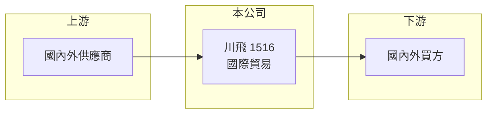

# 1516 川飛

> 上市｜[[產業索引-其他業|其他業]]｜上市（櫃）日期 1995/04/01

# 第一章：企業模式與商業藍圖

> [!info] 撰寫說明
> 精簡版，由 Claude 依公開資料整理，架構比照 [[2330台積電]]，資料截至 2026-10-07。來源：nStock 川飛公司簡介、winvest 營收快訊。公開資料有限。#待校對

川飛能源是小型貿易公司，目前以國際貿易為主要收入來源，營收規模小且利潤薄。

- **核心業務：** 目前主要業務為國際貿易；過去曾從事[[大宗物資]]（[[鋁錠]]）買賣，以及廢棄物[[焚化爐]]代理與投資。
- **營收結構：** 本次未查到各品項營收比重。
- **營運據點：** 總部位於台北市，掛牌約 31 年。
- **長期方向：** 公司名稱帶有能源，但本次未查到具體能源事業規劃。

# 第二章：護城河深度與競爭優勢

川飛的貿易業務門檻低，競爭優勢有限。

- **競爭優勢：** 主要依靠既有客戶與供應商關係，本次未查到明確的技術或規模優勢。
- **主要對手：** 國內外一般貿易商，本次未查到具體名單。
- **觀察重點：** 2026 年 1 至 8 月營收年增 30.57%，觀察營收成長能否轉為獲利。

# 第三章：財務體質與盈利規模

資料日期：2026-10-07，以下數字是撰寫當時的快照；最新月營收、毛利率、累計 EPS 由自動排程寫在本筆記的屬性欄位（月營收、毛利率、累計EPS 等）。#待校對

川飛營收成長但仍處於小幅虧損。

- **營收規模：** 2026 年 1 至 8 月累計營收 0.72 億元，年增 30.57%；2025 年全年營收 0.79 億元。
- **獲利：** 2026 年第二季 EPS -0.08 元，上半年累計 -0.13 元；第二季[[毛利率]] 5.37%、[[營業利益率]] -12.16%。
- **財務特色：** 資本額 4 億元、市值約 3.95 億元，近五年平均現金股利 0.39 元，2025 年第四季未配息。

# 第四章：總體風險與地緣政治

川飛的風險集中在貿易毛利低與規模小。

- **產業週期：** 貿易品項的價格隨原物料行情波動，影響營收與毛利。
- **營運風險：** 毛利率僅約 5%，費用若無法壓低，難以轉虧為盈。
- **其他風險：** 匯率變動會影響進出口貿易的成本與售價。

# 專有名詞解析

## 產業

- **[[大宗物資]]**：以大量標準化方式交易的原物料，例如金屬、穀物與能源，價格隨國際行情波動。
- **[[鋁錠]]**：電解鋁鑄成的錠狀原料，是鋁加工業的主要原料，價格跟隨國際鋁價。
- **[[焚化爐]]**：以高溫燃燒處理廢棄物的設備，常用於垃圾與事業廢棄物處理。

# 核心供應鏈

- 上游：國內外商品供應商（推估）
- 下游／客戶：國內外採購買方（推估）
- 同業：一般國際貿易商（本次未查到具體名單）

## 最新新聞
<!-- news:start（自動產生，請勿手動編輯此範圍） -->
- 2026-10-08 📰 媒體 17:23｜營收速報 - 川飛(1516)9月營收1,106萬元年增率高達1473.26％｜[鉅亨網](https://news.cnyes.com/news/id/6624977)

完整紀錄：[[1516川飛 新聞]]
<!-- news:end -->

## 相關連結
- [公開資訊觀測站](https://mopsov.twse.com.tw/mops/web/t05st03?step=1&firstin=1&co_id=1516)
- [Goodinfo](https://goodinfo.tw/tw/StockDetail.asp?STOCK_ID=1516)
- [Yahoo 股市](https://tw.stock.yahoo.com/quote/1516)
- [鉅亨網新聞](https://www.cnyes.com/twstock/1516/news)
