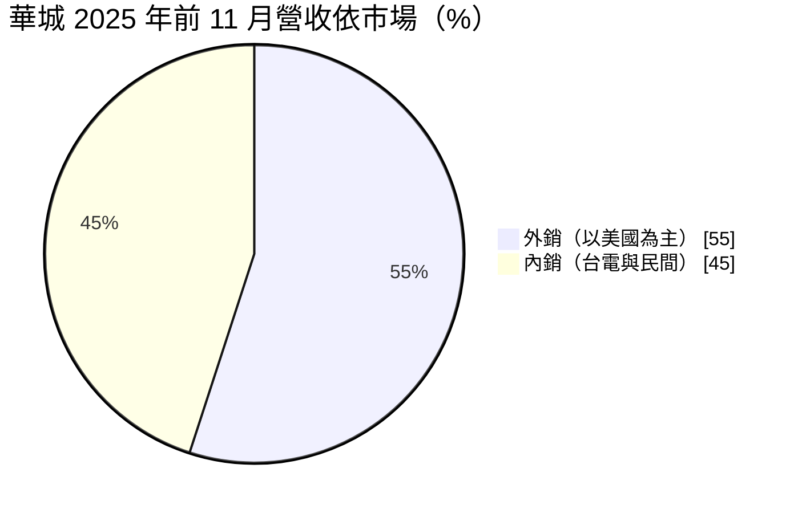
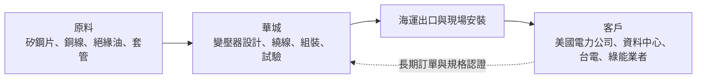
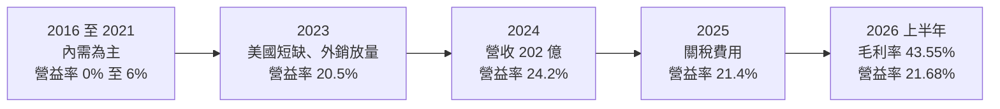
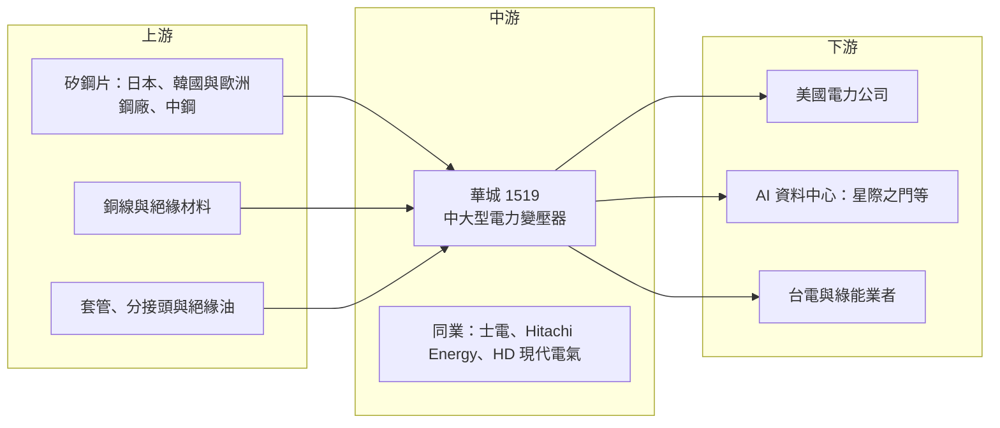

# 1519 華城

> 上市｜[[產業索引-電機機械|電機機械]]｜上市（櫃）日期 1997/04/16

# 第一章：企業模式與商業藍圖

> [!info] 撰寫說明
> 本文由 Claude 依公開資料整理，架構比照 [[2330台積電]] 的四章研究，資料截至 2026-10-08。財務數字來源：Goodinfo 年度經營績效頁、證交所開放資料（基本資料、綜合損益、資產負債、營益分析、股利、本益比殖利率）、優分析轉載之 2025 年 12 月法說會報導、自由時報報導；產業描述為整理性內容，尚未逐條比對原始文件。#待校對

評估一家設備廠的長期價值，要看它所處的產業是否正在經歷結構性變化，以及它是否站在變化的有利位置。本章針對華城電機（股票代號：1519，以下簡稱華城）的商業模式進行定性分析，說明一家台灣變壓器廠如何在全球變壓器短缺中，轉型為以美國市場為主的外銷型公司。

## 一、核心定位：外銷美國為主的電力變壓器專業廠

華城成立於 1969 年，1997 年上市，主力產品是[[電力變壓器]]，也就是電網中把電壓升高或降低的關鍵設備。和士電、東元等產品線多元的電機廠不同，華城高度專注在中大型電力變壓器，依電壓等級分工生產：觀音二廠負責 161kV 至 345kV 的大型變壓器，觀音 3B 廠負責 33kV 至 161kV 的中型變壓器，規劃中的台中廠則負責超大型變壓器。

華城最重要的特色是外銷比重高。依 2025 年 12 月法說會報導，2025 年前 11 個月外銷比重已超過 55%，核心客戶涵蓋美國 17 個州，並預期外銷比重持續提升。這讓華城的成長邏輯與其他以台電為主的重電廠明顯不同：它的需求主要來自美國電網汰換、再生能源併網與 AI 資料中心建設。

這個定位帶來兩個重要的商業意義：

* **搭上美國變壓器短缺的結構性機會：** 美國電網設備老化、再生能源與資料中心大量併網，造成大型變壓器嚴重短缺，國際大廠交期長達三到四年。華城在這個時間點已有美國客戶基礎與認證，因此能大量承接訂單，並取得較好的價格。
* **以 AI 資料中心作為新成長引擎：** 法說會指出，華城的 [[AIDC]] 相關變壓器接單已超過 120 億元，是[[在手訂單]]中成長最快的部分，華城也是[[星際之門]]（Stargate）計畫一期的電力變壓器供應商之一，2025 年已出貨 6.5 億元。AIDC 營收占比預估從 2025 年的 5% 至 6% 提升到 2026 年超過 10%。

## 二、終端應用板塊：外銷與內銷

依 2025 年前 11 個月的內外銷比重如下：

註：法說會表示外銷比重「超過 55%」，此處以 55% 與 45% 近似。

* **美國電力公司：** 華城的主要外銷客戶，用於變電所汰換與新建、再生能源併網。美國電網的長期投資計畫為這部分提供多年需求。
* **AI 資料中心：** 大型資料中心需要自建變電所，從輸電網直接受電，因此需要大型電力變壓器。華城參與星際之門計畫，代表它已進入美國頂級資料中心專案的供應鏈。
* **台電強韌電網：** 國內需求主要來自台電的[[強韌電網計畫]]與變電所建設。
* **綠能：** 太陽能與風電場需要升壓變壓器，將發電併入電網，這是華城四大成長動能之一。

## 三、資本轉化邏輯：產能就是營收上限

華城的資本轉化邏輯，可以用「產能決定營收、價格決定毛利」來概括：

* **產能擴充計畫：** 法說會資料顯示，擴產前華城整體產能約 55,000 [[MVA]]。觀音 3B 廠在 2026 年第一季投產，增加約 8,000 MVA；台中廠預計 2027 年第二季投產，增加約 27,000 MVA，產出約九成外銷。完成後總產能約 90,000 MVA，約為擴產前的 1.6 倍。觀音二廠因專注大型變壓器，產值預期提升 30% 至 35%。
* **定價能力來自短缺：** 在全球變壓器短缺期間，客戶更在乎交期與供貨確定性，價格相對不敏感。華城的毛利率從 2022 年的 20.5% 升到 2025 年的 40.5%，2026 年上半年更達 43.55%（證交所營益分析），說明短缺帶來的定價能力非常顯著。
* **關稅成本的分攤：** 美國對進口變壓器課徵關稅後，法說會指出以 20% 關稅計算，華城約負擔 6%，從 2025 年第二季起列為費用。2026 年上半年營業費用約 22.3 億元，占營收約 22%（依證交所資料推算），明顯高於一般製造業，是毛利率與營業利益率差距擴大的主因之一（推估）。公司表示 2027 至 2028 年的訂單在成立時已反映關稅成本。

## 四、企業長期藍圖：擴產、外銷與在美布局

華城的長期策略可以歸納為三點。第一是擴充產能，以觀音 3B 廠與台中廠把總產能提升約六成，並以台中廠主攻超大型與外銷變壓器。第二是深耕美國市場，擴大在美國各州電力公司與資料中心的客戶基礎。報導也提到華城切入星際之門計畫，並在美國建立安全庫存，以縮短交期並提高服務能力。第三是平衡內外銷，維持台電與綠能等國內需求，避免過度依賴單一市場。

從資本配置的角度，華城的股利政策規定每年就可分配盈餘提撥不低於 60% 分配股東紅利，現金股利比率不低於 25%。在高成長與高擴產期間，公司同時發放高額現金股利與部分股票股利，顯示獲利產生的現金足以支應擴產。

# 第二章：護城河深度與競爭優勢

護城河分析的核心問題是：這家公司的優勢能否在十年後依然存在？本章針對華城的競爭優勢進行拆解，並與國內外變壓器同業比較，評估它在全球變壓器短缺結束後的位置。

## 一、護城河的核心組成要素

* **美國客戶認證與實績：** 美國電力公司對變壓器供應商的認證嚴格，需要通過工廠審核、型式試驗與現場運轉實績。華城在美國 17 個州累積的客戶與實績，是它在短缺期能快速承接訂單的基礎。這種認證需要多年時間建立，新進者無法在短期內取得。
* **專注大型變壓器的製造經驗：** 大型電力變壓器的設計與製造需要大量經驗，包括絕緣設計、繞線工藝與試驗能力。華城長期專注於此，並依電壓等級分廠生產，提高了製造效率。
* **相對較短的交期：** 在國際大廠交期長達三到四年的情況下，華城能提供較短的交期，這是它取得訂單與價格的重要優勢。
* **產能擴充的時機：** 華城在短缺期積極擴產，台中廠完工後產能將大幅提升，這讓它能在需求高峰時取得更大的市占。

## 二、全球主要競爭對手格局

| 公司 | 所在地 | 定位與強項 | 與華城的關係 |
|---|---|---|---|
| Hitachi Energy | 瑞士／日本 | 全球電力變壓器與輸變電龍頭 | 美國市場的主要供應商，交期長 |
| Siemens Energy | 德國 | 全球輸變電大廠 | 美國大型變壓器的主要對手 |
| GE Vernova | 美國 | 美國本土電力設備大廠 | 具「美國製造」優勢的競爭者 |
| HD 現代電氣 | 韓國 | 積極擴產並設有美國工廠 | 美國市場最直接的亞洲競爭者 |
| 曉星重工、LS Electric | 韓國 | 美國變壓器市場的積極參與者 | 美國市場的直接競爭者 |
| [[1503士電]] | 台灣 | 高科技廠變壓器龍頭，擴大北美外銷 | 國內市場與北美外銷的競爭者 |
| [[1513中興電]] | 台灣 | 台電 GIS 主要供應商 | 台電變電所設備的互補與競爭者 |

從格局來看，華城在美國市場屬於「第二梯隊的亞洲供應商」，與韓國廠商同樣是趁國際大廠產能不足而擴大市占。長期而言，華城需要與在美國設廠的韓國與歐美大廠競爭，「美國製造」的要求可能成為不利因素。

## 三、優勢轉化：守得住、守不住與觀察重點

* **守得住：** 已建立長期合作的美國電力公司客戶。電力公司更換供應商需要重新認證，只要華城的品質與交期穩定，這些客戶在短缺結束後仍可能持續採購。
* **守不住：** 短缺期的超額毛利。40% 以上的毛利率是短缺環境的產物，當全球變壓器產能在 2027 至 2030 年陸續開出，價格可能回到正常水準，毛利率也會跟著回落。2016 至 2022 年華城毛利率只有 10% 至 20%，這是正常景氣下的參考水準。
* **觀察重點：** 第一，台中廠能否在 2027 年如期投產並取得足夠的外銷訂單；第二，美國關稅與「美國製造」政策的變化對華城成本與競爭力的影響；第三，全球變壓器產能擴張的速度，以及價格開始回落的時間點。

# 第三章：財務體質與盈利規模

資料日期：2026-10-08。數字取自 Goodinfo 年度經營績效頁與證交所開放資料，表格是撰寫當時的快照；最新月營收、毛利率、累計 EPS 由自動排程寫在本筆記的屬性欄位（月營收、毛利率、累計EPS 等）。#待校對

財務報表是檢驗護城河是否真實存在的最終標準。本章用多年度的三率、ROE 與資本報酬，檢視華城在變壓器短缺前後的獲利結構變化。

## 一、獲利能力的基石：三率

| 年度 | 營收（新台幣） | [[毛利率]] | [[營業利益率]] | EPS（元） | [[ROE]] |
|---|---|---|---|---|---|
| 2016 | 57.3 億 | 17.8% | 5.48% | 0.96 | 7.72% |
| 2017 | 58.7 億 | 12.6% | 2.67% | 0.36 | 2.87% |
| 2018 | 60.0 億 | 10.4% | 0.22% | 0.23 | 1.72% |
| 2019 | 71.8 億 | 15.7% | 4.61% | 1.57 | 12.9% |
| 2020 | 84.7 億 | 16.0% | 5.6% | 1.75 | 13.2% |
| 2021 | 90.2 億 | 15.6% | 4.35% | 1.11 | 8.14% |
| 2022 | 77.5 億 | 20.5% | 5.54% | 3.21 | 21.1% |
| 2023 | 139 億 | 31.2% | 20.5% | 9.87 | 49.3% |
| 2024 | 202 億 | 36.6% | 24.2% | 14.93 | 57.3% |
| 2025 | 244 億 | 40.5% | 21.4% | 13.99 | 44.6% |
| 2026 上半年 | 102.1 億 | 43.55% | 21.68% | 6.52 | 未查得 |

註：2016 至 2025 年取自 Goodinfo；2026 上半年取自證交所綜合損益與營益分析開放資料。EPS 未經股票股利追溯調整，2025 年度配發股票股利 1 元，股本由約 31.6 億元增加到約 34.7 億元。

* **[[毛利率]]：** 華城的毛利率在 2016 至 2021 年只有 10% 至 18%，2022 年起隨美國外銷增加開始上升，到 2026 年上半年達 43.55%。這是重電股中最驚人的毛利率改善，反映美國變壓器短缺帶來的定價能力。
* **[[營業利益率]]：** 2024 年達 24.2% 的高峰後，2025 年降到 21.4%，但同期毛利率仍在上升。兩者差距擴大，主因之一是美國關稅自 2025 年第二季起列為費用（推估，依法說會說明），其次是營收擴大帶來的運費與銷售費用增加。
* **營收趨勢：** 2020 年至 2025 年營收從 84.7 億元成長到 244 億元，年複合成長率約 23.6%（推算），是重電四雄中成長最快的公司。2026 年上半年營收 102.1 億元，與 2025 年同期大致持平，顯示產能已接近上限，成長需等待新廠投產。

## 二、[[ROE]]：資本效率

2021 至 2025 年平均 ROE 約 36.1%（推算），其中 2023 至 2025 年連續三年超過 44%，2024 年達 57.3%。這樣的 ROE 在製造業中非常罕見，來源有二：一是極高的營業利益率，二是相對精簡的權益基礎。2026 年第二季底歸屬母公司權益約 92 億元，每股淨值 29.14 元（證交所資料），由於公司把大部分盈餘以現金股利發放，權益沒有隨獲利快速累積，使 ROE 維持在高檔。股價淨值比約 23.9 倍（2026 年 10 月初，證交所資料），反映市場對高 ROE 能否延續的高度期待。

## 三、資本支出、自由現金流與股利

華城的資本支出集中在觀音 3B 廠與台中廠（具體金額未查得），2026 至 2027 年將是資本支出的高峰。重電業的客戶通常支付預收款，2026 年第二季底總負債約 237 億元，遠高於權益約 94 億元，其中應有相當比例為合約負債與預收款（推估），這些來自客戶的資金在擴產期提供了重要的營運資金來源。

股利方面，2025 年度配發現金股利 11 元與股票股利 1 元，以 EPS 13.99 元計算現金配發率約 79%（推算）。在擴產期間仍維持高配息，說明本業產生的現金流相當充沛（推估）。

## 四、[[ROIC]] 與 [[WACC]]：價值創造利差

**ROIC 推算：** 2025 年營收 244 億元乘以營業利益率 21.4%，營業利益約 52.2 億元，扣除 20% 稅率後約 41.8 億元。2026 年第二季底權益總計約 94 億元，總負債約 237 億元，其中大部分為合約負債與應付款，假設有息負債約占三成（推估，約 71 億元），投入資本約 165 億元，ROIC 約 25.3%（推算）。若實際有息負債比例更低，ROIC 會更高。

**WACC 推算：** 假設台灣 10 年期公債殖利率 1.75%、市場風險溢酬 6%、β 取 1.0（華城股價波動大於一般重電股，取市場平均值），股東權益成本約 7.75%。負債成本假設 2.5%，稅後約 2.0%。以帳面價值計，權益約占 57%、負債約占 43%，WACC 約 5.3%（推算）；若以市值計算，權益比重接近百分之百，WACC 約 7.6%（推算）。

**結論：** 2016 至 2021 年，華城的 ROIC 長期低於資金成本，是一家價值毀損或勉強打平的傳統製造業；2023 年以後 ROIC 大幅超過 WACC，利差達 15 個百分點以上（推算），屬於高度創造價值的狀態。然而，這段價值創造來自全球變壓器短缺的特殊環境。長期投資人應思考的核心問題是：當短缺結束、毛利率回落時，華城的 ROIC 會回到哪個水準？擴產後的較大規模與已建立的美國客戶基礎，能否讓它的正常化 ROIC 明顯高於過去的低點。

# 第四章：總體風險與地緣政治

任何企業都無法脫離宏觀環境獨立存在。本章分析華城未來必須面對的地緣政治、產業週期、營運與技術風險。

## 一、地緣政治

* **美國關稅與貿易政策：** 華城外銷以美國為主，美國對進口變壓器的關稅直接影響其成本與競爭力。法說會指出以 20% 關稅計算華城約負擔 6%，若稅率提高或分攤條件改變，獲利會受到明顯影響。
* **「美國製造」要求：** 美國政府對電網與關鍵基礎設施的在地化要求可能增加，已在美國設廠的韓國與歐美廠商具有優勢。華城目前以台灣生產為主，在美國建立安全庫存，但若要求更嚴格的在地製造，可能需要評估在美設廠。
* **台灣產能集中：** 華城的生產全部在台灣，與其他台灣企業一樣面臨兩岸情勢的長期不確定性，美國客戶也可能因此要求供應來源分散。

## 二、產業週期與市場結構

* **變壓器短缺終將結束：** 2023 年以後的全球變壓器短缺，是美國電網汰換、再生能源併網與 AI 資料中心建設同時發生的結果。各國大廠都在擴產，若產能在 2027 至 2030 年大量開出，價格與毛利率可能明顯回落。華城過去的歷史顯示，正常景氣下的毛利率只有 10% 至 20%。
* **AI 資料中心投資的持續性：** AIDC 接單已超過 120 億元，若 AI 投資放緩，這部分的成長可能不如預期。
* **擴產與需求錯配：** 台中廠 2027 年第二季投產時，若市場需求已開始放緩，新增產能可能面臨利用率不足的風險。

## 三、營運環境的隱性風險

* **固定價格合約：** 變壓器訂單通常在交貨前一到三年簽訂，若銅、[[矽鋼片]]等原物料價格在交貨前大幅上漲，而合約未充分反映，毛利率會受壓。
* **海運與現場安裝：** 大型變壓器重量可達數百噸，海運與內陸運輸的成本與風險高，運送或安裝延誤都可能影響驗收與收款。
* **匯率：** 外銷以美元計價，新台幣升值會壓縮以台幣計算的營收與毛利。
* **人力與工安：** 擴產需要大量熟練技工，招募與培訓若跟不上，可能限制新廠的產能爬坡速度。

## 四、科技演進風險

資料中心逐步採用 [[HVDC]] 供電，未來可能出現[[固態變壓器]]等以電力電子取代傳統鐵芯與線圈的新技術。這些技術目前仍在發展階段，主要用於中低壓應用，短期內不會取代大型電力變壓器，但十年後可能改變資料中心的供電架構。此外，電網數位化要求變壓器具備即時監測功能，華城需要在傳統製造之外，逐步建立數位化與電力電子的能力。

# 專有名詞解析

## 金融

- **[[ROIC]]**：投入資本報酬率，衡量公司每投入一元營運資本能賺回多少稅後營業利益。
- **[[WACC]]**：加權平均資金成本，股東與債權人要求報酬的加權平均，ROIC 高於 WACC 才代表創造價值。

## 產業

- **[[電力變壓器]]**：把電壓升高或降低的設備，發電廠升壓傳輸、變電所與工廠降壓使用都需要它，是電網最關鍵的設備之一。
- **[[MVA]]**：百萬伏安，衡量變壓器容量的單位，變壓器廠也常以總 MVA 表示產能規模。
- **[[AIDC]]**：AI 資料中心，耗電量遠高於傳統資料中心，帶動變壓器、配電與備援電力設備需求。
- **[[強韌電網計畫]]**：台電在 2022 年大停電後提出的十年電網強化計畫，投入大量預算更新輸變電設備。
- **[[在手訂單]]**：已簽約但尚未交貨認列營收的訂單金額，是重電業判斷未來營收能見度的指標。
- **[[星際之門]]**：由 OpenAI 等企業在 2025 年發起的美國大型 AI 資料中心投資計畫。
- **[[矽鋼片]]**：含矽的電工鋼板，是變壓器鐵芯的主要材料，品質直接影響變壓器的能量損耗。
- **[[HVDC]]**：高壓直流供電或輸電，在資料中心用於提高供電效率，在電網用於長距離輸電。
- **[[固態變壓器]]**：以電力電子元件取代傳統鐵芯與線圈的變壓器，體積小、可控性高，仍在發展階段。

# 核心供應鏈

## 1. 上游：原物料與關鍵零件
- 矽鋼片：日本、韓國與歐洲鋼廠、[[2002中鋼]]（具體供應商未查得，待校對）
- 銅線、絕緣材料、套管與分接頭（具體供應商未查得）

## 2. 中游：華城本身與同業
- 國內同業：[[1503士電]]、[[1513中興電]]、[[1514亞力]]、[[1504東元]]
- 國際同業：Hitachi Energy、Siemens Energy、GE Vernova、HD 現代電氣、曉星重工

## 3. 下游：美國電力公司與資料中心
- 美國 17 州電力公司（法說會未具名）
- AI 資料中心：星際之門計畫一期

## 4. 下游：國內客戶
- 台灣電力公司（強韌電網、變電所）
- 太陽能與風電業者

## 最新新聞
<!-- news:start -->
<!-- news:end -->

## 相關連結
- [公開資訊觀測站](https://mopsov.twse.com.tw/mops/web/t05st03?step=1&firstin=1&co_id=1519)
- [Goodinfo](https://goodinfo.tw/tw/StockDetail.asp?STOCK_ID=1519)
- [Yahoo 股市](https://tw.stock.yahoo.com/quote/1519)
- [鉅亨網新聞](https://www.cnyes.com/twstock/1519/news)
