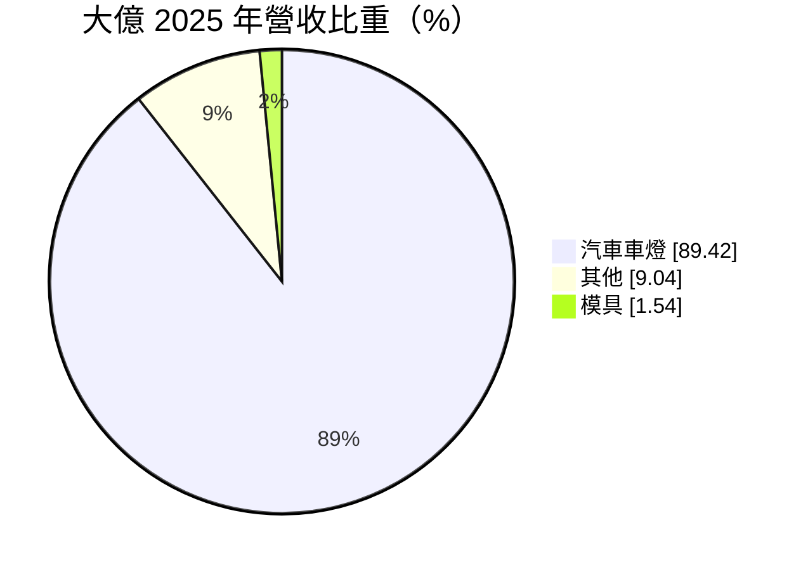
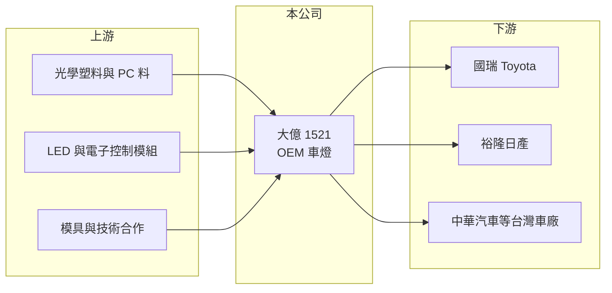

# 1521 大億

> 上市｜[[產業索引-汽車工業|汽車工業]]｜上市（櫃）日期 1997/10/06

# 第一章：企業模式與商業藍圖

> [!info] 撰寫說明
> 精簡版，由 Claude 依公開資料整理，架構比照 [[2330台積電]] 的四章研究，資料截至 2026-10-08。財務數字來源：Goodinfo 年度經營績效頁、MoneyDJ 個股基本資料（2025 年營收比重）、證交所開放資料（基本資料、2026 年第二季資產負債與綜合損益、營益分析、股利、本益比）、中央社 2026 年 9 月董事長異動報導標題；客戶與技術合作描述部分憑既有知識撰寫，已標「待校對」。公開資料有限。#待校對

在評估單一個股的長期價值時，首要步驟是拆解企業的獲利來源。本章說明大億交通工業（股票代號：1521，以下簡稱大億）作為台灣主要 [[OEM]] 車燈廠的定位，以及它的命運為何和台灣國產車市場緊密相連。

- **核心業務：** 大億成立於 1976 年，1997 年上市，總部與工廠位於台南，實收資本額約 7.62 億元。依 MoneyDJ 的 2025 年營收比重，汽車車燈占 89.42%、其他占 9.04%、模具占 1.54%，是一家以車燈為核心的專業零件廠。
- **OEM 車燈的商業模式：** 大億主要替在台灣生產的車廠供應原廠車燈，客戶包括國瑞（Toyota）、裕隆日產、中華汽車等台灣組裝廠（推估）。#待校對 OEM 車燈需要配合車廠從設計階段就共同開發，一款車的燈具訂單通常跟著整個[[車型生命週期]]走，收入可預期，但規模受限於客戶車款的銷量。
- **經營層：** 證交所基本資料顯示目前董事長為岩邊惠、總經理為莊智清。依中央社 2026 年 9 月報導標題，原董事長吳俊億辭任，公司走向專業經理人經營體制，這是大億治理結構的重要變化。#待校對 董事長由日籍人士擔任，推估與日系車燈技術合作夥伴的關係密切（待校對）。
- **長期方向：** 車燈正從鹵素燈走向 [[LED 車燈]]與智慧頭燈，單車燈具價值提高，但開發門檻也提高。大億的長期課題是跟上 LED 與電子化的技術升級，並爭取台灣以外的訂單，以降低對國產車市場的依賴。

# 第二章：護城河深度與競爭優勢

本章分析大億的競爭優勢與限制。

- **競爭優勢：** OEM 車燈必須通過車廠的光學法規、耐候與可靠度驗證，開發週期長，一旦取得某款車型的訂單，在整個車型生命週期內很少更換供應商。大億在台灣 OEM 車燈市場經營數十年，與在地車廠的合作關係是它最主要的進入門檻。
- **限制：** 台灣國產車市場規模小，且進口車比重逐年提高，大億的營收從 2017 年的 62 億元降到 2025 年的 36.3 億元（Goodinfo），規模縮小四成以上。客戶集中、市場封閉，使它的成長空間受限。
- **主要對手：** 國際車燈大廠如小糸製作所、法雷奧、海拉、市光工業，以及台灣以售後市場為主的 [[1522堤維西]]、[[6605帝寶]]（兩者也有 OEM 業務）。
- **觀察重點：** 第一，台灣車廠新車型的接單與 LED 車燈的導入比例；第二，海外或電動車客戶的開拓；第三，專業經理人體制下的經營策略與資本配置是否改變。

# 第三章：財務體質與盈利規模

資料日期：2026-10-08，表格是撰寫當時的快照；最新月營收、毛利率、累計 EPS 由自動排程寫在本筆記的屬性欄位（月營收、毛利率、累計EPS 等）。#待校對

本章用多年度的三率、ROE 與資本報酬，檢視大億的獲利品質。

| 年度 | 營收（新台幣） | [[毛利率]] | [[營業利益率]] | EPS（元） | [[ROE]] |
|---|---|---|---|---|---|
| 2021 | 49.9 億 | 12.9% | 2.55% | 1.08 | 4.72% |
| 2022 | 47.5 億 | 12.5% | 1.17% | 1.17 | 5.04% |
| 2023 | 48.2 億 | 14.8% | 4.12% | 0.56 | 2.38% |
| 2024 | 37.0 億 | 13.9% | 1.15% | 1.15 | 4.80% |
| 2025 | 36.3 億 | 16.3% | 2.95% | 0.87 | 3.56% |
| 2026 上半年 | 20.0 億 | 14.76% | 2.99% | 0.94 | 未查得 |

註：2021 至 2025 年取自 Goodinfo，2026 上半年取自證交所營益分析；2025 年 EPS 與證交所股利資料的本期淨利 0.66 億元換算結果一致。2022 與 2024 年的營業利益率與 EPS 數字相同，可能是擷取時欄位重複，請以年報核對。

- **營收規模：** 2016 至 2017 年營收約 59 億至 62 億元，2021 至 2025 年營收年複合成長率約 -7.6%（推算）。2026 年上半年營收約 20.0 億元，年化後高於 2025 年，有止跌跡象。
- **獲利結構：** 毛利率長期在 12% 至 18% 之間，營業利益率多在 1% 至 4%，屬於低利潤的代工型態。2016 至 2019 年 EPS 曾達 4 至 6.5 元、ROE 17% 至 27%（Goodinfo），對照近年的獲利水準，顯示車型組合與市場條件已明顯變差。
- **長期指標：** 2021 至 2025 年平均 ROE 約 4.1%（推算）。2025 年度配發現金股利 0.75 元，配發率約 86%（推算），公司維持高配發率。
- **財務特色：** 2026 年第二季底總負債約 12.4 億元、權益總計約 18.8 億元，負債比約 40%；流動資產約 21.8 億元，高於流動負債約 11.5 億元（證交所開放資料），短期償債能力無虞。

**[[ROIC]] 與 [[WACC]]：** 2025 年營業利益約 36.3 億元 × 2.95% ≈ 1.07 億元，稅後約 0.86 億元。投入資本以權益 18.8 億元加上假設占總負債四成的有息負債約 5.0 億元，合計約 23.8 億元，ROIC 約 3.6%（推算）。WACC 以 CAPM 推估：無風險利率 1.75%、市場風險溢酬 6%、β 取汽車零件業常見值 0.9，股東權益成本約 7.15%；負債成本 2.5%、稅後 2.0%；權益約占 79%，WACC 約 6.1%（推算）。2017 年營業利益約 5 億元，當時 ROIC 推估在 15% 以上（推算，資本基礎以近期數字代替），明顯創造價值；近年則低於資金成本。結論是大億目前處於價值流失狀態，扭轉的關鍵在於新車型與新客戶帶來的規模回升。

# 第四章：總體風險與地緣政治

本章分析大億長期面對的風險。

- **產業週期與結構：** 台灣汽車市場規模約四十多萬輛，進口車比重上升會直接壓縮國產車零件需求。電動車進口與車廠在台生產策略的調整，都可能改變大億的訂單基礎。
- **營運風險：** 客戶集中於少數台灣車廠，單一車型停產或改由進口，就會造成營收明顯缺口。LED 與智慧頭燈需要更多電子與光學研發，若技術跟不上，可能被國際大廠取代。
- **其他風險：** 經營層交接期間的策略延續性；塑膠原料、LED 元件與電子零件價格波動；日圓與新台幣匯率影響向日本採購零件與技術授權的成本。

# 專有名詞解析

## 應用

- **[[OEM]]**：原廠委託製造，零件直接供應車廠裝在新車上，需通過車廠認證，訂單隨車型生命週期而定。
- **[[車型生命週期]]**：一款車從上市到改款或停產的期間，通常為 4 至 6 年，零件供應商的訂單多以此為單位。
- **[[LED 車燈]]**：以發光二極體為光源的車燈，比鹵素燈省電、壽命長、造型彈性高，已成為新車主流。

## 金融

- **[[毛利率]]**：營業毛利占營收的比例，反映產品定價能力與生產成本控制。
- **[[營業利益率]]**：扣除營業費用後的營業利益占營收的比例，衡量本業整體獲利能力。
- **[[ROE]]**：股東權益報酬率，稅後淨利除以股東權益，衡量公司運用股東資金的效率。
- **[[ROIC]]**：投入資本報酬率，稅後營業利益除以股東權益與有息負債的合計，衡量本業對所有資金提供者的報酬。
- **[[WACC]]**：加權平均資金成本，依股東權益與負債的比重加權計算的資金成本，ROIC 高於它才代表創造價值。

# 核心供應鏈

- 上游：光學塑料與 PC 料、LED 與電子控制模組、模具與日系技術合作（待校對）。
- 下游／客戶：國瑞、裕隆日產、中華汽車等台灣組裝車廠（推估，待校對），對應上市公司包括 [[2201裕隆]]、[[2204中華]]。
- 同業：[[1522堤維西]]、[[6605帝寶]]、[[1339昭輝]]，以及國際車燈廠小糸製作所、法雷奧、海拉。

## 最新新聞
<!-- news:start -->
<!-- news:end -->

## 相關連結
- [公開資訊觀測站](https://mopsov.twse.com.tw/mops/web/t05st03?step=1&firstin=1&co_id=1521)
- [Goodinfo](https://goodinfo.tw/tw/StockDetail.asp?STOCK_ID=1521)
- [Yahoo 股市](https://tw.stock.yahoo.com/quote/1521)
- [鉅亨網新聞](https://www.cnyes.com/twstock/1521/news)
