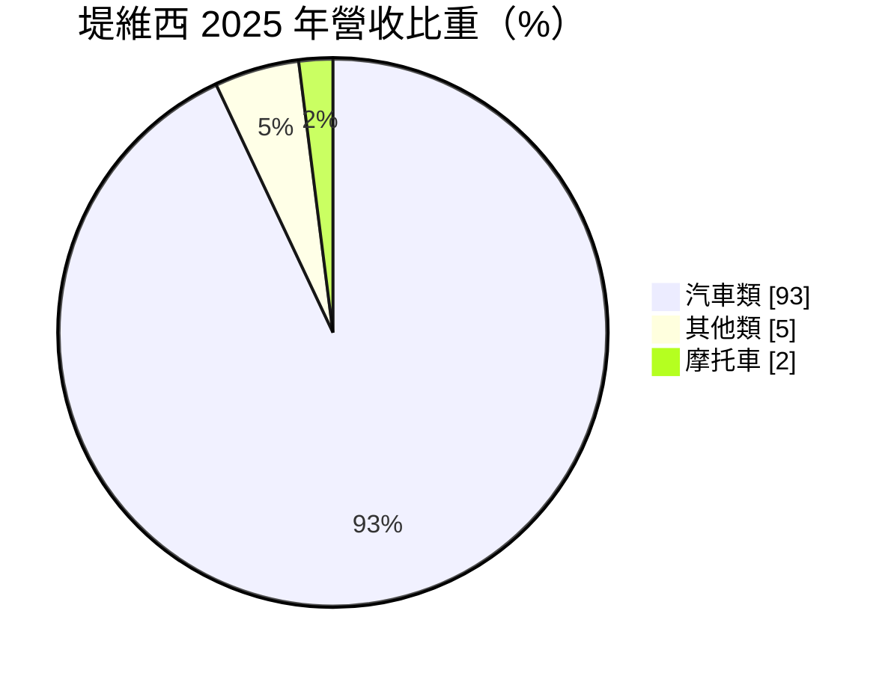
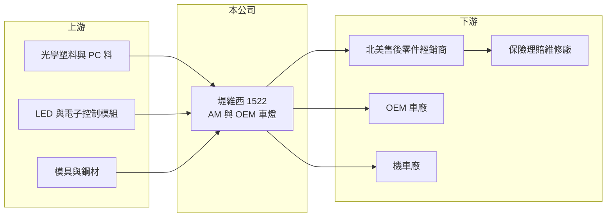

# 1522 堤維西

> 上市｜[[產業索引-汽車工業|汽車工業]]｜上市（櫃）日期 1997/10/06

# 第一章：企業模式與商業藍圖

> [!info] 撰寫說明
> 精簡版，由 Claude 依公開資料整理，架構比照 [[2330台積電]] 的四章研究，資料截至 2026-10-08。財務數字來源：Goodinfo 年度經營績效頁、MoneyDJ 個股基本資料（2025 年營收比重）、證交所開放資料（基本資料、2026 年第二季資產負債與綜合損益、營益分析、股利、本益比）；市場地位與通路描述部分憑既有知識撰寫，已標「待校對」。#待校對

在評估單一個股的長期價值時，首要步驟是拆解企業的獲利來源。本章說明堤維西交通工業（股票代號：1522，以下簡稱堤維西）如何從台南的車燈廠，成長為全球[[AM售後市場]]車燈的主要供應商之一，以及它近年往 [[OEM]] 市場延伸的策略。

- **核心業務：** 堤維西成立於 1986 年，1997 年上市，總部位於台南，董事長為吳國禎、總經理為蘇彥碩。依 MoneyDJ 的 2025 年營收比重，汽車類占 93%、其他類占 5%、摩托車占 2%，產品以汽車頭燈、尾燈等燈具為主，另有其他車身外觀零件。#待校對
- **售後市場的商業模式：** 堤維西的主要市場是北美的車燈替換市場。車輛發生碰撞後，保險公司為了控制理賠成本，傾向使用經過 [[CAPA認證]]、價格低於原廠件的替換零件，這就是堤維西等台灣 AM 車燈廠的主要需求來源。需求取決於路上車輛數、車齡與事故率，和新車銷量的關聯較弱。
- **OEM 延伸：** 除了售後市場，堤維西也替車廠供應原廠車燈，生產據點分布在台灣與中國等地（推估）。#待校對 OEM 業務的單價與技術要求較高，但開發期長、需要先投入模具與產能。
- **長期方向：** 車燈從鹵素燈走向 LED 與智慧頭燈，單顆燈具價值提高，對售後市場而言代表每次替換的金額變大，但開發難度也提高。堤維西營收從 2021 年的 166 億元成長到 2025 年的 244 億元（Goodinfo），規模持續擴大，長期關鍵在於維持 LED 新品的開發速度與北美通路地位。

# 第二章：護城河深度與競爭優勢

本章分析堤維西的競爭優勢與限制。

- **競爭優勢：** 售後市場車燈的護城河來自三點。第一是品項數量，每一款車都需要專屬的燈具模具，累積數十年的模具庫是新進者難以追上的資產。第二是認證，CAPA 等認證需要時間與測試成本，取得認證的零件才能進入保險理賠體系。第三是北美的倉儲與配送通路，維修廠要求快速交貨，在地庫存能力決定能否接單。
- **規模優勢：** 堤維西的營收規模在台灣售後車燈業者中名列前茅，與 [[6605帝寶]] 並列兩大廠，規模讓它在開模成本分攤與通路談判上占有優勢。
- **主要對手：** [[6605帝寶]] 是最直接的對手；其他包括台灣的 [[1339昭輝]]、中國的售後車燈廠，以及在 OEM 市場的小糸製作所、法雷奧、海拉等國際車燈廠。
- **觀察重點：** 第一，2025 年營收大增後獲利率下滑的原因能否改善；第二，北美關稅政策對售後零件的影響；第三，LED 車燈在替換市場的滲透率與價格。

# 第三章：財務體質與盈利規模

資料日期：2026-10-08，表格是撰寫當時的快照；最新月營收、毛利率、累計 EPS 由自動排程寫在本筆記的屬性欄位（月營收、毛利率、累計EPS 等）。#待校對

本章用多年度的三率、ROE 與資本報酬，檢視堤維西的獲利品質。

| 年度 | 營收（新台幣） | [[毛利率]] | [[營業利益率]] | EPS（元） | [[ROE]] |
|---|---|---|---|---|---|
| 2021 | 166 億 | 18.1% | 2.59% | 0.62 | 3.18% |
| 2022 | 192 億 | 21.8% | 4.62% | 2.91 | 11.5% |
| 2023 | 193 億 | 26.8% | 9.06% | 3.31 | 12.4% |
| 2024 | 201 億 | 29.2% | 11.7% | 4.76 | 15.9% |
| 2025 | 244 億 | 21.9% | 4.91% | 1.72 | 6.19% |
| 2026 上半年 | 133.4 億 | 16.73% | -0.76% | -0.76 | 未查得 |

註：2021 至 2025 年取自 Goodinfo，2026 上半年取自證交所營益分析。證交所股利資料的 2025 年本期淨利約 5.98 億元，以 2026 年第二季的股本 34.29 億元換算約 1.74 元，與 Goodinfo 的 1.72 元相近；但證交所基本資料的已發行普通股數為 3.13 億股，股本數字不一致，可能有增資或股本變動，請以年報核對。

- **營收規模：** 2021 至 2025 年營收年複合成長率約 10.1%（推算），2025 年單年成長約兩成，2026 年上半年約 133.4 億元，年化後仍高於 2025 年。2025 年營收大增的原因本文未查得（可能與合併範圍或新業務有關，待校對）。
- **獲利結構：** 2021 至 2024 年毛利率由 18.1% 提升到 29.2%，營業利益率由 2.6% 提升到 11.7%，是售後市場車燈景氣最好的一段期間；2025 年營收擴大但毛利率降到 21.9%，2026 年上半年更降到 16.73%、營業利益轉為虧損（證交所開放資料），顯示新增營收的獲利率偏低，或成本與費用明顯上升。
- **長期指標：** 2021 至 2025 年平均 ROE 約 9.8%（推算）。2025 年度配發現金股利 1.20 元，配發率約七成（推算）。
- **財務特色：** 2026 年第二季底總負債約 288.8 億元，其中流動負債約 170.6 億元、非流動負債約 118.2 億元，權益總計約 99.8 億元，負債比約 74%（證交所開放資料）。相較於台灣同業，堤維西的財務槓桿明顯偏高，這是分析它時最需要注意的一點。

**[[ROIC]] 與 [[WACC]]：** 2025 年營業利益約 244 億元 × 4.91% ≈ 12.0 億元，稅後約 9.6 億元。投入資本以權益 99.8 億元加上假設占總負債六成的有息負債約 173.3 億元，合計約 273.1 億元，ROIC 約 3.5%（推算）；以 2024 年營業利益約 23.5 億元計，ROIC 約 6.9%（推算）。WACC 以 CAPM 推估：無風險利率 1.75%、市場風險溢酬 6%，因負債比高，β 取 1.2，股東權益成本約 8.95%；負債成本 2.5%、稅後 2.0%；權益約占 37%，WACC 約 4.6%（推算）。結論是堤維西在 2023 至 2024 年的高峰期 ROIC 高於資金成本，屬於創造價值；2025 年後利差轉負。高槓桿放大了好年與壞年的差距，獲利率能否回到 2024 年水準，是判斷它長期價值的關鍵。

# 第四章：總體風險與地緣政治

本章分析堤維西長期面對的風險。

- **產業週期：** 售後市場需求雖與新車銷量關聯較弱，但北美經銷商的庫存調整、保險理賠政策與車禍率變化，都會讓訂單在短期內大幅波動。
- **營運風險：** 2025 年後營收擴大、獲利率下滑，顯示成本控制或產品組合出現問題；LED 車燈的開發成本高，若新品推出速度不及對手，市占率可能流失。高負債使利息支出成為固定負擔，獲利下滑時財務壓力會加重。
- **其他風險：** 美國對進口汽車零件的關稅政策，直接影響售後車燈的價格競爭力與利潤；原廠對外觀設計專利的主張是售後市場長期的法律風險；新台幣、人民幣與美元的匯率波動影響帳面獲利。

# 專有名詞解析

## 應用

- **[[AM售後市場]]**：After Market，汽車出廠後的維修、替換與改裝零件市場，需求取決於車輛數與車齡，而非新車銷量。
- **[[OEM]]**：原廠委託製造，零件直接供應車廠裝在新車上，需通過車廠認證，訂單隨車型生命週期而定。
- **[[CAPA認證]]**：美國汽車零件認證協會的品質認證，通過認證的替換零件較容易被保險公司接受用於理賠維修。

## 金融

- **[[毛利率]]**：營業毛利占營收的比例，反映產品定價能力與生產成本控制。
- **[[營業利益率]]**：扣除營業費用後的營業利益占營收的比例，衡量本業整體獲利能力。
- **[[ROE]]**：股東權益報酬率，稅後淨利除以股東權益，衡量公司運用股東資金的效率。
- **[[ROIC]]**：投入資本報酬率，稅後營業利益除以股東權益與有息負債的合計，衡量本業對所有資金提供者的報酬。
- **[[WACC]]**：加權平均資金成本，依股東權益與負債的比重加權計算的資金成本，ROIC 高於它才代表創造價值。

# 核心供應鏈

- 上游：光學塑料與 PC 料、LED 與電子控制模組、模具與鋼材。
- 下游／客戶：北美與歐洲的售後零件經銷商、保險理賠體系下的維修廠、OEM 車廠與機車廠（待校對）。
- 同業：[[6605帝寶]]、[[1339昭輝]]、[[1521大億]]、[[1524耿鼎]]。

## 最新新聞
<!-- news:start -->
<!-- news:end -->

## 相關連結
- [公開資訊觀測站](https://mopsov.twse.com.tw/mops/web/t05st03?step=1&firstin=1&co_id=1522)
- [Goodinfo](https://goodinfo.tw/tw/StockDetail.asp?STOCK_ID=1522)
- [Yahoo 股市](https://tw.stock.yahoo.com/quote/1522)
- [鉅亨網新聞](https://www.cnyes.com/twstock/1522/news)
