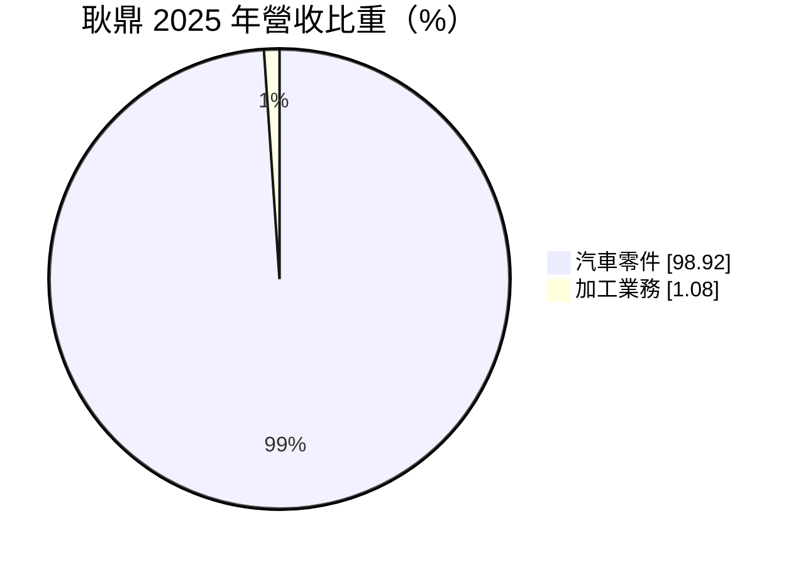
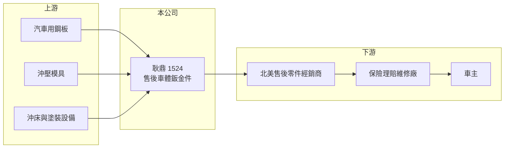

# 1524 耿鼎

> 上市｜[[產業索引-汽車工業|汽車工業]]｜上市（櫃）日期 1998/10/30

# 第一章：企業模式與商業藍圖

> [!info] 撰寫說明
> 精簡版，由 Claude 依公開資料整理，架構比照 [[2330台積電]] 的四章研究，資料截至 2026-10-08。財務數字來源：Goodinfo 年度經營績效頁、MoneyDJ 個股基本資料（2025 年營收比重）、證交所開放資料（基本資料、2026 年第二季資產負債與綜合損益、營益分析、股利、本益比）；產品與市場描述部分憑既有知識撰寫，已標「待校對」。公開資料有限。#待校對

在評估單一個股的長期價值時，首要步驟是拆解企業的獲利來源。本章說明耿鼎企業（股票代號：1524，以下簡稱耿鼎）作為[[AM售後市場]]車體鈑金件廠的定位，以及它為何能在 2022 至 2024 年交出汽車零件業少見的高報酬。

- **核心業務：** 耿鼎成立於 1986 年，1998 年上市，總部與工廠位於桃園市蘆竹區，董事長兼總經理為李茂源，實收資本額約 16.5 億元。依 MoneyDJ 的 2025 年營收比重，汽車零件占 98.92%、加工業務占 1.08%。產品以引擎蓋、葉子板、車門、後行李箱蓋等[[車體鈑金件]]為主，主要外銷北美的碰撞維修市場（推估）。#待校對
- **商業模式：** 車輛碰撞後最常更換的就是車體外殼與保險桿。保險公司為了控制理賠成本，願意使用通過 [[CAPA認證]]、價格低於原廠的替換件，這讓耿鼎這類業者有穩定的需求來源。需求取決於路上車輛數、車齡與事故率，與新車銷量的關聯較弱。
- **製造特性：** 鈑金件需要大型沖壓模具與沖床，每一款車型的每一個部位都要開一套模具，前期投資高。耿鼎的獲利模式是用累積的模具庫在車型的整個使用年限內持續銷售，一款車在路上跑十幾年，替換零件就能賣十幾年。
- **長期方向：** 耿鼎營收從 2021 年的 19.6 億元成長到 2024 年的 30.2 億元，毛利率從 16.4% 提升到 31.9%（Goodinfo），說明品項擴充與北美需求帶來明顯的規模效益。長期課題是持續開發新車型的模具，並因應美國關稅與電動車車體設計的變化。

# 第二章：護城河深度與競爭優勢

本章分析耿鼎的競爭優勢與限制。

- **競爭優勢：** 第一是模具庫。鈑金件的模具昂貴、開發期長，累積的車型與部位數量決定能接多少訂單，新進者需要多年才能追上。第二是認證與品質。鈑金件必須能精準對位安裝，尺寸偏差會影響維修品質，取得認證並維持穩定品質的業者才能長期留在保險理賠的採購名單中。第三是規模化的生產與出貨能力。
- **報酬率的證明：** 2024 年 ROE 達 20.6%、營業利益率 21.2%（Goodinfo），在台灣汽車零件業中屬於高水準，說明耿鼎在售後鈑金件領域具備實質的定價能力。
- **主要對手：** 台灣與中國的售後車體零件廠，以及原廠零件。台灣售後零件同業包括 [[1522堤維西]]、[[6605帝寶]]、[[1339昭輝]] 等，產品以車燈為主，與耿鼎的鈑金件部分互補、部分在通路上競爭。
- **觀察重點：** 第一，美國關稅政策對售後鈑金件價格的影響；第二，新車型模具的開發速度；第三，2025 年營收與利潤率回落後能否回到成長軌道。

# 第三章：財務體質與盈利規模

資料日期：2026-10-08，表格是撰寫當時的快照；最新月營收、毛利率、累計 EPS 由自動排程寫在本筆記的屬性欄位（月營收、毛利率、累計EPS 等）。#待校對

本章用多年度的三率、ROE 與資本報酬，檢視耿鼎的獲利品質。

| 年度 | 營收（新台幣） | [[毛利率]] | [[營業利益率]] | EPS（元） | [[ROE]] |
|---|---|---|---|---|---|
| 2021 | 19.6 億 | 16.4% | 4.26% | 0.38 | 2.79% |
| 2022 | 24.4 億 | 22.8% | 11.6% | 2.04 | 14.1% |
| 2023 | 27.0 億 | 27.0% | 16.2% | 2.13 | 13.5% |
| 2024 | 30.2 億 | 31.9% | 21.2% | 3.61 | 20.6% |
| 2025 | 26.3 億 | 27.9% | 16.2% | 1.95 | 10.6% |
| 2026 上半年 | 11.5 億 | 28.88% | 15.50% | 0.90 | 未查得 |

註：2021 至 2025 年取自 Goodinfo，2026 上半年取自證交所營益分析；2025 年 EPS 與證交所股利資料的本期淨利 3.23 億元換算結果一致。

- **營收規模：** 2021 至 2025 年營收年複合成長率約 7.6%（推算）。2024 年達 30.2 億元高峰，2025 年回落到 26.3 億元，2026 年上半年約 11.5 億元，年化後仍低於 2025 年，成長動能轉弱。
- **獲利結構：** 毛利率在 2024 年達到 31.9% 的高點，2025 年後維持在 28% 左右；營業利益率約 15% 至 16%，本業獲利穩定，業外收益占比低，獲利品質良好。
- **長期指標：** 2021 至 2025 年平均 ROE 約 12.3%（推算）。2025 年度配發現金股利 1.40 元，配發率約 72%（推算）。
- **財務特色：** 2026 年第二季底總負債約 23.1 億元，其中非流動負債約 13.4 億元，權益總計約 29.7 億元，負債比約 44%（證交所開放資料）。鈑金件需要持續投資模具與沖壓設備，負債水準高於一般零件廠，推估與廠房與設備投資有關。

**[[ROIC]] 與 [[WACC]]：** 2025 年營業利益約 26.3 億元 × 16.2% ≈ 4.3 億元，稅後約 3.4 億元。投入資本以權益 29.7 億元加上假設占總負債六成的有息負債約 13.8 億元，合計約 43.5 億元，ROIC 約 7.8%（推算）；以 2024 年營業利益約 6.4 億元計，ROIC 約 11.8%（推算）。WACC 以 CAPM 推估：無風險利率 1.75%、市場風險溢酬 6%、β 取汽車零件業常見值 0.9，股東權益成本約 7.15%；負債成本 2.5%、稅後 2.0%；權益約占 68%，WACC 約 5.5%（推算）。結論是耿鼎在 2022 年以後的 ROIC 持續高於資金成本，在台灣中小型汽車零件公司中屬於明確創造價值的例子；利差在 2025 年收窄，需要觀察是否為短期庫存調整或長期競爭加劇。

# 第四章：總體風險與地緣政治

本章分析耿鼎長期面對的風險。

- **產業週期：** 售後碰撞件需求雖較穩定，但北美經銷商的庫存調整會造成訂單短期大幅波動，2025 年營收下滑可能與此有關（推估）。
- **營運風險：** 模具開發需要大量前期投資，若開發的車型銷量不如預期，模具無法回收成本。鋼材是主要原料，鋼價上漲時若無法轉嫁，毛利率會受壓。
- **科技演進風險：** 電動車與新車款大量採用鋁材、[[一體壓鑄]]或塑料車身，未來部分車體部位的替換方式可能改變，傳統沖壓鈑金件的適用範圍可能縮小，這是十年尺度上最重要的結構性風險。
- **其他風險：** 美國關稅與貿易保護措施直接影響出口價格競爭力；原廠的設計專利主張是售後市場長期的法律風險；新台幣升值會壓縮以美元計價的毛利。

# 專有名詞解析

## 應用

- **[[AM售後市場]]**：After Market，汽車出廠後的維修、替換與改裝零件市場，需求取決於車輛數與車齡，而非新車銷量。
- **[[CAPA認證]]**：美國汽車零件認證協會的品質認證，通過認證的替換零件較容易被保險公司接受用於理賠維修。
- **[[車體鈑金件]]**：以鋼板沖壓成型的車身外殼零件，如引擎蓋、葉子板、車門，是碰撞維修最常更換的零件之一。
- **[[一體壓鑄]]**：以大型壓鑄機一次成型整塊車身結構件的製程，可減少零件數量，但碰撞後的維修方式與傳統鈑金不同。

## 金融

- **[[毛利率]]**：營業毛利占營收的比例，反映產品定價能力與生產成本控制。
- **[[營業利益率]]**：扣除營業費用後的營業利益占營收的比例，衡量本業整體獲利能力。
- **[[ROE]]**：股東權益報酬率，稅後淨利除以股東權益，衡量公司運用股東資金的效率。
- **[[ROIC]]**：投入資本報酬率，稅後營業利益除以股東權益與有息負債的合計，衡量本業對所有資金提供者的報酬。
- **[[WACC]]**：加權平均資金成本，依股東權益與負債的比重加權計算的資金成本，ROIC 高於它才代表創造價值。

# 核心供應鏈

- 上游：汽車用鋼板（如 [[2002中鋼]]，推估）、沖壓模具、沖床與塗裝設備。
- 下游／客戶：北美售後零件經銷商、保險理賠體系下的碰撞維修廠（待校對）。
- 同業：[[1522堤維西]]、[[6605帝寶]]、[[1339昭輝]]，以及中國的售後車體零件廠。

## 最新新聞
<!-- news:start -->
<!-- news:end -->

## 相關連結
- [公開資訊觀測站](https://mopsov.twse.com.tw/mops/web/t05st03?step=1&firstin=1&co_id=1524)
- [Goodinfo](https://goodinfo.tw/tw/StockDetail.asp?STOCK_ID=1524)
- [Yahoo 股市](https://tw.stock.yahoo.com/quote/1524)
- [鉅亨網新聞](https://www.cnyes.com/twstock/1524/news)
