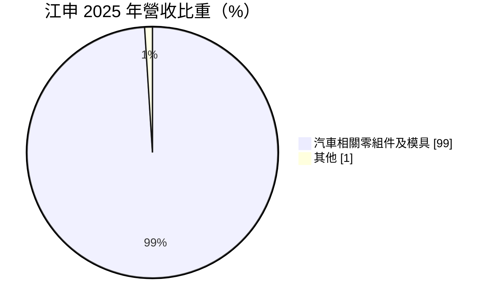
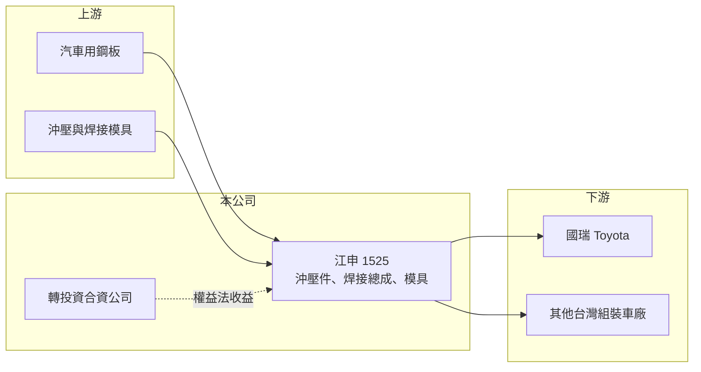

# 1525 江申

> 上市｜[[產業索引-汽車工業|汽車工業]]｜上市（櫃）日期 1999/05/15

# 第一章：企業模式與商業藍圖

> [!info] 撰寫說明
> 精簡版，由 Claude 依公開資料整理，架構比照 [[2330台積電]] 的四章研究，資料截至 2026-10-08。財務數字來源：Goodinfo 年度經營績效頁、MoneyDJ 個股基本資料（2025 年營收比重）、證交所開放資料（基本資料、2026 年第二季資產負債與綜合損益、營益分析、股利、本益比）；客戶與轉投資描述部分憑既有知識撰寫，已標「待校對」。公開資料有限。#待校對

在評估單一個股的長期價值時，首要步驟是拆解企業的獲利來源。本章說明江申工業（股票代號：1525，以下簡稱江申）的雙層獲利結構：表面上是一家營收約十幾億元的汽車沖壓件廠，實際上大部分盈餘來自轉投資。

- **核心業務：** 江申成立於 1963 年，1999 年上市，總部與工廠位於桃園市楊梅區，董事長為熊東台，實收資本額約 7.34 億元。依 MoneyDJ 的 2025 年營收比重，汽車相關零組件及模具占 99%、其他占 1%。產品以車體與底盤的[[沖壓件]]、焊接總成與相關模具為主（推估），主要客戶為台灣的日系組裝車廠，國瑞汽車（Toyota）是重要客戶。#待校對
- **本業的性質：** 江申屬於整車廠的一階或二階供應商，零件依車廠設計圖生產，訂單跟著[[車型生命週期]]走。台灣車市規模有限，江申本業營收長期在 10 億至 16 億元之間，營業利益率多在 1% 至 4%（Goodinfo），本業是穩定但微利的代工業務。
- **轉投資的角色：** 江申的 EPS 長期遠高於本業所能支撐的水準。以 2025 年為例，營業利益約 0.41 億元，但本期淨利約 2.36 億元（證交所股利資料），差額主要來自業外的轉投資收益，推估為以[[權益法]]認列的海外合資公司獲利。#待校對 換言之，投資江申，實際上是投資一個轉投資組合加上一個小型沖壓廠。
- **長期方向：** 江申的長期價值取決於兩件事：轉投資公司的獲利能否維持，以及本業能否藉由電動車零件等新產品提高附加價值。

# 第二章：護城河深度與競爭優勢

本章分析江申的競爭優勢與限制。

- **競爭優勢：** 汽車沖壓件需要通過車廠的品質認證，且與車廠的生產節奏緊密配合，新供應商要取代既有廠商並不容易。江申經營超過六十年，與日系車廠體系的長期合作關係與模具能力是它的主要門檻。財務上，江申幾乎沒有財務壓力，2026 年第二季底負債比僅約 16%，保留盈餘約 43.3 億元（證交所開放資料）。
- **限制：** 台灣車市規模小，本業缺乏規模經濟，毛利率長期只有 8% 至 15%。本業的議價能力弱，獲利波動主要來自轉投資，股東對轉投資公司的營運掌握度相對有限。
- **主要對手：** 台灣的汽車沖壓與車體零件廠，以及日系車廠體系內的其他協力廠；轉投資方面則取決於被投資公司所在市場的競爭。
- **觀察重點：** 第一，轉投資收益的穩定度與股利匯回情形；第二，台灣國產車市場的變化，特別是主要客戶的車型規劃；第三，電動車相關零件的接單是否擴大本業規模。

# 第三章：財務體質與盈利規模

資料日期：2026-10-08，表格是撰寫當時的快照；最新月營收、毛利率、累計 EPS 由自動排程寫在本筆記的屬性欄位（月營收、毛利率、累計EPS 等）。#待校對

本章用多年度的三率、ROE 與資本報酬，檢視江申本業與業外的獲利品質。

| 年度 | 營收（新台幣） | [[毛利率]] | [[營業利益率]] | EPS（元） | [[ROE]] |
|---|---|---|---|---|---|
| 2021 | 12.8 億 | 8.14% | 1.14% | 4.18 | 7.00% |
| 2022 | 15.0 億 | 9.83% | 2.98% | 3.68 | 5.96% |
| 2023 | 16.0 億 | 11.3% | 4.09% | 5.50 | 8.59% |
| 2024 | 14.6 億 | 12.2% | 3.75% | 4.12 | 6.18% |
| 2025 | 12.5 億 | 14.8% | 3.31% | 3.21 | 4.71% |
| 2026 上半年 | 6.34 億 | 15.18% | 2.48% | -0.13 | 未查得 |

註：2021 至 2025 年取自 Goodinfo，2026 上半年取自證交所營益分析；2025 年 EPS 與證交所股利資料的本期淨利 2.36 億元換算結果一致。

- **營收規模：** 2021 至 2025 年營收年複合成長率約 -0.6%（推算），本業規模大致停滯，2023 年 16.0 億元為近年高點。
- **獲利結構：** 毛利率從 2021 年的 8.14% 逐年提升到 2026 年上半年的 15.18%，本業效率有所改善。但 EPS 主要來自業外：2016 至 2017 年 EPS 達 7 元以上（Goodinfo），當時營業利益率僅約 1%。2026 年上半年稅前淨利約 1.08 億元，但所得稅費用約 1.17 億元，使稅後轉為小幅虧損（證交所開放資料），推估與海外轉投資盈餘匯回的稅負有關（待校對）。
- **長期指標：** 2021 至 2025 年平均 ROE 約 6.5%（推算），呈緩步下滑。2025 年度配發現金股利 2.80 元，配發率約 87%（推算），長期維持高配息。
- **財務特色：** 2026 年第二季底總負債約 9.4 億元、權益總計約 49.9 億元，負債比約 16%；流動資產約 28.4 億元，遠高於流動負債約 6.5 億元（證交所開放資料）。每股淨值約 67.96 元，股價淨值比約 0.93 倍。

**[[ROIC]] 與 [[WACC]]：** 若只看本業，2025 年營業利益約 12.5 億元 × 3.31% ≈ 0.41 億元，稅後約 0.33 億元；投入資本以權益 49.9 億元加上假設占總負債三成的有息負債約 2.8 億元，合計約 52.7 億元，ROIC 僅約 0.6%（推算）。由於大部分資本是轉投資股權，把轉投資收益計入後，整體資本報酬約與 ROE 相當，近年在 5% 至 9% 之間。WACC 以 CAPM 推估：無風險利率 1.75%、市場風險溢酬 6%、β 取汽車零件業常見值 0.9，股東權益成本約 7.15%；負債成本 2.5%、稅後 2.0%；權益約占 95%，WACC 約 6.9%（推算）。結論是江申的本業本身沒有創造價值，整體則在轉投資表現好的年度（如 2023 年）略高於資金成本、其他年度略低，大致處於「維持價值」的狀態。

# 第四章：總體風險與地緣政治

本章分析江申長期面對的風險。

- **產業週期與結構：** 本業依賴台灣國產車市場，進口車比重上升與車廠在台生產規模縮減，都會壓縮沖壓件需求。電動車的車體結構改用鋁材或[[一體壓鑄]]時，傳統鋼板沖壓件的需求可能下降。
- **營運風險：** 客戶集中於少數車廠，單一車型停產會造成營收缺口；鋼材價格波動影響毛利率。
- **轉投資風險：** EPS 高度依賴轉投資收益，被投資公司所在市場的景氣、競爭與政策變化，會直接影響江申的獲利；盈餘匯回的稅負與時點也讓年度 EPS 波動。
- **其他風險：** 兩岸關係與海外投資相關法規、匯率波動，以及台灣汽車產業政策的調整。

# 專有名詞解析

## 應用

- **[[沖壓件]]**：以沖床和模具把鋼板壓製成特定形狀的零件，用於車身、底盤與結構件。
- **[[車型生命週期]]**：一款車從上市到改款或停產的期間，通常為 4 至 6 年，零件供應商的訂單多以此為單位。
- **[[一體壓鑄]]**：以大型壓鑄機一次成型整塊車身結構件的製程，可減少零件數量，但碰撞後的維修方式與傳統鈑金不同。

## 金融

- **[[權益法]]**：持股約兩成至五成的轉投資，依持股比例認列被投資公司損益的會計方法，收益列在業外。
- **[[毛利率]]**：營業毛利占營收的比例，反映產品定價能力與生產成本控制。
- **[[營業利益率]]**：扣除營業費用後的營業利益占營收的比例，衡量本業整體獲利能力。
- **[[ROE]]**：股東權益報酬率，稅後淨利除以股東權益，衡量公司運用股東資金的效率。
- **[[ROIC]]**：投入資本報酬率，稅後營業利益除以股東權益與有息負債的合計，衡量本業對所有資金提供者的報酬。
- **[[WACC]]**：加權平均資金成本，依股東權益與負債的比重加權計算的資金成本，ROIC 高於它才代表創造價值。

# 核心供應鏈

- 上游：汽車用鋼板（如 [[2002中鋼]]，推估）、沖壓與焊接模具。
- 下游／客戶：國瑞汽車（Toyota）等台灣組裝車廠（待校對）。
- 同業：台灣汽車沖壓與車體零件廠，如 [[1524耿鼎]]、[[1512瑞利]]（汽車零件業務）。

## 最新新聞
<!-- news:start -->
<!-- news:end -->

## 相關連結
- [公開資訊觀測站](https://mopsov.twse.com.tw/mops/web/t05st03?step=1&firstin=1&co_id=1525)
- [Goodinfo](https://goodinfo.tw/tw/StockDetail.asp?STOCK_ID=1525)
- [Yahoo 股市](https://tw.stock.yahoo.com/quote/1525)
- [鉅亨網新聞](https://www.cnyes.com/twstock/1525/news)
