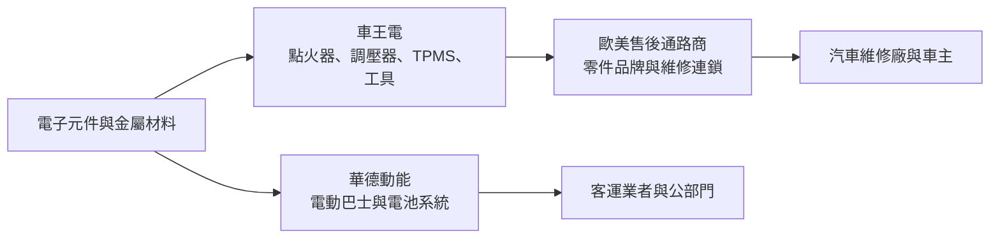
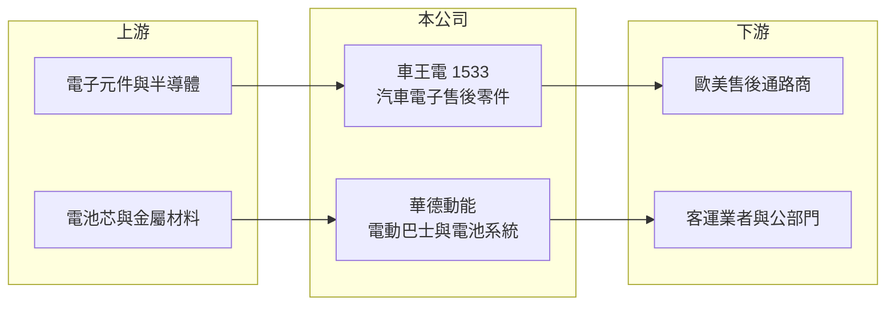

# 1533 車王電

> 上市｜[[產業索引-汽車工業|汽車工業]]｜上市（櫃）日期 2001/04/06

# 第一章：企業模式與商業藍圖

> [!info] 撰寫說明
> 本文由 Claude 依公開資料整理，架構比照 [[2330台積電]] 的四章研究，資料截至 2026-10-08。財務數字來源：Goodinfo 台灣股市資訊網年度經營績效、證交所開放資料（本筆記 _data 快照）、nstock 公司簡介；產品比重與客戶公開資料有限，部分業務描述憑既有知識整理並標「待校對」。#待校對

在評估單一個股的長期投資價值時，首要步驟是拆解企業的底層獲利邏輯。本章針對車王電子（股票代號：1533，以下簡稱車王電）的商業模式進行定性分析，說明一家以汽車售後電子零件起家的中型廠，如何把資源投入電動巴士與電動載具系統，以及這個轉型對獲利結構的影響。

## 一、核心定位：汽車電子售後零件加上電動載具系統

車王電成立於 1982 年，總部在台中大雅，2001 年上市。公司的傳統本業是汽車引擎與充電系統的電子控制零件，包括電子點火器、電壓調整器與整流器，以及無線胎壓偵測（[[TPMS]]）與車用精密數位工具。這類產品主要賣進歐美的 [[AM 售後市場]]，也就是車輛出廠後的維修更換通路，而不是直接賣給車廠組裝新車。售後市場的特性是車款多、單一料號量小，但需求跟著路上車輛的平均車齡走，景氣波動比新車市場小。

近十年車王電的第二條主線是電動載具。公司透過子公司華德動能（2025 年起以代號 2237 在台股掛牌，待校對）發展電動巴士、整車控制器（VCU）、電源分配器（PDU）、電池箱與電池管理系統（[[BMS]]）、動力線束與充電樁。這讓車王電從零件供應商延伸為電動商用車的系統整合者，但也讓集團財報同時承受新事業的虧損與投資。

## 二、產品板塊

公司未在本次查得的資料中揭露產品別營收比重，以下為定性分類，不畫圓餅圖。

* **汽車電子售後零件：** 點火器、電壓調整器、整流器等引擎與充電系統零件，是車王電累積數十年的本業。這類產品要對應大量歐美車款，料號管理與快速開模能力決定能否被通路商長期採用。
* **TPMS 與工具：** 胎壓偵測器與車用精密數位工具，同樣以維修通路為主。TPMS 在歐美屬法規強制配備，車齡增加後感測器電池耗盡就要更換，形成穩定的替換需求。
* **電動巴士與電動載具系統：** 由華德動能負責，包括電動大客車整車、控制器、電池系統與充電設備。這個板塊的營收隨標案與交車時點跳動，2025 至 2026 年電巴交車與充電樁出貨帶動集團營收明顯成長（依財經媒體標題，具體金額未查得）。

## 三、資本轉化邏輯（營運模式）

* **售後零件：小量多樣的利基生意。** 售後市場不需要像供應車廠那樣承擔新車專案的大額開發成本，但需要大量料號與穩定供貨。車王電的毛利率長期在 25% 至 30% 左右（Goodinfo 2019 至 2025 年資料），反映這類利基零件有一定的定價空間。
* **電動巴士：資本密集、標案導向。** 整車業務需要較大的營運資金與研發投入，營收認列取決於交車時點，獲利受補助政策與標案價格影響。2022 至 2024 年集團營業利益率轉為負值，主因就是新事業的投入期（推估）。

## 四、企業長期藍圖

車王電的長期方向是把傳統售後電子零件的穩定現金流，轉投入電動商用車與能源系統，讓公司在燃油車零件需求長期下滑之前，先建立電動化的第二成長曲線。從 2023 年公司打入北美電商車隊市場、電巴系統規劃進入日本的新聞（2023 年）來看，電動載具業務也開始往海外延伸。這個策略方向合理，但能否成功取決於電動巴士業務能否在補助退場後維持獲利，這是觀察車王電長期價值的核心問題。

# 第二章：護城河深度與競爭優勢

在長期價值投資中，「護城河」指企業抵禦競爭、維持超額利潤的保護機制。本章分析車王電在售後汽車電子與電動巴士兩個市場的護城河、主要對手，以及哪些優勢能長期守住。

## 一、護城河的核心組成要素

* **1. 售後料號廣度與通路關係：** 售後零件的競爭關鍵是能否涵蓋大量車款，讓通路商一站採購。車王電經營歐美售後市場數十年，累積的料號資料庫與通路關係，是新進者短期無法複製的資產。
* **2. 汽車電子設計能力：** 點火器、調壓器屬於車用電子控制產品，需要電路設計與可靠度驗證能力。這讓車王電可以把技術延伸到電動車的控制器與電池管理系統，而不是從零開始。
* **3. 國產電動巴士的在地優勢：** 台灣公部門推動電動巴士國產化，在地整車與系統廠在標案中具有優勢（推估）。不過這類優勢依賴政策，持續性不如技術或規模優勢。

## 二、全球主要競爭對手格局

| 對手 | 定位 | 對車王電的威脅 |
|---|---|---|
| 歐美與中國售後電子零件廠 | 以價格與料號廣度競爭 | 中國廠商以低價搶通路訂單 |
| [[1536和大]] 等台灣車用零件廠 | 部分供應電動車傳動與零件 | 在電動化零件領域爭取同一批客戶（間接競爭） |
| 2258鴻華先進-創 | 鴻海集團電動車平台 | 電動巴士與商用車整車的國內競爭者 |
| 成運、凱勝等電巴業者（未上市或其他市場） | 國內電動巴士整車 | 直接搶公部門與客運標案 |

## 三、優勢轉化：守得住／守不住／觀察重點

* **守得住：** 歐美售後電子零件與 TPMS 替換市場。只要燃油車與混合動力車的保有量仍大，維修需求就會延續，車王電的料號與通路優勢可以支撐穩定毛利。
* **守不住：** 若電動車普及到燃油車保有量明顯下降，點火器與充電系統零件的長期需求會萎縮。電動巴士業務則面臨國內外整車廠的價格競爭與補助政策變動。
* **觀察重點：** 長期可以看三件事：電動巴士與充電業務能否在不依賴一次性標案下持續獲利、集團營業利益率能否穩定回到 5% 以上，以及歸屬母公司的淨利與合併淨利之間的落差（反映子公司[[非控制權益]]的損益）是否縮小。

# 第三章：財務體質與盈利規模

資料日期：2026-10-08。數字取自 Goodinfo 年度經營績效與證交所開放資料快照，表格是撰寫當時的快照；最新月營收、毛利率、累計 EPS 由自動排程寫在本筆記的屬性欄位（月營收、毛利率、累計EPS 等）。#待校對

財務報表是檢驗護城河是否真實存在的最終標準。本章用多年度的三率、ROE 與資本報酬，檢視車王電在轉型投入期的獲利品質。

## 一、獲利能力的基石：三率

| 年度 | 營收（新台幣） | [[毛利率]] | [[營業利益率]] | EPS（元） | [[ROE]] |
|---|---|---|---|---|---|
| 2019 | 28.0 億 | 33.5% | 5.88% | 2.05 | 4.51% |
| 2020 | 28.7 億 | 28.1% | 2.23% | 0.86 | -0.18% |
| 2021 | 29.3 億 | 29.9% | 0.99% | 0.88 | 0.46% |
| 2022 | 33.7 億 | 26.0% | -2.73% | 0.42 | -2.20% |
| 2023 | 40.0 億 | 19.2% | -6.06% | -1.31 | -7.80% |
| 2024 | 33.5 億 | 25.1% | -5.98% | -1.11 | -7.58% |
| 2025 | 40.0 億 | 29.9% | 3.71% | 0.58 | 4.08% |

註：Goodinfo 的 ROE 以合併淨利計算，與歸屬母公司的 EPS 方向不一定一致（例如 2020 與 2022 年 EPS 為正但 ROE 為負），差異來自子公司的非控制權益損益（推估）。

* **[[毛利率]]：** 2019 至 2025 年大多在 25% 至 30%，2023 年降到 19.2%，可能與電巴等低毛利業務占比提高有關（推估）。2026 年上半年毛利率 27.7%（證交所開放資料），回到歷史常態區間。
* **[[營業利益率]]：** 2022 至 2024 年連續三年營業虧損，是新事業研發與營運費用尚未被營收撐起的結果；2025 年轉正為 3.71%，2026 年上半年進一步提高到 7.51%，顯示規模開始產生[[營運槓桿]]。
* **長期指標：** 2020 至 2025 年營收年複合成長率約 6.9%（推算）；2021 至 2025 年平均 ROE 約 -2.6%（推算）。2025 年度（114 年度）未配發現金股利（證交所開放資料），股利穩定度低。

## 二、[[ROE]]：資本效率

2026 年第二季底，車王電合併權益約 30.6 億元，其中歸屬母公司約 24.8 億元，非控制權益約 5.8 億元；負債總額約 71.9 億元，負債比約七成（證交所開放資料）。和多數售後零件廠低負債的型態不同，車王電因電動巴士業務需要營運資金，財務槓桿明顯較高。ROE 過去五年平均為負，代表轉型期間股東資本沒有得到合理報酬。

## 三、資本支出與自由現金流

* **[[CapEx]]：** 逐年資本支出未查得。售後零件本業屬輕資本，資本需求主要來自電動巴士產線與充電設備。
* **[[自由現金流]]：** 逐年數字未查得。電巴業務的應收款與存貨會占用大量現金，交車高峰期自由現金流可能為負，需留意。

## 四、[[ROIC]] 與 [[WACC]]：價值創造利差

有息負債明細未查得，以下以權益加非流動負債近似投入資本。2025 年營業利益約 1.48 億元（營收 40 億元 × 3.71%），扣除 20% 稅率後約 1.19 億元；投入資本以 2026 年第二季底權益 30.6 億元加非流動負債 27.8 億元，約 58.4 億元計算，ROIC 約 2.0%（推算）。若以 2026 年上半年營業利益 2.03 億元年化，稅後約 3.25 億元，ROIC 約 5.6%（推算）。

WACC 以 CAPM 推估：台灣 10 年期公債約 1.5% 至 2%，市場風險溢酬約 6%，β 未查得個股數值，考量轉型期獲利波動，採 1.0 至 1.2（假設），權益成本約 7.5% 至 9.2%；稅前負債成本假設 2.5%，稅後 2%；以負債約占投入資本一半計算，WACC 約 5% 至 6%（推算）。

兩者比較，車王電在 2022 至 2024 年 ROIC 為負，明顯低於 WACC；2025 年以後回升，但仍在資金成本附近。要成為長期創造價值的公司，電動巴士業務必須讓集團營業利益率穩定在 6% 以上，ROIC 才能持續高於 WACC。

# 第四章：總體風險與地緣政治

任何企業都無法脫離宏觀環境獨立存在。本章分析車王電長期必須面對的產業結構、政策與營運風險。

## 一、地緣政治與貿易

* **美國關稅：** 售後零件大量銷往美國，美國對進口汽車零件課徵關稅時，通路商可能要求供應商分攤成本，壓縮毛利。
* **中國低價競爭：** 中國售後零件廠以價格搶市，車王電需要靠料號廣度、品質與交期維持差異化。

## 二、產業週期與市場結構

* **燃油車零件的長期萎縮：** 點火器、調壓器等燃油車零件，長期需求會隨電動車滲透而下降。不過售後市場有十年以上的車齡尾巴，衰退速度會比新車市場慢。
* **電動巴士的政策週期：** 電動巴士銷售高度依賴政府補助與公部門採購時程，政策調整會直接影響訂單與營收認列。

## 三、營運環境的隱性風險

* **財務槓桿較高：** 負債比約七成，電巴業務若交車延後或應收款回收變慢，會增加財務壓力。
* **子公司損益波動：** 集團獲利受華德動能影響大，子公司虧損會讓合併報表與母公司 EPS 表現不一致，投資人需同時看兩者。
* **匯率：** 外銷以美元與歐元計價，新台幣升值會壓縮營收與毛利。

## 四、科技或法規演進

* **電池與充電技術變化：** 電池化學系統與充電標準變化快，若產品無法跟上，既有投資可能過時。
* **車輛安全與國產化法規：** 電動巴士需符合車輛安全審驗與國產化比率規定，法規調整會影響開發成本與標案資格。

# 專有名詞解析

## 應用

- **[[TPMS]]**：胎壓偵測系統，即時監測輪胎氣壓並在異常時警示駕駛，歐美新車法規強制配備。
- **[[BMS]]**：電池管理系統，監控電池的電壓、溫度與電量，確保電動車電池安全並延長壽命。

## 金融

- **[[非控制權益]]**：子公司中不屬於母公司的股東權益，子公司虧損時會讓合併淨利與母公司淨利出現差異。
- **[[營運槓桿]]**：固定成本占比高時，營收增加會讓營業利益以更快速度成長，反之亦然。
- **[[ROIC]]**：投入資本報酬率，衡量公司用股東與債權人資金創造本業稅後利潤的效率。
- **[[WACC]]**：加權平均資金成本，依股權與負債比重加權的資金成本，是 ROIC 要超過的門檻。

## 產業

- **[[AM 售後市場]]**：車輛出廠後的維修與更換零件市場，需求跟著路上車輛數量與車齡走，波動比新車市場小。

# 核心供應鏈

## 1. 上游：電子元件與電池材料
- 車用電子元件、功率半導體、電池芯與金屬結構件（具體供應商未查得）

## 2. 中游：車王電本身
- 汽車電子售後零件、TPMS、車用精密工具
- 子公司華德動能：電動巴士、VCU、PDU、電池系統、充電樁（待校對）

## 3. 下游：客戶
- 歐美汽車售後零件通路商與維修連鎖（具名客戶未查得）
- 國內客運業者與公部門電巴標案；2023 年報導打入北美電商車隊市場

## 4. 同業
- 台灣：[[1536和大]]、2258鴻華先進-創、[[2201裕隆]]、[[2206三陽工業]]（nstock 列為同產業類別）
- 海外：歐美與中國售後汽車電子零件廠

## 最新新聞
<!-- news:start -->
<!-- news:end -->

## 相關連結
- [公開資訊觀測站](https://mopsov.twse.com.tw/mops/web/t05st03?step=1&firstin=1&co_id=1533)
- [Goodinfo](https://goodinfo.tw/tw/StockDetail.asp?STOCK_ID=1533)
- [Yahoo 股市](https://tw.stock.yahoo.com/quote/1533)
- [鉅亨網新聞](https://www.cnyes.com/twstock/1533/news)
