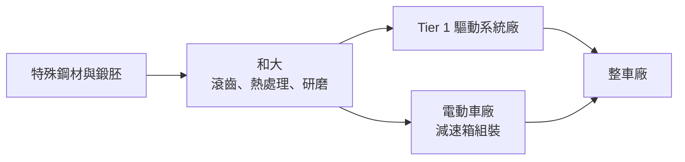
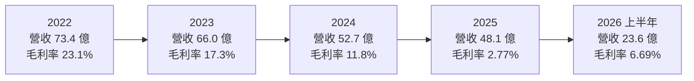
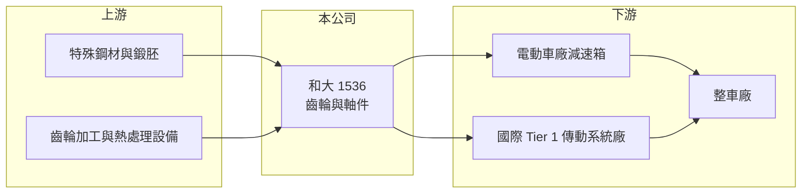

# 1536 和大

> 上市｜[[產業索引-汽車工業|汽車工業]]｜上市（櫃）日期 2001/09/17

# 第一章：企業模式與商業藍圖

> [!info] 撰寫說明
> 本文由 Claude 依公開資料整理，架構比照 [[2330台積電]] 的四章研究，資料截至 2026-10-08。財務數字來源：Goodinfo 台灣股市資訊網年度經營績效、證交所開放資料（本筆記 _data 快照）；業務描述參考股感 StockFeel（2020 年）與 CMoney 研究文章標題，客戶與據點細節公開資料有限，部分憑既有知識整理並標「待校對」。#待校對

在評估單一個股的長期投資價值時，首要步驟是拆解企業的底層獲利邏輯。本章針對和大工業（股票代號：1536，以下簡稱和大）的商業模式進行定性分析，說明這家台中的齒輪廠如何因為解決特斯拉減速齒輪的噪音問題而成為電動車概念股，以及高度集中的客戶結構如何在 2024 至 2025 年反過來壓垮獲利。

## 一、核心定位：汽車傳動齒輪與軸件的 OEM 供應商

和大成立於 1973 年，總部在台中大里，2001 年上市，主要產品是汽車變速箱、差速器與電動車減速箱使用的齒輪與軸類零件。和大屬於 [[OEM]] 供應鏈，零件直接或透過 [[Tier 1]] 系統廠進入新車組裝，和售後維修市場的零件廠不同，它的營收跟著客戶新車的生產量走。

和大在電動車產業的關鍵轉折發生在 2008 年前後。依股感 2020 年的報導，和大協助特斯拉解決 Roadster 減速齒輪箱的噪音問題，之後陸續參與 Model S、Model X 的減速齒輪，成為特斯拉減速齒輪的重要供應商。電動馬達轉速高、又沒有引擎聲音掩蓋，齒輪的精度與噪音控制要求比燃油車更嚴格，這是和大能切入電動車供應鏈的技術原因。

## 二、產品板塊

公司未在本次查得的資料中揭露最新產品別營收比重，以下為定性分類，不畫圓餅圖。

* **電動車減速齒輪與軸件：** 供應電動車驅動單元的減速齒輪組，是和大過去十年成長的主要來源。依 2020 年報導，特斯拉相關營收占比曾接近三成（年份未標註，僅供參考）。
* **燃油車與混合動力車傳動零件：** 變速箱齒輪、差速器零件與軸件，供應國際車廠與 Tier 1。2020 年報導指出，燃油車營收占比仍高於電動車。
* **其他工業齒輪：** 依產能狀況承接的機械與工業用齒輪（推估，比重未查得）。

## 三、資本轉化邏輯（營運模式）

* **重資本的精密製造：** 齒輪生產需要滾齒機、熱處理爐、研齒機與量測設備，屬於設備密集的製造業。設備投資一旦完成，[[產能利用率]]就決定毛利率高低，這也是和大獲利對客戶訂單量非常敏感的原因。
* **以專案綁定客戶：** 齒輪必須和客戶的驅動系統一起設計與驗證，車款量產後通常會延續數年供貨。好處是訂單黏著度高，壞處是若主要客戶的車款銷量下滑或改用其他供應商，產能會突然閒置。

## 四、企業長期藍圖

和大的長期方向是在電動車驅動系統中維持高精度齒輪供應商的地位，同時分散客戶，降低對單一電動車品牌的依賴。2024 至 2025 年營收與毛利率大幅下滑（見第三章），反映主要客戶訂單減少與產能閒置的壓力，也說明分散客戶是和大必須完成的結構調整。經營層在 2025 年度未配發股利，資本配置的重心轉向維持營運與財務穩定。

# 第二章：護城河深度與競爭優勢

在長期價值投資中，「護城河」指企業抵禦競爭、維持超額利潤的保護機制。本章分析和大在精密齒輪領域的護城河、主要競爭對手，以及這些優勢在客戶集中與中國競爭下能守住多少。

## 一、護城河的核心組成要素

* **1. 高精度與低噪音的齒輪製造能力：** 電動車減速齒輪的噪音與振動要求嚴格，需要精密研齒與熱處理控制。和大能解決特斯拉早期車款的噪音問題，證明它在這個利基技術上有實力。
* **2. 車廠驗證與專案經驗：** 汽車零件導入要經過數年的設計與驗證，一旦量產就有轉換成本。和大長期服務國際車廠累積的驗證紀錄，是進入新專案的門票。
* **3. 規模有限的窄護城河：** 和大的技術優勢屬於製程經驗，並非獨家專利，國際齒輪大廠與中國廠商都有能力量產類似產品，因此護城河偏窄。

## 二、全球主要競爭對手格局

| 對手 | 定位 | 對和大的威脅 |
|---|---|---|
| 中國齒輪廠（如雙環傳動等） | 規模大、成本低，供應中國電動車廠 | 以價格搶國際車廠訂單 |
| 國際 Tier 1 自製部門 | 車廠與系統廠內部齒輪產能 | 客戶可選擇自製，壓縮外包需求 |
| [[4551智伸科]] 等台灣精密零件廠 | 精密金屬零件與汽車零件 | 在部分精密加工件重疊（間接競爭） |

## 三、優勢轉化：守得住／守不住／觀察重點

* **守得住：** 對噪音與精度要求高、驗證期長的電動車與高階車款齒輪專案，客戶不容易輕易換掉已量產的供應商。
* **守不住：** 一般規格的齒輪與軸件。這類產品中國廠商的價格優勢明顯，和大的毛利空間會被壓縮。2025 年毛利率只剩 2.77%，就是產能閒置加上價格壓力的結果。
* **觀察重點：** 長期可以看新客戶與新專案的導入進度、毛利率能否回到 15% 以上，以及單一客戶營收占比是否下降。這三點決定和大能否回到過去的獲利水準。

# 第三章：財務體質與盈利規模

資料日期：2026-10-08。數字取自 Goodinfo 年度經營績效與證交所開放資料快照，表格是撰寫當時的快照；最新月營收、毛利率、累計 EPS 由自動排程寫在本筆記的屬性欄位（月營收、毛利率、累計EPS 等）。#待校對

財務報表是檢驗護城河是否真實存在的最終標準。本章用多年度的三率、ROE 與資本報酬，檢視和大從電動車成長期走到客戶訂單下滑期的獲利變化。

## 一、獲利能力的基石：三率

| 年度 | 營收（新台幣） | [[毛利率]] | [[營業利益率]] | EPS（元） | [[ROE]] |
|---|---|---|---|---|---|
| 2019 | 59.7 億 | 28.0% | 13.7% | 2.55 | 9.68% |
| 2020 | 52.1 億 | 22.5% | 7.61% | 1.12 | 4.38% |
| 2021 | 66.9 億 | 25.2% | 6.75% | 1.23 | 4.50% |
| 2022 | 73.4 億 | 23.1% | 7.34% | 2.23 | 7.10% |
| 2023 | 66.0 億 | 17.3% | 6.30% | 1.17 | 3.64% |
| 2024 | 52.7 億 | 11.8% | -3.34% | 0.47 | 1.49% |
| 2025 | 48.1 億 | 2.77% | -10.5% | -2.74 | -9.23% |

* **[[毛利率]]：** 2022 年以後連續下滑，從 23.1% 降到 2025 年的 2.77%。齒輪廠的折舊與人工成本大多固定，營收從 73 億元降到 48 億元，固定成本攤不開，毛利率就會快速崩落，這是典型的[[營運槓桿]]反向作用。
* **[[營業利益率]]：** 2024 年轉為營業虧損，2025 年營業利益率為 -10.5%，2026 年上半年進一步到 -12.08%（證交所開放資料），本業尚未止血。
* **長期指標：** 2020 至 2025 年營收年複合成長率約 -1.6%（推算）；2021 至 2025 年平均 ROE 約 1.5%（推算）。2025 年下半年與 2026 年上半年均未配發現金股利（證交所開放資料）。

## 二、[[ROE]]：資本效率

即使在 2019 至 2023 年的正常年度，和大的 ROE 也只有 4% 至 10%，低於多數投資人要求的報酬率。原因是齒輪製造資本密集、毛利率在二成上下，資產周轉又不高。2026 年第二季底，和大權益約 75.7 億元、負債約 135.6 億元，負債比約 64%（證交所開放資料），財務槓桿不低，但並沒有轉化成較高的 ROE。

## 三、資本支出與自由現金流

* **[[CapEx]]：** 逐年數字未查得。過去為配合電動車訂單擴充的設備，在訂單下滑後形成折舊負擔。
* **[[自由現金流]]：** 逐年數字未查得。營業虧損期間，現金流主要依賴折舊加回與營運資金回收，需留意借款水準。

## 四、[[ROIC]] 與 [[WACC]]：價值創造利差

有息負債明細未查得，以下以權益加非流動負債近似投入資本。以 2023 年為例，營業利益約 4.16 億元（營收 66 億元 × 6.3%），稅後約 3.33 億元；投入資本以權益約 75.7 億元加非流動負債約 65.2 億元，約 141 億元計算，ROIC 約 2.4%（推算）。2024 與 2025 年營業虧損，ROIC 為負值；2019 年營業利益率 13.7% 時，ROIC 約 4.6%（推算，以相同資本規模估算）。

WACC 以 CAPM 推估：台灣 10 年期公債約 1.5% 至 2%，市場風險溢酬約 6%，β 未查得，汽車零件股常見值採 1.0 至 1.2（假設），權益成本約 7.5% 至 9.2%；稅前負債成本假設 2.5%、稅後 2%，負債約占投入資本四成五，WACC 約 5% 至 6%（推算）。

兩者比較，和大近七年的 ROIC 始終低於 WACC，即使在電動車成長期也沒有創造足夠的超額報酬。這說明它的價值主要建立在「電動車供應鏈」的題材上，而不是資本報酬本身。未來除非毛利率回到 20% 以上，否則很難長期創造價值。

# 第四章：總體風險與地緣政治

任何企業都無法脫離宏觀環境獨立存在。本章分析和大長期必須面對的客戶、產業與財務風險。

## 一、地緣政治與貿易

* **美國關稅與供應鏈重組：** 主要客戶在美國，美國對進口汽車零件課稅，可能促使客戶把採購移往北美在地或其他國家的供應商。
* **中國競爭：** 中國齒輪廠受惠電動車內需規模，成本與產能都快速擴大，國際車廠在降本壓力下可能改向中國或其在海外的工廠採購。

## 二、產業週期與市場結構

* **客戶集中風險：** 營收高度依賴少數電動車與國際車廠客戶，客戶車款銷量下滑或換供應商，和大的營收會大幅波動。2023 至 2025 年營收從 73 億元降到 48 億元，正是這個風險的實例。
* **電動車滲透的速度不確定：** 電動車成長在不同市場時快時慢，加上減速箱設計逐漸整合到電驅系統中，齒輪供應商的議價力可能被系統廠壓縮。

## 三、營運環境的隱性風險

* **固定成本與折舊：** 產能閒置時折舊照提，虧損會持續擴大，需要靠新訂單填補或減少產能。
* **財務壓力：** 負債比約 64%，若虧損持續，借款成本與債務續借會成為壓力。
* **匯率：** 外銷以美元計價，新台幣升值壓縮毛利。

## 四、科技或法規演進

* **電驅系統整合：** 馬達、減速器與逆變器整合成「三合一」電驅系統，未來齒輪可能由系統廠統籌採購，傳統齒輪廠需要提升到模組或次系統能力。
* **[[輕量化]]與高轉速：** 電動車馬達轉速持續提高，對齒輪材料、熱處理與精度的要求升高，研發投入跟不上就會被淘汰。

# 專有名詞解析

## 金融

- **[[產能利用率]]**：實際產出占產能的比例，製造業的毛利率高度取決於此數字。
- **[[營運槓桿]]**：固定成本占比高時，營收增加會讓營業利益以更快速度成長，反之亦然。
- **[[ROIC]]**：投入資本報酬率，衡量公司用股東與債權人資金創造本業稅後利潤的效率。
- **[[WACC]]**：加權平均資金成本，依股權與負債比重加權的資金成本，是 ROIC 要超過的門檻。

## 產業

- **[[OEM]]**：原廠委託製造，零件直接供應車廠組裝新車，營收跟著新車產量走。
- **[[Tier 1]]**：直接供應整車廠的一階系統供應商，負責整合多個零件成為模組或系統。
- **[[輕量化]]**：以較輕的材料或結構設計降低車重，可提高電動車續航力與燃油車油耗表現。

# 核心供應鏈

## 1. 上游：鋼材與設備
- 特殊合金鋼與鍛胚：[[2002中鋼]] 等鋼廠（推估，實際往來未查得）
- 精密齒輪加工設備：歐洲與日本齒輪機械廠（具體名單未查得）

## 2. 中游：和大本身
- 汽車與電動車減速齒輪、變速箱與差速器軸件

## 3. 下游：客戶
- 特斯拉（2008 年起合作，2020 年報導），其他國際車廠與 Tier 1（具名客戶未查得）

## 4. 同業
- 台灣：[[4551智伸科]]、[[1533車王電]]（電動化零件）
- 海外：中國與國際齒輪廠

## 最新新聞
<!-- news:start -->
<!-- news:end -->

## 相關連結
- [公開資訊觀測站](https://mopsov.twse.com.tw/mops/web/t05st03?step=1&firstin=1&co_id=1536)
- [Goodinfo](https://goodinfo.tw/tw/StockDetail.asp?STOCK_ID=1536)
- [Yahoo 股市](https://tw.stock.yahoo.com/quote/1536)
- [鉅亨網新聞](https://www.cnyes.com/twstock/1536/news)
