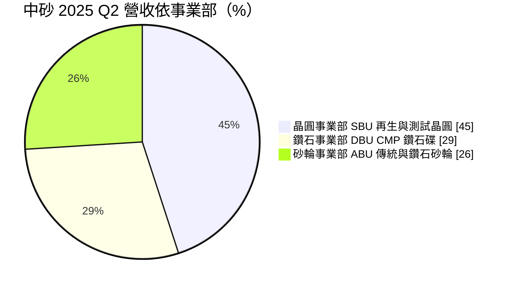
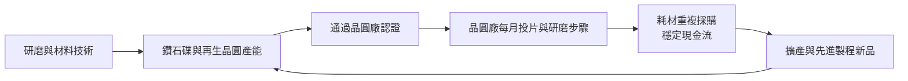
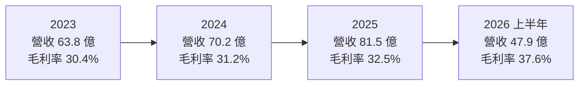
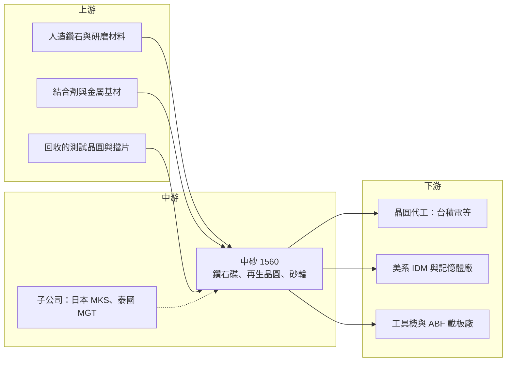

# 1560 中砂

> 上市｜[[產業索引-電機機械|電機機械]]｜上市（櫃）日期 2005/01/31

# 第一章：企業模式與商業藍圖

> [!info] 撰寫說明
> 本文由 Claude 依公開資料整理，架構比照 [[2330台積電]] 的四章研究，資料截至 2026-10-08。財務數字來源：Goodinfo 年度經營績效頁（2020 至 2025 年）、證交所開放資料（基本資料、2026 年第二季資產負債與綜合損益、營益分析、股利）、富果研究 2025 年第二季法說會整理、蕃新聞 2026 年 7 月報導；產業描述為整理性內容，尚未逐條比對原始文件，憑既有知識撰寫的部分已標「待校對」。#待校對

在評估單一個股的長期投資價值時，首要步驟是拆解企業的底層獲利邏輯。本章針對中國砂輪企業（股票代號：1560，以下簡稱中砂）的商業模式進行分析，說明一家從傳統砂輪起家的公司，如何轉型成為晶圓廠先進製程不可或缺的耗材供應商。

## 一、核心定位：從工業砂輪轉型的半導體耗材廠

中砂成立於 1964 年，2005 年上市，總部位於新北市鶯歌，董事長為林伯全、總經理為李偉彰，實收資本額約 15.0 億元（證交所開放資料）。公司早期以生產工業用砂輪起家，服務機械加工與工具機產業；之後把研磨技術延伸到半導體領域，發展出化學機械研磨（[[CMP]]）製程使用的[[鑽石碟]]，以及[[再生晶圓]]與測試晶圓業務。#待校對

這個轉型的關鍵在於，中砂沒有放棄原本的核心能力，而是把「如何精準地磨掉材料」這項技術，從金屬加工搬到晶圓表面。到了 2024 年，半導體相關業務（鑽石碟加再生晶圓）已占營收八成以上（富果研究整理之法說會內容）。因此，今天的中砂雖然名稱仍是「砂輪」，本質上已是一家半導體耗材公司，營運節奏與晶圓廠的投片量高度相關。

## 二、終端應用與產品板塊：三大事業部

中砂把業務分成三個事業部，2025 年第二季的營收結構如下：

* **晶圓事業部（SBU）：** 回收晶圓廠用過的測試晶圓與擋片，經研磨、拋光與清洗後重新供應，也生產 12 吋高階測試晶圓與特殊晶圓。晶圓廠在調機、監控製程時需要大量非產品用的晶圓，再生晶圓能大幅降低這項成本，因此只要晶圓廠在運轉，這項需求就會持續存在。
* **鑽石事業部（DBU）：** 生產 CMP 製程使用的鑽石碟，用來修整研磨墊表面，讓研磨速率保持穩定。先進製程的金屬層與研磨步驟比成熟製程多，對鑽石碟的精度與壽命要求也更高。2025 年第二季，DBU 最大客戶來自 5 奈米及以下先進製程的需求占比約 56%，2 奈米用鑽石碟出貨金額季增 64%（富果研究整理）。
* **砂輪事業部（ABU）：** 包含傳統砂輪與鑽石砂輪，用於工具機、機械加工與 ABF 載板。2025 年 4 月起合併收購的日本三井研削砥石（MKS）與泰國 Mitsui Grinding Technology（MGT），讓 ABU 營收比重明顯提升。

依蕃新聞 2026 年 7 月的報導，目前營收結構大致為再生晶圓 40% 至 50%、鑽石碟 30% 以上、砂輪約 20%。另外，美元計價收入約占五成，直接出貨到美國約占營收 7%。

## 三、資本轉化邏輯：跟著晶圓廠投片量成長的耗材模式

中砂的商業模式屬於典型的「耗材」生意。鑽石碟與再生晶圓都會隨晶圓廠的運轉持續消耗，一旦通過客戶認證，就能在該製程的生命週期內反覆出貨。這和設備廠一次性賣出機台不同，營收波動相對小，也不必承擔客戶資本支出週期的全部衝擊。

* **認證是進入門檻，也是黏著度來源：** 晶圓廠更換 CMP 耗材，需要重新驗證研磨速率、缺陷與良率，過程耗時且有風險。因此一旦中砂的鑽石碟被寫進某個製程配方，客戶通常不會輕易更換，這讓中砂能分享先進製程逐代推進的成果。
* **產能擴充跟著客戶走：** 再生晶圓月產能 2025 年 7 月由 30 萬片增加到 33 萬片，第二階段擴建後目標 40 萬片；鑽石碟到 2025 年底接近月產 5 萬顆的滿載水準，2026 年中報導已提升到約 6 萬顆仍供不應求，並規劃興建新廠房。這種「客戶需求先到、產能隨後跟上」的擴產節奏，讓資本支出的風險相對可控。
* **匯率是隱性成本：** 由於約一半營收以美元計價，新台幣升值會直接壓縮毛利率。2025 年第二季新台幣對美元平均升值約 6%，對毛利率的影響約 3 個百分點（富果研究整理）。

## 四、企業長期藍圖

中砂的長期方向可以歸納為三條線。第一是跟隨先進製程推進，持續提高 3 奈米、2 奈米等節點鑽石碟的出貨比重，並把客戶群從最大的晶圓代工客戶擴大到美系 [[IDM]]；美系 IDM 客戶在 2025 年第三季開始小量出貨。第二是再生晶圓的分階段擴產與產品升級，重點放在高階 12 吋測試晶圓與特殊晶圓，下一階段將在北台灣尋找新廠址。第三是透過併購日本 MKS 與泰國 MGT，把傳統砂輪事業國際化，整合品項、技術與採購系統。

法人預估鑽石碟未來三年年複合成長率約 15% 至 20%（蕃新聞引述，屬推估）。長期來看，只要全球先進製程產能持續擴張、CMP 步驟數隨製程微縮與[[先進封裝]]增加，中砂的耗材需求就有結構性的成長空間。

# 第二章：護城河深度與競爭優勢

本章針對中砂的競爭優勢進行分析。耗材的護城河看起來不如設備或製程那樣顯眼，但它來自長期累積的材料技術、製程認證與客戶信任，一旦建立就相當穩固。

## 一、護城河的核心組成要素

* **材料與研磨技術的長期累積：** 中砂從 1964 年開始做砂輪，研磨材料、結合劑與燒結製程的經驗累積超過半世紀。鑽石碟要讓每顆鑽石的高度與分布均勻，才能讓研磨墊表面平整，這需要材料、精密加工與品管的整合能力。
* **再生晶圓的專利製程：** 中砂在再生晶圓採用延性輪磨（Ductile Mode Grinding）專利製程（富果研究整理），能在去除表面膜層時減少損傷與材料損耗，讓晶圓可以多次再生。再生次數越多、良率越高，單片成本就越低，這是再生晶圓業者之間最重要的競爭指標。
* **與先進製程客戶同步開發：** 鑽石碟需要在客戶新製程開發階段就參與驗證。中砂的 2 奈米鑽石碟在 2025 年已放量出貨，代表它和最先進製程的客戶保持同步開發關係，後進者即使技術追上，也很難在客戶既有製程中取代它。
* **在地供應與快速服務：** 台灣聚集全球最大的晶圓代工產能，中砂的工廠與客戶距離近，能快速回應客戶對交期、品質異常與規格調整的要求。在地緣政治讓供應鏈重視「近岸」的環境下，這項優勢更加明顯。

## 二、全球主要競爭對手格局

| 業務 | 主要競爭者 | 中砂的相對位置 |
|---|---|---|
| CMP 鑽石碟 | 3M、Entegris、韓國 Saesol Diamond 等 #待校對 | 台灣先進製程主要供應商之一 |
| 再生晶圓 | 日本 RS Technologies、[[3583辛耘]]、[[8028昇陽半導體]] | 台灣主要業者之一，持續擴產 |
| 工業砂輪 | 日本、歐洲砂輪廠與中國業者 | 併購日本 MKS 後強化產品線 |

鑽石碟市場的國際對手以美國與韓國的材料公司為主，它們同樣具備長期的客戶認證與技術能力。再生晶圓市場則相對集中，日本 RS Technologies 是全球大廠，台灣的辛耘與昇陽半導體則與中砂在在地市場直接競爭。

## 三、優勢轉化：守得住、守不住與觀察重點

* **守得住：** 先進製程的鑽石碟。因為認證門檻高、客戶更換成本大，只要中砂持續跟上製程節點，就能維持較高的定價能力。2022 年毛利率曾達 36.6%，2026 年上半年更達 37.6%（證交所營益分析），反映先進製程產品組合的提升。
* **守不住：** 一般規格的再生晶圓與傳統砂輪。這些產品的技術差異較小，價格容易受同業擴產與景氣影響。再生晶圓業者同步擴產時，報價可能承壓。
* **觀察重點：** 第一，美系 IDM 客戶能否在 2026 年後逐步放量，降低對單一晶圓代工客戶的依賴；第二，再生晶圓 40 萬片月產能能否被順利填滿；第三，新台幣匯率的長期走勢，因為它會直接影響半數以美元計價的營收。

# 第三章：財務體質與盈利規模

資料日期：2026-10-08。多年度數字取自 Goodinfo 年度經營績效頁，2026 年上半年取自證交所開放資料，表格是撰寫當時的快照；最新月營收、毛利率、累計 EPS 由自動排程寫在本筆記的屬性欄位（月營收、毛利率、累計EPS 等）。#待校對

財務報表是檢驗護城河是否真實存在的最終標準。本章用多年度的三率、ROE、現金流與資本報酬，檢視中砂轉型為半導體耗材廠後的獲利品質。

## 一、獲利能力的基石：三率

| 年度 | 營收（新台幣） | [[毛利率]] | [[營業利益率]] | EPS（元） | [[ROE]] |
|---|---|---|---|---|---|
| 2020 | 51.6 億 | 30.0% | 13.7% | 3.63 | 11.6% |
| 2021 | 60.3 億 | 30.9% | 15.5% | 4.78 | 14.7% |
| 2022 | 69.1 億 | 36.6% | 20.7% | 8.71 | 22.9% |
| 2023 | 63.8 億 | 30.4% | 15.5% | 5.91 | 13.7% |
| 2024 | 70.2 億 | 31.2% | 16.5% | 7.10 | 15.3% |
| 2025 | 81.5 億 | 32.5% | 16.0% | 9.28 | 17.6% |
| 2026 上半年 | 47.9 億 | 37.6% | 21.9% | 6.44 | 未查得 |

* **營收成長：** 2020 至 2025 年營收由 51.6 億元成長到 81.5 億元，年複合成長率約 9.6%（推算）。唯一的衰退年是 2023 年半導體庫存調整期，營收年減約 8%，但仍維持獲利，顯示耗材模式的抗跌性。
* **[[毛利率]]：** 長期維持在 30% 以上，2022 年與 2026 年上半年的高點都對應先進製程鑽石碟需求旺盛的時期。2025 年毛利率受新台幣升值與併購低毛利的砂輪子公司影響，但仍較前一年提高。
* **[[營業利益率]]：** 長期在 15% 至 22% 之間。2026 年上半年營業利益率 21.9%，稅後純益率 20.4%（證交所營益分析），獲利結構以本業為主，業外占比不高。

## 二、[[ROE]]：資本效率

2021 至 2025 年平均 ROE 約 16.8%（推算），在台灣材料與耗材類股中屬於中上水準。2026 年第二季底，中砂權益總計約 94.4 億元、總負債約 54.6 億元，負債比約 37%（證交所開放資料），財務槓桿不高，ROE 主要來自本業獲利能力而不是借錢放大。

## 三、資本支出與自由現金流

中砂近年同時擴充鑽石碟與再生晶圓產能，並完成日本與泰國的併購，資本支出明顯增加，但具體金額本次未查得。由於耗材業務的營業現金流穩定，推估[[自由現金流]]長期為正，只是在擴產高峰年度可能縮小。

股利方面，2025 年度（2026 年發放）每股配發現金 5.0 元，其中盈餘配發 3.7 元、資本公積配發 1.3 元，合計占 EPS 9.28 元約 54%（證交所股利資料，推算）。公司章程規定現金股利不得低於股東股利總額的 20%。使用資本公積發放現金，代表公司在擴產期間仍希望維持股東的現金回報水準。

## 四、[[ROIC]] 與 [[WACC]]：價值創造利差

* **ROIC（推算）：** 2025 年營業利益約 81.5 億元 × 16.0% ≈ 13.0 億元，以稅率 20% 計算稅後營業利益約 10.4 億元。投入資本以 2026 年第二季底權益總計 94.4 億元，加上假設的有息負債約 25 億元（開放資料未拆分借款，以非流動負債 15.4 億元加上部分流動借款推估），合計約 119 億元，ROIC 約 8.7%（推算）。若以 2026 年上半年營業利益 10.5 億元年化計算，稅後約 16.8 億元，ROIC 約 14%（推算）。
* **WACC（推算）：** 無風險利率取台灣 10 年期公債約 1.75%，市場風險溢酬 6%，β 取半導體材料同業常見值 1.0，股東權益成本約 7.75%；負債成本假設 2.5%，稅後約 2.0%；權益約占 79%、負債約占 21%，WACC 約 6.5%（推算）。
* **結論：** 中砂的 ROIC 在 2025 年略高於 WACC，2026 年隨先進製程產品放量，利差擴大到 7 個百分點左右（推算）。這代表公司的擴產與併購整體仍在創造價值，但觀察重點在於新產能能否維持目前的報酬水準。

# 第四章：總體風險與地緣政治

任何企業都無法脫離宏觀環境獨立存在。本章分析中砂長期必須面對的地緣政治、產業週期與營運風險。

## 一、地緣政治風險

* **客戶集中於台灣先進製程：** 中砂鑽石碟超過半數來自晶圓代工大客戶，客戶的產能布局直接影響中砂的出貨。若主要客戶加快在美國、日本與歐洲設廠，中砂需要決定是否跟著在海外建立服務據點，否則可能讓當地供應商取得新廠的認證機會。
* **美國關稅：** 直接出貨美國約占營收 7%，且多為 FOB 條件，短期影響有限。但若美國對半導體材料採取更廣泛的關稅或在地化要求，美系 IDM 客戶的放量可能受到影響。
* **兩岸風險：** 主要產能位於台灣，面臨與其他台灣半導體供應鏈相同的集中風險。

## 二、產業週期與市場結構風險

* **晶圓廠稼動率：** 耗材需求跟著晶圓廠投片量走。2023 年半導體庫存調整時，中砂營收年減約 8%、EPS 由 8.71 元降至 5.91 元，顯示即使是耗材，仍會受到[[長鞭效應]]的影響。
* **砂輪事業的景氣循環：** 傳統砂輪的需求來自工具機與機械加工，景氣循環和半導體不同步，併購後占比提高，可能讓整體營收的波動來源更多元。
* **再生晶圓同業擴產：** 再生晶圓業者同時擴產時，若需求成長不如預期，報價與稼動率可能承壓。

## 三、營運環境的隱性風險

* **匯率：** 約五成營收以美元計價，新台幣每升值數個百分點就會影響毛利率，是中砂最直接的外部變數。
* **人力與廠房：** 鑽石碟產能擴充面臨人員招募困難，新廠建設與再生晶圓設備交期長，可能讓產能跟不上需求。
* **併購整合：** 日本 MKS 與泰國 MGT 的整合需要時間，若產品與採購整合不如預期，可能拉低 ABU 的獲利率。

## 四、科技演進風險

先進製程推進對中砂整體有利，因為研磨步驟與精度要求都在增加。但若 CMP 製程出現新的研磨墊修整技術，或客戶改採其他材料的修整器，既有的鑽石碟優勢可能被削弱。另一方面，[[先進封裝]]與[[Hybrid Bonding]] 需要高度平坦的接合面，是 CMP 耗材的新應用場景，中砂能否在這些新製程中取得認證，是長期觀察重點。

# 專有名詞解析

## 半導體

- **[[CMP]]**：化學機械研磨，結合化學反應與機械研磨把晶圓表面磨平，是每一層線路製作後的必要步驟。
- **[[鑽石碟]]**：CMP 製程中用來修整研磨墊的工具，表面鑲嵌鑽石顆粒，讓研磨墊維持穩定的研磨速率，是重複消耗的耗材。
- **[[再生晶圓]]**：把晶圓廠用過的測試晶圓與擋片去除膜層、重新拋光後再次使用，可降低晶圓廠的非產品晶圓成本。
- **[[測試晶圓]]**：晶圓廠用來調整機台、監控製程的非產品晶圓，不會做成晶片出貨，但使用量很大。
- **[[先進封裝]]**：把多顆晶片以中介層、混合鍵合等方式高密度整合的封裝技術，例如 CoWoS、SoIC。
- **[[Hybrid Bonding]]**：混合鍵合，以銅對銅直接接合兩片晶圓或晶片，不需凸塊，可大幅提高連接密度。
- **[[IDM]]**：整合元件製造廠，自行設計、製造並銷售晶片的公司，例如英特爾、三星。

## 金融

- **[[毛利率]]**：營業毛利占營收的比例，反映產品定價能力與生產成本控制。
- **[[ROE]]**：股東權益報酬率，稅後淨利除以股東權益，衡量公司運用股東資金的效率。
- **[[ROIC]]**：投入資本報酬率，稅後營業利益除以股東權益與有息負債的合計，衡量本業對所有資金提供者的報酬。
- **[[WACC]]**：加權平均資金成本，依股東權益與負債的比重加權計算的資金成本，ROIC 高於它才代表創造價值。
- **[[自由現金流]]**：營業活動現金流減去資本支出，代表企業可自由用於配息、還債或併購的現金。
- **[[長鞭效應]]**：終端需求的小幅變動，沿供應鏈往上游傳遞時被逐級放大，造成上游庫存與訂單劇烈波動。

# 核心供應鏈

## 1. 上游：原料與回收晶圓
- 研磨材料：人造鑽石、碳化矽、氧化鋁等磨料與結合劑。
- 再生晶圓的原料：晶圓廠送回的測試晶圓與擋片，因此晶圓廠本身既是客戶也是原料來源。

## 2. 中游：中砂本身
- 鑽石事業部（CMP 鑽石碟）、晶圓事業部（再生與測試晶圓）、砂輪事業部（含日本 MKS、泰國 MGT）。

## 3. 下游：客戶
- 晶圓代工：[[2330台積電]]（蕃新聞列為認可的優良供應商之一）、[[2303聯電]] 等。#待校對
- 美系 IDM：2025 年第三季起小量出貨，客戶名稱未公開。
- 記憶體廠、工具機業者與 ABF 載板廠。

## 4. 同業與競爭者
- 再生晶圓：[[3583辛耘]]、[[8028昇陽半導體]]、日本 RS Technologies。
- 鑽石碟：3M、Entegris 等國際材料公司。#待校對

延伸閱讀：[[台積電供應鏈]]

## 供應鏈關係
- 供應給 [[2330台積電]]：CMP化學機械研磨鑽石碟（台積電供應鏈 › 上游：矽晶圓、再生晶圓與研磨耗材）

## 最新新聞
<!-- news:start（自動產生，請勿手動編輯此範圍） -->
- 2026-10-08 📰 媒體 09:27｜中砂(1560) 個股概覽 ／ 個股 - 股市｜[CMoney](https://news.google.com/rss/articles/CBMiU0FVX3lxTE4xY2wyMzYxLXdLcXlTWlpJcllnM3ZRUkhaRWhuVzBaOWhEcGRHcHhlYlZiajdCaHBHRlEyaFBmTFV0ZlR4SGw5RmdXemUtYjk0dW0w?oc=5)
- 2026-10-06 📰 媒體 17:04｜中砂5月營收8.29億元 創歷史次高｜[自由時報](https://news.google.com/rss/articles/CBMiWEFVX3lxTE5EMXp1VFZTUy1lVHZsN2l0V3hKVVlGZWk3LUJHWEJXRVBBQ0EyaDdaQktsdU9TUTIta2V5VkxEaUQwRjRzQk5UVm1SVW1QdUZQX3Rnbm03LTE?oc=5)
- 2026-10-06 📰 媒體 11:48｜中砂9月/Q3營收報喜 毛利率、獲利看俏｜[台視全球資訊網](https://news.google.com/rss/articles/CBMinAFBVV95cUxQOFQteE1NSkZYeUhSYXF5b0tpY1hIZlN1RXluUjlBbjFSdjFzME5BeHdBMUZYc3JfaUxSbERRbi15SWtGbmtXRGpjaGEteVFIQ211WXJLcGc4NUV3U2R6WTNNb1o4cUh3bld1WUxlYWVmVUs5TjI2UUhGUnBmRDFRTGpaUlhVRWh6akJDNV9ISXE0YUpYbnIwbG1nMS0?oc=5)
- 2026-10-06 📰 媒體 10:27｜中砂9月/Q3營收報喜 毛利率、獲利看俏 ／ MoneyDJ理財網｜[LINE TODAY](https://news.google.com/rss/articles/CBMiVkFVX3lxTFBlTmw4UFdyR1NVa1NVM0h0STEwUU4xd0VwQnJQX2lST1NuNEdTM0UtYVBlWGdtOU5GeUJxNExkVGNDSkhkS2tzS3NjNlU0cE9WaHJMcTNR?oc=5)
- 2026-10-05 📰 媒體 08:20｜營收速報 - 中砂(1560)9月營收9.09億元年增率高達30.08％｜[鉅亨網](https://news.cnyes.com/news/id/6621435)

完整紀錄：[[1560中砂 新聞]]
<!-- news:end -->

## 相關連結
- [公開資訊觀測站](https://mopsov.twse.com.tw/mops/web/t05st03?step=1&firstin=1&co_id=1560)
- [Goodinfo](https://goodinfo.tw/tw/StockDetail.asp?STOCK_ID=1560)
- [Yahoo 股市](https://tw.stock.yahoo.com/quote/1560)
- [鉅亨網新聞](https://www.cnyes.com/twstock/1560/news)
