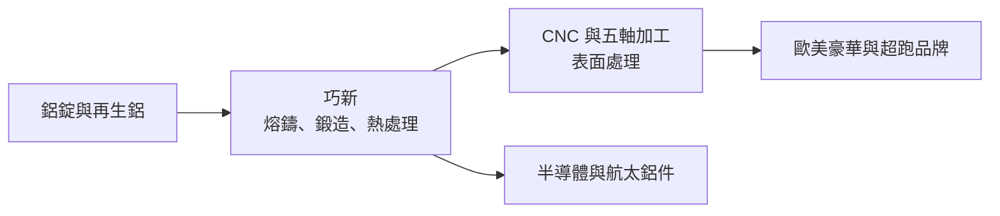
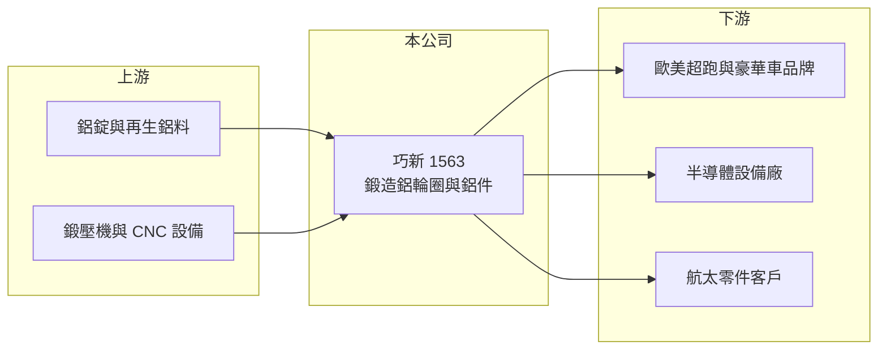

# 1563 巧新

> 上市｜[[產業索引-汽車工業|汽車工業]]｜上市（櫃）日期 2024/05/13

# 第一章：企業模式與商業藍圖

> [!info] 撰寫說明
> 本文由 Claude 依公開資料整理，架構比照 [[2330台積電]] 的四章研究，資料截至 2026-10-08。財務數字來源：Goodinfo 台灣股市資訊網年度經營績效、證交所開放資料（本筆記 _data 快照）；業務描述參考理財周刊（2025 年 2 月）與優分析、經濟日報報導標題。#待校對

在評估單一個股的長期投資價值時，首要步驟是拆解企業的底層獲利邏輯。本章針對巧新科技（股票代號：1563，以下簡稱巧新）的商業模式進行定性分析，說明一家位在雲林的鍛造鋁輪圈廠，如何靠歐美超跑與豪華車品牌建立利基，又為什麼要把鋁鍛造技術延伸到半導體與航太。

## 一、核心定位：高階車款的鍛造鋁輪圈供應商

巧新成立於 1994 年，總部在雲林斗六，2024 年 5 月在證交所上市。公司以[[鋁鍛造]]技術為核心，主要產品是汽車用的鍛造鋁輪圈，客戶是歐美的超跑與豪華汽車品牌，財經媒體報導中提及保時捷等客戶（依報導標題）。和一般用鑄造方式大量生產的鋁圈相比，鍛造鋁圈強度高、重量輕，單價也高出許多，主要用在高性能與豪華車款。

這個定位有兩個長期意義。第一，豪華與超跑品牌的產量小、車款多，對品質與外觀的要求高，供應商一旦通過驗證就不容易被替換，這讓巧新能維持二成以上的毛利率。第二，客戶集中在少數歐美品牌，營收會跟著這些品牌的車款週期與全球高端消費景氣起伏。

## 二、產品板塊

公司未在本次查得的資料中揭露精確營收比重，以下為定性分類，不畫圓餅圖。

* **汽車鍛造鋁輪圈：** 主力產品，供應歐美豪華與超跑品牌原廠配備。2024 年 8 月公司首次建置五軸加工設備，2025 年 1 月完成自主開發造型的試作，目標是從代工延伸到參與輪圈造型設計。
* **再生鋁與 RESAICAL 輪圈：** 公司推動自有的再生鋁材料與 RESAICAL 輪圈（2025 年），回應歐洲車廠降低碳足跡的要求。
* **非車用鋁鍛造件：** 以鋁鍛造技術拓展半導體設備與航太零件。依優分析報導標題，巧新規劃半導體鋁材 2027 年開始放大，非車用占比目標拚到五成（年份與目標以報導為準）。

## 三、資本轉化邏輯（營運模式）

* **從材料到成品的一貫製程：** 巧新從鋁材熔鑄、鍛造、熱處理到機械加工與表面處理，大部分製程在自家完成，能控制品質並降低外包成本。依 2025 年報導，公司正在調整前後製程的成本比重，以提升長期利潤率。
* **高設備投資、高單價產品：** 鍛造需要大型鍛壓機，加工需要大量 CNC 設備，屬資本密集製造。產品單價高，因此產能利用率與產品組合是毛利率的關鍵。

## 四、企業長期藍圖

巧新的長期策略可以概括為兩件事：在汽車輪圈領域爭取參與造型設計、提高附加價值；在非車用領域把鋁鍛造技術賣給半導體與航太客戶，降低對汽車景氣的依賴。2024 年上市取得資本後，公司的資本配置重心放在設備升級與新事業開發。若非車用比重真的拉高到五成，巧新會從汽車零件股轉變為多元的精密鋁材料公司，這是長期最大的結構變化。

# 第二章：護城河深度與競爭優勢

在長期價值投資中，「護城河」指企業抵禦競爭、維持超額利潤的保護機制。本章分析巧新在鍛造鋁輪圈與高階鋁件市場的護城河、主要對手與可守住的範圍。

## 一、護城河的核心組成要素

* **1. 高階車廠的驗證與信任：** 超跑與豪華品牌對輪圈的強度、重量、外觀與交期要求嚴格，供應商需要數年驗證。巧新長期服務這群客戶，累積的驗證紀錄就是轉換成本。
* **2. 鋁鍛造的材料與製程經驗：** 從熔鑄到鍛造的一貫製程，讓巧新能掌握材料配方與內部品質，這也是能延伸到半導體與航太鋁件的基礎。
* **3. 再生鋁與低碳能力：** 歐洲車廠重視供應鏈碳排，巧新的再生鋁技術若能提供低碳輪圈，會成為新的差異化優勢。

## 二、全球主要競爭對手格局

| 對手 | 定位 | 對巧新的威脅 |
|---|---|---|
| BBS、OZ 等歐洲輪圈品牌 | 歐洲高階輪圈製造商 | 在歐洲車廠有地緣與品牌優勢 |
| 中國鋁輪圈大廠（如中信戴卡） | 規模龐大，鑄造與鍛造皆有 | 以規模與價格切入中高階市場 |
| 日本鍛造輪圈廠 | 高品質鍛造輪圈 | 在日系與部分歐洲品牌競爭 |
| 半導體鋁件與航太零件廠 | 既有設備零件供應鏈 | 巧新新事業要面對的既有供應商 |

## 三、優勢轉化：守得住／守不住／觀察重點

* **守得住：** 超跑與豪華品牌的原廠鍛造輪圈。這個市場重視品質與合作關係，價格敏感度較低。
* **守不住：** 一般中高階車款的輪圈，中國大廠的成本優勢明顯，巧新不容易在價格上競爭。
* **觀察重點：** 長期可以看三件事：非車用營收比重能否如目標提升、自主造型設計能否讓巧新從代工走向共同開發，以及毛利率能否在汽車景氣淡季時仍維持 20% 以上。

# 第三章：財務體質與盈利規模

資料日期：2026-10-08。數字取自 Goodinfo 年度經營績效與證交所開放資料快照，表格是撰寫當時的快照；最新月營收、毛利率、累計 EPS 由自動排程寫在本筆記的屬性欄位（月營收、毛利率、累計EPS 等）。#待校對

財務報表是檢驗護城河是否真實存在的最終標準。本章用多年度的三率、ROE 與資本報酬，檢視巧新在高階車市場的獲利品質。

## 一、獲利能力的基石：三率

| 年度 | 營收（新台幣） | [[毛利率]] | [[營業利益率]] | EPS（元） | [[ROE]] |
|---|---|---|---|---|---|
| 2019 | 58.9 億 | 22.8% | 12.8% | 3.20 | 8.43% |
| 2020 | 54.4 億 | 18.2% | 7.00% | 1.14 | 3.04% |
| 2021 | 74.9 億 | 25.7% | 7.96% | 1.75 | 4.72% |
| 2022 | 64.0 億 | 18.9% | 1.86% | 2.90 | 8.06% |
| 2023 | 77.8 億 | 22.3% | 9.70% | 2.88 | 8.10% |
| 2024 | 74.7 億 | 26.8% | 13.1% | 3.30 | 8.61% |
| 2025 | 69.8 億 | 21.3% | 8.07% | 1.42 | 3.42% |

* **[[毛利率]]：** 長期在 18% 至 27% 之間，對汽車零件廠來說屬於中上水準，反映鍛造輪圈的高單價與客戶的品牌定位。2026 年上半年毛利率 23.2%（證交所開放資料）。
* **[[營業利益率]]：** 波動大，2022 年只有 1.86%，2024 年升到 13.1%。2022 年 EPS 2.90 元高於營業利益所能支撐的水準，推估有匯兌或其他[[業外收益]]挹注（推估）。
* **長期指標：** 2020 至 2025 年營收年複合成長率約 5.1%（推算）；2021 至 2025 年平均 ROE 約 6.6%（推算）。2025 年度董事會決議以盈餘配發現金 1 元，另以資本公積配發 1 元（證交所開放資料）。

## 二、[[ROE]]：資本效率

巧新的 ROE 長期在 3% 至 9%，偏低。原因是鍛造與加工設備投資大、資產周轉率低，加上負債比不低（2026 年第二季底負債約 114.2 億元、權益約 83.3 億元，負債比約 58%，證交所開放資料）。高毛利沒有完全轉換成高 ROE，是巧新財務結構的主要課題。

## 三、資本支出與自由現金流

* **[[CapEx]]：** 逐年數字未查得。五軸加工、再生鋁與半導體鋁件都需要新設備，未來幾年資本支出可能維持在較高水準。
* **[[自由現金流]]：** 逐年數字未查得。資本密集的擴張期，自由現金流可能不穩定，需搭配借款與 2024 年上市募資支應。

## 四、[[ROIC]] 與 [[WACC]]：價值創造利差

有息負債明細未查得，以權益加非流動負債近似投入資本。2024 年營業利益約 9.79 億元（營收 74.7 億元 × 13.1%），稅後約 7.83 億元；投入資本以 2026 年第二季底權益 83.3 億元加非流動負債 57.8 億元，約 141 億元計算，ROIC 約 5.6%（推算）。2025 年營業利益約 5.63 億元，稅後約 4.5 億元，ROIC 約 3.2%（推算）。

WACC 以 CAPM 推估：台灣 10 年期公債約 1.5% 至 2%，市場風險溢酬約 6%，β 未查得，汽車零件股常見值採 1.0 至 1.2（假設），權益成本約 7.5% 至 9.2%；稅前負債成本假設 2.5%、稅後 2%，負債約占投入資本四成，WACC 約 5.3% 至 6.3%（推算）。

兩者比較，巧新只有在 2024 年這類高峰年度 ROIC 接近或略高於 WACC，一般年度則低於資金成本。這代表巧新的利基定位雖然帶來不錯的毛利率，但資本密集度太高，尚未穩定創造超額價值。非車用事業若能提高資產周轉率，是改善 ROIC 的關鍵。

# 第四章：總體風險與地緣政治

任何企業都無法脫離宏觀環境獨立存在。本章分析巧新長期必須面對的市場、貿易與營運風險。

## 一、地緣政治與貿易

* **美國關稅：** 客戶多為歐美品牌，若美國對進口汽車零件或整車課稅，豪華車價格上升可能壓抑銷量。依 2025 年報導，巧新未從受限地區出貨，受關稅直接影響有限，但間接需求影響仍需觀察。
* **歐洲碳邊境調整：** 歐盟推動碳邊境調整機制（[[CBAM]]），鋁製品屬於涵蓋範圍，碳排較高的鋁件可能面臨額外成本，這同時也是巧新再生鋁的機會。

## 二、產業週期與市場結構

* **高端消費景氣：** 超跑與豪華車銷量跟著全球高所得族群的消費信心走，景氣下行時訂單會減少。
* **客戶集中：** 營收集中在少數歐美品牌，單一客戶車款改款或銷量下滑，影響明顯。
* **電動化：** 電動車更重視輕量化，對鍛造輪圈是長期利多，但電動車品牌的供應鏈選擇也可能改變既有關係。

## 三、營運環境的隱性風險

* **鋁價波動：** 鋁錠價格變動影響成本，若無法及時轉嫁，毛利率會受壓。
* **新事業執行風險：** 半導體與航太的驗證期長、客戶要求嚴格，投入資本後若無法如期放量，會拖累 ROIC。
* **匯率：** 外銷以美元與歐元計價，新台幣升值會壓縮營收與毛利。

## 四、科技或法規演進

* **輕量化材料替代：** 碳纖維輪圈等新材料在超跑市場出現，若成本下降，可能取代部分鍛造鋁圈的高階需求。
* **低碳供應鏈要求：** 歐洲車廠要求供應商揭露並降低碳排，未達標的供應商可能被排除。

# 專有名詞解析

## 金融

- **[[業外收益]]**：本業以外的收入，例如匯兌利益、利息與投資收益，通常較不穩定。
- **[[ROIC]]**：投入資本報酬率，衡量公司用股東與債權人資金創造本業稅後利潤的效率。
- **[[WACC]]**：加權平均資金成本，依股權與負債比重加權的資金成本，是 ROIC 要超過的門檻。

## 產業

- **[[鋁鍛造]]**：以高壓把加熱後的鋁材壓製成形的製程，強度與輕量化表現優於鑄造。
- **[[輕量化]]**：以較輕的材料或結構設計降低車重，可提高電動車續航力與燃油車油耗表現。
- **[[CBAM]]**：歐盟碳邊境調整機制，對進口的鋼鋁等高碳排產品依碳排量收取費用。

# 核心供應鏈

## 1. 上游：鋁材與設備
- 鋁錠與再生鋁料（具體供應商未查得）
- 鍛壓與 CNC 加工設備：歐洲、日本與台灣工具機廠（具體名單未查得）

## 2. 中游：巧新本身
- 鍛造鋁輪圈、RESAICAL 再生鋁輪圈、半導體與航太鋁鍛造件

## 3. 下游：客戶
- 歐美超跑與豪華汽車品牌，報導提及保時捷（具體名單以公司揭露為準）
- 半導體設備與航太客戶（開發中，名稱未揭露）

## 4. 同業
- 台灣：[[2239英利-KY]]（汽車零件，間接）、[[1568倉佑]]（傳動零件，間接）
- 海外：BBS、OZ、中信戴卡等鋁輪圈廠

## 最新新聞
<!-- news:start（自動產生，請勿手動編輯此範圍） -->
- 2026-10-08 📰 媒體 18:21｜營收速報 - 巧新(1563)9月營收8.16億元年增率高達39.69％｜[鉅亨網](https://news.cnyes.com/news/id/6625145)

完整紀錄：[[1563巧新 新聞]]
<!-- news:end -->

## 相關連結
- [公開資訊觀測站](https://mopsov.twse.com.tw/mops/web/t05st03?step=1&firstin=1&co_id=1563)
- [Goodinfo](https://goodinfo.tw/tw/StockDetail.asp?STOCK_ID=1563)
- [Yahoo 股市](https://tw.stock.yahoo.com/quote/1563)
- [鉅亨網新聞](https://www.cnyes.com/twstock/1563/news)
