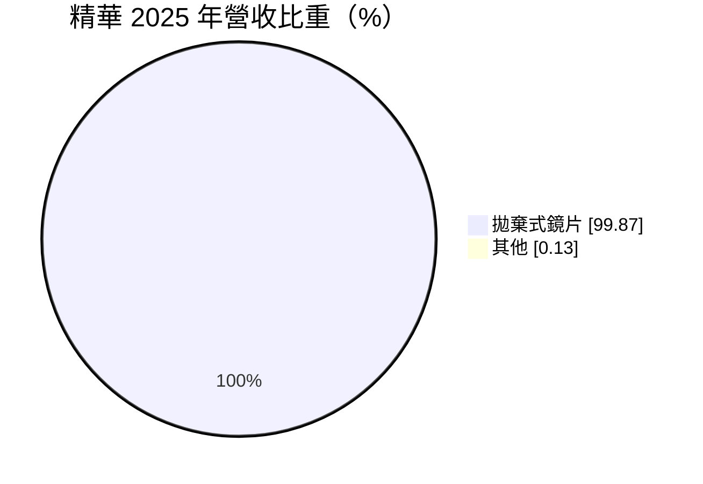
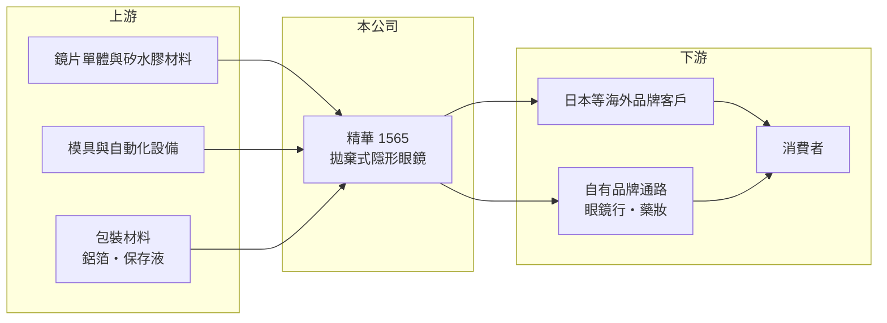

# 1565 精華

> 上櫃｜[[產業索引-生技醫療業|生技醫療業]]｜上市（櫃）日期 2004/03/30

# 第一章：企業模式與商業藍圖

> [!info] 撰寫說明
> 精簡版，由 Claude 依公開資料整理，架構比照 [[2330台積電]] 的四章研究，資料截至 2026-10-08。財務數字來源：Goodinfo 年度經營績效頁、MoneyDJ 個股基本資料（2025 年營收比重）、櫃買中心開放資料（基本資料、2026 年第二季資產負債與綜合損益、本益比殖利率、每月營收）；客戶結構與產品細節部分憑既有知識撰寫，已標「待校對」。公開資料有限。#待校對

本章說明精華光學（股票代號：1565，以下簡稱精華）作為台灣隱形眼鏡製造廠的商業模式，以及它如何從高獲利的代工廠，走到需要面對產品世代交替的階段。

- **核心業務：** 精華成立於 1986 年，2004 年在櫃買中心掛牌，董事長為陳明賢，實收資本額約 5.04 億元。依 MoneyDJ 的 2025 年營收分類，拋棄式鏡片占 99.87%，是一家幾乎只做[[拋棄式隱形眼鏡]]的專業製造商。
- **客戶與市場：** 精華以替海外品牌代工為主，日本是最重要的出口市場，同時也經營自有品牌（客戶與品牌細節憑既有知識，待校對）。日本消費者大量使用日拋與彩色隱形眼鏡，對品質要求高，能打進日本供應鏈本身就是技術能力的證明。
- **獲利模式：** 隱形眼鏡屬於[[醫療器材]]，產品上市前要取得各國許可，生產線也要通過品質系統稽核。拋棄式鏡片是高頻率消耗品，客戶一旦導入就會持續回購，因此量產規模與良率決定獲利。
- **長期方向：** 產業主流正從傳統水膠材質轉向透氧率更高的[[矽水膠]]，精華的營收自 2021 年的 54.0 億元下滑到 2025 年的 41.2 億元，關鍵在於能否在矽水膠與彩片的世代交替中守住客戶。

# 第二章：護城河深度與競爭優勢

本章分析精華的護城河、主要對手，以及近年市占面臨的挑戰。

- **競爭優勢：** 隱形眼鏡製造需要模具、材料配方與全自動化產線的長期累積，加上各國醫療器材許可，新進者要花數年才能量產。精華成立近四十年，累積了大量產線經驗與海外客戶認證，2020 至 2022 年營業利益率都在 20% 以上。
- **主要壓力：** 台灣同業 [[6491晶碩]] 在矽水膠與自有品牌上積極擴張，營收規模已明顯超越精華。中國與韓國廠商也加入代工競爭，壓低中低階產品價格。精華 2023 年後毛利率由約 30% 降到 22% 至 27%，反映價格與產品組合的壓力。
- **主要對手：** [[6491晶碩]]、金可-KY（8406，已下市）、[[6782視陽]]，以及國際品牌嬌生、Alcon、庫博（CooperVision）、博士倫的自有產能。
- **觀察重點：** 一是矽水膠產品的量產與出貨占比；二是日本主要客戶的訂單是否持續；三是營業利益率能否回到 15% 以上。

# 第三章：財務體質與盈利規模

資料日期：2026-10-08，表格是撰寫當時的快照；最新月營收、毛利率、累計 EPS 由自動排程寫在本筆記的屬性欄位（月營收、毛利率、累計EPS 等）。#待校對

本章用多年度的三率、ROE 與資本報酬，檢視精華的獲利變化。

| 年度 | 營收（新台幣） | [[毛利率]] | [[營業利益率]] | EPS（元） | [[ROE]] |
|---|---|---|---|---|---|
| 2020 | 50.1 億 | 27.4% | 20.0% | 14.78 | 13.1% |
| 2021 | 54.0 億 | 29.8% | 22.8% | 18.80 | 16.3% |
| 2022 | 50.0 億 | 29.5% | 21.4% | 20.21 | 16.7% |
| 2023 | 43.9 億 | 22.2% | 13.8% | 10.83 | 8.80% |
| 2024 | 45.5 億 | 26.7% | 17.6% | 14.82 | 11.8% |
| 2025 | 41.2 億 | 23.1% | 13.1% | 9.03 | 6.94% |
| 2026 上半年 | 17.8 億 | 18.86%（推算） | 9.60%（推算） | 3.00 | 未查得 |

註：2020 至 2025 年取自 Goodinfo；2026 上半年營收、EPS 取自櫃買中心綜合損益，毛利率與營業利益率由營業毛利 3.36 億元、營業利益 1.71 億元除以營收推算。

- **營收規模：** 2020 至 2025 年營收年複合成長率約 -3.8%（推算）。2026 年 1 至 8 月累計營收約 23.9 億元，較去年同期減少約 16%（櫃買中心每月營收），衰退仍在持續。
- **獲利結構：** 營收下滑時，產線固定成本攤提變重，毛利率與營業利益率同步下降，EPS 由 2022 年的 20.21 元降到 2025 年的 9.03 元。2026 年上半年 EPS 3.00 元，獲利能力仍在探底。
- **長期指標：** 2021 至 2025 年平均 ROE 約 12.1%（推算），但趨勢向下。依櫃買中心本益比資料，最近一年每股股利 5.80 元，以 2025 年 EPS 9.03 元計算，[[配息率]]約 64%（推算）。
- **財務特色：** 2026 年第二季底總負債約 13.2 億元、權益約 64.1 億元，負債比約 17%；保留盈餘約 53.8 億元，每股淨值約 127 元，股價淨值比約 0.76 倍（櫃買中心開放資料）。帳上資本雄厚，但目前的獲利無法讓這些資本發揮應有的報酬。

**[[ROIC]] 與 [[WACC]]：** 以 2025 年營收 41.2 億元乘營業利益率 13.1%，營業利益約 5.40 億元，稅後約 4.32 億元；投入資本以權益 64.1 億元加上假設占總負債一成的有息負債約 1.3 億元，合計約 65.4 億元，ROIC 約 6.6%（推算）。WACC 以 CAPM 推估：無風險利率 1.75%、市場風險溢酬 6%、β 取醫材製造業常見值 0.9，股東權益成本約 7.15%；負債成本 2.5%、稅後 2.0%；權益約占 98%，WACC 約 7.0%（推算）。2025 年 ROIC 已略低於 WACC，2026 年上半年的獲利更低，代表精華由過去明顯創造價值，轉為目前勉強打平資金成本，股價淨值比低於 1 倍也反映市場的疑慮。

# 第四章：總體風險與地緣政治

本章分析精華長期面對的風險。

- **產業週期：** 隱形眼鏡是消耗品，需求本身穩定成長，但代工廠的訂單取決於品牌客戶的庫存與供應商分配。客戶調整供應鏈或轉單時，代工廠的營收可能連續數年下滑。
- **營運風險：** 營收幾乎全部來自拋棄式鏡片，且集中在少數海外客戶與日本市場，客戶集中度高。矽水膠與彩片的技術轉換若落後同業，可能失去新世代產品的訂單。
- **其他風險：** 日圓長期貶值會削弱日本客戶的採購力並影響報價；各國醫療器材法規趨嚴會增加認證成本；中國與韓國廠商擴產可能壓低中低階產品價格。

# 專有名詞解析

## 金融

- **[[配息率]]**：現金股利占每股盈餘的比例，反映公司把獲利發還給股東的程度。
- **[[毛利率]]**：營業毛利占營收的比例，反映產品定價能力與生產成本控制。
- **[[營業利益率]]**：扣除營業費用後的營業利益占營收的比例，衡量本業整體獲利能力。
- **[[ROE]]**：股東權益報酬率，稅後淨利除以股東權益，衡量公司運用股東資金的效率。
- **[[ROIC]]**：投入資本報酬率，稅後營業利益除以股東權益與有息負債的合計，衡量本業對所有資金提供者的報酬。
- **[[WACC]]**：加權平均資金成本，依股東權益與負債的比重加權計算的資金成本，ROIC 高於它才代表創造價值。

## 產業

- **[[拋棄式隱形眼鏡]]**：依使用週期分為日拋、雙週拋、月拋等，到期即丟棄的隱形眼鏡，屬於高頻率回購的消耗品。
- **[[矽水膠]]**：在水膠中加入矽成分的隱形眼鏡材料，透氧率遠高於傳統水膠，是高階鏡片的主流材質。
- **[[醫療器材]]**：用於診斷、治療或矯正的器具與設備，上市前需取得各國衛生主管機關許可，生產須符合品質系統規範。

# 核心供應鏈

- 上游：鏡片單體與矽水膠材料、模具與自動化產線設備、鋁箔與保存液等包材。
- 下游／客戶：日本等海外隱形眼鏡品牌、眼鏡行與藥妝通路、終端消費者。
- 同業：[[6491晶碩]]、金可-KY（8406，已下市）、[[6782視陽]]、嬌生、Alcon、庫博、博士倫。

## 最新新聞
<!-- news:start -->
<!-- news:end -->

## 相關連結
- [公開資訊觀測站](https://mopsov.twse.com.tw/mops/web/t05st03?step=1&firstin=1&co_id=1565)
- [Goodinfo](https://goodinfo.tw/tw/StockDetail.asp?STOCK_ID=1565)
- [Yahoo 股市](https://tw.stock.yahoo.com/quote/1565)
- [鉅亨網新聞](https://www.cnyes.com/twstock/1565/news)
