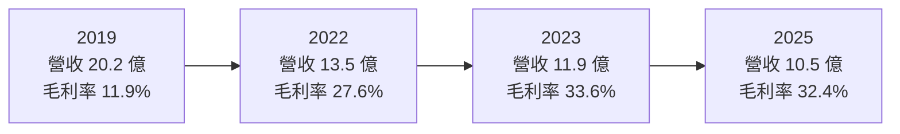
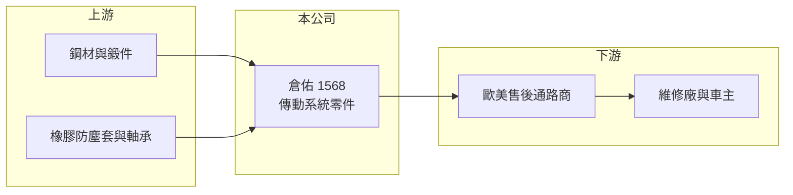

# 1568 倉佑

> 上市｜[[產業索引-汽車工業|汽車工業]]｜上市（櫃）日期 2014/05/14

# 第一章：企業模式與商業藍圖

> [!info] 撰寫說明
> 本文由 Claude 依公開資料整理，架構比照 [[2330台積電]] 的四章研究，資料截至 2026-10-08。財務數字來源：Goodinfo 台灣股市資訊網年度經營績效、理財周刊 2024 年度財報新聞、證交所開放資料（本筆記 _data 快照）；公開資料有限，產品細節部分憑既有知識整理並標「待校對」。#待校對

在評估單一個股的長期投資價值時，首要步驟是拆解企業的底層獲利邏輯。本章針對倉佑實業（股票代號：1568，以下簡稱倉佑）的商業模式進行定性分析，說明這家嘉義的傳動系統零件廠，如何在歐美售後市場以小規模維持高毛利，以及為什麼它的營收規模比十年前縮小、獲利能力卻變好。

## 一、核心定位：歐美售後市場的傳動零件供應商

倉佑成立於 1985 年，總部在嘉義民雄，2014 年上市。理財周刊稱倉佑為「傳動系統製造大廠」，主要產品是汽車傳動系統零件，包括等速萬向接頭（CV Joint）與傳動軸（待校對），主要賣到歐美的 [[AM 售後市場]]。當車輛使用多年後，傳動軸的防塵套破損或接頭磨損就需要更換，這類替換需求跟著路上車輛數量與車齡增加，不太受新車銷售景氣影響。

售後市場的特性是車款與料號非常多、每個料號的量不大。能在這個市場長期經營的廠商，靠的是開發速度、料號完整度與穩定的品質，而不是規模。倉佑營收規模約十億元，屬於小型廠，但毛利率長期在三成上下，說明它在這個利基市場有一定的定價能力。

## 二、產品板塊

公司未在本次查得的資料中揭露產品別營收比重，以下為定性分類，不畫圓餅圖。

* **傳動系統零件：** 等速接頭、傳動軸總成與相關零件（待校對），是倉佑的主力產品，以歐美售後通路為主要市場。
* **其他汽車零組件：** 依客戶需求提供的相關配件（比重未查得）。

## 三、資本轉化邏輯（營運模式）

* **少量多樣、快速開發：** 售後市場要求供應商在新車款上路幾年後就提供對應的替換件，倉佑必須持續開發新料號。料號數量越多，越容易成為通路商的主要供應商。
* **規模縮小、毛利提升：** 依 Goodinfo 資料，倉佑營收從 2019 年的 20.2 億元降到 2025 年的 10.5 億元，但毛利率從 11.9% 升到 32.4%。2022 年起營收規模明顯縮小、毛利率大幅提高，推估與退出低毛利業務或產品組合調整有關（具體原因未查得）。這代表公司選擇了「做小但做好」的方向。

## 四、企業長期藍圖

倉佑的長期方向是持續在歐美售後市場深耕高毛利料號。倉佑的營收主要跟著歐美售後通路的庫存循環起伏，通路補庫存時訂單回升、去化庫存時訂單轉弱。長期而言，電動車同樣需要傳動軸，等速接頭並不會因電動化消失，這讓倉佑的產品比引擎零件更能延續到電動車時代。經營層的資本配置偏保守，負債很低，並維持穩定配息（2025 年度現金股利 1 元，證交所開放資料）。

# 第二章：護城河深度與競爭優勢

在長期價值投資中，「護城河」指企業抵禦競爭、維持超額利潤的保護機制。本章分析倉佑在售後傳動零件市場的護城河、主要對手與可守住的範圍。

## 一、護城河的核心組成要素

* **1. 料號與通路關係：** 售後通路商偏好能一次供應大量料號的供應商。倉佑經營歐美市場多年，累積的料號與客戶關係，是新進者需要時間才能追上的。
* **2. 利基市場的定價空間：** 傳動零件屬於安全相關零件，車主與維修廠在意品質與耐用度，價格敏感度比一般耗材低，讓倉佑能維持三成上下的毛利率。
* **3. 電動化中立：** 等速接頭與傳動軸在燃油車與電動車都需要，產品不會因電動化而失去市場，這是相對引擎零件廠的結構優勢。

## 二、全球主要競爭對手格局

| 對手 | 定位 | 對倉佑的威脅 |
|---|---|---|
| GKN、NTN 等國際傳動大廠 | 原廠與售後市場的傳動系統龍頭 | 品牌與規模大，掌握高階售後市場 |
| 中國傳動軸與等速接頭廠 | 低成本大量生產 | 以價格搶歐美通路訂單 |
| 台灣其他售後零件廠 | 不同品項的售後零件 | 爭取同一批通路商的採購預算（間接） |

## 三、優勢轉化：守得住／守不住／觀察重點

* **守得住：** 料號完整、品質要求高的歐美售後通路訂單。通路商換供應商需要重新驗證品質與交期，倉佑的關係有黏著度。
* **守不住：** 規格標準化、價格導向的產品，中國廠商的成本優勢明顯。
* **觀察重點：** 長期可以看毛利率能否維持在 30% 上下、營收能否在小規模下穩定成長，以及子公司[[非控制權益]]占比的變化（2026 年第二季底合併權益 21.4 億元中，歸屬母公司約 19.0 億元）。

# 第三章：財務體質與盈利規模

資料日期：2026-10-08。數字取自 Goodinfo 年度經營績效、理財周刊與證交所開放資料快照，表格是撰寫當時的快照；最新月營收、毛利率、累計 EPS 由自動排程寫在本筆記的屬性欄位（月營收、毛利率、累計EPS 等）。#待校對

財務報表是檢驗護城河是否真實存在的最終標準。本章用多年度的三率、ROE 與資本報酬，檢視倉佑縮小規模後的獲利品質。

## 一、獲利能力的基石：三率

| 年度 | 營收（新台幣） | [[毛利率]] | [[營業利益率]] | EPS（元） | [[ROE]] |
|---|---|---|---|---|---|
| 2019 | 20.2 億 | 11.9% | 1.35% | 0.27 | 1.78% |
| 2020 | 17.6 億 | 9.46% | -1.18% | 0.10 | 0.68% |
| 2021 | 18.3 億 | 14.2% | 1.80% | 0.29 | 1.99% |
| 2022 | 13.5 億 | 27.6% | 14.3% | 1.62 | 10.6% |
| 2023 | 11.9 億 | 33.6% | 19.6% | 2.67 | 15.8% |
| 2024 | 10.5 億 | 27.8% | 11.4% | 1.59 | 8.61% |
| 2025 | 10.5 億 | 32.4% | 15.7% | 1.36 | 7.08% |

* **[[毛利率]]：** 2022 年是明顯的分水嶺，毛利率從一成多跳到三成上下，之後維持在 28% 至 34%。2026 年上半年毛利率 37.2%、營業利益率 21.2%（證交所開放資料），獲利能力仍在高檔。
* **[[營業利益率]]：** 2022 年以後營業利益率維持在 11% 至 20%，對售後零件廠來說屬於高水準。
* **長期指標：** 2020 至 2025 年營收年複合成長率約 -9.8%（推算，主要反映 2022 年的規模縮小）；2021 至 2025 年平均 ROE 約 8.8%（推算）。2024 年稅前淨利 2.1 億元、歸屬母公司淨利 1.63 億元（理財周刊）。

## 二、[[ROE]]：資本效率

倉佑的負債極低，2026 年第二季底負債約 4.3 億元、權益約 21.4 億元，負債比約 17%（證交所開放資料）。低負債代表 ROE 幾乎完全來自本業獲利，沒有財務槓桿放大。2023 年 ROE 15.8% 是近年高點，2024 與 2025 年降到 7% 至 9%，部分原因是權益持續累積但營收沒有同步成長。

## 三、資本支出與自由現金流

* **[[CapEx]]：** 逐年數字未查得。售後零件加工屬中度資本密集，規模縮小後資本需求不高。
* **[[自由現金流]]：** 逐年數字未查得。以低負債、穩定配息的財務型態推估，近年自由現金流應多為正值（推估）。

## 四、[[ROIC]] 與 [[WACC]]：價值創造利差

倉佑幾乎沒有長期負債（非流動負債約 0.3 億元），以股東權益近似投入資本。2025 年營業利益約 1.65 億元（營收 10.5 億元 × 15.7%），稅後約 1.32 億元；以權益 21.4 億元計算，ROIC 約 6.2%（推算）。2023 年營業利益約 2.33 億元，稅後約 1.87 億元，以權益約 20 億元估算，ROIC 約 9.3%（推算）。若扣除帳上現金（未查得），實際用於營運的資本較少，ROIC 會更高。

WACC 以 CAPM 推估：台灣 10 年期公債約 1.5% 至 2%，市場風險溢酬約 6%，β 未查得，小型汽車零件股採 0.9 至 1.1（假設），權益成本約 6.9% 至 8.6%；幾乎沒有有息負債，WACC 約等於權益成本，約 7% 至 8.5%（推算）。

兩者比較，倉佑在 2022 至 2023 年 ROIC 高於 WACC，2024 至 2025 年則在資金成本附近。轉型後的獲利能力確實改善，但小規模加上權益累積，讓資本報酬率不易再往上。若能把累積的現金用於提高配息或擴充高毛利料號，才能維持價值創造。

# 第四章：總體風險與地緣政治

任何企業都無法脫離宏觀環境獨立存在。本章分析倉佑長期必須面對的市場、貿易與營運風險。

## 一、地緣政治與貿易

* **美國關稅：** 主要市場在歐美，美國若對進口汽車零件提高關稅，通路商可能壓低採購價或轉向其他產地。
* **中國競爭：** 中國售後零件廠產能大、價格低，是長期的價格壓力來源。

## 二、產業週期與市場結構

* **售後市場相對穩定：** 傳動零件的替換需求與車齡相關，波動比新車市場小，但仍受通路商庫存調整影響，庫存去化期會出現訂單下滑（[[長鞭效應]]）。
* **規模限制：** 營收約十億元，產品線集中，單一市場或通路的變化對公司影響大。

## 三、營運環境的隱性風險

* **原物料：** 鋼材與鍛件價格上漲時，成本轉嫁可能有時間落差。
* **匯率：** 以美元與歐元計價的外銷為主，新台幣升值會壓縮營收與毛利。
* **人力與傳承：** 小型製造廠面臨技術人力老化與招募困難。

## 四、科技或法規演進

* **電動車傳動設計改變：** 電動車扭力大、輪內馬達等新設計可能改變傳動軸規格，需要持續開發新料號。
* **歐美售後零件法規：** 歐美對售後零件的品質、環保與標示規範日趨嚴格，增加合規成本。

# 專有名詞解析

## 金融

- **[[非控制權益]]**：子公司中不屬於母公司的股東權益，子公司虧損時會讓合併淨利與母公司淨利出現差異。
- **[[長鞭效應]]**：終端需求的小幅變動，沿供應鏈往上游傳遞時被逐級放大，造成上游庫存與訂單劇烈波動。
- **[[ROIC]]**：投入資本報酬率，衡量公司用股東與債權人資金創造本業稅後利潤的效率。
- **[[WACC]]**：加權平均資金成本，依股權與負債比重加權的資金成本，是 ROIC 要超過的門檻。

## 產業

- **[[AM 售後市場]]**：車輛出廠後的維修與更換零件市場，需求跟著路上車輛數量與車齡走，波動比新車市場小。
- **[[等速接頭]]**：傳動軸兩端的關節零件，讓車輪轉向與上下跳動時仍能平順傳遞動力。

# 核心供應鏈

## 1. 上游：鋼材與零件
- 鋼材與鍛件：國內鋼廠與鍛造廠（具體名單未查得）
- 橡膠防塵套、軸承等外購件（具體名單未查得）

## 2. 中游：倉佑本身
- 汽車傳動系統零件，等速接頭與傳動軸（待校對）

## 3. 下游：客戶
- 歐美汽車售後零件通路商與維修連鎖（具名客戶未查得）

## 4. 同業
- 台灣：[[1533車王電]]、[[1587吉茂]]、[[1522堤維西]]（同屬售後零件，品項不同）
- 海外：GKN、NTN 與中國傳動零件廠

## 最新新聞
<!-- news:start -->
<!-- news:end -->

## 相關連結
- [公開資訊觀測站](https://mopsov.twse.com.tw/mops/web/t05st03?step=1&firstin=1&co_id=1568)
- [Goodinfo](https://goodinfo.tw/tw/StockDetail.asp?STOCK_ID=1568)
- [Yahoo 股市](https://tw.stock.yahoo.com/quote/1568)
- [鉅亨網新聞](https://www.cnyes.com/twstock/1568/news)
