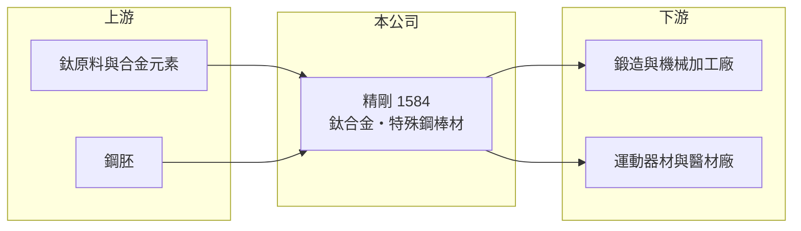

# 1584 精剛

> 上櫃｜[[產業索引-其他業|其他業]]｜上市（櫃）日期 2007/11/28

# 第一章：企業模式與商業藍圖

> [!info] 撰寫說明
> 精簡版，由 Claude 依公開資料整理，架構比照 [[2330台積電]]，資料截至 2026-10-07。來源：winvest 精剛營收快訊。下游應用部分為推估。#待校對

精剛是[[鈦合金]]與[[特殊鋼]][[棒材]]製造商，屬於金屬材料上游，2026 年營收較去年衰退但獲利小幅回升。

- **核心業務：** 公司全名精剛精密科技，主要業務為鈦合金棒材與特殊鋼棒材。
- **營收結構：** 本次未查到鈦合金與特殊鋼各自的營收比重。
- **營運據點：** 公司 2002 年成立、2007 年上市，生產據點明細本次未查到。
- **長期方向：** 鈦合金材料可延伸至高爾夫球具、醫療與航太等高附加價值應用（推估）。

# 第二章：護城河深度與競爭優勢

精剛的優勢在於鈦合金棒材的加工技術，但下游需求分散且受景氣影響。

- **競爭優勢：** 鈦合金熔煉與棒材加工的技術門檻較一般鋼材高，具一定專業性（推估）。
- **主要對手：** 國內外鈦材與特殊鋼棒材業者，本次未查到具體名單。
- **觀察重點：** 8 月營收 2.11 億元，年增 5.53%，是近幾個月首次年增，觀察下半年需求是否回溫。

# 第三章：財務體質與盈利規模

資料日期：2026-10-07，以下數字是撰寫當時的快照；最新月營收、毛利率、累計 EPS 由自動排程寫在本筆記的屬性欄位（月營收、毛利率、累計EPS 等）。#待校對

精剛營收規模穩定在每月約 2 億元，獲利偏薄。

- **營收規模：** 2026 年 1 至 8 月累計營收 14.90 億元，年減 14.59%；5 月營收 1.83 億元，年減 20.94%，是今年低點。
- **獲利：** 2026 年第二季 EPS 0.1 元，上半年累計 EPS 0.19 元；2025 年全年 EPS 0.44 元。
- **財務特色：** 資本額 23.25 億元、市值約 41.50 億元；本次未查到[[毛利率]]與股利資料。

# 第四章：總體風險與地緣政治

精剛的風險來自原料價格與下游需求循環。

- **產業週期：** 金屬材料需求跟隨下游製造業景氣，營收可能大幅波動。
- **營運風險：** 獲利率偏低，原料成本上升若無法轉嫁，可能轉為虧損。
- **其他風險：** 鈦與合金原料價格受國際供需與地緣政治影響，匯率也會影響出口報價。

# 專有名詞解析

## 產業

- **[[鈦合金]]**：以鈦為主並加入其他金屬的合金，重量輕、強度高且耐腐蝕。
- **[[特殊鋼]]**：加入特定合金元素或經特殊處理的鋼材，用於工具、機械零件等要求較高的用途。
- **[[棒材]]**：截面為圓形或方形的長條金屬材料，供下游鍛造或切削加工使用。

# 核心供應鏈

- 上游：鈦原料、合金元素與鋼胚供應商（推估）
- 下游／客戶：鍛造與機械加工廠、運動器材與醫材製造商（推估）
- 同業：國內外鈦材與特殊鋼棒材業者（本次未查到具體名單）

## 最新新聞
<!-- news:start -->
<!-- news:end -->

## 相關連結
- [公開資訊觀測站](https://mopsov.twse.com.tw/mops/web/t05st03?step=1&firstin=1&co_id=1584)
- [Goodinfo](https://goodinfo.tw/tw/StockDetail.asp?STOCK_ID=1584)
- [Yahoo 股市](https://tw.stock.yahoo.com/quote/1584)
- [鉅亨網新聞](https://www.cnyes.com/twstock/1584/news)
