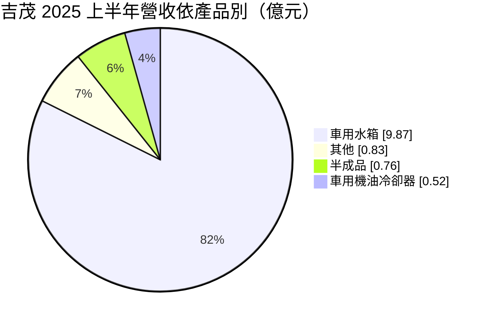
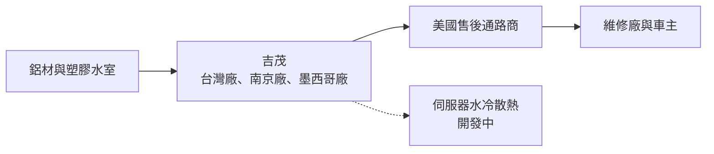
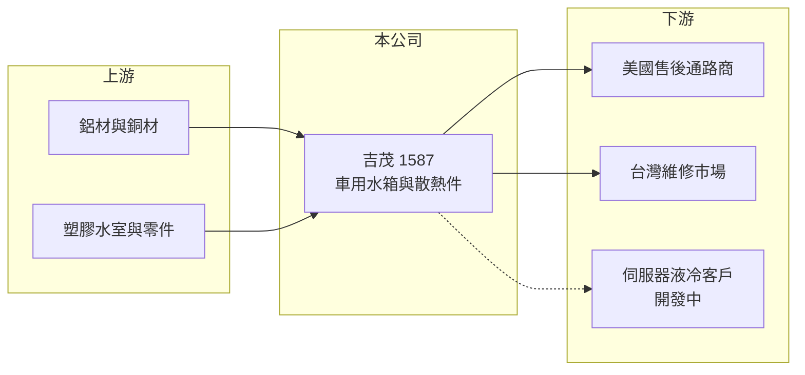

# 1587 吉茂

> 上市｜[[產業索引-汽車工業|汽車工業]]｜上市（櫃）日期 2018/04/16

# 第一章：企業模式與商業藍圖

> [!info] 撰寫說明
> 本文由 Claude 依公開資料整理，架構比照 [[2330台積電]] 的四章研究，資料截至 2026-10-08。財務數字來源：Goodinfo 台灣股市資訊網年度經營績效、富果研究 2025 年 9 月 17 日法說會整理、證交所開放資料（本筆記 _data 快照）；產業描述為整理性內容，尚未逐條比對原始文件。#待校對

在評估單一個股的長期投資價值時，首要步驟是拆解企業的底層獲利邏輯。本章針對吉茂精密（股票代號：1587，以下簡稱吉茂）的商業模式進行定性分析，說明一家以汽車售後水箱為主的散熱器廠，如何利用墨西哥廠取得美國關稅優勢，並嘗試把散熱技術延伸到伺服器水冷。

## 一、核心定位：美國售後市場的汽車水箱供應商

吉茂成立於 1984 年，總部在彰化芳苑，2018 年上市，主要產品是汽車售後維修用的散熱產品，以車用水箱（散熱器）為主。依 2025 年 9 月法說會，車用水箱占營收超過八成，地區別以美洲約 65% 最多（美國為最大宗），台灣內銷約 14%。產品透過美國通路商賣進 [[AM 售後市場]]，也就是車輛需要更換水箱時的維修通路。

汽車水箱屬於會隨車齡老化而損壞的零件，美國路上車輛平均車齡長，替換需求穩定。吉茂的競爭重點在於料號完整、交期與成本，毛利率長期約二成，屬於售後零件中較偏製造成本導向的產品。

## 二、產品板塊

依 2025 年上半年各產品營收（富果法說會整理）：

* **車用水箱：** 約占八成二，是公司的核心產品，供應美國售後通路。
* **車用機油冷卻器與其他散熱件：** 延伸自水箱技術的相關產品，比重較小。
* **半成品：** 散熱芯體等半成品銷售，依產能安排調整。
* **伺服器水冷散熱（開發中）：** 依 2025 年法說，已送樣並小批量出貨，目標 2026 年上半年量產。

## 三、資本轉化邏輯（營運模式）

* **三地生產：** 吉茂在台灣、中國南京與墨西哥設廠。2025 年時台灣與南京廠產能接近滿載，墨西哥廠已取得 [[USMCA]] 資格，銷美水箱可享零關稅。
* **墨西哥廠是成長引擎：** 公司目標 2025 年底墨西哥廠月產 2 萬片、2026 年全年 35 萬至 40 萬片，且定位為淨增加訂單，不取代台灣與南京的產能。這代表吉茂想藉關稅優勢搶下原本由中國廠供應的美國訂單。

## 四、企業長期藍圖

吉茂的長期策略分兩條線。第一條是以墨西哥廠擴大美國售後水箱市占，利用美國對中國零件的關稅，承接轉單。第二條是利用 40 多年累積的模具與散熱技術，切入伺服器 [[液冷]]散熱，尋找第二成長曲線。前者是延伸既有能力、確定性較高；後者市場大但競爭者多，能否成功仍需時間驗證。

# 第二章：護城河深度與競爭優勢

在長期價值投資中，「護城河」指企業抵禦競爭、維持超額利潤的保護機制。本章分析吉茂在售後水箱市場的護城河、主要對手與可守住的範圍。

## 一、護城河的核心組成要素

* **1. 料號與模具累積：** 售後水箱需要對應大量車款，每個車款都需要模具。吉茂 40 多年累積的模具庫，是新進者短期難以複製的資產。
* **2. 北美在地產能：** 墨西哥廠取得 USMCA 資格，在美國關稅提高的環境下，成為相對中國廠商的成本優勢。這項優勢來自政策，但短期內不容易被複製。
* **3. 規模與成本仍偏弱：** 售後水箱是價格競爭激烈的市場，吉茂的毛利率約二成，護城河偏窄，主要靠營運效率而非定價權。

## 二、全球主要競爭對手格局

| 對手 | 定位 | 對吉茂的威脅 |
|---|---|---|
| 中國售後水箱廠 | 規模大、成本低 | 美國關稅前是主要價格競爭者 |
| 國際散熱系統大廠（如 Denso、Valeo、Mahle） | 原廠散熱系統，部分做售後 | 在高階售後品牌占優 |
| 墨西哥與北美在地散熱器廠 | 同樣享有 USMCA 優勢 | 爭取同一批轉單 |
| [[3017奇鋐]]、[[3324雙鴻]] | 伺服器散熱大廠 | 吉茂進入液冷領域時的強勁對手 |

## 三、優勢轉化：守得住／守不住／觀察重點

* **守得住：** 美國售後水箱的在地供應。只要美國對中國零件的關稅持續，墨西哥廠就有成本優勢。
* **守不住：** 若關稅政策鬆綁，中國廠的價格競爭會再度回來；伺服器液冷則面對既有大廠的規模與客戶關係。
* **觀察重點：** 墨西哥廠能否達到年產 35 萬至 40 萬片並維持獲利、毛利率能否回到 22% 以上，以及液冷產品能否從小量出貨走向穩定營收。

# 第三章：財務體質與盈利規模

資料日期：2026-10-08。數字取自 Goodinfo 年度經營績效、富果法說會整理與證交所開放資料快照，表格是撰寫當時的快照；最新月營收、毛利率、累計 EPS 由自動排程寫在本筆記的屬性欄位（月營收、毛利率、累計EPS 等）。#待校對

財務報表是檢驗護城河是否真實存在的最終標準。本章用多年度的三率、ROE 與資本報酬，檢視吉茂在擴產期的獲利品質。

## 一、獲利能力的基石：三率

| 年度 | 營收（新台幣） | [[毛利率]] | [[營業利益率]] | EPS（元） | [[ROE]] |
|---|---|---|---|---|---|
| 2019 | 15.2 億 | 22.6% | 1.67% | 0.05 | 0.18% |
| 2020 | 17.3 億 | 26.0% | 7.61% | 2.64 | 14.1% |
| 2021 | 23.5 億 | 22.6% | 6.66% | 1.49 | 7.95% |
| 2022 | 25.4 億 | 23.2% | 6.56% | 2.00 | 10.2% |
| 2023 | 21.2 億 | 21.0% | 2.59% | 0.61 | 3.04% |
| 2024 | 21.5 億 | 21.0% | -1.46% | -0.47 | -2.31% |
| 2025 | 26.5 億 | 19.1% | 2.47% | 0.37 | 1.91% |

* **[[毛利率]]：** 長期在 19% 至 26%，2025 年降到 19.1%，2026 年上半年 17.4%（證交所開放資料）。墨西哥新廠在爬坡期的效率與折舊，可能是毛利率下滑的原因之一（推估）。
* **[[營業利益率]]：** 2020 年最高 7.61%，2024 年轉為虧損，2025 年回到 2.47%，2026 年上半年 1.59%。本業獲利空間薄，營收成長尚未轉化為利潤。
* **長期指標：** 2020 至 2025 年營收年複合成長率約 8.9%（推算）；2021 至 2025 年平均 ROE 約 4.2%（推算）。2025 年下半年與 2026 年上半年均未配發現金股利（證交所開放資料）。

## 二、[[ROE]]：資本效率

吉茂 2026 年第二季底負債約 20.0 億元、權益約 16.2 億元，負債比約 55%，其中流動負債 18.0 億元占大部分（證交所開放資料），推估包含較多短期借款支應擴產與營運資金（推估）。過去五年平均 ROE 只有 4% 上下，2020 與 2022 年的兩位數 ROE 屬於少數年份。

## 三、資本支出與自由現金流

* **[[CapEx]]：** 逐年數字未查得。墨西哥廠擴產與液冷開發是近年主要投資。
* **[[自由現金流]]：** 逐年數字未查得。擴產期加上營收成長需要的存貨與應收帳款，自由現金流可能偏弱，需留意短期借款水準。

## 四、[[ROIC]] 與 [[WACC]]：價值創造利差

有息負債明細未查得，假設有息負債約 10 億元（推估，依流動負債規模估算）。2025 年營業利益約 0.65 億元（營收 26.5 億元 × 2.47%），稅後約 0.52 億元；投入資本以權益 16.2 億元加有息負債約 10 億元，約 26 億元計算，ROIC 約 2.0%（推算）。2022 年營業利益約 1.67 億元，稅後約 1.33 億元，以相近資本規模估算 ROIC 約 5%（推算）。

WACC 以 CAPM 推估：台灣 10 年期公債約 1.5% 至 2%，市場風險溢酬約 6%，β 未查得，小型汽車零件股採 1.0 至 1.2（假設），權益成本約 7.5% 至 9.2%；稅前負債成本假設 2.5%、稅後 2%，負債約占投入資本四成，WACC 約 5.3% 至 6.3%（推算）。

兩者比較，吉茂多數年度 ROIC 低於 WACC，長期尚未創造超額價值。墨西哥廠若能如期放量並把營業利益率拉回 6% 以上，ROIC 才有機會超過資金成本，這是判斷擴產決策是否正確的關鍵。

# 第四章：總體風險與地緣政治

任何企業都無法脫離宏觀環境獨立存在。本章分析吉茂長期必須面對的貿易政策、產業與營運風險。

## 一、地緣政治與貿易

* **美國關稅政策：** 墨西哥廠的價值建立在 USMCA 零關稅與美國對中國零件的關稅上。若美墨貿易協定重新談判，或美國對墨西哥加徵關稅，這項優勢可能縮小。
* **中國南京廠：** 南京廠銷美產品面臨關稅壓力，產能配置需要隨政策調整。

## 二、產業週期與市場結構

* **售後市場需求穩定但價格競爭激烈：** 水箱替換需求跟車齡走，但產品同質性高，價格壓力長期存在。
* **電動化影響：** 電動車不需要傳統引擎水箱，但仍需要電池與電控的熱管理散熱器，產品形式會改變，吉茂需要跟著調整。

## 三、營運環境的隱性風險

* **新廠爬坡：** 墨西哥廠的良率、人力與管理若不如預期，會拖累毛利率。
* **財務槓桿：** 流動負債比重高，利率上升或銀行緊縮時，資金調度壓力增加。
* **原物料與匯率：** 鋁價上漲與新台幣升值，都會壓縮毛利。

## 四、科技或法規演進

* **伺服器液冷：** AI 伺服器散熱從氣冷轉向液冷，是新市場，但技術標準與客戶認證門檻高，吉茂需要與大廠競爭。
* **環保法規：** 美國與墨西哥的環保與勞動法規變化，可能增加營運成本。

# 專有名詞解析

## 金融

- **[[ROIC]]**：投入資本報酬率，衡量公司用股東與債權人資金創造本業稅後利潤的效率。
- **[[WACC]]**：加權平均資金成本，依股權與負債比重加權的資金成本，是 ROIC 要超過的門檻。

## 產業

- **[[AM 售後市場]]**：車輛出廠後的維修與更換零件市場，需求跟著路上車輛數量與車齡走，波動比新車市場小。
- **[[USMCA]]**：美墨加協定，符合原產地規則的產品在三國之間可享零關稅。
- **[[液冷]]**：以液體帶走熱量的散熱方式，效率高於氣冷，AI 伺服器逐步採用。

# 核心供應鏈

## 1. 上游：材料
- 鋁材、銅材與塑膠水室（具體供應商未查得）

## 2. 中游：吉茂本身
- 台灣廠、南京廠、墨西哥廠（USMCA 資格）
- 車用水箱、機油冷卻器、伺服器水冷散熱（開發中）

## 3. 下游：客戶
- 美國汽車售後零件通路商（具名客戶未揭露）
- 台灣內銷約 14%（2025 年）

## 4. 同業
- 台灣：[[1568倉佑]]、[[1533車王電]]（同屬售後零件，品項不同）；液冷領域 [[3017奇鋐]]、[[3324雙鴻]]
- 海外：中國售後水箱廠、Denso、Valeo、Mahle

## 最新新聞
<!-- news:start -->
<!-- news:end -->

## 相關連結
- [公開資訊觀測站](https://mopsov.twse.com.tw/mops/web/t05st03?step=1&firstin=1&co_id=1587)
- [Goodinfo](https://goodinfo.tw/tw/StockDetail.asp?STOCK_ID=1587)
- [Yahoo 股市](https://tw.stock.yahoo.com/quote/1587)
- [鉅亨網新聞](https://www.cnyes.com/twstock/1587/news)
