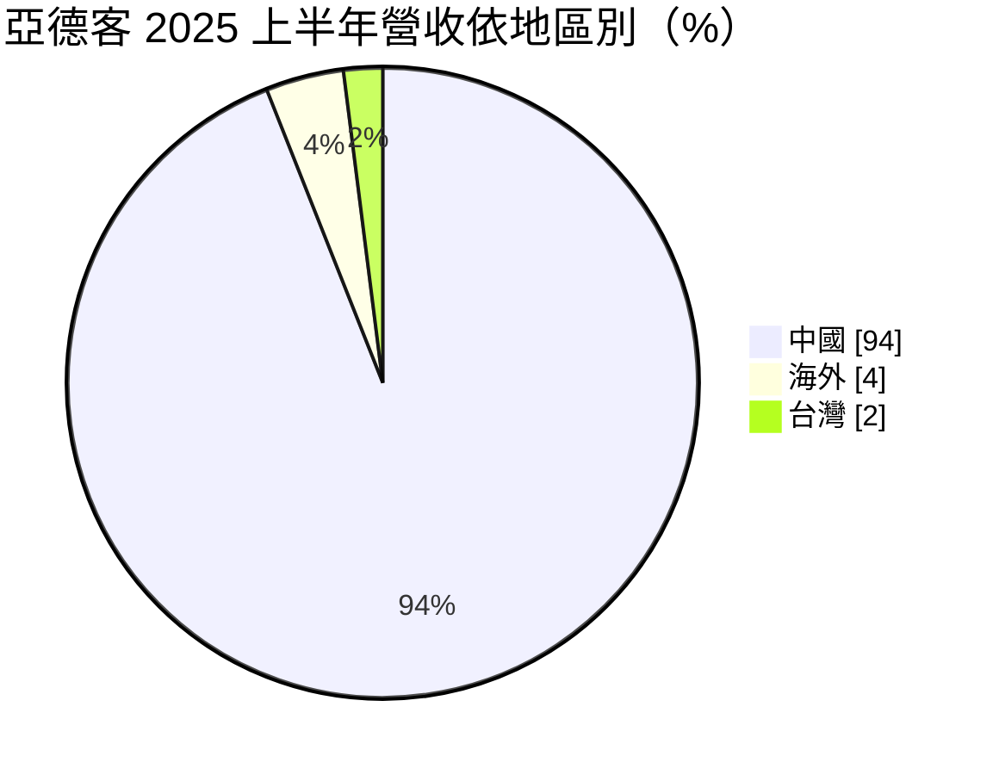
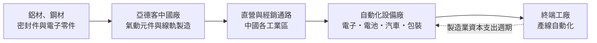
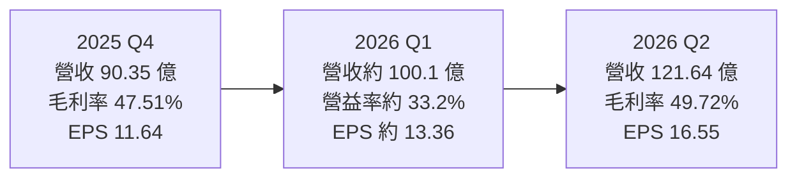
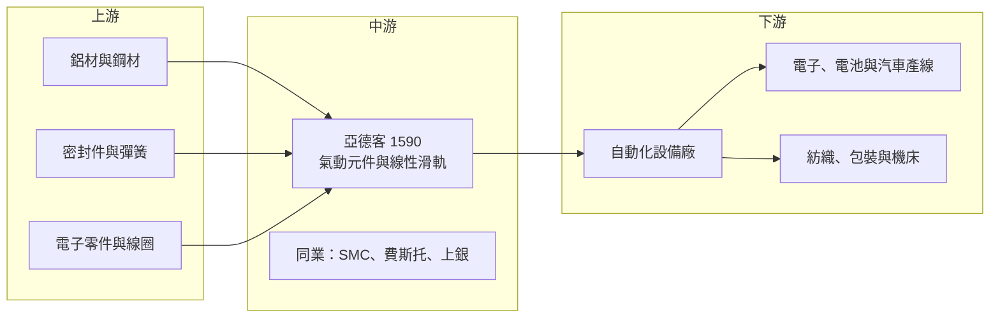

# 1590 亞德客-KY

> 上市｜[[產業索引-電機機械|電機機械]]｜上市（櫃）日期 2010/12/13

# 第一章：企業模式與商業藍圖

> [!info] 撰寫說明
> 本文由 Claude 依公開資料整理，架構比照 [[2330台積電]] 的四章研究，資料截至 2026-10-07。財務數字來源：工商時報與旺得富 2026 年 7 月財報報導、經濟日報 2026 年 7 月法人報導、優分析（2025 年報與 2025 上半年報導）、Yahoo 股市公司基本資料；產業描述為整理性內容，尚未逐條比對原始文件。#待校對

在評估單一個股的長期投資價值時，首要步驟是拆解企業的底層獲利邏輯。本章針對亞德客國際集團（股票代號：1590，以下簡稱亞德客）的商業模式進行定性分析，說明一家台灣背景的氣動元件廠，如何在中國工業自動化市場與日本龍頭 SMC 分庭抗禮，並維持接近五成的毛利率。

## 一、核心定位：中國第二大氣動元件品牌

亞德客是開曼註冊的 KY 公司，依 Yahoo 股市資料，控股公司登記成立日為 2009 年 9 月 16 日，2010 年在台上市，董事長為王世忠。公司研發、生產並銷售[[氣動元件]]，包括控制元件（[[電磁閥]]）、執行元件（[[氣缸]]）、氣源處理元件與輔助元件，近年再擴及[[線性滑軌]]與電控產品。

氣動元件是[[工廠自動化]]設備的「肌肉」，利用壓縮空氣推動機構完成夾取、推送、定位等動作，廣泛用在電子組裝、鋰電池、汽車、包裝、紡織與機床設備。依優分析 2025 年報導，亞德客在中國氣動元件市場市占約 30%，僅次於日本 SMC 的 33%，目標在 2030 年達到 35%。

* **以中國在地化取代進口：** 亞德客主要生產與銷售都在中國，產品價格低於日系、歐系品牌，交期與服務較快，主打進口替代。
* **以標準品規模創造毛利：** 氣動元件品項多但標準化程度高，規模越大，零件共用與自動化生產帶來的成本優勢越明顯。

## 二、終端應用板塊：中國市場占九成以上

亞德客的營收高度集中在中國。依優分析整理 2025 年上半年資料，地區別營收比重如下：

依產業應用，2026 年第二季各應用的年成長率為：電子業 20%、電池 56%、汽車 20%、紡織設備 39%、包裝設備 17%、機床設備 35%、通用機械 28%（應用別比重未查得）。

* **電子：** 3C 組裝與電子設備自動化，是最大應用之一。
* **電池與汽車：** 鋰電池與電動車產線自動化，2025 年第二季電池業務年增 117%，是近年成長最快的領域。
* **傳統產業設備：** 紡織、包裝、機床與通用機械，反映中國製造業整體景氣。
* **半導體：** 新產品布局，公司預估 2026 年半導體營收約人民幣 1 億多元。

## 三、資本轉化邏輯：規模化製造加上通路深耕

* **[[產能利用率]]決定毛利：** 依工商時報報導，氣動元件設備第三季稼動率預估達 100%；線軌產能利用率則從第一季 30%、第二季 40% 逐步提升，年底預估 50%。線軌仍在爬坡，產能利用率提高將帶動整體毛利率上升。
* **人民幣計價：** 約九成銷售以人民幣計價，換算成新台幣時受匯率影響，但實際營運的匯率風險有限。
* **營運槓桿：** 2026 年第二季營收年增約三成多，EPS 從 10.19 元增至 16.55 元，獲利成長遠快於營收。

## 四、企業長期藍圖：從氣動到電控與線軌

* **市占目標：** 2030 年中國氣動元件市占 35%，持續拉近與 SMC 的差距。
* **產品延伸：** 線性滑軌與電控產品（[[電動缸]]等）讓亞德客從單一氣動元件，延伸成工廠自動化的多元零組件供應商。
* **半導體與高階應用：** 開發半導體設備用元件，切入規格更高、毛利更好的市場。
* **2026 年展望：** 公司把全年營收成長目標上修到 20% 以上，營業利益率目標 34%，並預期產業上升週期延續到 2027 年。

# 第二章：護城河深度與競爭優勢

在長期價值投資中，「護城河」指企業抵禦競爭、維持超額利潤的保護機制。本章分析亞德客的護城河構成、全球主要競爭對手，以及這些優勢在中國製造業週期中能守住多少。

## 一、亞德客護城河的核心組成要素

亞德客屬於「中等護城河」，由三個要素組成：

* **1. 規模經濟：** 中國市占約三成，量產規模讓單位成本低於多數本土小廠，又能以低於日歐品牌的價格銷售。
* **2. 通路與服務網：** 氣動元件品項繁多，客戶需要快速交貨與技術支援，亞德客長年建立的經銷與服務網是新進者難以複製的。
* **3. 品牌信任：** 在中國工廠端，亞德客已被視為可替代進口品牌的主要選擇，設備廠設計時會直接選用其規格。

## 二、全球主要競爭對手格局

| 對手 | 定位 | 對亞德客的威脅 |
|---|---|---|
| SMC | 日本氣動元件全球龍頭，中國市占約 33% | 品牌、品質與產品線完整，在高階市場占優勢 |
| Festo 費斯托 | 德國氣動與自動化大廠 | 在高階自動化與汽車產線競爭 |
| 中國本土氣動廠 | 中小型本土品牌 | 以更低價格搶中低階市場 |
| [[2049上銀]] | 台灣線性滑軌龍頭 | 在線軌產品直接競爭 |

## 三、優勢轉化：哪些市場守得住、哪些守不住

* **守得住：** 中國中階自動化設備市場，亞德客的性價比與交期優勢明顯，電池、汽車與電子產線是主力。
* **守不住：** 對可靠度要求最高的高階產線，仍以 SMC、Festo 為首選；低階市場則面臨本土廠價格競爭。
* **觀察重點：** 線軌產能利用率能否提升到損益兩平以上、半導體新產品能否放量，以及中國製造業資本支出週期是否延續到 2027 年。

# 第三章：財務體質與盈利規模

資料日期：2026-10-07。數字取自工商時報、旺得富與優分析的財報報導，表格是撰寫當時的快照；最新月營收、毛利率、累計 EPS 由自動排程寫在本筆記的屬性欄位（月營收、毛利率、累計EPS 等）。#待校對

財務報表是檢驗護城河是否真實存在的最終標準。本章用三率、ROE、現金流與資本報酬，檢視亞德客在中國製造業循環中的獲利品質。

## 一、獲利能力的基石：三率

| 項目 | 2025 全年 | 2025 Q4 | 2026 Q1 | 2026 Q2 |
|---|---|---|---|---|
| 營收（新台幣） | 343.3 億 | 90.35 億 | 約 100.1 億（推算） | 121.64 億 |
| [[毛利率]] | 未查得 | 47.51% | 未查得 | 49.72% |
| [[營業利益率]] | 未查得 | 未查得 | 約 33.2%（推算） | 約 35.1%（推算） |
| 稅後純益 | 84 億 | 23.27 億 | 約 26.7 億（推算） | 33.11 億 |
| EPS（元） | 42 | 11.64 | 約 13.36（推算） | 16.55 |

* **[[毛利率]]：** 從 2025 年第三季 46.04%、第四季 47.51%，回升到 2026 年第二季 49.72%，來自產品組合優化、規模經濟與產能利用率提高。
* **[[營業利益率]]：** 2026 年上半年營業利益 75.9 億元，營益率約 34%，與公司全年 34% 的目標一致。
* **[[淨利率]]：** 2026 年第二季稅後淨利率約 27%。2025 年獲利也曾認列約人民幣 2,000 萬元匯兌收益，評估本業時應以營業利益為準。

## 二、[[ROE]]：資本效率

2025 年 EPS 42 元、稅後純益 84 億元，2026 年上半年 EPS 已達 29.91 元，ROE 推估處於雙位數高檔（具體數值未查得）。亞德客的高 ROE 主要來自高營益率，而非財務槓桿。

## 三、資本支出與自由現金流

* **[[CapEx]]：** 線軌與新產品產能擴充是主要支出，具體金額未查得。線軌產能利用率仍低，短期擴產壓力不大。
* **[[自由現金流]]：** 高毛利標準品加上穩定的經銷收款，營業現金流穩健，股利能力強（具體股利金額未查得）。

## 四、[[ROIC]] 與 [[WACC]]：價值創造利差

氣動元件本業的營益率超過三成，ROIC 推估明顯高於資金成本。線軌事業目前產能利用率不到五成，會拉低整體資本報酬，若利用率能在 2027 年提升到七成以上，將是 ROIC 進一步提升的關鍵。

# 第四章：總體風險與地緣政治

任何企業都無法脫離宏觀環境獨立存在。本章分析亞德客未來必須面對的地緣政治、產業週期與營運風險。

## 一、地緣政治風險

* **高度依賴中國：** 約 94% 營收來自中國，中國經濟、產業政策與兩岸關係直接影響營運。
* **中美貿易衝突：** 美國對中國製品課徵關稅、供應鏈外移，可能減少中國工廠的自動化投資，但也可能促使中國工廠加速自動化以降低成本。
* **KY 公司的資金匯回：** 主要獲利在中國，盈餘匯回台灣發放股利受中國外匯管理規範。

## 二、產業週期與市場結構風險

* **製造業資本支出週期：** 氣動元件需求跟著中國製造業設備投資起伏，景氣下行時訂單會迅速萎縮。
* **電池與電動車產能過剩：** 鋰電池與電動車是近年主要成長來源，若中國電池產能過剩導致擴產停止，相關需求會明顯下滑。
* **[[長鞭效應]]：** 設備廠與經銷商的庫存調整，會放大終端需求的變化。

## 三、營運環境的隱性風險

* **價格競爭：** 中國本土品牌崛起，可能在中低階市場引發價格戰。
* **匯率：** 人民幣兌新台幣貶值，會降低以台幣計的營收與獲利。
* **線軌爬坡：** 線軌產能利用率低，若需求不如預期，固定成本會壓縮毛利。

## 四、科技演進風險

工廠自動化正從氣動逐步走向電動化與智慧化，電動缸、伺服馬達在部分高精度應用取代氣缸。亞德客若電控產品發展不夠快，長期可能在高階市場失去份額；反之，電控與線軌的布局也是它從氣動元件廠轉型為自動化零組件平台的機會。

# 專有名詞解析

## 金融

- **[[產能利用率]]**：實際生產量占總產能的比例，產能利用率越高，固定成本攤提越低、毛利率越高。
- **[[CapEx]]**：資本支出，企業購買土地、廠房與設備的支出。
- **[[自由現金流]]**：營業活動現金流減去資本支出，代表企業可自由用於配息、還債或併購的現金。
- **[[長鞭效應]]**：終端需求的小幅變動，沿供應鏈往上游傳遞時被逐級放大，造成上游庫存與訂單劇烈波動。

## 產業

- **[[氣動元件]]**：以壓縮空氣驅動的元件，包括氣缸、電磁閥與氣源處理器，是工廠自動化設備的基本動力零件。
- **[[電磁閥]]**：以電訊號控制氣體流向的閥門，是氣動系統的控制核心。
- **[[氣缸]]**：把壓縮空氣的能量轉為直線運動的執行元件，用於推、拉、夾取等動作。
- **[[線性滑軌]]**：讓機構沿直線精準移動的導軌與滑塊，用於機床、半導體設備與自動化設備。
- **[[電動缸]]**：以馬達驅動的直線運動元件，可取代氣缸用於需要精準定位的場合。
- **[[工廠自動化]]**：以機器與控制系統取代人工完成生產作業，常見英文縮寫為 FA。

# 核心供應鏈

## 1. 上游：材料
- 鋁材、鋼材、密封件與電子零件：供應商未揭露

## 2. 中游：自動化零組件同業
- 氣動元件：SMC、Festo 費斯托、中國本土品牌
- 線性滑軌：[[2049上銀]]

## 3. 下游：應用產業
- 電子組裝、鋰電池、汽車、紡織、包裝與機床設備的自動化設備廠，以中國為主，客戶名稱未揭露

## 最新新聞
<!-- news:start -->
<!-- news:end -->

## 相關連結
- [公開資訊觀測站](https://mopsov.twse.com.tw/mops/web/t05st03?step=1&firstin=1&co_id=1590)
- [Goodinfo](https://goodinfo.tw/tw/StockDetail.asp?STOCK_ID=1590)
- [Yahoo 股市](https://tw.stock.yahoo.com/quote/1590)
- [鉅亨網新聞](https://www.cnyes.com/twstock/1590/news)
