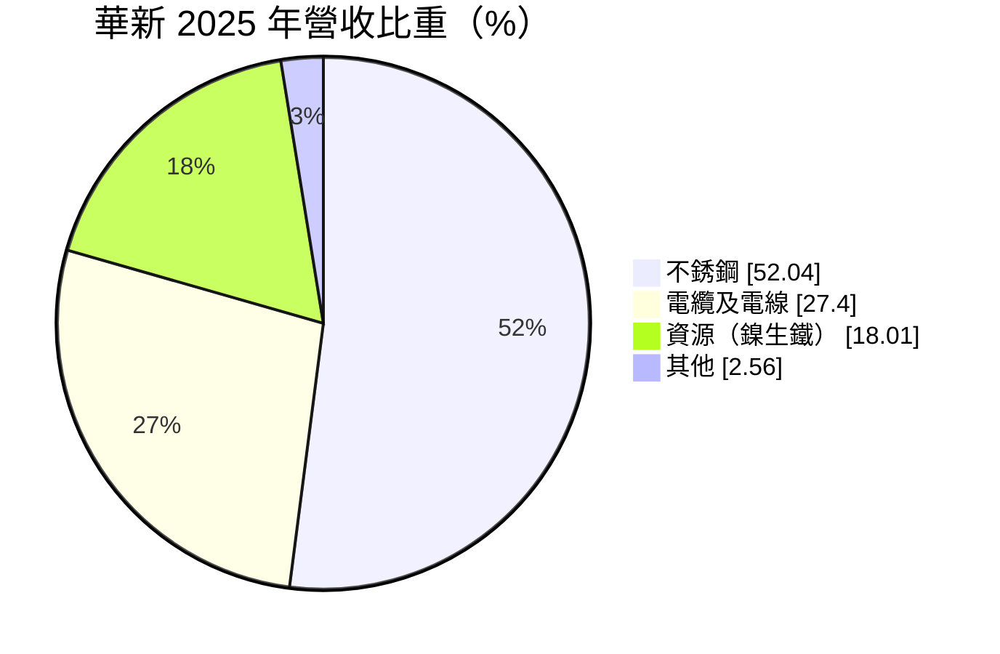
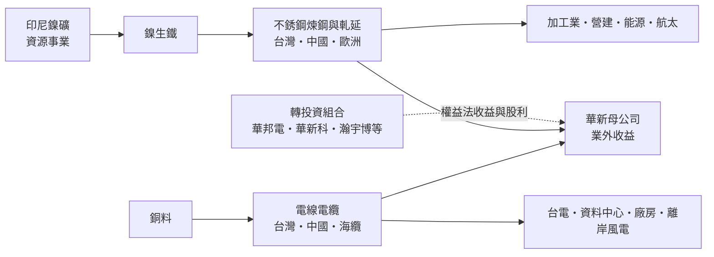
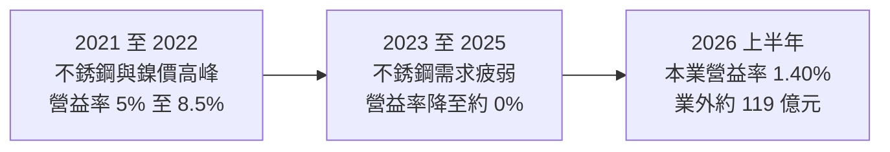
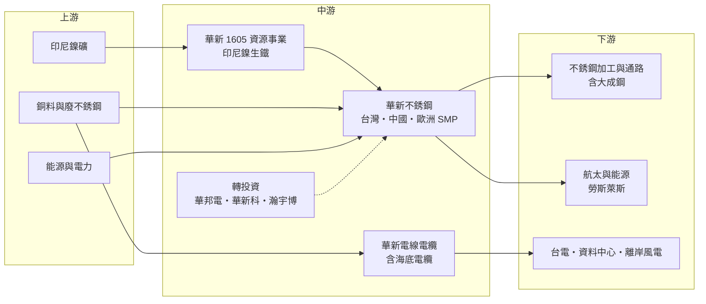

# 1605 華新

> 上市｜[[產業索引-電器電纜|電器電纜]]｜上市（櫃）日期 1972/11/03

# 第一章：企業模式與商業藍圖

> [!info] 撰寫說明
> 本文由 Claude 依公開資料整理，架構比照 [[2330台積電]] 的四章研究，資料截至 2026-10-08。財務數字來源：Goodinfo 年度經營績效、現金流量與股利政策頁、MoneyDJ 理財網財務比率、營收比重與資產負債表、優分析法說會報導（2026 年 2 月、8 月）、經濟日報、工商時報、證交所開放資料（基本資料、資產負債、綜合損益、營益分析、股利）；產業描述為整理性內容，尚未逐條比對原始文件。#待校對

在評估單一個股的長期投資價值時，首要步驟是拆解企業的底層獲利邏輯。本章針對華新麗華（股票代號：1605，以下簡稱華新）的商業模式進行定性分析。華新是一家很特別的公司：本業是[[不銹鋼]]、電線電纜與鎳資源，但近年真正決定獲利高低的，往往是它持有的電子公司股權。理解華新，必須同時看懂「本業」與「控股」兩個層次。

## 一、核心定位：本業為金屬材料、價值核心在轉投資的控股型集團

華新成立於 1966 年，1972 年在台灣證券交易所上市，是華新麗華集團的母公司，現任董事長為焦佑倫、總經理為王錫欽。公司早年以電線電纜起家，後來擴展到不銹鋼、鎳資源，並從 1984 年起陸續轉投資電子、材料與房地產開發（nStock 整理）。華新也曾在 1995、2010 與 2023 年發行全球存託憑證（GDR），在盧森堡證券交易所掛牌。

華新的定位可以拆成兩層：

* **本業：** 不銹鋼（台灣、中國、歐洲）、電線電纜（台灣與中國，含新發展的[[海底電纜]]）與資源事業（印尼鎳生鐵）。這三塊業務營收規模大，但毛利率低、受原物料價格影響大，近年本業的營業利益率只有 0% 至 2%。
* **控股：** 華新透過[[權益法]]與金融資產持有多家電子公司股權，例如 [[2344華邦電]]、[[2492華新科]]、[[5469瀚宇博]] 等（持股比例未查得，待校對）。2026 年第二季底，華新帳上採權益法之投資約 858 億元、透過其他綜合損益按公允價值衡量之金融資產（[[FVOCI]]）約 285 億元（MoneyDJ），合計超過千億元，占股東權益一半以上。

正因為這種雙層結構，華新的稅後淨利經常與本業脫鉤。2026 年上半年營業利益僅 12.7 億元，但營業外收入高達 119 億元，稅後淨利 126 億元、EPS 2.85 元創同期新高（證交所開放資料、優分析）。

## 二、終端應用／產品板塊：不銹鋼過半、電線電纜與資源各占一部分

依 MoneyDJ 理財網整理的 2025 年營收比重，不銹鋼占 52.04%、電纜及電線占 27.40%、資源占 18.01%、其他占 2.56%。

* **不銹鋼：** 華新是台灣主要的不銹鋼長條產品（盤元、線材、棒材、扁鋼胚等）生產者，在台灣、中國與歐洲設有據點（具體廠區名稱待校對）。不銹鋼的主要成本是鎳，鎳價波動會直接影響售價與毛利。歐洲子公司 SMP 生產高階特殊合金，依優分析報導已與勞斯萊斯簽訂長期合約，雖然歐洲銷售額占比不到 20%，卻是獲利最好的部分，公司規劃 2028 年產能增加一倍。
* **電線電纜：** 包括電力電纜、建築用電線與通訊線纜，客戶是台電、營建商與工廠。台灣「[[強韌電網計畫]]」與 AI 資料中心、半導體廠建廠需求，讓電線電纜成為近年最穩定的獲利來源。華新也投入海底電纜，依優分析報導，2025 年底完成第一根電纜建置，2026 年 5 月開始認證，預計 2027 年 7 月前取得認證後量產，量產後預期每年貢獻約 100 億元營收。
* **資源事業：** 在印尼生產[[鎳生鐵]]，作為自家不銹鋼的原料，也對外銷售。印尼政府控制鎳礦開採配額，讓鎳生鐵價格與產量受政策影響很大。
* **其他：** 包含商貿地產等業務，比重小。

## 三、資本轉化邏輯（營運模式）：垂直整合的金屬材料鏈加上投資組合

* **原料到成品的[[垂直整合]]：** 華新從印尼的鎳資源，到不銹鋼的煉鋼與軋延，再到下游的線材與棒材，形成一條垂直整合的供應鏈。理論上，鎳價上漲時資源事業受惠、不銹鋼事業受壓，可以部分互相抵銷。但在實務上，近年不銹鋼需求疲弱，兩者經常同時承壓，例如 2025 年第四季資源與不銹鋼合計虧損逾 10 億元（工商時報）。
* **電線電纜的穩定現金流：** 電線電纜以銅為主要原料，多採成本加成定價，獲利相對穩定。這是華新本業中最可靠的支柱。
* **轉投資的價值實現：** 華新的轉投資收益來自兩種方式：一是被投資公司賺錢時依持股比例認列的權益法收益，二是處分部分持股的利益。後者屬於[[一次性收益]]，可以在某一年大幅推高 EPS，但無法每年重複。

## 四、企業長期藍圖：海纜、高階合金與歐洲在地化

* **海底電纜：** 台灣離岸風電與跨海電網需要大量海纜，過去多仰賴歐洲廠商。華新若在 2027 年取得認證並量產，可望成為台灣少數具備海纜能力的本土業者，是未來十年最重要的新事業。
* **高階特殊合金：** 歐洲 SMP 的航太與能源用高階合金，毛利遠高於一般不銹鋼。擴產一倍的計畫代表華新正把不銹鋼事業往高附加價值方向移動。
* **歐洲在地化：** 歐盟的碳邊境調整機制（[[CBAM]]）與鋼鐵防衛措施，讓在歐洲有產能的業者受惠，華新的歐洲據點具有就近供料優勢（工商時報引述公司說法）。
* **資本配置：** 華新長期透過處分轉投資股權取得資金，再投入本業擴張與海外併購，例如 2023 年透過新加坡子公司取得 Berg Holding 75% 股權（nStock 整理的新聞標題，與 SMP 的關係待校對）。這種「以投資組合養本業轉型」的模式，是華新經營層的核心資本配置習慣。

# 第二章：護城河深度與競爭優勢

在長期價值投資中，「護城河」指企業抵禦競爭、維持超額利潤的保護機制。本章分析華新三大本業的護城河構成、主要競爭對手，以及哪些業務守得住、哪些容易被價格戰侵蝕。

## 一、護城河的核心組成要素

華新本業的護城河整體偏窄，但各事業之間差異很大：

* **1. 電線電纜的認證與通路：** 電力電纜需要通過台電等公用事業的規格認證，大型工程案也重視供應商的過往實績與交期。華新在台灣線纜市場經營數十年，擁有完整的產品線與客戶關係，新進者不容易在短期內取得同等的信任。
* **2. 高階合金的技術門檻：** 歐洲 SMP 的特殊合金需要長時間的材料認證，航太客戶（如勞斯萊斯）一旦簽訂長期合約，轉換供應商的成本極高。這是華新集團中技術護城河最深的業務。
* **3. 垂直整合的原料保障：** 自有印尼鎳生鐵產能，讓華新在鎳原料供應緊張時有較穩定的來源。不過這個優勢在鎳價下跌時會反過來變成負擔。
* **4. 投資組合帶來的財務彈性：** 千億元規模的轉投資股權，讓華新在本業低迷時仍有股利收入與處分利益可以支撐獲利與配息，這是一般鋼廠沒有的財務緩衝。

## 二、全球主要競爭對手格局

| 對手 | 定位 | 對華新的影響 |
|---|---|---|
| [[2002中鋼]]（含不銹鋼子公司） | 台灣最大鋼廠，旗下有不銹鋼業務 | 台灣不銹鋼市場的主要對手（集團內不銹鋼子公司名稱待校對） |
| 中國不銹鋼廠（青山、太鋼等） | 全球最大不銹鋼產能，結合印尼鎳資源 | 低價出口壓縮亞洲不銹鋼價格 |
| 歐洲不銹鋼廠（Outokumpu、Acerinox 等） | 歐洲主要不銹鋼生產商 | 在歐洲市場競爭，但同受 CBAM 保護 |
| [[1608華榮]]、[[1609大亞]] 等 | 台灣電線電纜業者 | 在台灣電線電纜市場競爭 |
| Prysmian、Nexans、NKT | 全球海底電纜領導廠 | 海纜市場的既有領導者，技術與實績遠超華新 |

註：對手名單為產業常識整理，部分未經本次搜尋來源確認，待校對。

## 三、優勢轉化：守得住／守不住／觀察重點

* **守得住：** 電線電纜與高階合金。電網升級、資料中心與離岸風電的長期需求明確，加上認證門檻，華新在這兩塊業務有穩定的獲利基礎。
* **守不住：** 一般不銹鋼與鎳生鐵。這兩項都是全球定價的大宗商品，中國與印尼的產能決定價格，華新只是價格接受者。2023 年以後營業利益率從 5% 以上跌到接近 0%，主要就是不銹鋼與資源事業的拖累。
* **觀察重點：** 第一，海纜能否如期在 2027 年取得認證並量產，這是本業能否升級的關鍵。第二，不銹鋼與資源事業何時能穩定損益兩平。第三，轉投資公司（尤其是記憶體與被動元件）的景氣循環，這會直接影響華新的業外收益與配息能力。

# 第三章：財務體質與盈利規模

資料日期：2026-10-08。數字取自 Goodinfo 年度經營績效、現金流量與股利政策頁、MoneyDJ 理財網財務比率與資產負債表、優分析法說會報導與證交所開放資料，表格是撰寫當時的快照；最新月營收、毛利率、累計 EPS 由自動排程寫在本筆記的屬性欄位（月營收、毛利率、累計EPS 等）。#待校對

財務報表是檢驗護城河是否真實存在的最終標準。本章用十年的三率、ROE、現金流與資本報酬，檢視華新的本業獲利能力，以及業外收益在其中扮演的角色。

## 一、獲利能力的基石：三率

| 年度 | 營收（新台幣） | [[毛利率]] | [[營業利益率]] | EPS（元） | [[ROE]] |
|---|---|---|---|---|---|
| 2016 | 1,434 億 | 6.67% | 3.71% | 1.33 | 7.51% |
| 2017 | 1,678 億 | 7.15% | 4.71% | 1.97 | 9.73% |
| 2018 | 1,909 億 | 8.35% | 5.78% | 3.53 | 15.8% |
| 2019 | 1,348 億 | 6.97% | 3.01% | 0.95 | 4.79% |
| 2020 | 1,125 億 | 11.1% | 6.56% | 2.04 | 8.45% |
| 2021 | 1,567 億 | 12.6% | 8.52% | 4.27 | 15.6% |
| 2022 | 1,804 億 | 9.62% | 5.27% | 5.45 | 15.8% |
| 2023 | 1,898 億 | 7.58% | 3.23% | 1.31 | 4.06% |
| 2024 | 1,793 億 | 6.59% | 1.27% | 0.69 | 1.71% |
| 2025 | 1,742 億 | 6.37% | 0.01% | 0.75 | 1.45% |
| 2026 上半年 | 907.2 億 | 7.66% | 1.40% | 2.85 | 未查得 |

註：2016 至 2025 年取自 Goodinfo 合併報表；2026 上半年取自證交所營益分析與綜合損益開放資料。工商時報報導 2025 年「本業獲利 18.85 億元」，與 Goodinfo 合併營業利益率 0.01% 的口徑不同（可能包含部分非營業項目），以年報為準。

* **[[毛利率]]：** 華新的毛利率長期在 6% 至 12% 之間，屬於典型的原物料加工業水準。毛利率主要受鎳價與不銹鋼供需影響，電線電纜則提供相對穩定的基礎。
* **[[營業利益率]]：** 2023 至 2025 年營業利益率從 3.23% 一路降到 0.01%，代表本業幾乎沒有賺錢。這段期間的 EPS 主要靠[[業外收益]]支撐。
* **業外與本業的落差：** 2026 年上半年稅後純益率 13.78%，但營業利益率只有 1.40%（證交所營益分析），兩者差距超過 12 個百分點。投資人分析華新時必須把本業與轉投資分開看，不能用 EPS 直接判斷本業體質。
* **營收趨勢：** 營收從 2020 年的 1,125 億元成長到 2025 年的 1,742 億元，年複合成長率約 9.1%（推算），但這主要反映金屬價格與資源事業的擴張，並未帶來相應的獲利成長。

## 二、[[ROE]]：資本效率

2021 至 2025 年平均 ROE 約 7.7%（推算），但走勢是從 15% 以上一路降到 1.5%。華新的股東權益中有大量轉投資股權與未實現評價利益（2026 年第二季底其他權益約 511 億元，證交所），這些資產帶來的是股利與權益法收益，而不是本業報酬，因此 ROE 天生偏低。股價淨值比約 0.84 倍（證交所 2026 年 10 月資料），長期低於 1 倍，反映市場對本業前景的保守看法，以及控股公司常見的折價。

## 三、資本支出、自由現金流與股利

| 年度 | 營業現金流 | 投資現金流 | [[自由現金流]] | 現金股利（元） |
|---|---|---|---|---|
| 2019 | 86.3 億 | -23.4 億 | 62.8 億 | 0.506 |
| 2020 | 71.5 億 | -123 億 | -51.6 億 | 0.9 |
| 2021 | 13.2 億 | -9.86 億 | 3.3 億 | 1.6 |
| 2022 | 139 億 | -263 億 | -125 億 | 1.8 |
| 2023 | 227 億 | -215 億 | 12.5 億 | 1.1 |
| 2024 | 15 億 | -155 億 | -140 億 | 0.5 |
| 2025 | 52.7 億 | -113 億 | -60.4 億 | 0.5 |

註：現金流取自 Goodinfo（自由現金流＝營業現金流＋投資現金流），股利依所屬年度列示。

* **長期投資期：** 2020 年以後華新的投資現金流明顯放大，2022 至 2025 年每年投資流出 113 億至 263 億元，包括印尼資源、歐洲併購、海纜建廠等（推估）。結果是自由現金流在七年中有四年為負。
* **負債上升：** 2026 年第二季底有息負債約 897 億元（短期借款 140.8 億元、長期借款含一年內到期約 662 億元、公司債 53 億元、租賃負債約 40.7 億元，MoneyDJ），相對 2,145 億元的股東權益約 42%。轉型投資的資金部分來自借款。
* **股利政策：** 公司章程規定提撥不低於可分配盈餘 40% 發放股利，並排除權益法認列利益、加回實際收到的被投資公司現金股利；若有非經常性重大收益，可以保留不分配。2024 與 2025 年度現金股利均為 0.5 元，2025 年度以 EPS 0.75 元計算[[配發率]]約 67%（推算）。2026 年上半年 EPS 大增主要來自處分投資利益，依章程可能不會全數反映在配息上。

## 四、[[ROIC]] 與 [[WACC]]：價值創造利差

**ROIC 推算：** 2025 年合併營業利益接近零（營收 1,742 億元 × 營業利益率 0.01%，約 0.2 億元），本業 ROIC 約 0%（推算）。以 2026 年上半年營業利益 12.73 億元年化並扣除 20% 稅率，稅後營業利益約 20.4 億元；投入資本以 2026 年第二季底計算：股東權益 2,144.7 億元（證交所）加有息負債約 897 億元，合計約 3,042 億元，ROIC 約 0.7%（推算）。若排除約 1,143 億元的轉投資股權，只計算本業實際使用的資本（約 1,899 億元），ROIC 約 1.1%（推算）。以 2021 年高峰（營業利益約 133 億元）回推，ROIC 約 3.5% 至 5.5%（推算，資本基礎以近期數字代替，並分別計入或排除轉投資）。

**WACC 推估（CAPM）：** 假設台灣 10 年期公債殖利率約 1.75%、市場風險溢酬 6%、β 取 1.0（推估，原物料類股常見值），股東權益成本約 7.75%；稅前負債成本假設 2.5%（推估），稅後約 2.0%。以市值計算（股價淨值比約 0.84 倍，市值約 1,717 億元），權益約占 66%、負債約占 34%，WACC 約 5.8%（推算）。

**結論：** 華新本業的 ROIC 近年遠低於 WACC，代表不銹鋼與資源事業在目前的市場環境下並未創造價值。公司整體的報酬主要來自轉投資組合，若把轉投資收益計入，整體資本報酬約與 ROE 接近，2021 至 2025 年平均約 7.7%（推算），略高於 WACC，但近三年已低於 WACC。華新能否重新創造價值，取決於海纜與高階合金等高附加價值事業能否扭轉本業的報酬率。

# 第四章：總體風險與地緣政治

任何企業都無法脫離宏觀環境獨立存在。本章分析華新未來必須面對的地緣政治、產業週期與營運風險。

## 一、地緣政治

* **印尼資源政策：** 印尼政府限縮鎳礦開採許可，直接影響華新資源事業的產量與鎳生鐵價格。資源民族主義是長期存在的政策風險，政策方向可能在短時間內改變。
* **中國反內卷與出口：** 中國不銹鋼產能龐大，內需不振時出口會壓低亞洲價格；反之，若中國推動減產（反內卷政策），對華新有利。華新在中國也有營運據點，同時承受中國內需疲弱的影響。
* **歐盟貿易保護：** 歐盟的 CBAM 與鋼鐵防衛措施，對華新的歐洲據點是保護，但對從亞洲出口到歐洲的產品則是障礙。
* **美國關稅：** 美國對鋼鋁的高關稅，使華新出口美國的不銹鋼面臨成本壓力（影響幅度未查得）。

## 二、產業週期與市場結構

* **鎳價循環：** 鎳是不銹鋼最主要的成本，價格受印尼供給、中國需求與電動車電池需求影響，波動劇烈。
* **轉投資的景氣循環：** 華邦電屬於記憶體產業、華新科屬於被動元件產業，兩者都是週期性很強的電子產業。華新的業外收益會隨這些產業的景氣大幅波動。
* **電網與資料中心投資：** 電線電纜的需求受益於電網升級與 AI 資料中心建設，但這類投資也會受政府預算與科技業資本支出週期影響。

## 三、營運環境的隱性風險

* **財務槓桿上升：** 大規模投資讓有息負債接近 900 億元，在本業獲利偏弱時，利息支出與再融資風險需要注意。[[利息保障倍數]]從 2022 年的 29 倍降到 2025 年的 1.7 倍（MoneyDJ）。
* **[[存貨跌價損失]]：** 不銹鋼與鎳生鐵存貨約 454 億元（MoneyDJ 2026 年第二季），平均售貨天數約 95 天，鎳價急跌時可能需要提列跌價損失。
* **海纜執行風險：** 海底電纜技術門檻高，認證時間與良率都有不確定性，若延後量產，前期投資的折舊會先侵蝕獲利。

## 四、科技或法規演進

* **低碳不銹鋼：** 歐洲客戶越來越重視不銹鋼的碳足跡，使用廢鋼比例高、綠電生產的不銹鋼會取得溢價。華新的歐洲據點若能提供低碳產品，是相對優勢。
* **能源轉型：** 離岸風電、儲能與電網升級帶動電纜需求，是華新電線電纜事業的長期順風；但若再生能源政策放緩，海纜投資的回收期將拉長。

# 專有名詞解析

## 金融

- **[[權益法]]**：持有被投資公司約 20% 至 50% 股權時，依持股比例認列其損益的會計方法。
- **[[業外收益]]**：營業活動以外的收益，例如投資收益、處分利益、股利與匯兌利益，持續性通常低於本業。
- **[[FVOCI]]**：透過其他綜合損益按公允價值衡量的金融資產，股價變動計入其他綜合損益而不影響當期 EPS。
- **[[一次性收益]]**：不會每年重複發生的收益，例如處分投資或資產的利益，評估長期獲利時應排除。
- **[[存貨跌價損失]]**：存貨的市價低於帳上成本時必須提列的損失，常見於原物料價格急跌時。
- **[[配發率]]**：現金股利占當年度每股盈餘的比例，用來衡量公司把多少獲利分給股東。
- **[[利息保障倍數]]**：稅前息前利益除以利息費用，衡量公司以獲利支付利息的能力。

## 產業

- **[[鎳生鐵]]**：以紅土鎳礦冶煉出的含鎳生鐵，是生產不銹鋼的低成本鎳原料，印尼為主要產地。
- **[[不銹鋼]]**：含鉻、鎳等合金元素的耐腐蝕鋼材，鎳價是主要成本，價格隨鎳價波動。
- **[[海底電纜]]**：鋪設在海床上傳輸電力或通訊的電纜，離岸風電與跨島電網的關鍵設備，技術與認證門檻高。
- **[[CBAM]]**：歐盟碳邊境調整機制，對進口鋼鐵等高碳產品依碳排量課徵費用，使低碳製程較具競爭力。
- **[[垂直整合]]**：同一企業掌握原料、加工到成品等多個供應鏈環節，以確保供應並分散利潤波動。
- **[[強韌電網計畫]]**：台電為提升供電穩定度推動的長期電網投資計畫，帶動電力電纜與變電設備需求。

# 核心供應鏈

## 1. 上游：原料與能源
- 鎳礦：印尼礦區（自有資源事業）
- 銅料、廢不銹鋼與合金原料（供應商名稱未查得）

## 2. 中游：華新三大事業與轉投資
- 不銹鋼、電線電纜、資源事業（印尼鎳生鐵）
- 主要轉投資：[[2344華邦電]]、[[2492華新科]]、[[5469瀚宇博]]
- 不銹鋼同業：[[2002中鋼]]
- 電線電纜同業：[[1608華榮]]、[[1609大亞]]

## 3. 下游：客戶與應用
- 不銹鋼通路與加工：[[2027大成鋼]] 等
- 航太與能源合金：勞斯萊斯（SMP 長約客戶）
- 電力與基礎建設：台灣電力公司、資料中心與半導體廠、離岸風電開發商

## 最新新聞
<!-- news:start -->
<!-- news:end -->

## 相關連結
- [公開資訊觀測站](https://mopsov.twse.com.tw/mops/web/t05st03?step=1&firstin=1&co_id=1605)
- [Goodinfo](https://goodinfo.tw/tw/StockDetail.asp?STOCK_ID=1605)
- [Yahoo 股市](https://tw.stock.yahoo.com/quote/1605)
- [鉅亨網新聞](https://www.cnyes.com/twstock/1605/news)
