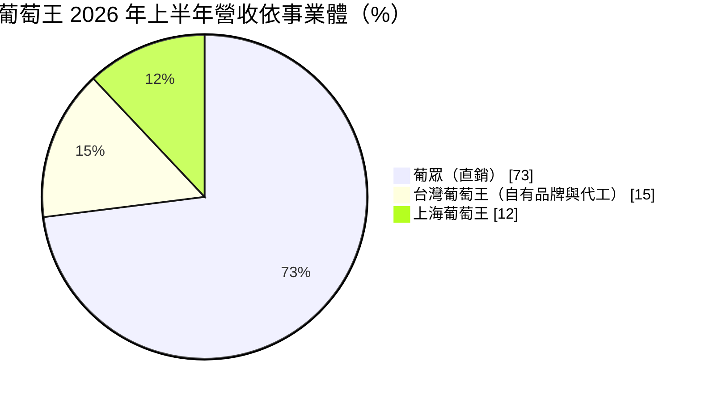
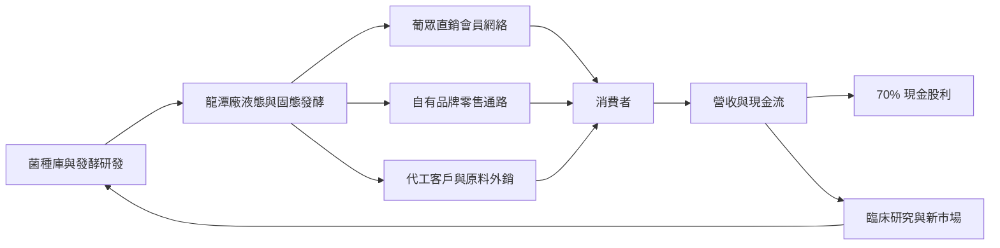
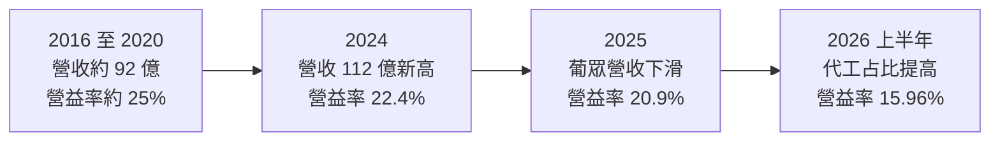
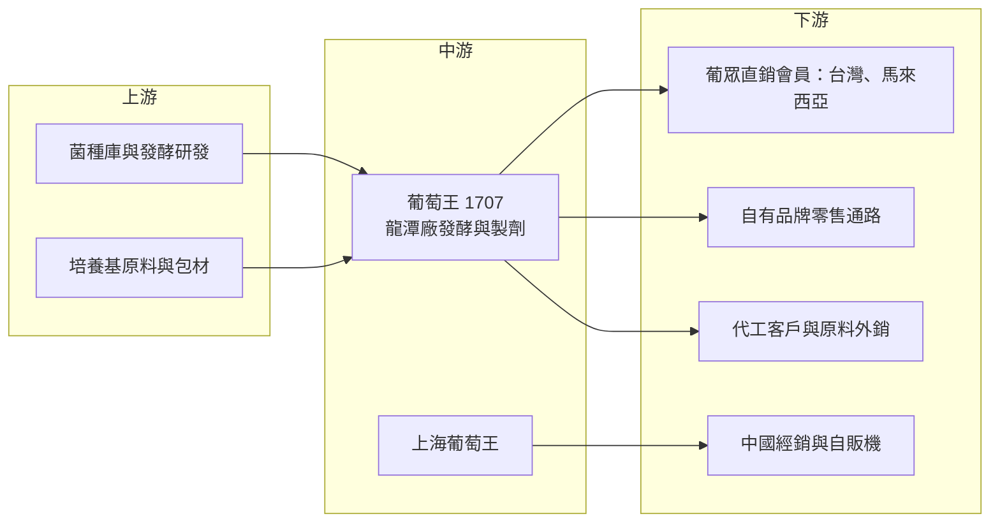

# 1707 葡萄王

> 上市｜[[產業索引-生技醫療業|生技醫療業]]｜上市（櫃）日期 1982/12/20

# 第一章：企業模式與商業藍圖

> [!info] 撰寫說明
> 本文由 Claude 依公開資料整理，架構比照 [[2330台積電]] 的四章研究，資料截至 2026-10-08。財務數字來源：Goodinfo 年度經營績效頁、富果研究 2025 年 8 月與 2026 年 9 月法說會整理、證交所開放資料（基本資料、2026 年第二季資產負債與綜合損益、股利）；產業描述為整理性內容，尚未逐條比對原始文件。#待校對

在評估單一個股的長期投資價值時，首要步驟是拆解企業的底層獲利邏輯。本章針對葡萄王生技（股票代號：1707，以下簡稱葡萄王）的商業模式進行定性分析，說明這家以發酵技術起家的保健食品公司，為什麼能長期維持七成以上的毛利率，以及它高度依賴直銷子公司葡眾的結構，帶來什麼樣的長期機會與風險。

## 一、核心定位：以菌種發酵技術為核心、直銷通路為主力的保健食品集團

葡萄王成立於 1971 年，總部在桃園，董事長兼總經理為曾盛麟，實收資本額約 14.8 億元。公司以微生物發酵技術起家，核心能力是菌種篩選、液態與固態發酵，以及[[菌絲體]]原料的量產，產品涵蓋[[益生菌]]、靈芝、樟芝、蟬花、猴頭菇等保健食品。

葡萄王集團由三個主要事業體組成，彼此分工清楚：

* **葡眾企業（持股 60%）：** 以[[多層次傳銷]]（直銷）模式銷售葡萄王生產的保健食品，是集團最主要的營收與獲利來源。
* **台灣葡萄王（母公司）：** 負責研發與生產，供應葡眾的產品，同時經營自有品牌零售與[[代工]]業務。
* **上海葡萄王（持股 100%）：** 經營中國市場，目前仍處於虧損。

這種「研發製造在母公司、銷售在直銷子公司」的結構，讓葡萄王的財報呈現兩個特徵：一是毛利率極高，因為直銷的售價包含了會員獎金；二是營業費用也很高，因為會員獎金與推廣費用列在費用中。

## 二、事業板塊：葡眾貢獻七成營收與九成獲利

依 2026 年 9 月法說會資料，2026 年上半年的營收結構如下：

* **葡眾：** 營收占比約 73%、淨利占比約 92%，是集團的獲利核心。直銷模式靠會員推薦與口碑銷售，會員忠誠度高、回購穩定，但也受會員人數與活躍度影響。2026 年 8 月葡眾以 UVACO 品牌在馬來西亞吉隆坡正式營運，是首次進軍東南亞，採台馬業績可合併計算的[[全球掛線]]制度。
* **台灣葡萄王：** 營收占比約 15%，包括自有品牌零售與代工。2025 年上半年代工業務年增 60%，自有品牌則年減 11%；2026 年上半年整體營收年增 7%，但自有品牌累計衰退約 8%。代工是近年成長最快的業務，主要替其他品牌生產益生菌與菌絲體保健品。
* **上海葡萄王：** 營收占比約 12%，目前仍虧損。策略包括維持代工、拓展經銷（經銷已占其營收 71%）與布局智能自販機，目標 2027 年損益兩平。

## 三、資本轉化邏輯：發酵原料、直銷獎金與高配息

* **原料自製的毛利優勢：** 葡萄王從菌種到成品一條龍生產，許多菌絲體原料是自有專利菌種，原料成本低，這是毛利率能長期維持在 75% 至 86% 的原因之一。
* **直銷的費用結構：** 直銷的售價包含會員獎金，因此毛利率高，但營業費用率也高。2026 年上半年毛利率 71.45%，營業利益率只有 15.96%（證交所營益分析），代表約 55% 的營收用於獎金、推廣與管理費用。
* **輕資產與高配息：** 保健食品的生產設備投資相對有限，加上直銷會員預付款項帶來的營運資金優勢，葡萄王的現金創造能力強，長期維持約 70% 的現金股利發放率。

## 四、企業長期藍圖

葡萄王的長期策略有三個方向。第一是國際化，以 UVACO 品牌從馬來西亞進軍東協，初期推出 6 項產品，目標兩年內擴增至 30 項，降低對台灣市場的依賴。第二是提高原料與代工的價值，龍潭二期強化後段製程，支持蟬花、猴頭菇等原料外銷，並以製程優化爭取代工訂單。第三是以臨床研究建立科學證據，[[植物新藥]] GKAC（樟芝）已獲美國 FDA 核准第二期人體臨床試驗，針對非酒精性脂肪肝的植物新藥也在推進中；獨家原料的人體臨床數據預計 2027 年第四季後才會有較明顯的營收貢獻。

整體而言，葡萄王是一家「技術與通路兼具、現金流穩定」的公司，但成長動能高度依賴葡眾的會員經營。長期價值取決於直銷模式在台灣能否維持活力，以及海外市場能否成為第二個成長引擎。

# 第二章：護城河深度與競爭優勢

本章針對葡萄王的競爭優勢進行分析，說明它在保健食品市場的護城河從何而來，以及在保健品市場高度競爭的環境下，哪些優勢守得住。

## 一、護城河的核心組成要素

* **菌種與發酵技術：** 葡萄王累積數十年的菌種庫與發酵量產經驗，特別是菌絲體的[[液態發酵]]技術，能以穩定品質大量生產樟芝、蟬花、猴頭菇等原料。菌種的專利與量產技術是新進者難以快速複製的。
* **直銷通路的會員網絡：** 葡眾經營多年，建立了忠誠度高的會員網絡。直銷模式靠人際關係與口碑推廣，會員一旦認同產品，回購率高，競爭者要挖走會員並不容易。
* **科學證據與認證：** 葡萄王持續投入動物與人體試驗，並取得[[健康食品認證]]。在保健品市場資訊混亂的環境中，有臨床數據支持的產品更容易建立信任。
* **一條龍的成本優勢：** 從菌種、發酵、製劑到銷售都在集團內完成，原料成本與品質都能掌握，這讓葡萄王在價格競爭中仍有空間。

## 二、全球主要競爭對手格局

| 競爭對手 | 主要重疊領域 | 與葡萄王的比較 |
|---|---|---|
| 安麗（Amway） | 直銷保健食品 | 全球最大直銷公司之一，品牌與產品線更廣 |
| 如新（Nu Skin）、賀寶芙（Herbalife） | 直銷保健與營養品 | 國際直銷品牌，在台灣與葡眾競爭會員 |
| [[8436大江]] | 保健食品代工與品牌 | 國內代工龍頭，與台灣葡萄王代工業務競爭 |
| [[8279生展]] | 益生菌原料與代工 | 國內益生菌專業廠，原料與代工重疊 |
| 白蘭氏、[[1216統一]] 等食品集團 | 零售保健食品 | 零售通路強大，品牌知名度高 |
| 中國保健品業者 | 中國市場 | 價格競爭激烈，壓縮上海葡萄王獲利 |

## 三、優勢轉化：守得住、守不住與觀察重點

* **守得住：** 葡眾的會員網絡與原料自製的成本優勢。即使營收成長停滯，葡萄王仍維持 15% 以上的營業利益率與高配息，顯示護城河在財報上確實存在。
* **守不住：** 台灣自有品牌與中國市場的價格。零售保健品市場品牌眾多、價格競爭激烈，自有品牌近年持續衰退；中國市場價格戰嚴重，上海葡萄王長期虧損。
* **觀察重點：** 第一，馬來西亞 UVACO 的會員數成長與回購率；第二，葡眾在台灣的會員活躍度能否止穩；第三，GKAC 植物新藥與獨家原料臨床數據能否帶來新的營收來源。

# 第三章：財務體質與盈利規模

資料日期：2026-10-08。數字取自 Goodinfo 年度經營績效頁、富果研究法說會整理與證交所開放資料，表格是撰寫當時的快照；最新月營收、毛利率、累計 EPS 由自動排程寫在本筆記的屬性欄位（月營收、毛利率、累計EPS 等）。#待校對

財務報表是檢驗護城河是否真實存在的最終標準。本章用十年的三率、ROE 與資本報酬，檢視葡萄王高毛利、高配息模式的穩定性。

## 一、獲利能力的基石：三率

| 年度 | 營收（新台幣） | [[毛利率]] | [[營業利益率]] | EPS（元） | [[ROE]] |
|---|---|---|---|---|---|
| 2019 | 92.4 億 | 81.9% | 25.3% | 9.63 | 26.9% |
| 2020 | 91.7 億 | 82.2% | 25.1% | 9.34 | 24.5% |
| 2021 | 98.0 億 | 80.2% | 23.6% | 8.81 | 21.2% |
| 2022 | 104 億 | 81.6% | 24.6% | 9.84 | 20.1% |
| 2023 | 106 億 | 80.2% | 23.5% | 9.81 | 18.8% |
| 2024 | 112 億 | 77.6% | 22.4% | 9.78 | 18.5% |
| 2025 | 103 億 | 75.1% | 20.9% | 8.22 | 15.6% |
| 2026 上半年 | 46.9 億 | 71.45% | 15.96% | 2.75 | 未查得 |

* **[[毛利率]]：** 十年間毛利率從 2016 年的 86.2% 逐步降到 2025 年的 75.1%，2026 年上半年再降到 71.45%。下滑的主因是營收結構改變：毛利較低的代工業務成長，毛利最高的葡眾直銷業務占比下降。這是結構性的變化，而不是產品售價下跌。
* **[[營業利益率]]：** 2016 至 2023 年營業利益率穩定在 23% 至 26% 之間，展現直銷模式的穩定性；2024 年以後逐步下滑，2026 年上半年降到 15.96%，反映葡眾營收下滑時，固定的推廣與管理費用無法同步縮減。
* **營收趨勢：** 2016 年營收 91.9 億元，2024 年達 112 億元高峰，2025 年回落到 103 億元。十年營收年複合成長率約 1.3%（推算），2021 至 2025 年同樣約 1.3%（推算），屬於低成長的成熟事業。公司預估 2026 全年營收年減 5% 至 7%。

## 二、[[ROE]]：資本效率

2021 至 2025 年平均 ROE 約 18.8%（推算），2016 年更高達 37.7%。ROE 呈現長期下滑趨勢，原因有二：一是獲利停滯，EPS 長期停留在 9 至 10 元；二是股東權益持續累積，每股淨值從 2016 年的 35.56 元增加到 2025 年的 69.81 元。即使下滑，ROE 仍明顯高於多數傳統產業公司。2026 年第二季底總負債約 34.0 億元、權益總計約 116.0 億元，負債比約 23%（證交所開放資料），幾乎沒有財務槓桿，ROE 完全來自本業獲利。

## 三、資本支出、自由現金流與股利

保健食品屬於輕資產產業，葡萄王的資本支出主要用於龍潭廠擴建與設備更新，相對營業現金流的比例不高，自由現金流長期為正（推估，具體金額未查得）。公司表示大型資本支出暫緩，待馬來西亞業績更明朗後再評估。股利方面，公司維持約 70% 的現金股利發放率，2025 年下半年盈餘配發每股 3.8 元（證交所股利資料）。高且穩定的配息是葡萄王長期吸引存股族的主因。

## 四、[[ROIC]] 與 [[WACC]]：價值創造利差

**ROIC 推算：** 2025 年營收 103 億元、營業利益率 20.9%，營業利益約 21.5 億元，扣除 20% 稅率後約 17.2 億元。2026 年第二季底權益總計約 116.0 億元，總負債約 34.0 億元，其中多為應付獎金、應付帳款等營運負債，假設有息負債約 5 億元（推估），投入資本約 121 億元，ROIC 約 14.2%（推算）。由於股東權益中包含相當比例的現金與金融資產，若只計算營運實際使用的資本，ROIC 會更高。

**WACC 推算：** 假設台灣 10 年期公債殖利率 1.75%、市場風險溢酬 6%、β 取民生消費股常見值 0.6，股東權益成本約 5.35%。負債成本假設 2.5%，稅後約 2.0%；權益約占 96%、負債約占 4%，WACC 約 5.2%（推算）。

**結論：** 葡萄王的 ROIC 約 14%，比約 5.2% 的資金成本高出約 9 個百分點，長期穩定創造經濟價值，這是直銷通路與發酵技術護城河在財報上的具體呈現。不過，ROIC 的趨勢正在下滑，若葡眾營收持續衰退、代工占比持續提高，利差會逐步縮小。海外市場能否帶來新的高毛利成長，是維持價值創造能力的關鍵。

# 第四章：總體風險與地緣政治

任何企業都無法脫離宏觀環境獨立存在。本章分析葡萄王長期必須面對的市場、通路、營運與法規風險。

## 一、地緣政治與海外市場

* **中國市場：** 上海葡萄王長期虧損，中國經濟復甦緩慢、保健品市場價格競爭激烈，兩岸關係變化也可能影響台資企業在中國的經營。公司目標 2027 年損益兩平，但能否達成仍有不確定性。
* **東南亞擴張：** 馬來西亞是葡眾首次走出台灣，新市場的消費習慣、法規與會員經營方式都與台灣不同，會員忠誠度與回購率仍待觀察。

## 二、產業週期與市場結構

* **直銷模式的成熟：** 台灣直銷市場已相當成熟，會員人口老化、年輕世代對直銷模式的接受度不高，是葡眾長期面臨的結構性挑戰。
* **保健品市場競爭：** 保健食品進入門檻低，電商與網紅品牌大量出現，價格透明度提高，傳統品牌的定價能力受到挑戰。
* **消費景氣：** 保健品屬於可選消費，通膨與經濟壓力會影響消費者的購買意願。2024 年第三季曾因漲價出現囤貨潮，造成隔年同期的高基期壓力，顯示營收也會受短期促銷與價格調整干擾。

## 三、營運環境的隱性風險

* **對單一子公司的依賴：** 葡眾貢獻約九成淨利，且葡萄王只持有 60%，葡眾的營運變化會直接放大到集團獲利，少數股東也分走約四成的葡眾獲利（列為[[非控制權益]]）。
* **直銷法規：** 多層次傳銷受公平交易委員會監理，獎金制度、退貨規定與廣告用語都有嚴格規範，法規變動或違規事件可能影響營運。
* **食品安全：** 保健食品一旦發生食安或品質事件，品牌信任會受到嚴重打擊，直銷模式依賴口碑，影響可能更大。

## 四、科技與法規演進

* **健康食品認證與廣告規範：** 台灣對保健食品的功效宣稱有嚴格限制，只有取得健康食品認證的產品才能宣稱特定保健功效，法規趨嚴會增加研發與認證成本。
* **植物新藥的開發風險：** GKAC 與非酒精性脂肪肝植物新藥都需要經過多期人體臨床試驗，新藥開發的成功率低、時間長，不宜過早計入營收預期。
* **精準營養與菌相研究：** 腸道菌相研究與個人化營養是保健品產業的新趨勢，葡萄王的菌種庫與發酵技術是基礎，但需要持續投入研究才能把技術轉化為產品優勢。

# 專有名詞解析

## 金融

- **[[非控制權益]]**：合併報表中子公司不屬於母公司的那部分股權，其分得的損益不歸母公司股東。
- **[[毛利率]]**：營業毛利占營收的比例，反映產品定價能力與生產成本控制。
- **[[營業利益率]]**：扣除營業費用後的營業利益占營收的比例，衡量本業整體獲利能力。
- **[[ROE]]**：股東權益報酬率，稅後淨利除以股東權益，衡量公司運用股東資金的效率。
- **[[ROIC]]**：投入資本報酬率，稅後營業利益除以股東權益與有息負債的合計，衡量本業對所有資金提供者的報酬。
- **[[WACC]]**：加權平均資金成本，依股東權益與負債的比重加權計算的資金成本，ROIC 高於它才代表創造價值。

## 產業

- **[[益生菌]]**：對人體有益的活性微生物，常見於乳酸菌類保健品，用於調整腸道菌相。
- **[[菌絲體]]**：真菌的營養體部分，可透過液態發酵大量培養，用於製作樟芝、蟬花、猴頭菇等保健原料。
- **[[液態發酵]]**：在發酵槽中以液體培養基培養微生物或菌絲體的技術，品質穩定、適合大量生產。
- **[[多層次傳銷]]**：透過會員推薦與分層獎金制度銷售產品的通路模式，俗稱直銷，受公平交易委員會監理。
- **[[代工]]**：替其他品牌生產產品，由委託品牌負責行銷與銷售，代工廠賺取製造利潤。
- **[[健康食品認證]]**：台灣對保健食品功效的官方認證，取得後才能在廣告中宣稱特定保健功效。
- **[[植物新藥]]**：以植物萃取物為主成分、依新藥規範進行臨床試驗的藥品，開發時間長、成功率不高。
- **[[全球掛線]]**：直銷公司讓會員在不同國家的業績可以合併計算的制度，方便會員跨國經營。

# 核心供應鏈

## 1. 上游：原料與研發
- 自有菌種庫與發酵技術
- 培養基原料（穀物、糖類等）與包裝材料

## 2. 中游：葡萄王本身與子公司
- 台灣葡萄王：研發、生產、自有品牌與代工
- 上海葡萄王：中國市場的生產與經銷

## 3. 下游：通路
- 葡眾企業（持股 60%）：直銷通路，2026 年進軍馬來西亞（UVACO 品牌）
- 藥局、量販與電商等零售通路
- 代工品牌客戶（客戶名稱未公開）

## 4. 同業
- 保健食品代工與原料：[[8436大江]]、[[8279生展]]
- 食品集團：[[1216統一]]
- 國際直銷品牌：安麗、如新、賀寶芙

## 最新新聞
<!-- news:start -->
<!-- news:end -->

## 相關連結
- [公開資訊觀測站](https://mopsov.twse.com.tw/mops/web/t05st03?step=1&firstin=1&co_id=1707)
- [Goodinfo](https://goodinfo.tw/tw/StockDetail.asp?STOCK_ID=1707)
- [Yahoo 股市](https://tw.stock.yahoo.com/quote/1707)
- [鉅亨網新聞](https://www.cnyes.com/twstock/1707/news)
