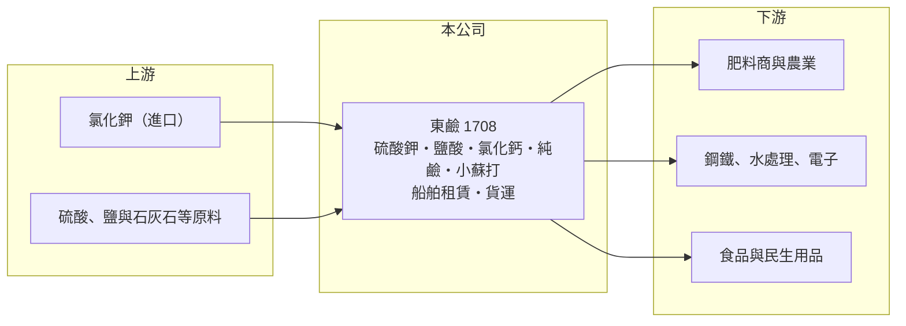

# 1708 東鹼

> 上市｜[[產業索引-化學工業|化學工業]]｜上市（櫃）日期 1986/06/16

# 第一章：企業模式與商業藍圖

> [!info] 撰寫說明
> 精簡版，由 Claude 依公開資料整理，架構比照 [[2330台積電]]，資料截至 2026-10-08。來源：nStock 東鹼公司概況、MoneyDJ 理財網財務比率年表（2021 至 2025 年）、winvest.tw 營收快訊。產品比重與客戶未查得。#待校對

東鹼（東南實業，原東南鹼業）是台灣老牌基礎化學品廠，以硫酸鉀與鹽酸為核心，兼營純鹼、小蘇打、氯化鈣與船舶、貨運服務。

- **核心業務：** 東鹼製造與銷售[[硫酸鉀]]、鹽酸、氯化鈣、純鹼、小蘇打及各項副產品，另經營船舶租賃與汽車貨運。硫酸鉀是不含氯的鉀肥，適合對氯敏感的經濟作物；鹽酸則廣泛用於鋼鐵酸洗、水處理與電子產業清洗，兩者需求來自農業與工業兩個不同的市場。
- **營收結構：** 產品別比重本次未查得。產業上，以氯化鉀和硫酸反應生產硫酸鉀時會同時產出鹽酸，兩項產品的產量相互綁定，因此兩邊的價格都會影響整體獲利（推估，依一般製程）。
- **營運據點：** 公司掛牌約 40 年，資本額約 24.9 億元，生產廠區與海外據點細節本次未查得。
- **長期方向：** 公司更名為東南實業，反映業務已不只是鹼業。航運與物流業務可以支援原料進口與產品配送，也讓公司在化工本業之外有另一個收入來源。

# 第二章：護城河深度與競爭優勢

東鹼的優勢在於產品組合與長年的生產經驗，但產品屬於[[大宗物資]]，價格主要由市場決定。

- **競爭優勢：** 硫酸鉀與鹽酸同時產出，讓東鹼能在兩個市場同時銷售，當其中一項價格疲弱時，另一項可以部分抵銷。鹽酸屬於運輸成本高、危險性高的化學品，在地生產、就近供應的廠商有天然的區域優勢。
- **主要對手：** 硫酸鉀的對手是中國與歐洲的鉀肥廠，以及從鹽湖提煉硫酸鉀的大型生產商；鹽酸與氯化鈣方面，對手是台灣的氯鹼廠如 [[1301台塑]]，以及進口產品；肥料市場則與 [[1722台肥]] 等肥料廠重疊。
- **觀察重點：** 2022 年與 2024 年毛利率超過三成，2023 年降到 14.62%，顯示獲利高度跟著肥料與化學品報價波動。長期要看公司在景氣低點時能否守住獲利，以及航運業務的穩定度。

# 第三章：財務體質與盈利規模

資料日期：2026-10-08，表格是撰寫當時的快照；最新月營收、毛利率、累計 EPS 由自動排程寫在本筆記的屬性欄位（月營收、毛利率、累計EPS 等）。#待校對

東鹼的獲利跟著化學品與肥料景氣大幅起伏，但多數年度能維持不錯的營業利益率。

| 年度 | 營收（億元） | [[毛利率]] | [[營業利益率]] | EPS（元） | [[ROE]] |
|---|---|---|---|---|---|
| 2021 | 約 48（推算） | 32.66% | 16.97% | 2.69 | 11.34% |
| 2022 | 約 80（推算） | 35.49% | 21.79% | 4.84 | 18.30% |
| 2023 | 約 59（推算） | 14.62% | 3.57% | -0.11 | -0.42% |
| 2024 | 約 64（推算） | 33.15% | 18.61% | 3.81 | 13.94% |
| 2025 | 約 62（推算） | 31.87% | 18.21% | 3.28 | 11.19% |

註：2025 年營收以 MoneyDJ 每股營業額 24.72 元乘以股數約 2.49 億股推算，其他年度依營收成長率回推。

- **長期指標：** 2021 至 2025 年營收年複合成長率約 6%（推算），近 5 年平均 ROE 約 10.9%（推算）。近五年平均現金股利約 2.02 元，2025 年度配發 1.6 元，除了景氣低點外配息穩定。
- **[[ROIC]] 與 [[WACC]]：** 2025 年稅後營業利益約 9.0 億元，ROIC 約 9%（推算：營業利益率 18.21% × 營收約 61.6 億元 × 0.8，除以股東權益約 73.9 億元加有息負債以總負債一半推估約 25.6 億元）。WACC 推估約 5.4%（推算：無風險利率 1.75%、市場風險溢酬 6%、β 取基礎化工同業常見值 0.8，股東權益成本 6.55%；稅前負債成本 2.5%、稅率 20%；權益比重約 74%）。除了 2023 年的景氣低點，ROIC 多數年度高於 WACC，代表公司在一個完整循環內能創造價值。
- **財務特色：** 負債比率由 2021 年的 50.25% 降到 2025 年的 40.96%，財務結構逐步改善。

# 第四章：總體風險與地緣政治

東鹼的風險主要來自大宗化學品與肥料的價格循環。

- **產業週期：** 鉀肥價格受全球糧食價格、主要產鉀國出口政策與地緣政治影響，2022 年肥料價格大漲時獲利創高，2023 年價格回落就幾乎打平。這種循環性是投資東鹼時最需要理解的特性。
- **營運風險：** [[原物料]]氯化鉀多仰賴進口，進口價格與海運成本直接影響毛利；鹽酸屬危險化學品，工安事故會造成停工與罰款。
- **其他風險：** 環保與碳排法規趨嚴，化工廠的排放與能源成本會上升；匯率與國際航運運價也會影響原料成本與航運業務收入。

# 專有名詞解析

## 金融

- **[[ROIC]]**：投入資本報酬率，稅後營業利益除以股東權益加有息負債，衡量本業運用資本的效率。
- **[[WACC]]**：加權平均資金成本，股東與債權人要求報酬率的加權平均，是 ROIC 要超越的門檻。

## 產業

- **[[硫酸鉀]]**：不含氯的鉀肥，適合菸草、果樹、茶等對氯敏感的作物，也用於工業用途。
- **[[大宗物資]]**：規格標準化、價格由全球供需決定的原料商品，例如穀物、肥料、基礎化學品。
- **[[原物料]]**：生產所需的基本原料，價格波動會直接影響下游廠商的成本與毛利。

# 核心供應鏈

- 上游：進口氯化鉀、硫酸、鹽與石灰石等原料供應商，國際散裝航運
- 下游／客戶：肥料商與農業用戶，鋼鐵、水處理與電子產業，食品與民生用品廠（客戶名稱未查得）
- 同業：國際鉀肥廠、[[1722台肥]]（肥料）、[[1301台塑]]（氯鹼與鹽酸）

## 最新新聞
<!-- news:start -->
<!-- news:end -->

## 相關連結
- [公開資訊觀測站](https://mopsov.twse.com.tw/mops/web/t05st03?step=1&firstin=1&co_id=1708)
- [Goodinfo](https://goodinfo.tw/tw/StockDetail.asp?STOCK_ID=1708)
- [Yahoo 股市](https://tw.stock.yahoo.com/quote/1708)
- [鉅亨網新聞](https://www.cnyes.com/twstock/1708/news)
