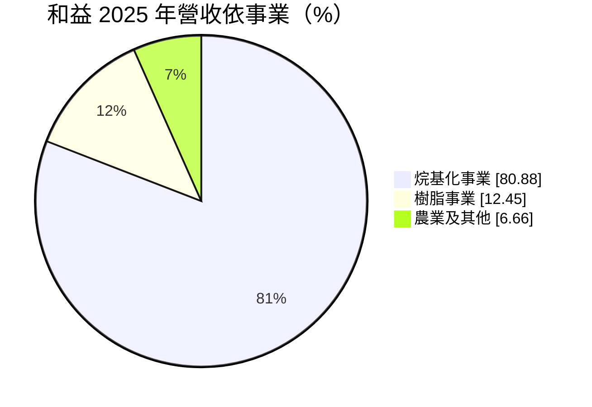
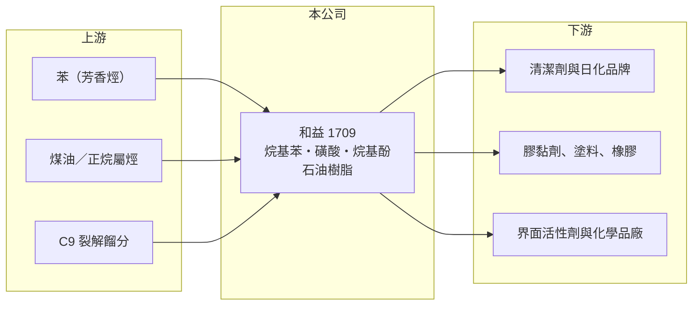

# 1709 和益

> 上市｜[[產業索引-化學工業|化學工業]]｜上市（櫃）日期 1986/07/03

# 第一章：企業模式與商業藍圖

> [!info] 撰寫說明
> 精簡版，由 Claude 依公開資料整理，架構比照 [[2330台積電]]，資料截至 2026-10-08。來源：富果研究 2026 年 7 月和益法說會整理、理財周刊和益報導、nStock 和益公司概況、MoneyDJ 理財網財務比率年表（2021 至 2025 年）。#待校對

和益化學是台灣主要的烷基苯生產商，產品是洗衣粉、洗衣精等清潔劑的關鍵原料，另有石油樹脂與烷基酚等產品。

- **核心業務：** 和益製造[[烷基苯]]（LAB）、烷基苯磺酸、正烯烴、烷基酚（壬酚、辛基酚）及其衍生物，以及 C9 石油樹脂與氫化石油樹脂。烷基苯經磺化後成為[[界面活性劑]]，是合成清潔劑最主要的去污成分，需求跟著民生消費走，相對穩定。
- **營收結構：** 依 2026 年 7 月法說會，2025 年烷基化事業 72.87 億元、占 80.88%，樹脂事業 11.21 億元、占 12.45%，農業及其他 6.01 億元、占 6.66%。銷售地區分散：中國 21.22%、瓜地馬拉 20.89%、台灣 19.18%、菲律賓 6.78%、美國 6.09%、越南 4.33%，其他地區合計 21.51%。
- **營運據點：** 主要生產在台灣；在中國江蘇與長春集團各持股 50% 合資壬酚廠，年產能 4 萬噸，2026 年 7 月試生產。外銷比重約八成，產品以出口為主。
- **長期方向：** 公司推動高值化轉型，烷基酚往高附加價值等級移動、擴充樹脂產能，並研發環保、醫藥與電子領域的化學品，目標 2027 年中至年底商業化。這些方向若成功，可以降低對烷基苯單一產品與油價的依賴。

# 第二章：護城河深度與競爭優勢

和益的優勢在烷基苯的規模與長期外銷客戶網絡，但產品屬於大宗化學品，獲利主要取決於原料與產品的[[價差]]。

- **競爭優勢：** 烷基苯是需求穩定的民生化學品，和益長期出口到中南美、東南亞與中國等多個市場，客戶分散，不依賴單一國家。從上游正烷屬烴到烷基苯、再到磺酸的[[一貫作業]]，讓公司能依市場狀況調整產品組合。
- **主要對手：** 全球烷基苯產能集中在中東、印度、中國與歐洲的石化集團，例如沙烏地與印度的大型石化廠、西班牙 Cepsa 等，規模多大於和益。樹脂方面，對手包括日本與中國的石油樹脂廠。
- **觀察重點：** 2021 至 2025 年毛利率在 12% 至 23% 之間波動，2026 年第二季因油價上漲帶動產品價格，毛利率升到 32.4%。長期要看高值化產品能否讓毛利率的谷底墊高，而不是只隨油價起伏。

# 第三章：財務體質與盈利規模

資料日期：2026-10-08，表格是撰寫當時的快照；最新月營收、毛利率、累計 EPS 由自動排程寫在本筆記的屬性欄位（月營收、毛利率、累計EPS 等）。#待校對

和益在景氣循環中始終維持獲利，沒有虧損年度，但 ROE 隨價差變化在 5% 至 13% 之間。

| 年度 | 營收（億元） | [[毛利率]] | [[營業利益率]] | EPS（元） | [[ROE]] |
|---|---|---|---|---|---|
| 2021 | 約 92（推算） | 23.24% | 13.25% | 1.99 | 11.95% |
| 2022 | 約 106（推算） | 18.43% | 9.73% | 2.27 | 13.15% |
| 2023 | 約 94（推算） | 12.25% | 4.60% | 0.88 | 4.90% |
| 2024 | 約 103（推算） | 14.28% | 6.02% | 1.54 | 8.33% |
| 2025 | 90.09 | 14.89% | 7.01% | 1.23 | 6.32% |

註：2025 年營收取自法說會；其他年度依 MoneyDJ 營收成長率回推。2025 年 EPS 法說會為 1.20 元、MoneyDJ 為 1.23 元，待校對。

- **長期指標：** 2021 至 2025 年營收大致持平（年複合成長率約 -0.5%，推算），近 5 年平均 ROE 約 8.9%（推算）。近五年平均現金股利約 1.18 元，2025 年度配發 1 元，配息穩定。
- **[[ROIC]] 與 [[WACC]]：** 2025 年營業利益 7.13 億元，稅後約 5.7 億元，ROIC 約 5% 至 6%（推算：分母為股東權益約 89.5 億元加有息負債以總負債一半推估約 14 億元）。WACC 推估約 5.9%（推算：無風險利率 1.75%、市場風險溢酬 6%、β 取石化同業常見值 0.8，股東權益成本 6.55%；稅前負債成本 2.5%、稅率 20%；權益比重約 86%）。ROIC 在景氣好的年度（2021、2022）明顯高於 WACC，在一般年度大致與 WACC 相當，代表公司長期勉強創造價值，關鍵在價差的高低。
- **財務特色：** 負債比率由 2022 年的 35.57% 降到 2025 年的 23.99%，財務保守；公司持有轉投資，曾處分部分雲豹能源持股認列約 2.67 億元獲利（年份未查得），業外收益偶爾會放大當年 EPS。

# 第四章：總體風險與地緣政治

和益的風險主要是油價與石化景氣，以及關稅造成的出口變化。

- **產業週期：** 烷基苯的原料來自石油，產品價格與原油價格正相關。油價上漲時產品報價跟漲、庫存有利益，油價下跌時則出現跌價損失，這讓獲利呈現明顯的循環性。
- **營運風險：** 中東、印度與中國持續擴充烷基苯產能，可能壓低全球價差；新的合資廠與高值化產品從試產到量產需要時間，初期可能拖累獲利。
- **其他風險：** 外銷占約八成，匯率影響大；美國關稅曾使 2025 年前三季銷量減少約一成；壬酚屬於受環保法規關注的化學品，部分市場有使用限制。

# 專有名詞解析

## 金融

- **[[ROIC]]**：投入資本報酬率，稅後營業利益除以股東權益加有息負債，衡量本業運用資本的效率。
- **[[WACC]]**：加權平均資金成本，股東與債權人要求報酬率的加權平均，是 ROIC 要超越的門檻。

## 產業

- **[[烷基苯]]**：以苯與正烯烴合成的石化中間體，經磺化後成為清潔劑最主要的界面活性劑原料。
- **[[界面活性劑]]**：一端親水、一端親油的分子，能把油污帶入水中，是洗衣精、洗碗精的主要成分。
- **[[價差]]**：產品售價與原料成本之間的差距，是石化業獲利的核心指標。
- **[[一貫作業]]**：從上游原料到下游成品在同一體系內連續生產，可降低成本並調整產品組合。

# 核心供應鏈

- 上游：苯與煤油等石化原料供應商，例如 [[6505台塑化]]、[[1314中石化]]（產業參考，實際供應商未查得）
- 下游／客戶：中南美、東南亞、中國與台灣的清潔劑與日化品牌，膠黏劑、塗料與橡膠廠
- 同業：中東、印度與中國的烷基苯廠，西班牙 Cepsa，日本與中國的石油樹脂廠

## 最新新聞
<!-- news:start -->
<!-- news:end -->

## 相關連結
- [公開資訊觀測站](https://mopsov.twse.com.tw/mops/web/t05st03?step=1&firstin=1&co_id=1709)
- [Goodinfo](https://goodinfo.tw/tw/StockDetail.asp?STOCK_ID=1709)
- [Yahoo 股市](https://tw.stock.yahoo.com/quote/1709)
- [鉅亨網新聞](https://www.cnyes.com/twstock/1709/news)
