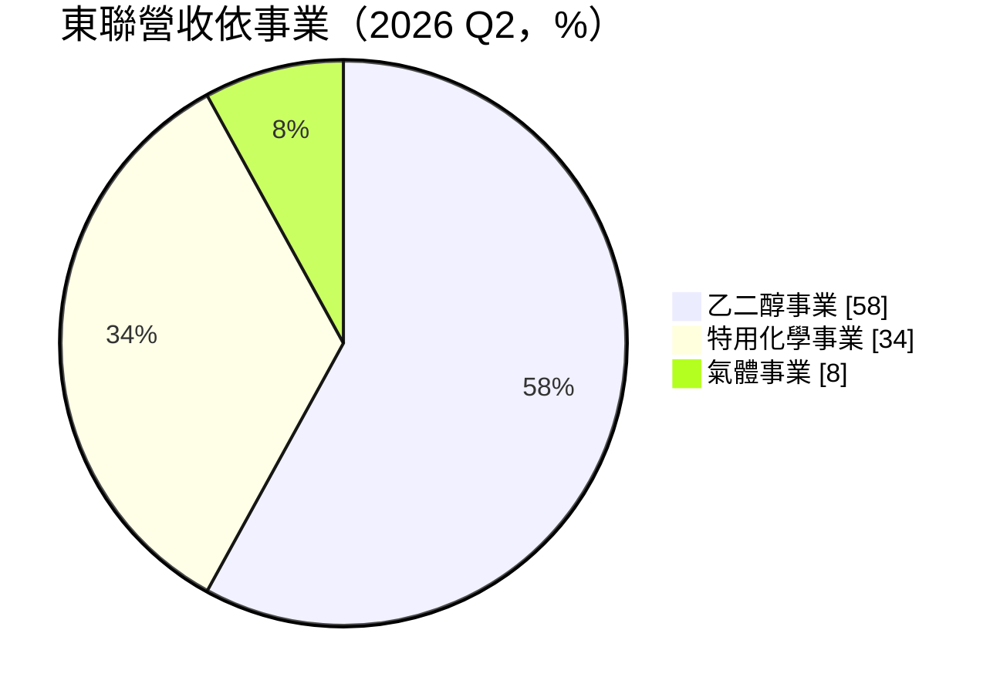
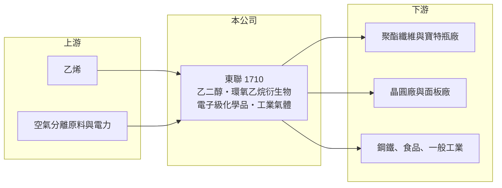

# 1710 東聯

> 上市｜[[產業索引-化學工業|化學工業]]｜上市（櫃）日期 1987/10/21

# 第一章：企業模式與商業藍圖

> [!info] 撰寫說明
> 精簡版，由 Claude 依公開資料整理，架構比照 [[2330台積電]]，資料截至 2026-10-08。來源：富果研究 2026 年 9 月東聯法說會整理、nStock 東聯公司概況、MoneyDJ 理財網財務比率年表（2021 至 2025 年）、聯合新聞網東聯法說報導。#待校對

東聯化學是遠東集團旗下的石化公司，主力產品乙二醇是聚酯纖維與寶特瓶的原料，近年積極把重心轉向[[電子級化學品]]與工業氣體。

- **核心業務：** 東聯生產[[EG]]乙二醇、二乙二醇、環氧乙烷，以及乙醇胺、碳酸乙烯酯、聚乙二醇、醇醚類等特用化學品，另有氧氣、氮氣、液氬與二氧化碳等工業氣體。乙二醇是大宗石化品，價格隨全球供需大幅波動；特用化學品與氣體則是公司用來穩定獲利的部分。
- **營收結構：** 依 2026 年 9 月法說會，乙二醇事業占營收比重由 2025 年第四季的 69% 降到 2026 年第二季的 58%，特用化學事業由 23% 升到 34%，氣體事業約 6% 至 8%。電子級產品中，以乙二醇丁醚（EB）獲利金額最高，乙醇胺次之。
- **營運據點：** 主要生產基地在高雄林園，另有中國揚州廠，兩地乙二醇稼動率在 2026 年分別約九成與滿載。新建的氣體五廠預計 2026 年底至 2027 年初投產，公司估計每年可節省約 4.2 億元電費。
- **長期方向：** 公司目標把高毛利的電子材料與特化品比重提高到 30% 至 40%，2028 年電子化學品營收占比達 10%。先進製程與 [[HBM]] 用的化學品正在推廣，公司預期 2027 年放量；高純度電子級二氧化碳雖只占營收 1% 至 2%，毛利卻是傳統工業氣體的數倍。

# 第二章：護城河深度與競爭優勢

東聯在乙二醇上沒有成本優勢，轉型方向是用電子級化學品與氣體建立較穩定的利基。

- **競爭優勢：** 東聯從環氧乙烷延伸出多種衍生物，能把同一套上游設備的產品轉向附加價值較高的電子級溶劑與胺類。電子級化學品需要通過晶圓廠的長期認證，一旦打入，客戶不會輕易更換，這是它比大宗乙二醇更有護城河的地方。
- **主要對手：** 乙二醇方面，對手是中東以乙烷為原料的低成本大廠、中國的煤制與石油制乙二醇廠，以及台塑集團旗下 [[1303南亞]] 的乙二醇產能。電子級化學品方面，對手是日本與歐美化學大廠以及台灣的電子化學品廠。
- **觀察重點：** 長期要看特化與電子化學品比重能否穩定超過三成，讓公司在乙二醇低迷時也不至於虧損；氣體五廠投產後的電費節省與產能貢獻，是改善成本結構的重要指標。

# 第三章：財務體質與盈利規模

資料日期：2026-10-08，表格是撰寫當時的快照；最新月營收、毛利率、累計 EPS 由自動排程寫在本筆記的屬性欄位（月營收、毛利率、累計EPS 等）。#待校對

東聯在 2022 至 2025 年的乙二醇低迷期毛利率僅個位數，多數年度本業虧損，2026 年第二季營業利益才轉正。

| 年度 | 營收（億元） | [[毛利率]] | [[營業利益率]] | EPS（元） | [[ROE]] |
|---|---|---|---|---|---|
| 2021 | 約 278（推算） | 9.29% | 5.17% | 1.03 | 7.70% |
| 2022 | 約 223（推算） | -0.25% | -5.24% | 0.04 | -5.23% |
| 2023 | 約 210（推算） | 1.62% | -3.27% | 0.30 | -1.56% |
| 2024 | 約 240（推算） | 4.60% | -0.30% | 0.02 | -1.18% |
| 2025 | 約 225（推算） | 0.86% | -4.06% | -1.01 | -9.15% |

註：2025 年營收以 MoneyDJ 每股營業額 25.37 元乘以股數約 8.86 億股推算，其他年度依營收成長率回推。部分年度 EPS 為正而 ROE 為負，可能與非控制權益或計算口徑有關，待校對。

- **長期指標：** 2021 至 2025 年營收年複合成長率約 -5%（推算），近 5 年平均 ROE 約 -1.9%（推算）。近五年平均現金股利約 0.22 元，2025 年度未配息；每股淨值由 2021 年的 14.64 元降到 2025 年的 10.50 元。
- **[[ROIC]] 與 [[WACC]]：** 2025 年稅後營業利益約 -7.3 億元，ROIC 約 -4%（推算：營業利益率 -4.06% × 營收約 225 億元 × 0.8，除以股東權益約 93 億元加有息負債以總負債一半推估約 85 億元）。WACC 推估約 5.0%（推算：無風險利率 1.75%、市場風險溢酬 6%、β 取石化同業常見值 1.0，股東權益成本 7.75%；稅前負債成本 2.5%、稅率 20%；權益比重約 52%）。2022 至 2025 年 ROIC 持續低於 WACC，代表乙二醇低迷期公司在消耗價值，轉型能否成功決定長期報酬。
- **財務特色：** 負債比率由 2021 年的 52.86% 升到 2025 年的 64.58%，在同業中偏高；石化廠資本密集，折舊與利息負擔在景氣低迷時特別沉重。

# 第四章：總體風險與地緣政治

東聯的風險集中在乙二醇的全球供需與高負債。

- **產業週期：** 乙二醇價格受中國聚酯需求、中國新增產能與中東供給影響。2026 年中東戰事造成供給緊縮，中國港口庫存由 108 萬噸降到約 12 萬噸、價格回升，但這類由地緣事件推動的上漲通常不持久。
- **營運風險：** 中國近年大舉擴充乙二醇產能，使台灣廠商長期面臨[[價差]]壓縮；高負債在虧損期會限制公司投資轉型的能力。電子化學品認證時間長，貢獻營收的速度可能慢於預期。
- **其他風險：** 原油與乙烯價格、電價與碳費會影響成本；揚州廠面對中國政策與兩岸關係的不確定性；石化廠也承受環保與工安法規的長期壓力。

# 專有名詞解析

## 半導體

- **[[電子級化學品]]**：純度達到半導體製程要求的化學品，用於晶圓清洗、蝕刻與顯影，雜質要求極低。
- **[[HBM]]**：高頻寬記憶體，把多顆 DRAM 垂直堆疊，提供 AI 晶片大量資料頻寬。

## 金融

- **[[ROIC]]**：投入資本報酬率，稅後營業利益除以股東權益加有息負債，衡量本業運用資本的效率。
- **[[WACC]]**：加權平均資金成本，股東與債權人要求報酬率的加權平均，是 ROIC 要超越的門檻。

## 產業

- **[[EG]]**：乙二醇，以環氧乙烷水合製成，是聚酯纖維與寶特瓶的主要原料之一。
- **[[價差]]**：產品售價與原料成本之間的差距，是石化業獲利的核心指標。

# 核心供應鏈

- 上游：乙烯供應商，例如 [[6505台塑化]]、[[1314中石化]]（產業參考，實際供應商未查得），以及電力
- 下游／客戶：聚酯纖維與寶特瓶廠，例如 [[1402遠東新]]（同集團，供應關係未逐一確認）；晶圓廠與面板廠；鋼鐵、食品與一般工業的氣體用戶
- 同業：[[1303南亞]]、中東與中國乙二醇廠、日本與歐美電子化學品廠

## 最新新聞
<!-- news:start -->
<!-- news:end -->

## 相關連結
- [公開資訊觀測站](https://mopsov.twse.com.tw/mops/web/t05st03?step=1&firstin=1&co_id=1710)
- [Goodinfo](https://goodinfo.tw/tw/StockDetail.asp?STOCK_ID=1710)
- [Yahoo 股市](https://tw.stock.yahoo.com/quote/1710)
- [鉅亨網新聞](https://www.cnyes.com/twstock/1710/news)
