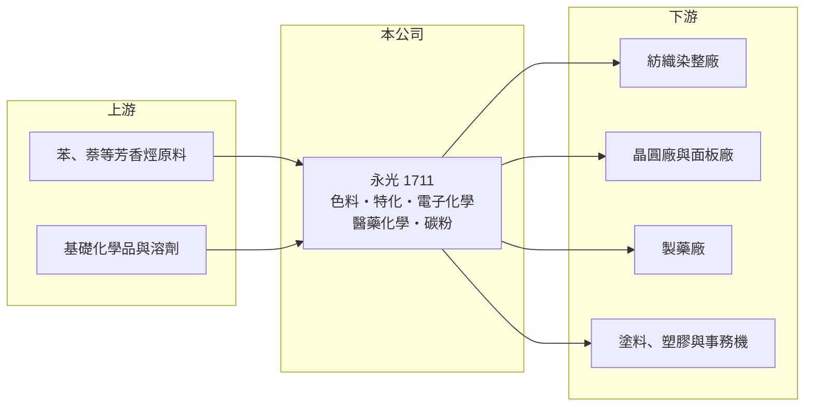

# 1711 永光

> 上市｜[[產業索引-化學工業|化學工業]]｜上市（櫃）日期 1988/12/27

# 第一章：企業模式與商業藍圖

> [!info] 撰寫說明
> 精簡版，由 Claude 依公開資料整理，架構比照 [[2330台積電]]，資料截至 2026-10-08。來源：nStock 永光公司概況、旺得富／中時 2026 年永光營運報導、MoneyDJ 理財網財務比率年表（2021 至 2025 年）。各事業營收比重未查得。#待校對

永光化學是台灣[[染料]]龍頭，以色料起家，逐步發展出特用化學、電子化學與醫藥化學品三條成長線。

- **核心業務：** 永光製造與銷售染料與紡織漂染用化工原料、紫外線吸收劑等精密化學品、醫藥原料與中間體、電子化學品（[[光阻]]劑、溶凝膠），以及雷射印表機與影印機的碳粉和卡匣。這是一家典型[[多角化經營]]的特用化學公司，各事業的客戶與景氣循環不同。
- **營收結構：** 各事業比重本次未查得。依 2026 年初報導，色料化學品、電子化學品與醫藥化學品都有成長；色料是傳統主力，電子與醫藥則是公司長期培養、毛利率較高的事業（推估）。
- **營運據點：** 公司總部與主要工廠在台灣，海外布局細節本次未查得。
- **長期方向：** 永光的長期策略是把資源從紡織染料逐步移到半導體與面板用的[[電子級化學品]]、醫藥原料與中間體，以及塗料、塑膠用的紫外線吸收劑等特化品。這些產品需要較長的客戶認證，一旦打入，訂單比染料穩定。

# 第二章：護城河深度與競爭優勢

永光的優勢在數十年累積的合成化學技術與多元產品線，但染料本業面對中國與印度的價格競爭。

- **競爭優勢：** 染料、紫外線吸收劑、醫藥中間體與光阻劑都是以有機合成為基礎，永光能把同一套合成與純化技術應用到不同市場。電子化學品與醫藥原料需要通過客戶與法規的嚴格認證，認證後轉換成本高，形成較深的護城河。
- **主要對手：** 染料方面，對手是德國德司達、瑞士昂高（Archroma），以及中國浙江龍盛等大型染料廠；電子化學品方面，對手是日本與美國的光阻及化學品大廠，以及台灣的 [[4755三福化]]、[[1717長興]] 等化學公司。
- **觀察重點：** 毛利率長期在 19% 至 24% 之間，但營業利益率只有 0% 至 6%，代表研發與管理費用吃掉大部分毛利。長期要看高毛利事業的比重能否提高，讓營業利益率回到中高個位數。

# 第三章：財務體質與盈利規模

資料日期：2026-10-08，表格是撰寫當時的快照；最新月營收、毛利率、累計 EPS 由自動排程寫在本筆記的屬性欄位（月營收、毛利率、累計EPS 等）。#待校對

永光的毛利率穩定，但營業利益率偏低，近五年獲利能力逐步下滑，2025 年出現小幅虧損。

| 年度 | 營收（億元） | [[毛利率]] | [[營業利益率]] | EPS（元） | [[ROE]] |
|---|---|---|---|---|---|
| 2021 | 約 92（推算） | 24.06% | 6.01% | 0.86 | 5.51% |
| 2022 | 約 89（推算） | 22.44% | 4.28% | 0.68 | 4.38% |
| 2023 | 約 79（推算） | 20.35% | 1.06% | 0.16 | 1.09% |
| 2024 | 約 82（推算） | 21.88% | 2.15% | 0.44 | 2.90% |
| 2025 | 75.69 | 18.97% | -2.59% | -0.21 | -1.58% |

註：2025 年營收取自 nStock；其他年度依 MoneyDJ 營收成長率回推。

- **長期指標：** 2021 至 2025 年營收年複合成長率約 -5%（推算），近 5 年平均 ROE 約 2.5%（推算）。近五年平均現金股利約 0.26 元，2025 年度未配息，配息不穩定。
- **[[ROIC]] 與 [[WACC]]：** 2025 年稅後營業利益約 -1.6 億元，ROIC 約 -1.5%（推算：營業利益率 -2.59% × 營收 75.69 億元 × 0.8，除以股東權益約 81.8 億元加有息負債以總負債一半推估約 21 億元）。即使在較好的 2021 年，ROIC 也只有約 4%（推算）。WACC 推估約 6.1%（推算：無風險利率 1.75%、市場風險溢酬 6%、β 取特化同業常見值 0.9，股東權益成本 7.15%；稅前負債成本 2.5%、稅率 20%；權益比重約 79%）。ROIC 長期低於 WACC，代表目前的事業組合沒有替股東創造足夠報酬，轉型成效是投資的核心。
- **財務特色：** 負債比率約 33% 至 36%，財務穩健；每股淨值約 15 元上下，長年變化不大，顯示公司處於低成長、低報酬的狀態。

# 第四章：總體風險與地緣政治

永光的風險在於染料本業的結構性競爭，以及新事業放量的速度。

- **產業週期：** 染料需求跟著紡織成衣的景氣循環起伏，品牌庫存調整時，染料訂單會明顯減少；電子化學品則跟著半導體與面板的投片量變動。
- **營運風險：** 中國與印度的染料產能龐大，價格競爭使染料毛利難以提高；醫藥原料需要符合各國藥政法規，新產品從開發到銷售時間長。
- **其他風險：** 化工廠面對環保、廢水與碳排法規的長期壓力；石化原料價格與匯率波動會影響成本，外銷產品也受新台幣升值影響。

# 專有名詞解析

## 半導體

- **[[電子級化學品]]**：純度達到半導體製程要求的化學品，用於晶圓清洗、蝕刻與顯影，雜質要求極低。
- **[[光阻]]**：塗在晶圓或面板上、經曝光顯影後形成電路圖形的感光材料。

## 金融

- **[[ROIC]]**：投入資本報酬率，稅後營業利益除以股東權益加有息負債，衡量本業運用資本的效率。
- **[[WACC]]**：加權平均資金成本，股東與債權人要求報酬率的加權平均，是 ROIC 要超越的門檻。

## 產業

- **[[染料]]**：使纖維著色的有機化合物，依纖維種類分為反應性、分散性等不同系列。
- **[[多角化經營]]**：同時經營多個不同市場的事業，可分散單一產業的景氣風險，但也可能分散資源。

# 核心供應鏈

- 上游：苯、萘等芳香烴與基礎化學品供應商，例如 [[1314中石化]]、[[6505台塑化]]（產業參考，實際供應商未查得）
- 下游／客戶：紡織染整廠、晶圓廠與面板廠、製藥廠、塗料與塑膠廠、事務機與碳粉通路（客戶名稱未查得）
- 同業：德司達、昂高、浙江龍盛、[[1717長興]]、[[4755三福化]]

## 最新新聞
<!-- news:start -->
<!-- news:end -->

## 相關連結
- [公開資訊觀測站](https://mopsov.twse.com.tw/mops/web/t05st03?step=1&firstin=1&co_id=1711)
- [Goodinfo](https://goodinfo.tw/tw/StockDetail.asp?STOCK_ID=1711)
- [Yahoo 股市](https://tw.stock.yahoo.com/quote/1711)
- [鉅亨網新聞](https://www.cnyes.com/twstock/1711/news)
