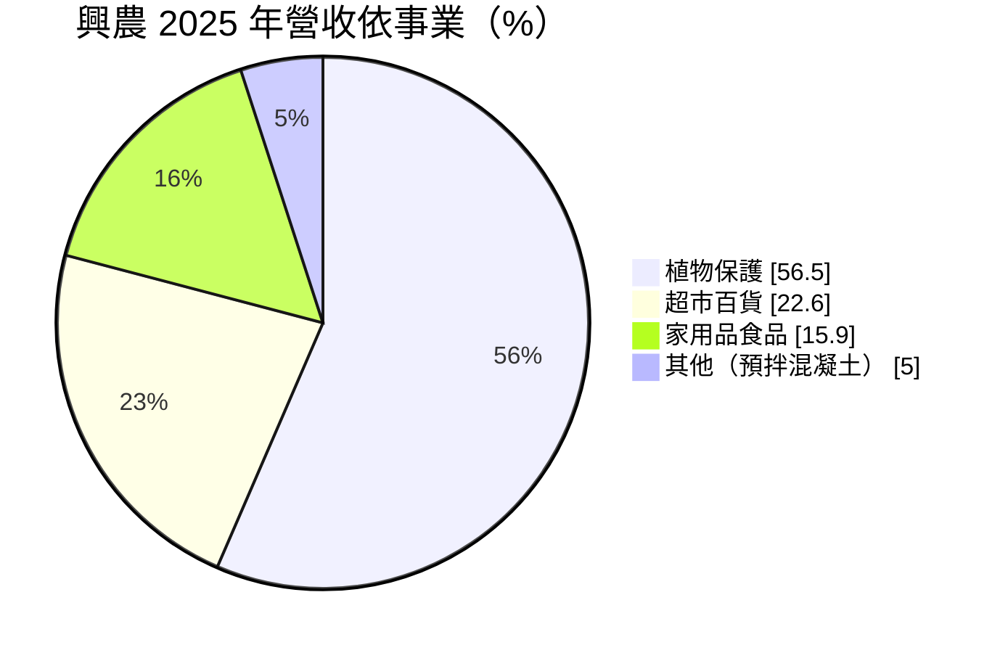
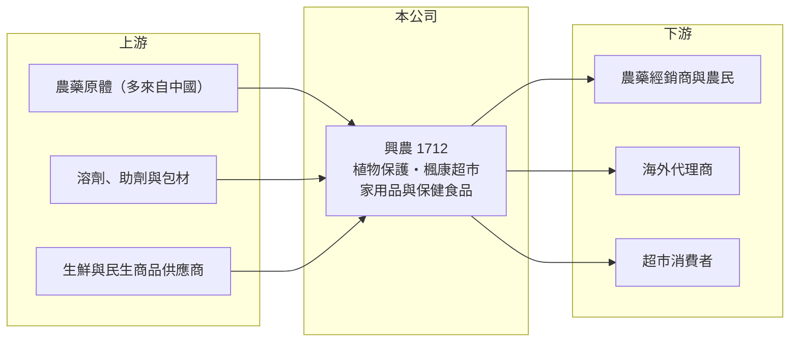

# 1712 興農

> 上市｜[[產業索引-化學工業|化學工業]]｜上市（櫃）日期 1989/12/14

# 第一章：企業模式與商業藍圖

> [!info] 撰寫說明
> 精簡版，由 Claude 依公開資料整理，架構比照 [[2330台積電]]，資料截至 2026-10-08。來源：富果研究 2026 年 3 月興農法說會整理、MoneyDJ 理財網財務比率年表（2021 至 2025 年）、HiStock 嗨投資每股盈餘與營收資料。#待校對

興農是台灣最大的農藥公司之一，以植物保護產品為核心，並經營中部的楓康超市與家用品、保健食品，形成農業加民生消費的組合。

- **核心業務：** 興農的主力是[[植物保護]]產品，也就是殺蟲劑、殺菌劑與除草劑，全球持有約 1,300 張農藥登記證。農藥登記證需要經過各國的毒理、殘留與環境試驗才能取得，數量多代表公司能在多國銷售多種產品，是長期累積的資產。
- **營收結構：** 依 2026 年 3 月法說會，2025 年植物保護占營收 56.5%、超市百貨 22.6%、家用品食品 15.9%、其他（預拌混凝土）5.0%。家用品食品包括玉美生技的保健食品、興家安速的居家殺蟲劑，以及吳羽保鮮膜等。
- **營運據點：** 2025 年營收台灣占 62%，海外占 38%，分布在中國 10%、美洲 10%、歐洲 8%、東北亞 6%。超市事業以楓康超市為主，共有 52 家門市，集中在中台灣。
- **長期方向：** 植物保護事業持續累積海外登記證、拓展中南美與歐洲市場；民生事業則靠楓康超市展店與玉美生技等保健食品成長。兩條線的景氣循環不同，讓公司整體獲利比單純的農藥廠穩定。

# 第二章：護城河深度與競爭優勢

興農的護城河在大量的農藥登記證與在地通路，這些資產需要多年時間與大筆試驗費用才能複製。

- **競爭優勢：** 每一張農藥登記證都需要完整的試驗資料，新進者很難在短時間取得同樣廣的產品組合，這讓興農在學名農藥市場有穩定的進入門檻。楓康超市深耕中台灣、與在地農產品結合，形成區域型的生鮮通路，和全國連鎖量販店有所區隔。
- **主要對手：** 農藥方面，對手是先正達、拜耳、科迪華、巴斯夫等跨國農化集團，以及中國與印度的學名農藥廠；台灣同業有 [[4721美琪瑪]] 等。超市方面，對手是 [[2912統一超]]、全聯、家樂福等連鎖通路。
- **觀察重點：** 2025 年植物保護營收年減約 8%，主因巴西信貸緊縮使農民購買力下降。長期要看海外市場能否分散單一國家的風險，以及超市與保健食品的成長能否持續抵銷農藥的波動。

# 第三章：財務體質與盈利規模

資料日期：2026-10-08，表格是撰寫當時的快照；最新月營收、毛利率、累計 EPS 由自動排程寫在本筆記的屬性欄位（月營收、毛利率、累計EPS 等）。#待校對

興農的毛利率穩定在三成上下，ROE 長期維持在一成以上，是獲利穩定度相當高的公司。

| 年度 | 營收（億元） | [[毛利率]] | [[營業利益率]] | EPS（元） | [[ROE]] |
|---|---|---|---|---|---|
| 2021 | 約 186（推算） | 27.97% | 6.14% | 2.19 | 12.72% |
| 2022 | 約 230 | 28.19% | 8.83% | 3.92 | 20.49% |
| 2023 | 約 191 | 27.20% | 6.96% | 2.50 | 12.28% |
| 2024 | 約 189 | 29.41% | 6.82% | 2.50 | 12.35% |
| 2025 | 186.1 | 30.49% | 6.96% | 2.60 | 12.81% |

註：2022 至 2025 年營收取自法說會與 HiStock 年度累計營收；2021 年依 MoneyDJ 營收成長率回推。

- **長期指標：** 2021 至 2025 年營收大致持平（年複合成長率約 0%，推算），近 5 年平均 ROE 約 14.1%（推算）。2025 年現金股利 2.5 元，配發率 96.2%，配息穩定且高。2018 至 2025 年 EPS 從 1.60 元穩定提升到 2.60 元，沒有虧損年度。
- **[[ROIC]] 與 [[WACC]]：** 2025 年稅後營業利益約 10.4 億元，ROIC 約 8.7%（推算：營業利益率 6.96% × 營收 186.1 億元 × 0.8，除以股東權益約 85.6 億元加有息負債以總負債一半推估約 33.5 億元）。WACC 推估約 4.4%（推算：無風險利率 1.75%、市場風險溢酬 6%、β 取民生與農化防禦型同業常見值 0.6，股東權益成本 5.35%；稅前負債成本 2.5%、稅率 20%；權益比重約 72%）。ROIC 長期高於 WACC，代表公司穩定創造價值，只是營收成長有限，價值創造主要以高配息的方式回饋股東。
- **財務特色：** 負債比率由 2021 年的 53.12% 降到 2025 年的 43.86%；超市事業屬於現金收款、營運資金需求低的生意，可以補充農藥事業的應收帳款壓力。

# 第四章：總體風險與地緣政治

興農的風險主要來自全球農業景氣與海外市場的信用狀況。

- **產業週期：** 農藥需求跟著農產品價格、天候與農民收入起伏，2022 年全球糧價高漲時獲利創高，之後回到正常水準。農藥原料多來自中國，原料價格的循環也會影響毛利。
- **營運風險：** 海外市場如巴西信用條件緊縮時，農藥商可能延長收款或減少進貨；超市業務面對連鎖通路競爭與人力、租金成本上升。
- **其他風險：** 各國農藥法規趨嚴，部分有效成分可能被禁用，需要持續投入登記與替代產品開發；匯率與中國原料供應也是需要留意的變數。

# 專有名詞解析

## 金融

- **[[ROIC]]**：投入資本報酬率，稅後營業利益除以股東權益加有息負債，衡量本業運用資本的效率。
- **[[WACC]]**：加權平均資金成本，股東與債權人要求報酬率的加權平均，是 ROIC 要超越的門檻。

## 產業

- **[[植物保護]]**：以殺蟲劑、殺菌劑、除草劑等農藥保護作物免於病蟲害與雜草的產業。
- **[[農藥登記證]]**：農藥在各國上市銷售前必須取得的許可，需提交毒理、殘留與環境試驗資料。
- **[[學名藥]]**：專利到期後由其他廠商生產的同成分產品，農藥與西藥都有這種模式。
- **[[預拌混凝土]]**：在工廠依配比拌好、以攪拌車運到工地使用的混凝土。

# 核心供應鏈

- 上游：農藥原體供應商（多在中國），溶劑、助劑與包材廠，生鮮與民生商品供應商
- 下游／客戶：台灣農藥經銷商與農民，中國、美洲、歐洲與東北亞的代理商，楓康超市消費者
- 同業：先正達、拜耳、科迪華、巴斯夫、[[4721美琪瑪]]，超市方面有全聯、[[2912統一超]]

## 最新新聞
<!-- news:start -->
<!-- news:end -->

## 相關連結
- [公開資訊觀測站](https://mopsov.twse.com.tw/mops/web/t05st03?step=1&firstin=1&co_id=1712)
- [Goodinfo](https://goodinfo.tw/tw/StockDetail.asp?STOCK_ID=1712)
- [Yahoo 股市](https://tw.stock.yahoo.com/quote/1712)
- [鉅亨網新聞](https://www.cnyes.com/twstock/1712/news)
