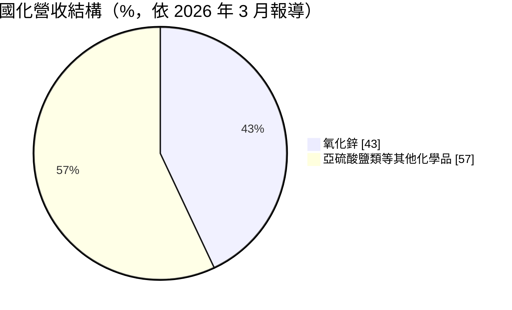
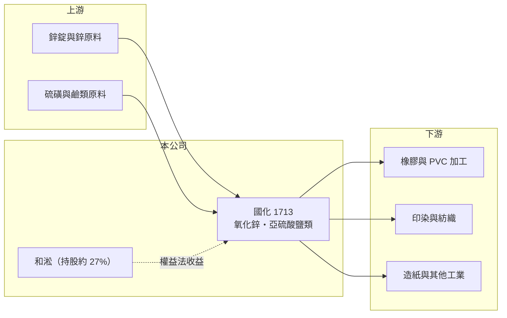

# 1713 國化

> 上市｜[[產業索引-化學工業|化學工業]]｜上市（櫃）日期 1990/01/31

# 第一章：企業模式與商業藍圖

> [!info] 撰寫說明
> 精簡版，由 Claude 依公開資料整理，架構比照 [[2330台積電]]，資料截至 2026-10-08。來源：旺得富（中時）2026 年 3 月年報新聞、Goodinfo 年度經營績效、poorstock 公司資料、winvest 營收快訊（搜尋結果標題）。公開資料有限，產品細項與客戶名單未查得。#待校對

國化是一家營收規模不大的老牌無機化學品廠，本業以氧化鋅與亞硫酸鹽類化學品為主，但近年的獲利主要來自轉投資與資產處分，閱讀時要把「本業」和「業外」分開看。

- **核心業務：** 國化生產鍛燒與輕質[[氧化鋅]]，以及亞硫酸氫鈉、偏亞硫酸鈉、甲醛次硫酸氫鈉等亞硫酸鹽類化學品。這些都是印染、紡織、橡膠、PVC 與造紙等傳統產業會用到的添加劑或還原劑，屬於量小、品項多、技術成熟的基礎化學品。
- **營收結構：** 依 2026 年 3 月媒體報導，氧化鋅約占營收 43%，其餘為亞硫酸鹽類等化學品。由於客戶集中在傳統製造業，營收隨台灣紡織、橡膠產業的景氣與外移程度起伏，長期缺乏成長動能。

- **營運據點與資產：** 公司總部在台北，營業登記為基本化學工業與化學原料批發。國化持有不少早年取得的土地，近年陸續處分閒置資產，2026 年報導指出已售出兩處，另有約 3,972 平方公尺的兩筆土地待股東會同意後處分。
- **長期方向：** 國化持有關係企業和淞約 27% 股權，並表示未來會維持 20% 以上，以[[權益法]]認列投資收益。換句話說，公司長期價值較依賴轉投資與土地資產，而不是氧化鋅本業的擴張。

# 第二章：護城河深度與競爭優勢

國化本業的護城河很淺，真正的支撐來自轉投資股權與帳面低估的土地，屬於典型的資產型小型股。

- **競爭優勢：** 國化在台灣經營氧化鋅與亞硫酸鹽類化學品多年，對在地印染、橡膠客戶有長期供貨關係與配方經驗。不過這類產品規格標準化，客戶轉換成本不高，優勢主要是交期與服務，而非技術門檻。
- **主要對手：** 氧化鋅與亞硫酸鹽類在國際上有大量中國與東南亞供應商，價格競爭激烈；國內則與其他基礎化學品廠在部分品項重疊，具體廠商本次未查到。進口品價格下跌時，國化很難維持售價。
- **觀察重點：** 長期要看三件事：本業能否回到損益兩平、和淞的獲利與配息能力，以及剩餘土地處分的金額與用途。如果處分所得用於發放現金或投入新事業，對股東價值的影響會比本業更大。

# 第三章：財務體質與盈利規模

資料日期：2026-10-08，表格是撰寫當時的快照；最新月營收、毛利率、累計 EPS 由自動排程寫在本筆記的屬性欄位（月營收、毛利率、累計EPS 等）。#待校對

國化最近五年營收在 4.6 億至 6.3 億元之間，本業從 2022 年起轉為營業虧損，EPS 卻逐年走高，差距全部來自業外收益。

| 年度 | 營收（億元） | [[毛利率]] | [[營業利益率]] | EPS（元） | [[ROE]] |
|---|---|---|---|---|---|
| 2021 | 6.25 | 14.0% | 4.16% | 1.04 | 6.61% |
| 2022 | 5.71 | 11.1% | -1.21% | 1.89 | 11.4% |
| 2023 | 4.76 | 7.99% | -7.77% | 2.32 | 12.9% |
| 2024 | 5.28 | 12.1% | -18.8% | 10.31 | 43.3% |
| 2025 | 4.60 | 4.53% | -17.2% | 3.87 | 14.3% |

- **營收與本業獲利：** 2020 至 2025 年營收由 4.76 億元變為 4.60 億元，年複合成長率約 -0.7%（推算），本業沒有成長。毛利率從十餘％一路下滑到 2025 年的 4.53%，營業虧損擴大到約 0.79 億元，代表售價與成本的壓力已經超過規模能承受的範圍。
- **業外與股利：** 2024 年業外損益約 16.5 億元，使 EPS 跳到 10.31 元；2025 年稅後純益 5.84 億元、EPS 3.87 元，同樣靠轉投資收益支撐。2025 年度配發現金股利 3.1 元，配發率 80.1%，股利高低取決於業外收益而非本業現金流。近 5 年平均 ROE 約 17.7%（推算），但扣除業外後本業 ROE 為負，這個平均值不具代表性。
- **[[ROIC]] 與 [[WACC]]：** 以本業計算，2025 年營業利益約 -0.79 億元，稅後營業利益為負，ROIC 為負值（推算）。WACC 以 CAPM 推估：無風險利率 1.75%、市場風險溢酬 6%、β 假設 0.6（傳統化學小型股常見值），股權成本約 5.4%；公司負債不高，WACC 約 5% 至 5.5%（推算）。本業 ROIC 長期低於 WACC，代表化學品本業在消耗價值，公司整體價值主要由和淞股權與土地撐起。

# 第四章：總體風險與地緣政治

國化的風險不在景氣大起大落，而在本業持續萎縮與獲利過度依賴單一轉投資。

- **產業週期：** 氧化鋅與亞硫酸鹽類的需求跟著紡織、橡膠、造紙等傳統產業走，台灣這些產業長期外移，國內需求逐步縮小。鋅價等原料價格上漲時，小廠的轉嫁能力有限，毛利率容易被壓縮。
- **營運風險：** 營收僅約 5 億元，固定成本攤提壓力大，營業虧損若持續，最終可能需要縮減產線或轉型。土地處分屬一次性收益，賣完之後無法重複貢獻獲利。
- **其他風險：** 獲利高度依賴和淞，和淞的景氣或股利政策改變，會直接影響國化的 EPS 與配息。另外環保法規對化學品製程的要求持續提高，小型化學廠的合規成本占營收比重相對較大。

# 專有名詞解析

## 金融

- **[[權益法]]**：持股 20% 至 50% 等具重大影響力的轉投資，按持股比例把被投資公司損益認列為本公司投資收益。
- **[[業外收益]]**：本業以外的收入，例如轉投資收益、處分資產利益、利息與股利收入，通常較不穩定。
- **[[資產股]]**：帳上持有大量土地或轉投資、市值主要由資產價值而非本業獲利支撐的股票。
- **[[ROIC]]**：投入資本報酬率，稅後營業利益除以股東權益加有息負債，衡量本業運用資本的效率。
- **[[WACC]]**：加權平均資金成本，股權成本與稅後負債成本依資本結構加權，是 ROIC 要超越的門檻。

## 產業

- **[[氧化鋅]]**：白色無機粉末，用於橡膠硫化促進、陶瓷、塗料、飼料與醫藥，是國化營收占比最高的產品。

# 核心供應鏈

- 上游：鋅錠等金屬原料、硫磺與鹼類化學原料供應商（推估，名稱未查得）
- 下游／客戶：橡膠、PVC、印染、紡織與造紙業者，客戶名稱未揭露
- 同業：國內基礎化學品廠如 [[1708東鹼]]，以及中國與東南亞的氧化鋅供應商

## 最新新聞
<!-- news:start -->
<!-- news:end -->

## 相關連結
- [公開資訊觀測站](https://mopsov.twse.com.tw/mops/web/t05st03?step=1&firstin=1&co_id=1713)
- [Goodinfo](https://goodinfo.tw/tw/StockDetail.asp?STOCK_ID=1713)
- [Yahoo 股市](https://tw.stock.yahoo.com/quote/1713)
- [鉅亨網新聞](https://www.cnyes.com/twstock/1713/news)
