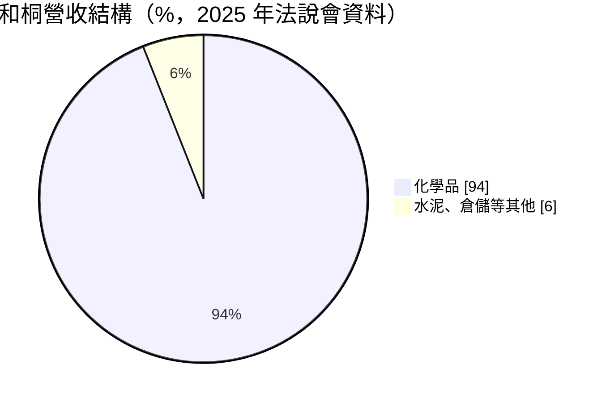
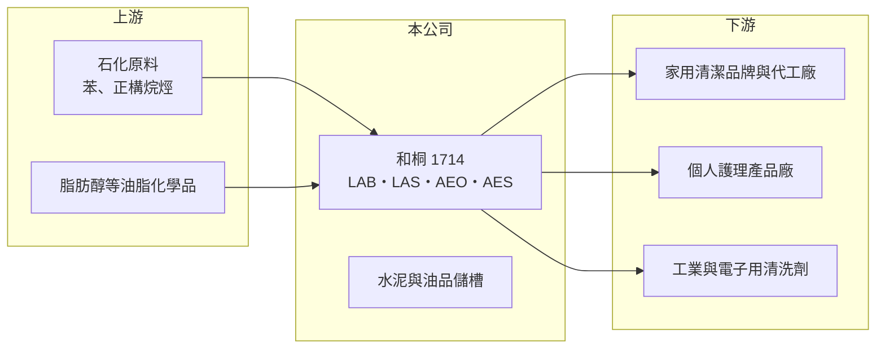

# 1714 和桐

> 上市｜[[產業索引-化學工業|化學工業]]｜上市（櫃）日期 1991/08/30

# 第一章：企業模式與商業藍圖

> [!info] 撰寫說明
> 精簡版，由 Claude 依公開資料整理，架構比照 [[2330台積電]]，資料截至 2026-10-08。來源：富果研究 2026 年 3 月和桐法說會整理、Goodinfo 年度經營績效、nStock 公司資料、winvest 營收快訊（搜尋結果標題）。#待校對

和桐是台灣少數以「清潔劑原料」為主業的化工公司，生產重心在中國大陸，另有水泥與油品儲槽等多角化事業。

- **核心業務：** 和桐生產直鏈烷基苯（[[LAB]]）、烷基苯磺酸（LAS）、醇醚（AEO）與醇醚磺酸鹽（AES）等[[界面活性劑]]原料。這些是洗衣精、洗碗精、洗髮精與沐浴乳的主要去污成分，和桐不直接賣給消費者，而是賣給日化品牌與代工廠。
- **營收結構：** 依 2026 年 3 月法說會整理，化學品占總營收 94%，水泥與倉儲等其他事業約占 6%；從地區看，中國大陸占營收 73%。這代表和桐雖然是台灣上市公司，營運景氣主要取決於中國的日化消費與化工價格。

- **營運據點：** 中國大陸的磺化與界面活性劑工廠分布在南京、安徽、天津、四川、廣州與惠州；台灣有高雄化工廠，彰化經營水泥製造銷售，台中港與天津另有油品儲槽業務。法說會資料指出，和桐在中國的磺化產能約 76 萬噸，屬市場前三大。
- **長期方向：** 公司採保守穩健策略，以化學品、水泥、倉儲三條事業線分散風險，沒有給出具體財務目標。法說會引用的產業研究估計，全球界面活性劑市場 2025 至 2034 年年複合成長率約 4.9%，屬於與民生消費同步的穩定成長市場。

# 第二章：護城河深度與競爭優勢

和桐的優勢在於中國多點布局形成的規模與物流網，但產品同質性高，議價力有限。

- **競爭優勢：** 磺化產品屬於「重量重、單價低」的化學品，運費占成本比重高，因此靠近客戶設廠是關鍵。和桐在中國華東、華北、西南與華南都有工廠，可就近供應各地日化廠，這種分散的產能網絡需要多年累積，新進者不易複製。
- **主要對手：** 中國本土的界面活性劑大廠，以及跨國化工公司在中國的工廠，都是直接競爭者；LAB 上游則有中東與亞洲的石化廠。台灣上市同業中，[[1717長興]]、[[1718中纖]]、[[1722台肥]] 被歸在同一化學類股，但產品重疊有限。
- **觀察重點：** 長期要看中國日化需求的成長、磺化產品的[[價差]]，以及非化學品事業（水泥、儲槽）能否提供穩定現金流。2025 年三率同步改善，可作為觀察價差回升能否延續的基準。

# 第三章：財務體質與盈利規模

資料日期：2026-10-08，表格是撰寫當時的快照；最新月營收、毛利率、累計 EPS 由自動排程寫在本筆記的屬性欄位（月營收、毛利率、累計EPS 等）。#待校對

和桐營收規模約 200 億至 260 億元，但毛利率長期只有一成左右，屬於「高營收、薄利」的化學品加工模式。

| 年度 | 營收（億元） | [[毛利率]] | [[營業利益率]] | EPS（元） | [[ROE]] |
|---|---|---|---|---|---|
| 2021 | 202 | 15.3% | 8.82% | 0.72 | 8.85% |
| 2022 | 226 | 9.10% | 3.52% | 0.37 | 3.94% |
| 2023 | 203 | 9.44% | 3.79% | 0.60 | 5.40% |
| 2024 | 206 | 9.31% | 4.41% | 0.41 | 4.32% |
| 2025 | 240 | 10.4% | 5.23% | 0.50 | 7.02% |

- **長期趨勢：** 2020 年營收 258 億元、2025 年 240 億元，年複合成長率約 -1.4%（推算），營收大致在原料價格帶動下起伏。2020 年毛利率曾達 23.2%、EPS 1.68 元，是疫情期間清潔用品需求暴增的特殊年份；其他年份毛利率多在 9% 至 10% 左右。近 5 年平均 ROE 約 5.9%（推算），偏低。
- **獲利結構：** 2025 年營業利益約 13 億元，但歸屬母公司稅後淨利只有 4.9 億元，差距來自中國子公司的所得稅與非控制權益。投資人看合併營業利益時，要記得只有一部分歸屬台灣母公司股東。財務體質穩健，2025 年流動比率 324%、速動比率 251%。
- **[[ROIC]] 與 [[WACC]]：** 2025 年營業利益約 12.55 億元（240 億 × 5.23%），扣 20% 稅後約 10 億元；以歸屬母公司權益約 123 億元（每股淨值 12.42 元 × 約 9.92 億股）估算，ROIC 上限約 8%，有息負債未查得，納入後實際 ROIC 約 6% 至 8%（推算）。WACC 以 CAPM 推估：無風險利率 1.75%、市場風險溢酬 6%、β 假設 0.9（化學類股常見值），股權成本約 7.2%；稅後負債成本約 2%，負債占比假設 20%，WACC 約 6%（推算）。ROIC 與 WACC 大致打平，代表和桐在一般年份只是勉強賺回資金成本，只有像 2020 年那樣價差擴大時才明顯創造價值。

# 第四章：總體風險與地緣政治

和桐的風險集中在中國市場與化工原料價格，本業利潤薄，對外部變數的敏感度高。

- **產業週期：** LAB 原料來自石化產品，價格隨原油與苯類波動；界面活性劑售價調整往往落後原料，價差在原料急漲時被壓縮。中國化工產能持續擴充，供過於求時磺化產品的加工費很難提高。
- **營運風險：** 中國營收占七成以上，中國內需、環保督察、限電政策與地方產業政策都會直接影響工廠運作。毛利率只有一成左右，原料或匯率小幅變動就可能讓獲利大幅波動，這是薄利模式的[[營運槓桿]]。
- **其他風險：** 兩岸關係與人民幣匯率會影響中國子公司獲利換算回新台幣的金額。水泥事業則受台灣營建景氣與碳費政策影響，屬於高排碳產業。

# 專有名詞解析

## 金融

- **[[營運槓桿]]**：固定成本占比高時，營收小幅變動就會讓獲利大幅增減；營收萎縮時虧損也會被放大。
- **[[ROIC]]**：投入資本報酬率，稅後營業利益除以股東權益加有息負債，衡量本業運用資本的效率。
- **[[WACC]]**：加權平均資金成本，股權成本與稅後負債成本依資本結構加權，是 ROIC 要超越的門檻。

## 產業

- **[[界面活性劑]]**：同時具有親水與親油結構、能降低表面張力的化學品，是清潔劑、洗髮精與工業清洗劑的主要去污成分。
- **[[LAB]]**：直鏈烷基苯，以石化原料合成，經磺化後成為烷基苯磺酸（LAS），是洗衣粉與洗衣精最常用的界面活性劑原料。
- **[[價差]]**：產品售價與主要原料成本之間的差額，化學品加工廠的獲利主要取決於價差而非售價本身。

# 核心供應鏈

- 上游：苯、正構烷烴等石化原料與脂肪醇供應商（推估，名稱未查得）
- 下游／客戶：中國與台灣的家用清潔、個人護理品牌與代工廠，以及工業清洗劑客戶，名稱未揭露
- 同業：中國本土界面活性劑大廠與跨國化工公司；台灣化學類股 [[1717長興]]、[[1718中纖]]、[[1722台肥]]

## 最新新聞
<!-- news:start -->
<!-- news:end -->

## 相關連結
- [公開資訊觀測站](https://mopsov.twse.com.tw/mops/web/t05st03?step=1&firstin=1&co_id=1714)
- [Goodinfo](https://goodinfo.tw/tw/StockDetail.asp?STOCK_ID=1714)
- [Yahoo 股市](https://tw.stock.yahoo.com/quote/1714)
- [鉅亨網新聞](https://www.cnyes.com/twstock/1714/news)
