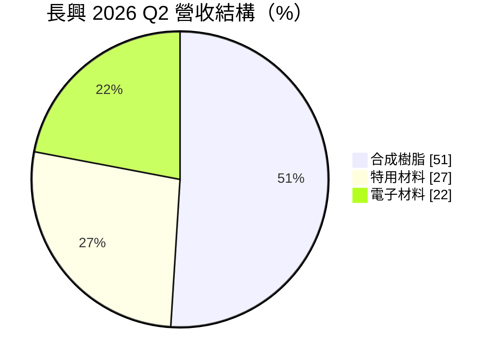
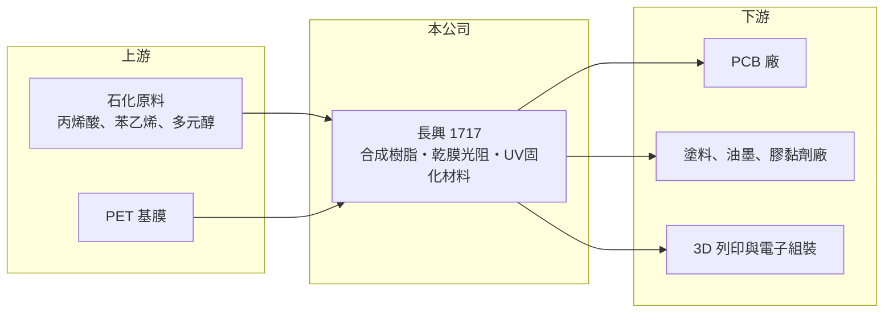

# 1717 長興

> 上市｜[[產業索引-化學工業|化學工業]]｜上市（櫃）日期 1994/03/31

# 第一章：企業模式與商業藍圖

> [!info] 撰寫說明
> 精簡版，由 Claude 依公開資料整理，架構比照 [[2330台積電]]，資料截至 2026-10-08。來源：富果研究 2026 年 8 月長興法說會整理、Goodinfo 年度經營績效、nStock 公司資料（搜尋結果）。#待校對

長興材料是台灣規模最大的特用化學品公司之一，從塗料用樹脂起家，再延伸到印刷電路板用的乾膜光阻與 UV 固化材料，三大事業各自服務不同的終端市場。

- **核心業務：** 長興的產品分三大類。合成樹脂用於塗料、膠黏劑與複合材料；電子材料以[[乾膜光阻]]為主，是 [[PCB]] 製作線路時的關鍵耗材；特用材料以 [[UV固化]] 材料為核心，公司自稱是全球三大供應商之一。
- **營收結構：** 依 2026 年第二季法說會資料，合成樹脂占 51%、特用材料占 27%、電子材料占 22%。樹脂事業量大但毛利較低，電子與特用材料規模較小但技術門檻較高，是拉高整體毛利率的主力。

- **營運據點：** 台灣有路竹廠（擴產中），中國有蘇州、珠海廠並新設湖北廠，泰國新建分條廠，另在美國、馬來西亞、印度設有子公司。乾膜光阻的分條加工靠近 PCB 廠設點，泰國布局即是跟隨 PCB 產業往東南亞移動。
- **長期方向：** 公司規劃把特用材料產能從約 11 萬噸擴充到 13.5 萬至 14 萬噸，重點應用放在消費電子、新能源車與 [[3D列印]]。UV 固化不需溶劑、耗能低，在環保法規趨嚴下有長期替代傳統溶劑型材料的空間。

# 第二章：護城河深度與競爭優勢

長興的護城河來自配方技術、客戶認證與全球化學品產能布局，屬於中等寬度的護城河。

- **競爭優勢：** 乾膜光阻要通過 PCB 廠的製程驗證，一旦導入，客戶因良率風險不願輕易更換供應商，形成轉換成本。UV 固化材料品項多、配方客製化程度高，長興累積數十年的配方資料庫與全球產能，是後進者難以短期追上的優勢。
- **主要對手：** 乾膜光阻的國際對手主要是日本與韓國廠商，例如旭化成、日立化成系統的材料廠；UV 固化材料則有歐美大型特化公司與中國新興廠商。合成樹脂市場則與台灣、中國的眾多塗料樹脂廠競爭，價格敏感度高。
- **觀察重點：** 長期看三點：一是特用材料擴產後的利用率與毛利率；二是乾膜光阻能否跟著 AI 伺服器與高階 PCB 的成長擴大份額；三是合成樹脂在中國價格競爭下能否維持獲利。2026 年上半年毛利率約 24%，高於 2025 年同期約 20%，可作為產品組合改善的觀察起點。

# 第三章：財務體質與盈利規模

資料日期：2026-10-08，表格是撰寫當時的快照；最新月營收、毛利率、累計 EPS 由自動排程寫在本筆記的屬性欄位（月營收、毛利率、累計EPS 等）。#待校對

長興年營收約 400 億至 500 億元，毛利率穩定在 20% 上下，但營業利益率在 2023 年後降到 4% 至 5%，獲利效率明顯不如疫情前後的高峰。

| 年度 | 營收（億元） | [[毛利率]] | [[營業利益率]] | EPS（元） | [[ROE]] |
|---|---|---|---|---|---|
| 2021 | 505 | 21.2% | 8.11% | 2.86 | 14.6% |
| 2022 | 490 | 20.7% | 6.69% | 2.15 | 10.5% |
| 2023 | 425 | 19.2% | 4.51% | 1.28 | 5.93% |
| 2024 | 442 | 20.0% | 4.91% | 1.56 | 6.91% |
| 2025 | 407 | 20.6% | 4.16% | 1.41 | 5.99% |

- **長期趨勢：** 2020 至 2025 年營收由 384 億元到 407 億元，年複合成長率約 1.2%（推算），規模大致持平。毛利率十年間大多在 17% 至 23% 之間，波動不大，但費用與新廠折舊增加，使營業利益率從 2021 年的 8.11% 降到 2025 年的 4.16%。近 5 年平均 ROE 約 8.8%（推算），且呈下滑趨勢。
- **業外與財務：** 長興每年有數億元業外收益（2025 年約 6.97 億元），占稅後淨利的比重不低，部分來自轉投資。公司正在擴建路竹、湖北與泰國產能，未來幾年 [[CapEx]] 偏高，折舊會先壓低獲利，效益要等新產能利用率拉高後才會出現。
- **[[ROIC]] 與 [[WACC]]：** 2025 年營業利益約 16.9 億元（407 億 × 4.16%），扣 20% 稅後約 13.5 億元；股東權益約 276 億元（每股淨值 23.61 元 × 約 11.7 億股），僅以權益計算 ROIC 約 4.9%，有息負債未查得，納入後約 3% 至 4%（推算）。WACC 以 CAPM 推估：無風險利率 1.75%、市場風險溢酬 6%、β 假設 0.9，股權成本約 7.2%；稅後負債成本約 1.6%，負債占比假設 35%，WACC 約 5.2%（推算）。2021 年 ROIC 約 13%（推算），明顯高於 WACC；近三年則低於 WACC，代表擴產期的資本尚未產生足夠報酬，能否回到 WACC 之上是長興長期價值的關鍵。

# 第四章：總體風險與地緣政治

長興的風險主要來自中國市場競爭、電子產業週期與擴產的執行風險。

- **產業週期：** 乾膜光阻跟著 PCB 產量走，PCB 又受消費電子、伺服器與車用景氣影響，屬於典型的電子材料週期。合成樹脂與 UV 材料則跟著塗料、印刷與營建需求起伏，景氣下行時量價同時承壓。
- **營運風險：** 中國同業產能擴張快，合成樹脂與部分 UV 材料面臨價格競爭。新廠陸續完工後，若需求不如預期，折舊與固定成本會壓低利潤率，形成[[營運槓桿]]反向的壓力。
- **其他風險：** 主要原料為石化衍生品，原油價格波動會影響成本。中國生產比重高，兩岸關係、關稅與匯率都會影響獲利；環保法規趨嚴雖有利 UV 材料，但也提高溶劑型產品的合規成本。

# 專有名詞解析

## 金融

- **[[營運槓桿]]**：固定成本占比高時，營收小幅變動就會讓獲利大幅增減；營收萎縮時虧損也會被放大。
- **[[ROIC]]**：投入資本報酬率，稅後營業利益除以股東權益加有息負債，衡量本業運用資本的效率。

## 產業

- **[[乾膜光阻]]**：貼在 PCB 銅面上的感光薄膜，曝光顯影後定義出線路圖形，是 PCB 製程的關鍵耗材。
- **[[UV固化]]**：以紫外光照射讓樹脂在數秒內硬化的技術，不需溶劑揮發，用於塗料、油墨、膠黏劑與 3D 列印。
- **[[PCB]]**：印刷電路板，承載並連接電子零件的基板，幾乎所有電子產品都需要。
- **[[3D列印]]**：以逐層堆疊材料的方式製造立體物件的技術，光固化樹脂是其中一種主要材料。

# 核心供應鏈

- 上游：丙烯酸酯、苯乙烯等石化原料，以及乾膜光阻用的 PET 基膜供應商（推估，名稱未查得）
- 下游／客戶：台灣、中國與東南亞的 PCB 廠，塗料、油墨、膠黏劑與 3D 列印業者，名稱未揭露
- 同業：日本與韓國乾膜光阻廠、國際特化公司；台灣化學類股 [[1714和桐]]、[[1718中纖]]、[[4722國精化]]

## 最新新聞
<!-- news:start -->
<!-- news:end -->

## 相關連結
- [公開資訊觀測站](https://mopsov.twse.com.tw/mops/web/t05st03?step=1&firstin=1&co_id=1717)
- [Goodinfo](https://goodinfo.tw/tw/StockDetail.asp?STOCK_ID=1717)
- [Yahoo 股市](https://tw.stock.yahoo.com/quote/1717)
- [鉅亨網新聞](https://www.cnyes.com/twstock/1717/news)
