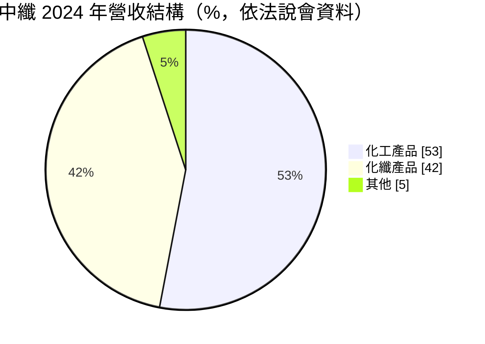
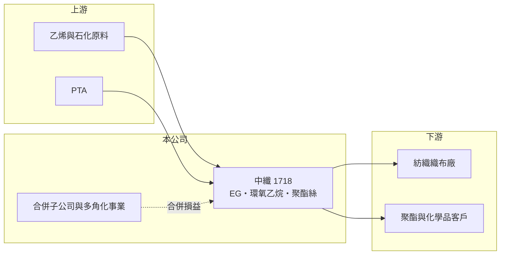

# 1718 中纖

> 上市｜[[產業索引-化學工業|化學工業]]｜上市（櫃）日期 1963/12/02

# 第一章：企業模式與商業藍圖

> [!info] 撰寫說明
> 精簡版，由 Claude 依公開資料整理，架構比照 [[2330台積電]]，資料截至 2026-10-08。來源：富果研究 2025 年 6 月中纖法說會整理、Goodinfo 年度經營績效、nStock 公司資料、winvest 營收快訊（搜尋結果標題）。合併報表含大型子公司，Goodinfo 的合併比率與歸屬母公司 EPS 對不上，本文 ROE 改用 EPS ÷ 每股淨值推算。#待校對

中纖（中國人造纖維）是老牌的石化與化纖公司，本業生產乙二醇與聚酯絲，但合併報表包含規模遠大於本業的子公司，閱讀財報時要分清「母公司本業」與「合併數字」。

- **核心業務：** 中纖的本業有兩條線：一是石化，生產[[EG]]（乙二醇）、二乙二醇、環氧乙烷與壬酚；二是化纖，生產聚酯粒、預延伸絲（POY）與加工絲（DTY）。乙二醇與 PTA 是生產聚酯的兩大原料，中纖等於同時站在聚酯產業鏈的上游與中游。
- **營收結構：** 依 2025 年法說會資料，2024 年化工產品占 53%、化纖產品占 42%、其他占 5%。2024 年單乙二醇產量約 7.1 萬噸、POY 約 3.8 萬噸，規模在全球乙二醇市場中屬於小廠。

- **營運據點：** 生產單位包括石化廠、聚酯廠、假撚廠與汽電廠，形成乙二醇到聚酯絲的上下游一貫生產。公司另經營氣體、加油站、不動產開發與超市等業務，屬於多角化的老牌集團。
- **長期方向：** 公司策略是整合乙二醇、聚酯與假撚廠以降低成本，並擴大環保紗（回收聚酯）產能，回應[[循環經濟]]需求。由於中國乙二醇產能過剩，公司把乙二醇[[開工率]]控制在 50% 至 60%，以避免虧損擴大。

# 第二章：護城河深度與競爭優勢

中纖本業缺乏規模與成本優勢，護城河很窄；真正撐住合併報表的是轉投資與子公司。

- **競爭優勢：** 乙二醇、聚酯、假撚的一貫生產可以省下中間運輸與包裝成本，並把乙二醇內部消化。環保紗與特殊聚酯產品則是少數能和大宗商品拉開差距的方向。
- **主要對手：** 乙二醇的主要供給來自中國煤化工與大型石化一體化廠，以及中東低成本天然氣廠；台灣同業則有台塑集團的 [[1303南亞]]、[[1326台化]] 等聚酯與石化大廠。這些對手規模都比中纖大上許多，中纖在價格上沒有主導力。
- **觀察重點：** 長期要看中國乙二醇產能過剩何時緩解、環保紗占比能否提高，以及母公司本業能否轉為穩定獲利。法說會資料指出，2024 年母公司個體營業損失約 13.7 億元，本業轉虧為盈是最根本的觀察點。

# 第三章：財務體質與盈利規模

資料日期：2026-10-08，表格是撰寫當時的快照；最新月營收、毛利率、累計 EPS 由自動排程寫在本筆記的屬性欄位（月營收、毛利率、累計EPS 等）。#待校對

中纖合併營收約 300 億至 450 億元，合併毛利率高達三到四成，但歸屬母公司的 EPS 長期在零附近，顯示合併數字主要反映子公司，母公司股東實際分到的獲利很少。

| 年度 | 合併營收（億元） | [[毛利率]] | [[營業利益率]] | EPS（元） | [[ROE]]（推算） |
|---|---|---|---|---|---|
| 2021 | 323 | 38.0% | 12.4% | 0.00 | 約 0% |
| 2022 | 335 | 36.9% | 10.9% | -1.01 | 約 -6.2% |
| 2023 | 374 | 35.7% | 11.8% | -1.18 | 約 -7.6% |
| 2024 | 447 | 42.7% | 21.2% | 0.02 | 約 0.1% |
| 2025 | 431 | 40.0% | 15.8% | 0.09 | 約 0.5% |

- **合併與個體的落差：** 依法說會整理，2024 年合併總資產約 9,966 億元、合併稅後淨利約 63 億元，但歸屬母公司淨利只有約 2,700 萬元，EPS 0.02 元；母公司個體營收約 56.8 億元、營業損失約 13.7 億元。合併報表裡的高毛利率與高營業利益率來自子公司，母公司股東只按持股比例分享，大部分歸屬[[非控制權益]]。
- **長期指標：** 近 5 年平均 ROE（以 EPS ÷ 每股淨值推算）約 -2.6%，每股淨值從 2021 年 17.39 元降到 2025 年 16.47 元。nStock 資料顯示近五年沒有配發現金股利，對母公司股東而言，資本長期沒有產生報酬。
- **[[ROIC]] 與 [[WACC]]：** 以母公司本業計算，2024 年個體營業損失約 13.7 億元，稅後營業利益為負，ROIC 為負值（推算）；合併層級的營業利益率雖高，但不能直接歸給母公司股東。WACC 以 CAPM 推估：無風險利率 1.75%、市場風險溢酬 6%、β 假設 0.9，股權成本約 7.2%；母公司個體負債約 175 億元、權益約 213 億元，稅後負債成本假設 2%，WACC 約 5% 左右（推算）。本業 ROIC 長期低於 WACC，代表化工本業持續消耗價值。

# 第四章：總體風險與地緣政治

中纖的風險在於乙二醇供過於求的結構問題，以及複雜集團結構造成的資訊不透明。

- **產業週期：** 乙二醇與聚酯是典型的大宗石化商品，價格受原油、中國產能與紡織需求影響。法說會指出中國乙二醇產能過剩、內需復甦可能需要 2 至 3 年，這段期間價差難以明顯改善。
- **營運風險：** 本業稼動率只有五到六成，固定成本攤提不足，虧損容易延續。小規模的一貫生產在面對大型石化一體化廠時，成本劣勢會長期存在。
- **其他風險：** 合併報表包含大型子公司，母公司股東權益與合併數字差距大，投資人容易誤讀財報。匯率方面，法說會提到美元升值 6% 至 8% 對整體營運影響約 2%；原油價格與碳費政策也會影響石化事業成本。

# 專有名詞解析

## 金融

- **[[非控制權益]]**：合併報表中子公司不屬於母公司持有的那部分股權與損益，不歸母公司股東所有。
- **[[ROIC]]**：投入資本報酬率，稅後營業利益除以股東權益加有息負債，衡量本業運用資本的效率。
- **[[WACC]]**：加權平均資金成本，股權成本與稅後負債成本依資本結構加權，是 ROIC 要超越的門檻。

## 產業

- **[[EG]]**：乙二醇，以乙烯經環氧乙烷製成，是聚酯纖維與寶特瓶的兩大原料之一（另一為 PTA）。
- **[[循環經濟]]**：把廢棄物回收再製成原料或產品，減少資源開採與碳排的經濟模式，例如回收寶特瓶製成環保紗。
- **[[開工率]]**：實際產量占設計產能的比例，化工廠在價差不佳時會主動降低開工率以減少虧損。

# 核心供應鏈

- 上游：乙烯等石化原料、PTA 供應商（推估，名稱未查得）
- 下游／客戶：紡織織布廠、聚酯加工廠與化學品客戶；環氧乙烷客戶之一為磐亞
- 同業：[[1301台塑]]、[[1303南亞]]、[[1326台化]]，以及中國與中東乙二醇廠

## 最新新聞
<!-- news:start -->
<!-- news:end -->

## 相關連結
- [公開資訊觀測站](https://mopsov.twse.com.tw/mops/web/t05st03?step=1&firstin=1&co_id=1718)
- [Goodinfo](https://goodinfo.tw/tw/StockDetail.asp?STOCK_ID=1718)
- [Yahoo 股市](https://tw.stock.yahoo.com/quote/1718)
- [鉅亨網新聞](https://www.cnyes.com/twstock/1718/news)
