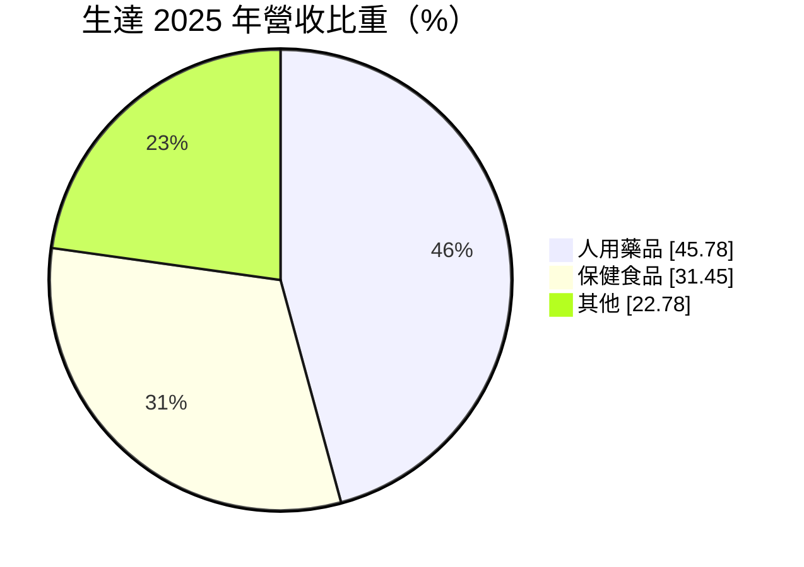
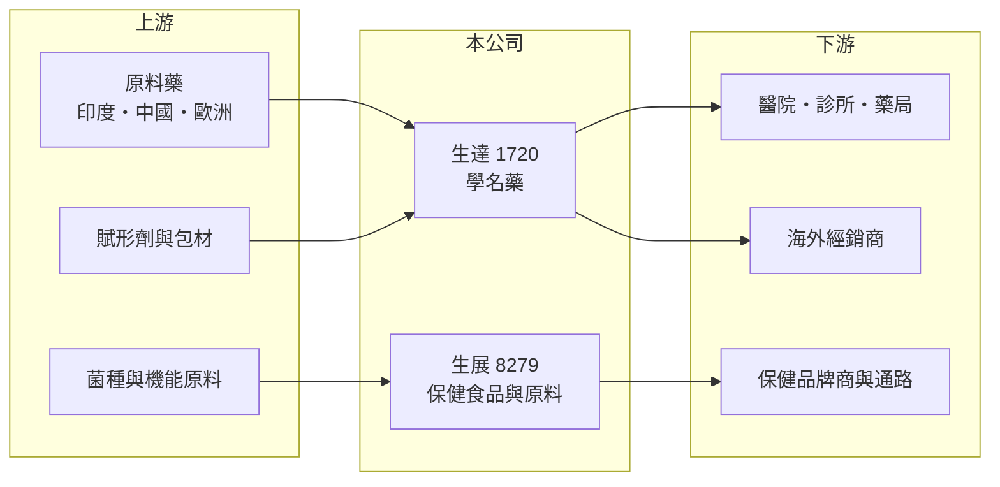

# 1720 生達

> 上市｜[[產業索引-生技醫療業|生技醫療業]]｜上市（櫃）日期 1995/12/12

# 第一章：企業模式與商業藍圖

> [!info] 撰寫說明
> 精簡版，由 Claude 依公開資料整理，架構比照 [[2330台積電]] 的四章研究，資料截至 2026-10-08。財務數字來源：Goodinfo 年度經營績效頁、MoneyDJ 個股基本資料（2025 年營收比重）、證交所開放資料（基本資料、2026 年第二季資產負債與綜合損益、營益分析、股利、本益比、每月營收）；子公司、產品線與研發細節部分憑既有知識撰寫，已標「待校對」。#待校對

本章說明生達製藥（股票代號：1720，以下簡稱生達）作為台灣主要[[學名藥]]廠之一的商業模式，以及它如何透過保健食品子公司分散健保藥價壓力。

- **核心業務：** 生達成立於 1967 年，1995 年上市，董事長為范滋庭，實收資本額約 19.7 億元。依 MoneyDJ 的 2025 年營收分類，人用藥品占 45.78%、[[保健食品]]占 31.45%、其他占 22.78%。人用藥品以慢性病學名藥為主，包括心血管、代謝與腸胃等科別（產品線細節待校對）。
- **集團結構：** 生達的保健食品業務主要透過子公司 [[8279生展]] 經營，生展以益生菌與機能性原料為主，同時供應品牌商與自有通路（憑既有知識，待校對）。2026 年第二季底權益總計約 93.2 億元，其中歸屬母公司約 61.9 億元，非控制權益約 31.3 億元，代表子公司有相當比例由其他股東持有。
- **獲利模式：** 學名藥是專利到期後的仿製藥，研發風險低於新藥，但在台灣主要賣給醫院與診所，價格受[[健保藥價]]制度管控。生達的毛利率長期維持在 41% 至 45% 之間，營業利益率約 19% 至 21%，代表產品組合與生產效率都在同業前段。
- **長期方向：** 生達 2020 至 2025 年營收由 43.1 億元成長到 70.2 億元，年複合成長率約 10.2%（推算），成長來自學名藥新品上市、保健食品擴張與海外市場。研發費用率這次未查得，可由年報補充。

# 第二章：護城河深度與競爭優勢

本章分析生達的護城河、主要對手，以及學名藥產業的競爭結構。

- **競爭優勢：** 學名藥廠的核心能力是「搶先取得藥證」與「穩定的大量生產」。生達經營近六十年，擁有大量藥品許可證、符合 PIC/S GMP 的工廠，以及遍及醫院、診所與藥局的業務網路，這些都需要長時間累積。
- **雙引擎結構：** 處方藥受健保藥價調降壓力，保健食品則屬於自費市場，價格由市場決定。兩條業務並行，讓生達在健保砍價年度仍能維持成長，這是它和純處方藥廠最大的差別。
- **主要對手：** 學名藥同業 [[1795美時]]、[[1734杏輝]]、[[4120友華]]、永信、中化製藥，以及國際原廠的過專利藥。保健食品市場則面對眾多品牌商與代工廠。
- **觀察重點：** 一是每年新取得的學名藥藥證數量；二是保健食品子公司的成長與獲利；三是海外市場（推估以東南亞與中國為主，待校對）的布局進度。

# 第三章：財務體質與盈利規模

資料日期：2026-10-08，表格是撰寫當時的快照；最新月營收、毛利率、累計 EPS 由自動排程寫在本筆記的屬性欄位（月營收、毛利率、累計EPS 等）。#待校對

本章用多年度的三率、ROE 與資本報酬，檢視生達的成長品質。

| 年度 | 營收（新台幣） | [[毛利率]] | [[營業利益率]] | EPS（元） | [[ROE]] |
|---|---|---|---|---|---|
| 2020 | 43.1 億 | 44.6% | 16.4% | 2.93 | 13.1% |
| 2021 | 46.0 億 | 44.9% | 19.0% | 3.95 | 14.3% |
| 2022 | 58.5 億 | 42.5% | 19.1% | 4.56 | 16.2% |
| 2023 | 62.4 億 | 43.7% | 20.2% | 4.67 | 14.9% |
| 2024 | 67.9 億 | 44.0% | 20.6% | 4.93 | 15.1% |
| 2025 | 70.2 億 | 41.4% | 19.4% | 5.19 | 13.7% |
| 2026 上半年 | 35.2 億 | 43.76% | 21.32% | 2.49 | 未查得 |

註：2020 至 2025 年取自 Goodinfo，2026 上半年取自證交所營益分析與綜合損益。2026 年 EPS 以配股後股本計算，與過去年度比較時要注意稀釋。

- **營收規模：** 營收連續六年成長，2020 至 2025 年年複合成長率約 10.2%（推算）。2026 年 1 至 8 月累計營收約 47.5 億元，較去年同期成長約 3%（證交所每月營收），成長速度放緩。
- **獲利結構：** 毛利率與營業利益率都相當穩定，EPS 由 2.93 元逐年增加到 5.19 元。2026 年上半年歸屬母公司淨利約 4.90 億元，而合併淨利約 6.60 億元，約四分之一歸屬子公司的少數股東。
- **長期指標：** 2021 至 2025 年平均 ROE 約 14.8%（推算）。2025 年度配發現金股利 2.00 元與股票股利 1.00 元（證交所股利資料），現金[[配息率]]約 39%（推算），保留較多盈餘支應成長。
- **財務特色：** 2026 年第二季底總負債約 29.9 億元、權益總計約 93.2 億元，負債比約 24%（證交所開放資料）。財務結構穩健，配股使股本持續擴大。

**[[ROIC]] 與 [[WACC]]：** 以 2025 年營收 70.2 億元乘營業利益率 19.4%，營業利益約 13.6 億元，稅後約 10.9 億元；投入資本以權益總計 93.2 億元（含非控制權益）加上假設占總負債四成的有息負債約 12.0 億元，合計約 105.2 億元，ROIC 約 10.4%（推算）。WACC 以 CAPM 推估：無風險利率 1.75%、市場風險溢酬 6%、β 取製藥業常見值 0.6，股東權益成本約 5.35%；負債成本 2.5%、稅後 2.0%；權益約占 89%，WACC 約 5.0%（推算）。ROIC 約為 WACC 的兩倍，代表生達的學名藥與保健食品雙引擎長期穩定創造價值，在台灣中型藥廠中屬於資本效率較好的一群（推估）。

# 第四章：總體風險與地緣政治

本章分析生達長期面對的風險。

- **產業週期：** 藥品需求受景氣影響小，但台灣健保每年檢討藥價，學名藥價格長期呈下降趨勢。保健食品則受消費景氣與市場流行影響，成長速度可能起伏。
- **營運風險：** 學名藥的獲利仰賴持續推出新藥證，如果新品上市速度落後，舊產品降價會拖累毛利率。子公司占合併獲利比重高，子公司業績波動會影響母公司 EPS。
- **其他風險：** 原料藥多仰賴印度與中國供應，地緣政治或供應中斷會影響生產；藥品與保健食品的法規、標示與廣告規範持續趨嚴；拓展海外需要取得當地藥證，時間與成本都高。

# 專有名詞解析

## 金融

- **[[配息率]]**：現金股利占每股盈餘的比例，反映公司把獲利發還給股東的程度。
- **[[毛利率]]**：營業毛利占營收的比例，反映產品定價能力與生產成本控制。
- **[[營業利益率]]**：扣除營業費用後的營業利益占營收的比例，衡量本業整體獲利能力。
- **[[ROE]]**：股東權益報酬率，稅後淨利除以股東權益，衡量公司運用股東資金的效率。
- **[[ROIC]]**：投入資本報酬率，稅後營業利益除以股東權益與有息負債的合計，衡量本業對所有資金提供者的報酬。
- **[[WACC]]**：加權平均資金成本，依股東權益與負債的比重加權計算的資金成本，ROIC 高於它才代表創造價值。

## 產業

- **[[學名藥]]**：原廠藥專利到期後，由其他藥廠生產、成分與療效相同的仿製藥，價格通常低於原廠藥。
- **[[保健食品]]**：以維持健康為訴求的膳食補充產品，受食品與廣告法規規範。
- **[[健保藥價]]**：全民健保給付給醫院的藥品價格，由健保署定期調查市場價格後調整，長期趨勢是逐步調降。
- **[[PIC S GMP]]**：國際醫藥品稽查協約組織的藥品優良製造規範，台灣藥廠須符合此標準才能生產西藥。

# 核心供應鏈

- 上游：印度、中國與歐洲的原料藥供應商，賦形劑與包材，益生菌菌種與機能原料。
- 下游／客戶：醫院、診所與藥局，保健食品品牌商與零售通路，海外經銷商。
- 同業：[[1795美時]]、[[1734杏輝]]、[[4120友華]]、永信、中化製藥。

## 最新新聞
<!-- news:start -->
<!-- news:end -->

## 相關連結
- [公開資訊觀測站](https://mopsov.twse.com.tw/mops/web/t05st03?step=1&firstin=1&co_id=1720)
- [Goodinfo](https://goodinfo.tw/tw/StockDetail.asp?STOCK_ID=1720)
- [Yahoo 股市](https://tw.stock.yahoo.com/quote/1720)
- [鉅亨網新聞](https://www.cnyes.com/twstock/1720/news)
