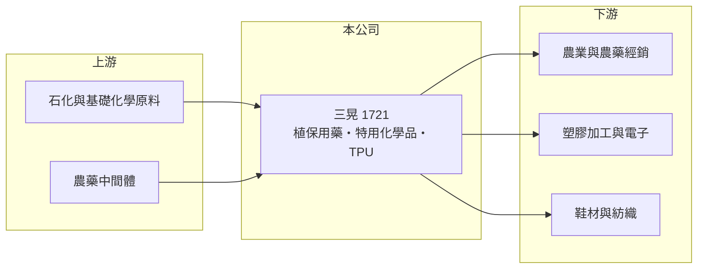

# 1721 三晃

> 上市｜[[產業索引-化學工業|化學工業]]｜上市（櫃）日期 1996/05/16

# 第一章：企業模式與商業藍圖

> [!info] 撰寫說明
> 精簡版，由 Claude 依公開資料整理，架構比照 [[2330台積電]]，資料截至 2026-10-08。來源：nStock 公司資料、Goodinfo 年度經營績效、winvest 營收快訊（搜尋結果標題）。公開資料有限，各產品營收比重與主要客戶未查得。#待校對

三晃是一家產品線分散的中型化學公司，橫跨農藥、特用化學品與高分子材料，近年本業連續虧損，正處於艱困的調整期。

- **核心業務：** 三晃的產品分三類。第一是[[植物保護用藥]]與環境衛生用藥；第二是特用化學品，包括交聯劑、無鹵阻燃劑、電子化學品、抗氧化劑與紫外線吸收劑；第三是高分子產品，包括接著劑、消光劑、亮光劑與熱可塑性聚氨酯（[[TPU]]）。
- **營收結構：** 各產品線的營收比重本次未查到。從營業項目看，三晃的客戶分散在農業、塑膠加工、電子與紡織鞋材等不同產業，好處是不依賴單一客戶，壞處是每條產品線的規模都不大。
- **營運據點與沿革：** 公司登記地址在台中。三晃在 2016 年合併國慶化學，國慶原本生產植物保護用藥原體、特用化學品與塑膠原料，合併後擴大了農藥原體的自製能力。
- **長期方向：** 公開資料未提供明確的轉型計畫。從產品組合看，無鹵阻燃劑、電子化學品與 TPU 是較有機會受惠環保法規與電子產業的品項，能否把資源集中到這些較高附加價值的產品，是三晃走出虧損的關鍵（推估）。

# 第二章：護城河深度與競爭優勢

三晃的競爭優勢主要是農藥原體的登記證照與多年的配方經驗，但在虧損期間，這些優勢沒有轉化成定價能力。

- **競爭優勢：** 農藥原體與成品在台灣需要取得主管機關登記許可，登記需要毒理與田間試驗資料，耗時且成本高，這是新進者的門檻。三晃同時具備原體合成與特化配方能力，可以把部分中間體內部使用。
- **主要對手：** 植物保護用藥的國內對手以 [[1712興農]] 為代表，國際上則有大型跨國農化公司與大量中國原體廠；特用化學品與 TPU 方面，與台灣與中國的眾多特化廠競爭。中國原體廠產能龐大，價格下殺時對三晃衝擊最大。
- **觀察重點：** 長期要看毛利率能否回到正值、產品線是否收斂到具競爭力的品項，以及公司是否需要處分資產或增資來支撐營運。2023 至 2025 年連續三年虧損，每股淨值由 2022 年的 12.97 元降到 2025 年的 8.91 元，財務緩衝正在縮小。

# 第三章：財務體質與盈利規模

資料日期：2026-10-08，表格是撰寫當時的快照；最新月營收、毛利率、累計 EPS 由自動排程寫在本筆記的屬性欄位（月營收、毛利率、累計EPS 等）。#待校對

三晃營收從 2016 年的 35.8 億元一路降到 2025 年的 17.7 億元，毛利率由正轉負，是本批化學股中財務狀況最弱的一家。

| 年度 | 營收（億元） | [[毛利率]] | [[營業利益率]] | EPS（元） | [[ROE]] |
|---|---|---|---|---|---|
| 2021 | 28.5 | 4.49% | -3.37% | -0.38 | -2.91% |
| 2022 | 30.1 | 8.50% | 1.08% | 0.33 | 2.59% |
| 2023 | 21.9 | -2.85% | -11.9% | -1.50 | -12.3% |
| 2024 | 22.9 | 0.28% | -7.99% | -0.98 | -9.02% |
| 2025 | 17.7 | -7.30% | -18.8% | -1.84 | -18.9% |

- **長期趨勢：** 2020 至 2025 年營收由 27.5 億元降到 17.7 億元，年複合成長率約 -8.4%（推算）。毛利率在 2016 年還有 18.9%，之後逐年下滑，2025 年為 -7.30%，代表產品售價已經低於生產成本，問題不只是費用過高。
- **一次性收益：** 2020 年 EPS 2.43 元是靠約 7.27 億元的業外收益，當年本業其實虧損（營業利益率 -8.86%）。近 5 年平均 ROE 約 -8.1%（推算），扣除業外後本業長期無法賺回資本。
- **[[ROIC]] 與 [[WACC]]：** 2025 年營業利益約 -3.3 億元（17.7 億 × -18.8%），稅後營業利益為負，ROIC 為負值（推算）；股東權益約 16.5 億元（每股淨值 8.91 元 × 約 1.85 億股）。WACC 以 CAPM 推估：無風險利率 1.75%、市場風險溢酬 6%、β 假設 0.8，股權成本約 6.6%，有息負債未查得，WACC 約 6%（推算）。ROIC 長期低於 WACC，而且差距在擴大，代表三晃目前在消耗股東資本，必須靠產品結構調整才能扭轉。

# 第四章：總體風險與地緣政治

三晃的風險集中在持續虧損與中國競爭，屬於需要密切追蹤財務體質的公司。

- **產業週期：** 農藥需求受天候、作物價格與病蟲害影響，具有季節性與年度波動；中國原體廠在產能過剩時大量出口，會壓低全球價格。特用化學品則跟著塑膠、電子與鞋材景氣起伏。
- **營運風險：** 毛利率為負代表每多賣一單位就多虧一些，若無法調整產品組合或降低成本，虧損會持續侵蝕淨值。營收規模縮小後，固定成本攤提壓力更大，形成[[營運槓桿]]反向的惡性循環。
- **其他風險：** 農藥受法規嚴格管理，政府若禁用特定成分或提高登記門檻，會直接影響產品線。化學品製程涉及環保與工安責任，小規模公司承擔事故或改善成本的能力較弱。

# 專有名詞解析

## 金融

- **[[營運槓桿]]**：固定成本占比高時，營收小幅變動就會讓獲利大幅增減；營收萎縮時虧損也會被放大。
- **[[ROIC]]**：投入資本報酬率，稅後營業利益除以股東權益加有息負債，衡量本業運用資本的效率。
- **[[WACC]]**：加權平均資金成本，股權成本與稅後負債成本依資本結構加權，是 ROIC 要超越的門檻。

## 產業

- **[[植物保護用藥]]**：俗稱農藥，包括殺蟲劑、殺菌劑與除草劑，需經主管機關登記才能販售，原體合成與成品配製是兩個不同環節。
- **[[TPU]]**：熱可塑性聚氨酯，兼具橡膠彈性與塑膠可加工性的材料，用於鞋材、薄膜、電線外被與 3C 保護套。
- **[[無鹵阻燃劑]]**：不含氯、溴等鹵素的阻燃添加劑，燃燒時較少產生有毒氣體，電子電器與建材的環保法規推動其取代含鹵阻燃劑。

# 核心供應鏈

- 上游：石化與基礎化學原料、農藥中間體供應商（推估，名稱未查得）
- 下游／客戶：農藥經銷與農業用戶、塑膠加工、電子、鞋材與紡織業者，名稱未揭露
- 同業：[[1712興農]]、國際農化公司與中國農藥原體廠；台灣化學類股 [[1714和桐]]、[[1717長興]]、[[1718中纖]]

## 最新新聞
<!-- news:start -->
<!-- news:end -->

## 相關連結
- [公開資訊觀測站](https://mopsov.twse.com.tw/mops/web/t05st03?step=1&firstin=1&co_id=1721)
- [Goodinfo](https://goodinfo.tw/tw/StockDetail.asp?STOCK_ID=1721)
- [Yahoo 股市](https://tw.stock.yahoo.com/quote/1721)
- [鉅亨網新聞](https://www.cnyes.com/twstock/1721/news)
