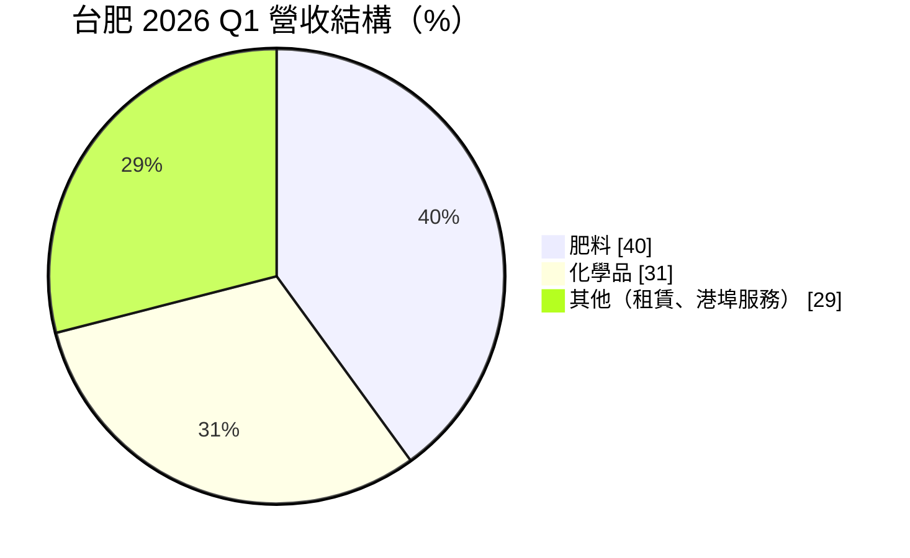
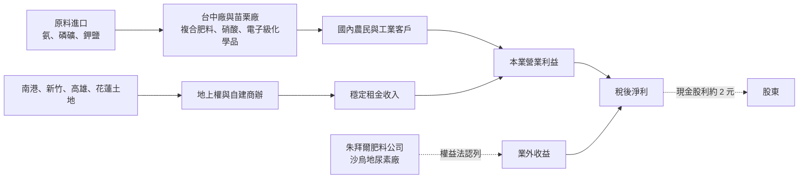
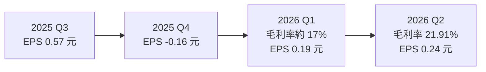
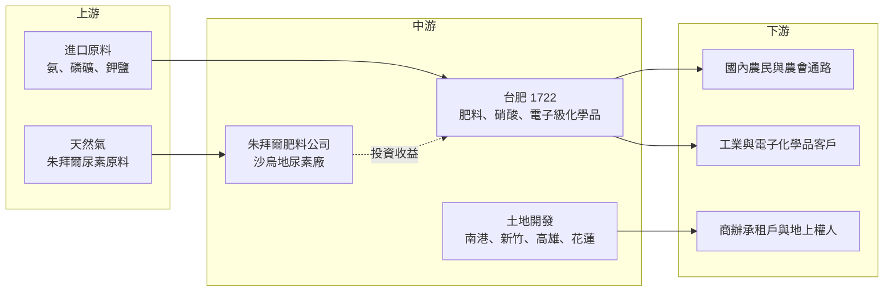

# 1722 台肥

> 上市｜[[產業索引-化學工業|化學工業]]｜上市（櫃）日期 1998/03/24

# 第一章：企業模式與商業藍圖

> [!info] 撰寫說明
> 本文由 Claude 依公開資料整理，架構比照 [[2330台積電]] 的四章研究，資料截至 2026-10-07。財務數字來源：富果研究台肥 2025 年 6 月與 2026 年 6 月法說會整理、poorstock 法說摘要、nStock 公司資料、Yahoo 股市季 EPS、winvest 除權息新聞；產業描述為整理性內容，尚未逐條比對原始文件。#待校對

在評估單一個股的長期投資價值時，首要步驟是拆解企業的底層獲利邏輯。本章針對台灣肥料公司（股票代號：1722，以下簡稱台肥）的商業模式進行定性分析，說明一家老牌國營轉民營的肥料廠，如何變成「肥料、化工、土地租賃、海外轉投資」四條腿並行的資產型公司。

## 一、核心定位：國內肥料龍頭，實質是一家資產活化公司

台肥成立於 1946 年，1999 年 3 月在證交所上市，資本額約 98 億元。從營業項目看，它製造與銷售各種無機、有機化學肥料與化學品，並經營不動產開發租售。

但從獲利來源看，台肥的本業並不是主要引擎。依 poorstock 整理的法說資料，2025 年營業淨利只有 3.62 億元，而沙烏地阿拉伯合資的朱拜爾肥料公司貢獻的轉投資收益達 12.09 億元，稅後淨利 9.32 億元、EPS 0.95 元。換句話說，台肥的股東其實同時持有三種資產：

* **國內肥料與化工本業：** 面對政府肥料補貼政策與國際原料價格，利潤率薄。
* **大面積土地：** 法說資料指公司持有土地逾 57 萬坪（約 157 萬平方公尺），分布在南港、新竹、高雄與花蓮，正逐步以[[地上權]]或自建商辦方式[[資產活化]]。
* **海外[[尿素]]廠轉投資：** 朱拜爾公司的獲利以[[權益法]]認列為業外收益，隨國際尿素與天然氣價格大幅波動。

## 二、終端應用／產品板塊：肥料、化工與租賃三分天下

依富果整理的 2026 年 6 月法說會資料，2026 年第一季營收結構如下：

* **肥料：** 以[[複合肥料]]與單質肥料供應國內農民，台中廠年產複合肥料約 30 萬噸。台肥在國內肥料市場有長期供應地位，但售價受政府肥料補貼與價格政策影響，2025 年第一季獲利下滑即與政府補貼減少有關。
* **化學品：** 包括工業用與[[電子級化學品]]，台中廠年產[[硝酸]]約 16.5 萬噸，苗栗廠負責特用肥料與電子級化學品，客戶涵蓋國內工業用戶，並外銷東南亞與印度。公司也在發展電子廢酸回收的循環經濟業務。
* **其他：** 南港 C2 商辦與飯店租金、台中港區的散裝貨物裝卸與儲槽出租。富果 2025 年法說整理指出，公司預估 2025 年租金收入約 24 億元（含集團各項租賃），已是相當穩定的現金來源。

## 三、資本轉化邏輯（營運模式）：土地換租金、轉投資換股利

* **土地資產的現金化：** 南港 C2 辦公大樓進駐率九成以上，飯店部分由晶華集團旗下 Silks Club 經營；C3 以地上權方式交由台灣人壽開發；C4 辦公大樓興建中，預計 2027 年 12 月完工。新竹 D7-A 已全數出租，D7-B 於 2025 年 5 月動工、預計 2029 年 7 月完工；D6 以 70 年地上權交由竹科管理局。這些專案讓台肥的收入結構逐年往「收租」傾斜。
* **轉投資的週期性：** 朱拜爾貢獻在 2022 年高達 34.92 億元，2024 年降到 9.83 億元，2025 年回升到 12.09 億元，2026 年第一季為 2.63 億元。台肥的 EPS 高低，大部分取決於這一項。
* **股利政策：** 公司連續 22 年配發每股 2 元以上的現金股利，2026 年 8 月除息 2 元。由於 2025 年 EPS 只有 0.95 元，[[盈餘分配率]]超過 200%，部分股利來自累積盈餘。

## 四、企業長期藍圖：從肥料廠轉向「租賃加新能源」雙引擎

* **[[藍氨]]與氨氫能源：** 法說資料顯示，台肥規劃在 2028 年前建置約 8 萬噸氨儲存能力，並以年處理 200 萬噸為營運目標，切入發電廠混燒用的低碳氨供應鏈。台肥既有的氨進口、儲存與港口設施，是這項業務的基礎。
* **商辦開發：** C4 與 D7-B 陸續完工後，租金收入可望再上一個台階（推估，具體金額公司未揭露）。
* **[[深層海水]]：** 花蓮海洋深層水園區以招商為主，屬長期題材，目前對營收貢獻不明顯。
* **減碳路徑：** 公司目標 2030 年減碳 30% 至 46%、2040 年減碳 65% 至 83%、2050 年淨零，逐步汰換燃煤鍋爐並導入太陽能。

# 第二章：護城河深度與競爭優勢

在長期價值投資中，「護城河」指企業抵禦競爭、維持超額利潤的保護機制。本章分析台肥護城河的組成、主要競爭對手，以及哪些部分真正能守住超額報酬。

## 一、護城河的核心組成要素

台肥本業的護城河不深，真正難以複製的是「土地」與「港口設施」，屬於資產型護城河：

* **1. 取得成本極低的都會區土地：** 台肥的土地多在國營時期取得，帳面成本遠低於市價。南港經貿園區與新竹科學園區周邊的土地，後進者幾乎不可能用相同成本取得，因此租賃事業的資本報酬率天然較高。
* **2. 國內肥料供應體系：** 長年作為國內主要肥料供應商，擁有農會與經銷通路，以及政府肥料政策的配合角色。不過這也代表售價受政策影響，屬「有市占、無定價權」的地位。
* **3. 港口與化學品儲運設施：** 台中港的儲槽、碼頭與化學品處理經驗，是發展氨進口與藍氨業務的先天條件。新進者要取得港區土地與危險物品儲存許可，時間成本很高。
* **4. 海外合資的原料優勢：** 朱拜爾尿素廠位於沙烏地阿拉伯，天然氣原料成本在全球屬於低檔，景氣好時獲利能力強。

## 二、全球主要競爭對手格局

| 對手 | 定位 | 對台肥的影響 |
|---|---|---|
| 進口肥料（中國、東南亞、中東） | 尿素與複合肥料的國際供應者 | 國際肥料價格下跌時壓縮台肥售價 |
| [[1714和桐]]、[[1717長興]]、[[1718中纖]] | 國內化學工業同業 | 在部分工業化學品市場競爭 |
| 國際氨與肥料大廠（如 Yara、CF Industries） | 全球氨、尿素與藍氨供應 | 決定國際尿素價格，左右朱拜爾獲利 |
| 國內電子化學品業者 | 半導體用化學品與廢酸回收 | 台肥在電子級化學品屬後進者 |
| 商辦開發商與壽險業者 | 南港、竹科商辦供給 | 影響租金水準與空置率 |

## 三、優勢轉化：哪些守得住、哪些守不住

* **守得住：** 土地租賃收入。南港 C2 進駐率九成以上，地上權合約動輒 50 至 70 年，現金流穩定度高，是台肥能維持 2 元股利的底氣。
* **守不住：** 肥料本業的利潤率。政府補貼縮減、國際原料成本上升時，台肥很難完全轉嫁，2026 年第一季[[毛利率]]從前一年同期的 21% 降到 17%，營業淨利轉為小幅虧損。
* **觀察重點：** 第一，C4 與 D7-B 能否如期完工並出租；第二，朱拜爾的尿素價格與天然氣成本；第三，藍氨業務能否取得電廠或半導體客戶的長期合約。這三點決定台肥能否擺脫「靠轉投資撐 EPS」的結構。

# 第三章：財務體質與盈利規模

資料日期：2026-10-07。數字取自富果研究、poorstock 法說整理、nStock 與 Yahoo 股市，表格是撰寫當時的快照；最新月營收、毛利率、累計 EPS 由自動排程寫在本筆記的屬性欄位（月營收、毛利率、累計EPS 等）。#待校對

財務報表是檢驗護城河是否真實存在的最終標準。本章用三率、ROE、現金流與資本報酬，檢視台肥本業與資產的獲利品質。

## 一、獲利能力的基石：三率

| 項目 | 2024 全年 | 2025 全年 | 2026 Q1 | 2026 Q2 |
|---|---|---|---|---|
| 營收（新台幣） | 未查得 | 120.88 億 | 未查得 | 未查得 |
| [[毛利率]] | 未查得 | 未查得 | 約 17% | 21.91% |
| [[營業利益率]] | 未查得 | 約 3.0%（推算） | 負值（營業淨損 0.49 億） | 12.41% |
| 朱拜爾轉投資收益 | 9.83 億 | 12.09 億 | 2.63 億 | 未查得 |
| 稅後淨利 | 19.66 億 | 9.32 億 | 1.85 億 | 未查得 |
| EPS（元） | 2.01 | 0.95 | 0.19 | 0.24 |

* **[[毛利率]]：** 肥料與化學品毛利率受國際原料價格、政府補貼與售價調整時間差影響，季度波動大。租賃收入毛利率高，租金比重提升有助於拉高整體毛利率。
* **[[營業利益率]]：** 2025 年營業淨利 3.62 億元，以全年營收推算營業利益率約 3%，本業獲利能力偏弱。2026 年第二季營業利益率回到 12.41%，主要反映毛利率回升（推估）。
* **業外收益：** 依 poorstock 整理，2025 年核心事業獲利中約 76% 依賴朱拜爾轉投資，閱讀台肥財報時必須把本業與轉投資分開看。2026 年 1 至 9 月累計營收 98.18 億元，年增 4.86%。

## 二、[[ROE]]：資本效率

台肥的總資產約 695 億元（2026 年 3 月），其中不動產、廠房及設備約占六成，大量土地以歷史成本入帳。依 nStock 資料，2026 年第二季單季 ROE 僅 0.43%，換算全年約 2% 上下（推估）。低 ROE 的原因是股東權益龐大而本業獲利薄，土地的市場價值並未反映在帳面報酬上。這也是資產股的典型特徵：用 ROE 衡量會低估土地價值，用股價淨值比衡量才比較合理。

## 三、資本支出與自由現金流

* **[[CapEx]]：** 未來幾年的主要資本支出是 C4 商辦（預計 2027 年底完工）、新竹 D7-B（預計 2029 年完工）與藍氨儲槽設施，具體年度金額未查得。
* **[[自由現金流]]：** 租金與朱拜爾股利是穩定的現金流入，但在商辦興建期間，資本支出會壓低自由現金流。2026 年 3 月總負債 247 億元，其中非流動負債 145 億元，舉債空間仍在合理範圍。
* **股利：** 近五年平均現金股利 2.38 元，2025 年度配發 2 元、總額 19.60 億元，超過當年稅後淨利 9.32 億元。若本業與轉投資未回升，維持 2 元股利需要持續動用累積盈餘。

## 四、[[ROIC]] 與 [[WACC]]：價值創造利差

以帳面投入資本計算，台肥本業的 ROIC 明顯低於一般企業的資金成本（推估，具體數值未查得），價值主要藏在未重估的土地與海外合資股權。商辦專案若能以低土地成本換取市場租金，單一專案的報酬率可以高於 WACC，這是台肥從「低報酬資產股」轉為「收租型公司」的關鍵。

# 第四章：總體風險與地緣政治

任何企業都無法脫離宏觀環境獨立存在。本章分析台肥未來必須面對的地緣政治、產業週期、營運與法規風險。

## 一、地緣政治

* **中東風險：** 朱拜爾尿素廠位於沙烏地阿拉伯，中東戰事、荷莫茲海峽航運與當地政策變化，會直接影響這項最大的獲利來源。
* **原料進口依賴：** 台灣缺乏天然氣與磷鉀礦產，氨、磷礦、鉀鹽仰賴進口，海運中斷或國際制裁會推升成本。
* **兩岸與國際肥料貿易：** 中國的尿素出口管制政策常改變國際尿素價格，進而影響台肥進口成本與朱拜爾的售價。

## 二、產業週期與市場結構

* **國際肥料價格週期：** 尿素價格受天然氣、糧價與中國出口政策驅動，2022 年高峰時朱拜爾貢獻近 35 億元，2024 年跌到不到 10 億元，波動幅度遠超一般製造業。
* **國內農業萎縮：** 台灣耕地面積與農業人口長期下降，肥料需求缺乏成長性。
* **商辦供需：** 南港與竹科周邊商辦陸續完工，若供給過多，新案出租速度與租金可能不如預期。

## 三、營運環境的隱性風險

* **政策依賴：** 肥料售價與補貼由政府政策決定，2025 年第一季獲利大減即源於補貼減少。
* **高配息的可持續性：** EPS 低於股利時，市場對 2 元股利的信心若動搖，股價可能重新評價。
* **工安與環保：** 硝酸、氨等危險化學品的儲運，一旦發生事故，罰款與停工影響可觀。

## 四、科技或法規演進

* **碳費與淨零法規：** 肥料與化學品製程排碳量高，台灣碳費制度與歐盟碳邊境調整機制若擴大適用，會增加成本；反過來，藍氨與低碳產品則可能受惠。
* **新能源技術路線：** 氨作為發電燃料仍在示範階段，如果電廠混燒政策延後或改採其他技術，台肥的氨氫布局可能要更長時間才能回收。

# 專有名詞解析

## 半導體

- **[[電子級化學品]]**：純度達 ppb 等級、供半導體與面板製程清洗蝕刻使用的化學品，雜質要求遠高於工業級。

## 金融

- **[[地上權]]**：土地所有人把土地使用權長期出租給他人開發建物，期滿後土地與建物歸還地主，常見期間 50 至 70 年。
- **[[資產活化]]**：把閒置或低度利用的土地、廠房轉為出租、開發或出售，以提高資產報酬率。
- **[[權益法]]**：持股 20% 至 50% 等具重大影響力的轉投資，按持股比例把被投資公司損益認列為本公司投資收益。
- **[[盈餘分配率]]**：現金股利占每股盈餘的比例，超過 100% 代表發放的股利高於當年獲利、動用了累積盈餘。
- **[[毛利率]]**：營收扣除銷貨成本後的毛利占營收比例，反映產品本身的獲利能力。
- **[[自由現金流]]**：營業活動現金流減去資本支出，代表企業可自由用於配息、還債或併購的現金。

## 產業

- **[[複合肥料]]**：同一顆肥料中含有氮、磷、鉀中兩種以上養分的肥料，施用方便，是台肥國內銷售的主力產品。
- **[[尿素]]**：含氮量最高的固體氮肥，以天然氣製氨後合成，國際價格隨天然氣與中國出口政策大幅波動。
- **[[硝酸]]**：重要的基礎化學品，用於製造肥料、炸藥與半導體蝕刻清洗，台肥台中廠年產約 16.5 萬噸。
- **[[藍氨]]**：以天然氣製造、並將製程產生的二氧化碳捕捉封存的氨，可作為低碳燃料或氫能載體。
- **[[深層海水]]**：取自水深 200 公尺以下的海水，溫度低、潔淨且富含礦物質，可用於飲品、養殖與保養品。

# 核心供應鏈

## 1. 上游：原料與能源
- 進口氨、磷礦、鉀鹽：主要來自國際肥料與礦業公司（名稱未查得）
- 朱拜爾肥料公司的天然氣原料：沙烏地阿拉伯當地供應

## 2. 中游：台肥本身與轉投資
- 肥料與化學品生產：台中廠、苗栗廠
- 海外尿素轉投資：朱拜爾肥料公司（沙烏地阿拉伯合資）
- 不動產開發：南港 C2、C3、C4，新竹 D3、D6、D7，高雄多功能經貿園區，花蓮海洋深層水園區

## 3. 下游：客戶與承租人
- 國內農民、農會與肥料經銷商
- 工業化學品與電子級化學品客戶，外銷東南亞與印度
- 南港 C3 地上權：台灣人壽（[[2891中信金]]旗下）
- 南港 C2 飯店經營：晶華集團旗下 Silks Club（[[2707晶華]]）

## 4. 同業
- 國內化工同業：[[1714和桐]]、[[1717長興]]、[[1718中纖]]

## 最新新聞
<!-- news:start -->
<!-- news:end -->

## 相關連結
- [公開資訊觀測站](https://mopsov.twse.com.tw/mops/web/t05st03?step=1&firstin=1&co_id=1722)
- [Goodinfo](https://goodinfo.tw/tw/StockDetail.asp?STOCK_ID=1722)
- [Yahoo 股市](https://tw.stock.yahoo.com/quote/1722)
- [鉅亨網新聞](https://www.cnyes.com/twstock/1722/news)
