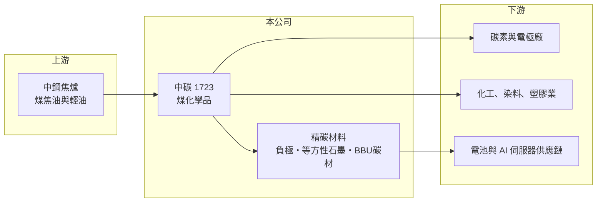

# 1723 中碳

> 上市｜[[產業索引-化學工業|化學工業]]｜上市（櫃）日期 1998/11/27

# 第一章：企業模式與商業藍圖

> [!info] 撰寫說明
> 精簡版，由 Claude 依公開資料整理，架構比照 [[2330台積電]]，資料截至 2026-10-08。來源：優分析 2026 年第二季財報報導、Goodinfo 年度經營績效、nStock 公司資料、winvest 營收快訊（搜尋結果標題）。與中鋼的關係與原料來源為一般產業知識整理。#待校對

中碳是中鋼集團的煤化學公司，把煉鋼焦爐產生的副產品加工成化學品與碳材料，正嘗試從傳統煤化學轉向高附加價值的「精碳材料」。

- **核心業務：** 中碳的傳統本業是[[煤焦油]]與輕油的分餾精製，產品包括瀝青、萘、酚類、苯類等煤化學品，供應碳素、染料、塑膠與化工業者。第二條事業線是精碳材料，包括電池用的高階[[負極材料]]、[[等方性石墨]]，以及 AI 伺服器 [[BBU]] 用的先進碳材料。
- **營收結構：** 目前營收仍以煤化學品為主，精碳材料占比較小；依優分析報導，公司目標把精碳材料營收占比提高到 20%。精碳材料毛利較高、較不受煤化學原料價格影響，是改變中碳長期體質的關鍵。
- **營運據點與原料：** 中碳的原料主要來自 [[2002中鋼]] 煉焦過程的副產品，工廠位於高雄臨海工業區一帶，與中鋼形成集團內上下游關係（推估，依一般產業資料）。原料供應穩定，但數量也受中鋼煉鐵產量限制。
- **長期方向：** 依 2026 年第二季報導，BBU 碳材料已送樣超過 40 件，與日本客戶的產品認證接近完成，預計 2027 年開始量產，新產能規劃在 2027 年第一季建置完成，全面投產後估計每年可增加約 5 億元營收。等方性石墨已開發 6 吋與 8 吋規格，瞄準半導體與光電用的高純度石墨市場。

# 第二章：護城河深度與競爭優勢

中碳的護城河來自穩定且低成本的原料來源，以及煤化學在台灣近乎獨占的地位；精碳材料則是正在建立中的第二道護城河。

- **競爭優勢：** 煤焦油是煉焦的副產品，原料取得取決於是否擁有焦爐，中碳背靠中鋼，原料來源長期穩定，這是外部競爭者難以複製的結構性優勢。台灣煤化學市場規模不大，中碳實質上是國內主要供應者，在國內客戶的供貨與物流上有地利。
- **主要對手：** 煤化學品的國際對手包括日本、韓國與中國的煤化工廠，中國產能龐大，常主導亞洲報價；負極材料與等方性石墨則面對日本與中國的專業碳材料廠，技術與規模都領先。
- **觀察重點：** 長期要看三件事：BBU 碳材料能否如期在 2027 年量產並放量；精碳材料占比能否接近 20% 目標；以及煤化學品在鋼鐵減碳趨勢下的原料量變化。這三點決定中碳能否從「中鋼副產品加工廠」變成「碳材料公司」。

# 第三章：財務體質與盈利規模

資料日期：2026-10-08，表格是撰寫當時的快照；最新月營收、毛利率、累計 EPS 由自動排程寫在本筆記的屬性欄位（月營收、毛利率、累計EPS 等）。#待校對

中碳年營收在 50 億至 105 億元之間大幅波動，但營業利益率長期維持兩位數，是一家獲利能力不錯、低負債的週期股。

| 年度 | 營收（億元） | [[毛利率]] | [[營業利益率]] | EPS（元） | [[ROE]] |
|---|---|---|---|---|---|
| 2021 | 79.8 | 20.2% | 15.0% | 4.73 | 15.2% |
| 2022 | 105 | 22.6% | 17.1% | 7.33 | 21.7% |
| 2023 | 83.2 | 25.2% | 18.3% | 6.18 | 17.6% |
| 2024 | 76.5 | 23.8% | 16.2% | 5.20 | 14.7% |
| 2025 | 58.6 | 18.9% | 9.15% | 2.65 | 7.68% |

- **長期趨勢：** 2020 至 2025 年營收由 53.6 億元到 58.6 億元，年複合成長率約 1.8%（推算），但中間在 2022 年衝到 105 億元，顯示營收主要跟著煤化學品報價起伏。2016 至 2024 年營業利益率大多在 14% 至 21% 之間，2025 年降到 9.15%，是近十年低點。近 5 年平均 ROE 約 15.4%（推算），在傳統化學股中屬於高水準。
- **財務體質：** 股本約 23.7 億元多年未變，沒有稀釋股東；2025 年 ROA 5.38%、ROE 7.68%，換算負債比重不高。高營業利益率與低資本需求，讓中碳過去能長期維持高配息（具體配息率本次未查得）。
- **[[ROIC]] 與 [[WACC]]：** 2025 年營業利益約 5.36 億元（58.6 億 × 9.15%），扣 20% 稅後約 4.3 億元；股東權益約 79.8 億元（每股淨值 33.68 元 × 約 2.37 億股），有息負債未查得，視為很低，ROIC 約 5.4%（推算）。2022 年同樣方法推算約 17.6%。WACC 以 CAPM 推估：無風險利率 1.75%、市場風險溢酬 6%、β 假設 0.8（原物料類股常見值），股權成本約 6.6%，負債很少，WACC 約 6.3%（推算）。過去十年中碳多數年份 ROIC 明顯高於 WACC，長期創造價值；2025 年短暫跌到 WACC 以下，精碳材料能否把 ROIC 拉回兩位數是觀察重點。

# 第四章：總體風險與地緣政治

中碳的風險來自原料與煤化學品的價格週期，以及鋼鐵業減碳對原料量的長期影響。

- **產業週期：** 瀝青、萘與酚類的價格跟著原油、煤價與中國煤化工產能波動，2022 年高峰與 2025 年低谷的獲利差距接近三倍，屬於明顯的週期性產業。下游碳素、電極與化工需求也受全球鋼鐵與製造業景氣影響。
- **營運風險：** 原料幾乎完全依賴中鋼焦爐，中鋼若減產、歲修或改變煉鐵製程，煤焦油量會隨之變化。精碳材料仍在驗證與建廠階段，量產時程或良率若不如預期，新事業的獲利貢獻會延後。
- **其他風險：** 鋼鐵業長期朝電弧爐與氫能煉鋼轉型，若焦爐使用量下降，煤化學原料會長期減少。煤化學製程排碳與污染較高，碳費與環保法規會提高營運成本。

# 專有名詞解析

## 應用

- **[[BBU]]**：備援電池模組，在資料中心斷電時短時間供電，AI 伺服器機櫃的耗電大幅提高後需求增加。

## 金融

- **[[ROIC]]**：投入資本報酬率，稅後營業利益除以股東權益加有息負債，衡量本業運用資本的效率。
- **[[WACC]]**：加權平均資金成本，股權成本與稅後負債成本依資本結構加權，是 ROIC 要超越的門檻。

## 產業

- **[[煤焦油]]**：煉鋼用焦炭在焦爐中生產時產生的黑色黏稠副產品，經分餾可得瀝青、萘、酚類等化學品。
- **[[負極材料]]**：鋰電池負極使用的材料，以人造石墨與天然石墨為主，影響電池容量與充放電速度。
- **[[等方性石墨]]**：各方向物理性質一致的高純度石墨，用於半導體與太陽能矽晶生長爐、放電加工電極等高階用途。

# 核心供應鏈

- 上游：[[2002中鋼]]焦爐副產的煤焦油與輕油
- 下游／客戶：碳素與電極廠、化工染料與塑膠業者、電池與 AI 伺服器 BBU 供應鏈；BBU 材料正與日本客戶進行認證
- 同業：日本、韓國與中國的煤化工廠，以及日本與中國的碳材料與負極材料廠

## 最新新聞
<!-- news:start（自動產生，請勿手動編輯此範圍） -->
- 2026-10-07 📰 媒體 18:53｜營收速報 - 中碳(1723)9月營收8.12億元年增率高達61.87％｜[鉅亨網](https://news.cnyes.com/news/id/6623858)

完整紀錄：[[1723中碳 新聞]]
<!-- news:end -->

## 相關連結
- [公開資訊觀測站](https://mopsov.twse.com.tw/mops/web/t05st03?step=1&firstin=1&co_id=1723)
- [Goodinfo](https://goodinfo.tw/tw/StockDetail.asp?STOCK_ID=1723)
- [Yahoo 股市](https://tw.stock.yahoo.com/quote/1723)
- [鉅亨網新聞](https://www.cnyes.com/twstock/1723/news)
