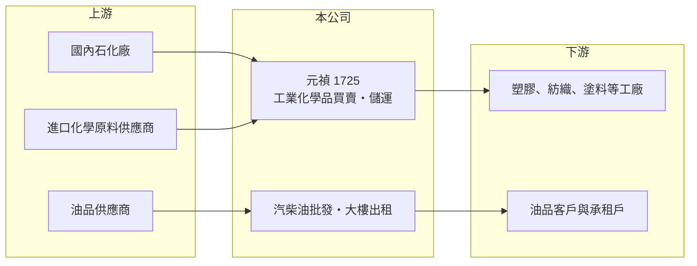

# 1725 元禎

> 上市｜[[產業索引-化學工業|化學工業]]｜上市（櫃）日期 2000/09/11

# 第一章：企業模式與商業藍圖

> [!info] 撰寫說明
> 精簡版，由 Claude 依公開資料整理，架構比照 [[2330台積電]]，資料截至 2026-10-08。來源：nStock 公司資料、winvest 公司簡介與營收快訊、Goodinfo 年度經營績效。公開資料有限，代理產品、客戶與轉投資明細未查得。#待校對

元禎是一家以工業化學品買賣為主的公司，營收規模不小，但毛利率只有約 5%，本質上是賺取流通價差的化學品通路商。

- **核心業務：** 依公司營業項目，元禎經營工業用化學品的製造加工與買賣、汽柴油批發，以及大樓出租。公司簡介把主業描述為「化工原料物流」，也就是向石化廠或國外供應商採購化學原料，再分裝、儲運並銷售給下游工業客戶。
- **營收結構：** 各產品線比重本次未查到。從毛利率長期在 4% 至 5.5% 之間來看，營收以低毛利的[[化學品貿易]]為主，租賃收入規模較小但毛利較高（推估）。
- **公司沿革：** 元禎成立於 1977 年，2000 年上市，資本額約 18.2 億元，股本多年未變。營收規模在 70 億至 107 億元之間，跟著化學原料價格起伏。
- **長期方向：** 公開資料沒有明確的轉型計畫。每股淨值從 2016 年的 14.62 元成長到 2025 年的 36.5 元，增幅遠大於累積盈餘，推估來自金融資產或轉投資的評價增加，公司的價值有相當部分來自本業以外的資產。

# 第二章：護城河深度與競爭優勢

化學品通路商的護城河主要是供應商代理關係、儲運設施與客戶網絡，屬於窄護城河。

- **競爭優勢：** 化學品通路需要危險品儲運許可、倉儲與車隊，以及與上游石化廠的長期採購關係，新進者要同時具備這些條件並不容易。元禎經營近 50 年，累積了穩定的客戶與供應來源，能在中小型工業客戶需要少量多樣供貨時發揮作用。
- **主要對手：** 國內化學品通路與溶劑貿易商，例如 [[1773勝一]]，以及石化大廠自己的直銷通路。通路商在價格上缺乏主導權，上游石化廠調價時只能被動跟隨。
- **觀察重點：** 長期要看本業營業利益率能否維持在 2% 左右的水準、業外收益的穩定性，以及高額淨值如何配置（例如配息或轉投資）。由於本業報酬低，資本配置決策對股東報酬的影響比本業成長更大。

# 第三章：財務體質與盈利規模

資料日期：2026-10-08，表格是撰寫當時的快照；最新月營收、毛利率、累計 EPS 由自動排程寫在本筆記的屬性欄位（月營收、毛利率、累計EPS 等）。#待校對

元禎的財務特徵是「營收大、毛利薄、獲利穩、淨值高」，營業利益率十年來幾乎都在 2% 左右。

| 年度 | 營收（億元） | [[毛利率]] | [[營業利益率]] | EPS（元） | [[ROE]] |
|---|---|---|---|---|---|
| 2021 | 107 | 4.44% | 2.30% | 1.76 | 8.22% |
| 2022 | 92.1 | 4.63% | 2.02% | 1.40 | 5.96% |
| 2023 | 75.0 | 5.06% | 2.12% | 1.10 | 4.57% |
| 2024 | 83.9 | 4.89% | 2.18% | 1.91 | 6.85% |
| 2025 | 80.0 | 4.59% | 1.82% | 1.53 | 4.56% |

- **長期趨勢：** 2020 至 2025 年營收由 70.7 億元到 80 億元，年複合成長率約 2.5%（推算）。營業利益率在 1.8% 至 2.4% 的窄幅區間，十年來沒有明顯改善也沒有惡化，是典型的通路商獲利結構。近 5 年平均 ROE 約 6.0%（推算），呈下滑趨勢，主因是淨值增加的速度快於獲利。
- **業外與股利：** 每年有 0.7 億至 2 億元的業外收益，占稅後淨利的比重在三到六成之間，2024 年業外 2.07 億元、稅後淨利 3.47 億元。nStock 資料顯示近五年平均現金股利約 1.08 元，配息穩定。
- **[[ROIC]] 與 [[WACC]]：** 2025 年營業利益約 1.46 億元（80 億 × 1.82%），扣 20% 稅後約 1.16 億元；股東權益約 66 億元（每股淨值 36.5 元 × 約 1.82 億股），有息負債未查得，僅以權益計算 ROIC 約 1.8%（推算）。WACC 以 CAPM 推估：無風險利率 1.75%、市場風險溢酬 6%、β 假設 0.7，股權成本約 5.9%，WACC 約 5.5%（推算）。本業 ROIC 遠低於 WACC，但這主要是因為淨值裡有大量非營業資產；若只看營運所需的資本，通路本業的報酬會高一些（推估）。整體而言，元禎的股東價值取決於非營業資產的報酬，而非化學品貿易本身。

# 第四章：總體風險與地緣政治

元禎的風險不在虧損，而在本業成長有限與資產配置效率偏低。

- **產業週期：** 化學原料價格隨原油與石化景氣大幅波動，元禎的營收會跟著漲跌，例如 2021 年 107 億元、2023 年 75 億元。通路商毛利以價差計算，原料急跌時手上庫存可能出現跌價損失。
- **營運風險：** 毛利率不到 5%，只要費用或呆帳增加一點，營業利益就會明顯下降。下游客戶以傳統製造業為主，產業外移會讓國內化學品需求長期萎縮。
- **其他風險：** 化學品儲運涉及危險物品管理，發生工安或環保事故的責任重大。業外收益與淨值變化受金融市場影響，股市修正時獲利與淨值都可能下降。

# 專有名詞解析

## 金融

- **[[業外收益]]**：本業以外的收入，例如轉投資收益、處分資產利益、利息與股利收入，通常較不穩定。
- **[[每股淨值]]**：股東權益除以流通股數，代表每一股在帳面上對應的公司淨資產。
- **[[ROIC]]**：投入資本報酬率，稅後營業利益除以股東權益加有息負債，衡量本業運用資本的效率。
- **[[WACC]]**：加權平均資金成本，股權成本與稅後負債成本依資本結構加權，是 ROIC 要超越的門檻。

## 產業

- **[[化學品貿易]]**：向石化廠或國外供應商採購化學原料，再分裝、儲運並銷售給下游工廠的通路業務，毛利率低但周轉快。

# 核心供應鏈

- 上游：國內石化廠與國外化學原料供應商、油品供應商（推估，名稱未查得）
- 下游／客戶：塑膠、紡織、塗料、電子等工業客戶，以及油品客戶與大樓承租戶，名稱未揭露
- 同業：[[1773勝一]] 等化學品與溶劑通路商；台灣化學類股 [[1714和桐]]、[[1717長興]]、[[1718中纖]]

## 最新新聞
<!-- news:start（自動產生，請勿手動編輯此範圍） -->
- 2026-10-07 🏛️ 重訊 17:18｜公告本公司召開法說會相關內容｜[觀測站](https://mops.twse.com.tw/mops/#/web/t05st01)

完整紀錄：[[1725元禎 新聞]]
<!-- news:end -->

## 相關連結
- [公開資訊觀測站](https://mopsov.twse.com.tw/mops/web/t05st03?step=1&firstin=1&co_id=1725)
- [Goodinfo](https://goodinfo.tw/tw/StockDetail.asp?STOCK_ID=1725)
- [Yahoo 股市](https://tw.stock.yahoo.com/quote/1725)
- [鉅亨網新聞](https://www.cnyes.com/twstock/1725/news)
