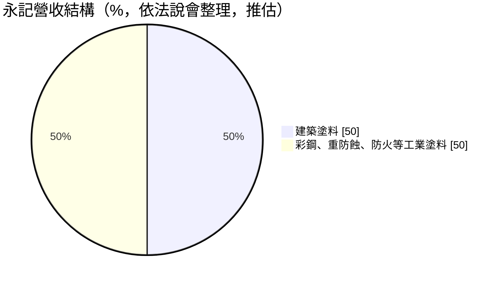
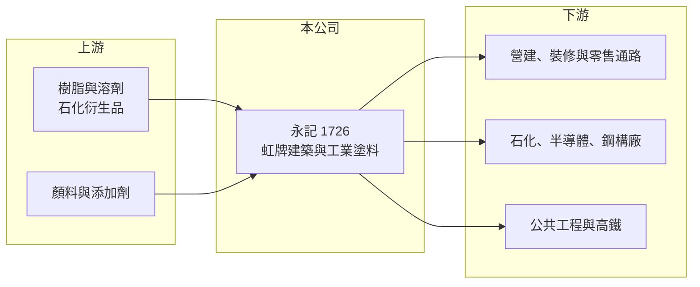

# 1726 永記

> 上市｜[[產業索引-化學工業|化學工業]]｜上市（櫃）日期 2000/09/11

# 第一章：企業模式與商業藍圖

> [!info] 撰寫說明
> 精簡版，由 Claude 依公開資料整理，架構比照 [[2330台積電]]，資料截至 2026-10-08。來源：富果研究 2025 年 12 月永記法說會整理、nStock 公司資料、Goodinfo 年度經營績效、CMoney 與工商時報相關報導（搜尋結果標題）。#待校對

永記造漆是台灣塗料龍頭，以「虹牌油漆」品牌經營建築與工業塗料，長年保持穩定獲利與高配息，是傳統產業中體質相當健康的公司。

- **核心業務：** 永記生產與銷售油漆塗料並承攬塗裝工程，品牌包括虹牌、彩虹屋調色中心與永氟龍氟碳塗料。產品涵蓋建築塗料、[[重防蝕塗料]]、[[防火塗料]]、彩鋼塗料、船舶塗料、環氧樹脂地坪、防水塗料與木器塗料，幾乎覆蓋所有塗裝需求。
- **營收結構：** 依法說會整理，建築塗料占營收比重最高，接近 50%；彩鋼塗料也占相當比重，但確切比例未揭露。其餘為重防蝕、防火、地坪、防水與船舶等工業用塗料，客戶多為大型工程與工廠。

- **營運據點：** 共有 8 個生產據點：台灣高雄總廠、中國兩廠、越南、馬來西亞，以及美國加州、德州、芝加哥三廠。客戶包括台塑六輕、台船、[[2330台積電]]、友達、康寧、燁輝、盛餘與台灣高鐵等，顯示永記同時服務石化、半導體、鋼鐵與公共工程市場。
- **長期方向：** 公司在台灣市占率超過五成，策略是深耕國內核心市場、把重心放在大型公共建設與科技廠房工程，並投入離岸風電用重防蝕塗料的研發。環保方面，木器塗料已轉向水性配方，並取得綠建材與 UL GreenGuard 等認證。

# 第二章：護城河深度與競爭優勢

永記的護城河來自品牌、通路與工程實績，在台灣塗料市場屬於寬度不錯的護城河。

- **競爭優勢：** 虹牌在台灣是家喻戶曉的油漆品牌，加上彩虹屋調色中心可提供 2,232 種電腦調色，品牌與通路讓永記在零售與裝修市場有[[品牌溢價]]。工業塗料方面，重防蝕、防火與高鐵防水等工程需要長期實績與規格認證，業主不會輕易換用沒有案例的供應商。
- **主要對手：** 國際塗料大廠在台灣與亞洲市場競爭，例如立邦、阿克蘇諾貝爾、PPG 等；國內則有多家中小型油漆廠與工業塗料商。永記在建築塗料以品牌與通路對抗外商，在工業塗料以工程經驗與在地服務競爭。
- **觀察重點：** 長期看三點：台灣房市與裝修需求的變化、科技廠房與公共工程訂單的延續性（法說會指出鋼構廠接單能見度已到 2026 至 2027 年），以及彩鋼塗料外銷受美國關稅影響的程度。

# 第三章：財務體質與盈利規模

資料日期：2026-10-08，表格是撰寫當時的快照；最新月營收、毛利率、累計 EPS 由自動排程寫在本筆記的屬性欄位（月營收、毛利率、累計EPS 等）。#待校對

永記十年來 EPS 幾乎都在 4.2 元至 6.5 元之間，毛利率穩定在 22% 至 29%，是本批化學股中獲利最穩定的公司之一。

| 年度 | 營收（億元） | [[毛利率]] | [[營業利益率]] | EPS（元） | [[ROE]] |
|---|---|---|---|---|---|
| 2021 | 88.7 | 25.2% | 11.3% | 5.45 | 9.81% |
| 2022 | 97.4 | 22.2% | 8.93% | 5.03 | 8.67% |
| 2023 | 93.5 | 25.0% | 10.1% | 5.13 | 8.59% |
| 2024 | 95.3 | 26.0% | 10.4% | 5.28 | 8.54% |
| 2025 | 97.9 | 26.7% | 11.1% | 5.50 | 8.62% |

- **長期趨勢：** 2020 至 2025 年營收由 79.9 億元成長到 97.9 億元，年複合成長率約 4.1%（推算），成長溫和但穩定。2022 年原料上漲時毛利率降到 22.2%，之後逐年回升到 26.7%，顯示永記有能力把原料成本轉嫁給客戶。近 5 年平均 ROE 約 8.8%（推算）。
- **股利與財務體質：** 法說會指出股利[[配發率]]近年維持在七成左右，連續四年發放 3.5 元現金股利後，2025 年提高到 3.6 元，nStock 資料顯示 2025 年度盈餘配發 3.7 元；近五年平均現金股利約 3.56 元。負債比約 12%，幾乎沒有財務槓桿，ROE 不高的主因是帳上淨值與現金充裕，而非本業獲利差。
- **[[ROIC]] 與 [[WACC]]：** 2025 年營業利益約 10.9 億元（97.9 億 × 11.1%），扣 20% 稅後約 8.7 億元；股東權益約 104 億元（每股淨值 64.38 元 × 約 1.62 億股），負債比僅約 12%，有息負債視為很低，ROIC 約 8.3%（推算）。WACC 以 CAPM 推估：無風險利率 1.75%、市場風險溢酬 6%、β 假設 0.6（民生與建材類股常見值），股權成本約 5.4%，幾乎無負債，WACC 約 5.3%（推算）。ROIC 長期高於 WACC 約 3 個百分點，代表永記穩定創造價值；若扣除帳上多餘現金，實際營運資本的報酬會更高。

# 第四章：總體風險與地緣政治

永記的風險主要來自房市景氣、原料價格與海外市場的貿易政策，整體風險屬於中低。

- **產業週期：** 建築塗料跟著新建案、裝修與房屋交易量走，房市降溫時需求會下滑。工業塗料則受科技廠房、石化廠與公共工程投資週期影響，好處是兩者景氣不一定同步，能互相抵銷一部分波動。
- **營運風險：** 塗料的主要原料是樹脂、顏料與溶劑，屬石化衍生品，原油價格急漲時毛利率會被壓縮，2022 年即是例子。工程類業務若遇到工程延宕或業主付款延遲，也會影響收入認列與現金流。
- **其他風險：** 彩鋼塗料外銷受美國關稅影響，海外據點則有匯率風險。環保法規持續提高揮發性有機物（VOC）的管制標準，溶劑型塗料必須持續轉型，這既是成本也是水性塗料的機會。

# 專有名詞解析

## 金融

- **[[配發率]]**：現金股利占每股盈餘的比例，反映公司把多少獲利以現金發還股東。
- **[[ROIC]]**：投入資本報酬率，稅後營業利益除以股東權益加有息負債，衡量本業運用資本的效率。
- **[[WACC]]**：加權平均資金成本，股權成本與稅後負債成本依資本結構加權，是 ROIC 要超越的門檻。

## 產業

- **[[重防蝕塗料]]**：用於鋼構、儲槽、橋樑與離岸風機等嚴苛環境的高性能塗料，要求數十年不鏽蝕，需經規格認證與長期實績。
- **[[防火塗料]]**：塗在鋼構上、受熱時膨脹形成隔熱層的塗料，延緩鋼材在火災中軟化，用於高樓與科技廠房。
- **[[品牌溢價]]**：消費者願意為知名品牌多付的價格，來自品牌信任、通路覆蓋與售後服務。

# 核心供應鏈

- 上游：樹脂、溶劑、顏料與添加劑供應商（推估，名稱未查得）
- 下游／客戶：營建與裝修業者、油漆零售通路；工業客戶包括台塑六輕、台船、[[2330台積電]]、友達、康寧、燁輝、盛餘與台灣高鐵
- 同業：立邦、阿克蘇諾貝爾、PPG 等國際塗料大廠，以及國內中小型塗料廠

## 最新新聞
<!-- news:start -->
<!-- news:end -->

## 相關連結
- [公開資訊觀測站](https://mopsov.twse.com.tw/mops/web/t05st03?step=1&firstin=1&co_id=1726)
- [Goodinfo](https://goodinfo.tw/tw/StockDetail.asp?STOCK_ID=1726)
- [Yahoo 股市](https://tw.stock.yahoo.com/quote/1726)
- [鉅亨網新聞](https://www.cnyes.com/twstock/1726/news)
