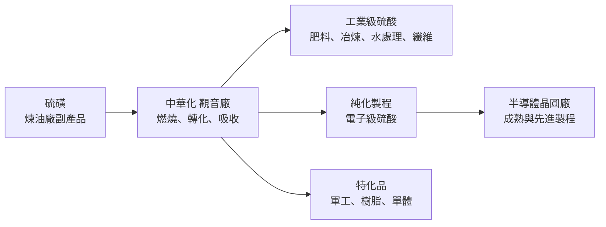
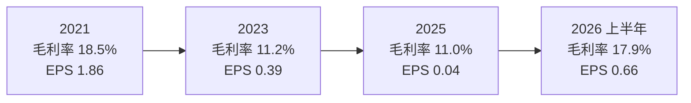
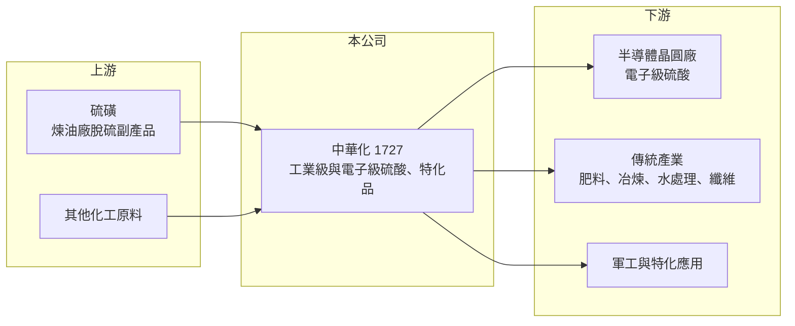

# 1727 中華化

> 上市｜[[產業索引-化學工業|化學工業]]｜上市（櫃）日期 2000/09/11

# 第一章：企業模式與商業藍圖

> [!info] 撰寫說明
> 本文由 Claude 依公開資料整理，架構比照 [[2330台積電]] 的四章研究，資料截至 2026-10-08。財務數字來源：Goodinfo 台灣股市資訊網年度經營績效、nStock 公司資料、優分析報導（2026 年 9 月）、經濟日報新聞標題、證交所開放資料（本筆記 _data 快照）；產品營收比重與客戶名稱公開資料有限，產業描述為整理性內容，尚未逐條比對原始文件。#待校對

在評估單一個股的長期投資價值時，首要步驟是拆解企業的底層獲利邏輯。本章說明臺灣中華化學工業（股票代號：1727，以下簡稱中華化）這家近七十年的硫酸廠，如何從傳統基礎化學品走向半導體用的[[電子級化學品]]，以及這個轉型對它長期獲利結構的意義。

## 一、核心定位：台灣老牌硫酸製造商

中華化成立於 1956 年，總部與工廠位於桃園觀音工業區，2000 年在證交所上市，董事長干文元、總經理干凱恩。依公司登記的營業項目，中華化主要從事硫酸等化學工業原料的製造與買賣，也承接相關化學工程設計、原料進出口與代理經銷。

硫酸是用量最大的基礎化學品之一，被稱為「化學工業之母」，廣泛用於肥料、金屬冶煉、水處理、紙漿、纖維與電池等產業。工業級硫酸的特性是產品同質、運輸成本高，因此通常由在地工廠供應鄰近客戶，價格隨原料硫磺與市場供需波動。這樣的生意穩定但毛利不高，中華化過去八年的[[毛利率]]多在 11% 至 13% 之間。

## 二、產品板塊：從工業級硫酸走向電子級硫酸

產品別營收比重未查得。依 2026 年 9 月優分析報導，中華化的產品與研發方向可以分成三類：

* **工業級硫酸與基礎化學品：** 公司的傳統本業，供應國內各產業使用，是營收的主要基本盤（推估）。
* **電子級硫酸：** 半導體晶圓清洗與蝕刻製程需要極高純度的硫酸，金屬雜質要控制在極低的濃度。中華化的電子級硫酸已穩定供應成熟製程，先進製程產線在 2026 年第一季通過認證、5 月起少量出貨，另有 3 家半導體業者正在認證中。經濟日報曾以「台積電先進製程扮演新動能」為題報導，具體客戶名稱公司未揭露。
* **新特化產品：** 包括軍工特化品（已取得標案與第二批訂單），以及研發中的高頻樹脂材料、航太燃油與工程塑料單體。

## 三、資本轉化邏輯：硫磺變硫酸，純化創造附加價值

硫酸的主要原料是硫磺，多半來自煉油廠脫硫的副產品。硫磺燃燒成二氧化硫，再轉化並吸收成硫酸，製程本身相當成熟。中華化的獲利關鍵在於兩件事：

* **原料與售價的[[價差]]：** 工業級硫酸的獲利取決於硫磺成本與硫酸售價的差距。2026 年硫磺與化工原料價格大漲，帶動硫酸與特化產品報價上升，是當年獲利改善的原因之一。
* **純化帶來的附加價值：** 同樣是硫酸，電子級產品需要額外的純化、潔淨包裝與品質檢測，售價與毛利都遠高於工業級。電子級比重提高，是中華化毛利率結構性上升的關鍵。

## 四、企業長期藍圖：半導體材料在地化

* **電子級硫酸擴產（2025 至 2026 年）：** 新產線在 2026 年第三季末開始放量，目前共有 5 條產線運作。台灣是全球晶圓代工重鎮，半導體廠為降低供應鏈風險，傾向在地採購化學品，這是中華化切入的長期機會。
* **特化多元化：** 軍工、航太與工程塑料等應用，讓公司不只依賴硫酸單一產品。
* **資本配置習慣：** 公司章程規定每年至少分配可分配盈餘的 10%，其中現金股利至少占 30%。2024 年度配發現金股利 0.5 元，2025 年度 EPS 只有 0.04 元，仍配發 0.15 元，近五年平均現金股利約 0.44 元。

# 第二章：護城河深度與競爭優勢

在長期價值投資中，「護城河」指企業抵禦競爭、維持超額利潤的保護機制。本章分析中華化在硫酸與電子級化學品市場的護城河、競爭對手，以及轉型能否提升它的長期獲利能力。

## 一、護城河的核心組成要素

中華化的傳統本業幾乎沒有護城河，新的護城河正在電子級產品上建立。

* **1. 在地供應與運輸半徑：** 硫酸是危險化學品，長途運輸成本高、管制嚴格，在地工廠對鄰近客戶有天然優勢。這是工業級硫酸業務能長期存在的原因，但無法帶來高毛利。
* **2. 半導體認證門檻：** 電子級硫酸要通過晶圓廠嚴格的品質驗證，從送樣到量產往往需要一年以上。一旦通過，客戶不會輕易更換供應商，因為更換化學品可能影響製程良率。這是中華化正在建立的核心護城河。
* **3. 老牌工廠的執照與經驗：** 化學工廠的設廠許可、環評與安全管理門檻很高，新進者不容易在台灣新設硫酸廠。

## 二、全球主要競爭對手格局

| 對手 | 定位 | 對中華化的威脅 |
|---|---|---|
| 日本、韓國電子化學品大廠 | 長期供應全球晶圓廠的高純度化學品 | 品質與實績領先，是先進製程的主要供應商（推估） |
| [[4755三福化]] | 台灣電子化學品廠 | 在半導體濕製程化學品領域部分重疊（推估） |
| 台灣其他硫酸與基礎化學品廠 | 工業級硫酸 | 在工業級市場以價格競爭（推估） |

## 三、優勢轉化：守得住／守不住／觀察重點

* **守得住：** 已通過認證的電子級硫酸，以及在地供應的工業級客戶。半導體在地化趨勢對台灣供應商有利。
* **守不住：** 工業級硫酸的價格。這部分是標準化商品，價格跟著原料與景氣走，公司無法主導。2025 年毛利率降到 11%、營業利益幾乎為零，顯示工業級本業的獲利非常薄。
* **觀察重點：** 長期可以觀察三個指標：電子級產品占營收比重；新增半導體客戶的認證進度；以及毛利率能否從過去的 11% 至 13% 結構性提升到 15% 以上。

# 第三章：財務體質與盈利規模

資料日期：2026-10-08。數字取自 Goodinfo 年度經營績效、nStock 與證交所開放資料快照，表格是撰寫當時的快照；最新月營收、毛利率、累計 EPS 由自動排程寫在本筆記的屬性欄位（月營收、毛利率、累計EPS 等）。#待校對

財務報表是檢驗護城河是否真實存在的最終標準。本章用多年度的三率、ROE 與資本報酬，檢視中華化從傳統化學品轉型過程中的獲利品質。

## 一、獲利能力的基石：三率

| 年度 | 營收（新台幣） | [[毛利率]] | [[營業利益率]] | EPS（元） | [[ROE]] |
|---|---|---|---|---|---|
| 2018 | 26.5 億 | 13.0% | 4.2% | 0.90 | 6.6% |
| 2019 | 21.7 億 | 11.9% | 2.4% | 0.30 | 2.1% |
| 2020 | 17.7 億 | 10.9% | 0.6% | -1.26 | -11.2% |
| 2021 | 20.1 億 | 18.5% | 7.9% | 1.86 | 15.1% |
| 2022 | 23.1 億 | 12.2% | 2.9% | 1.11 | 8.3% |
| 2023 | 17.2 億 | 11.2% | 0.2% | 0.39 | 2.7% |
| 2024 | 20.8 億 | 13.0% | 3.4% | 0.51 | 3.2% |
| 2025 | 19.7 億 | 11.0% | 0.1% | 0.04 | 0.3% |

* **[[毛利率]]：** 長期在 11% 至 13% 之間，只有 2021 年原料與景氣循環有利時升到 18.5%。2026 年上半年回到 17.9%，原因包括電子級產品出貨與硫酸報價上漲。
* **[[營業利益率]]：** 多數年份在 0% 至 4% 之間，代表工業級本業扣除費用後幾乎不賺錢。2026 年上半年升到 8.9%，是近年高點。
* **長期指標：** 2020 至 2025 年營收年複合成長率約 2.2%（推算）；2021 至 2025 年五年平均 ROE 約 5.9%（推算），其中大部分來自 2021 年。2026 年上半年營收 11.6 億元、EPS 0.66 元，已遠超過 2025 年全年。

## 二、[[ROE]]：資本效率

中華化 ROE 長期偏低，八年中只有 2021 年超過 10%。2026 年第二季底總資產約 38.0 億元、總負債約 16.4 億元、股東權益約 21.6 億元。負債比約 43%，高於一般輕資產公司，推估與擴建電子級產線有關（借款明細未查得）。

## 三、資本支出與自由現金流

* **[[CapEx]]：** 電子級硫酸需要新建純化產線與潔淨包裝設施，2025 至 2026 年處於擴產期，資本支出較高，具體金額未查得。
* **[[自由現金流]]：** 工業級本業獲利薄，擴產期的自由現金流可能為負（推估，逐年數字未查得）。2025 年在 EPS 0.04 元的情況下仍配發 0.15 元現金股利，配息率超過 100%，顯示公司重視股利延續性，但長期需靠電子級產品的獲利支撐。

## 四、[[ROIC]] 與 [[WACC]]：價值創造利差

有息負債金額未查得，先以股東權益近似投入資本（為 ROIC 的上限值）。以 2024 年為例，營業利益約 0.71 億元（營收 20.8 億元 × 營業利益率 3.39%），扣除 20% 稅率後約 0.56 億元；以淨利約 0.65 億元與 ROE 3.2% 回推，股東權益約 20 億元，ROIC 約 2.8%（推算）。2025 年營業利益接近零，ROIC 約 0%（推算）。以 2026 年上半年年化估算，營業利益約 2.07 億元，稅後約 1.66 億元，除以股東權益 21.6 億元，ROIC 約 7.7%（推算）。

WACC 以 CAPM 推估：台灣 10 年期公債約 1.5% 至 2%，市場風險溢酬約 6%，β 未查得個股數值，採化學工業常見的 0.8 至 1.0（假設），股東權益成本約 6.3% 至 8.0%。假設有息負債占投入資本約 30%、稅前利率 2.5%，WACC 約 5% 至 6%（推算）。

比較兩者，中華化過去八年多數年份的 ROIC 低於 WACC，代表傳統硫酸本業長期沒有創造價值。2026 年上半年年化 ROIC 首次明顯超過 WACC，若電子級產品比重持續提高、且不是只靠原料行情，這會是公司體質的結構性轉變；若主要來自硫酸報價上漲，則可能隨原料循環回落。

# 第四章：總體風險與地緣政治

任何企業都無法脫離宏觀環境獨立存在。本章分析中華化長期必須面對的產業週期、營運與法規風險。

## 一、地緣政治

* **半導體在地化的機會與風險：** 地緣政治推動晶圓廠在地採購材料，對中華化有利；但台灣晶圓廠同時到美國、日本、德國設廠，海外工廠的化學品可能改由當地供應商供貨。
* **原料進口：** 硫磺價格受國際煉油與能源市場影響，國際衝突可能造成原料價格劇烈波動。

## 二、產業週期與市場結構

* **工業級硫酸的景氣循環：** 硫酸需求跟著肥料、金屬冶煉、纖維與化工產業走，價格隨原料與供需大幅波動。2020 年與 2023 年營收明顯下滑，就是景氣循環的結果。
* **半導體客戶集中：** 電子級產品的客戶是少數大型晶圓廠，若主要客戶調整採購比例，影響會很明顯。

## 三、營運環境的隱性風險

* **[[原物料]]價格：** 硫磺價格上漲時若無法即時轉嫁，毛利率會被壓縮；價格下跌時硫酸報價也會跟著下滑。
* **工安與環保：** 硫酸屬於危險化學品，工廠事故、洩漏或環保違規都可能造成停工與罰款，影響商譽與客戶認證。
* **品質穩定性：** 電子級化學品只要一批出現雜質，就可能影響客戶良率，品質事故的代價很高。

## 四、科技或法規演進

* **先進製程規格提高：** 製程越先進，對化學品純度要求越高，中華化需要持續投資純化與檢測能力，才能跟上客戶的技術節點。
* **碳排與環保法規：** 化學工業面臨碳費與更嚴格的排放標準，會增加長期營運成本。

# 專有名詞解析

## 半導體

- **[[電子級化學品]]**：半導體與面板製程使用的高純度化學品，金屬雜質須控制在極低濃度，認證門檻高。

## 金融

- **[[ROIC]]**：投入資本報酬率，稅後營業利益除以投入資本，衡量本業運用資金創造報酬的能力。
- **[[WACC]]**：加權平均資金成本，股東與債權人要求報酬率的加權平均，是 ROIC 要超過的門檻。

## 產業

- **[[原物料]]**：生產所需的基礎材料，價格波動會直接影響製造業的成本與毛利率。
- **[[價差]]**：產品售價與原料成本之間的差距，是基礎化學品與大宗原物料業者的主要獲利來源。

# 核心供應鏈

## 1. 上游：原料
- 硫磺：國內煉油廠如 [[6505台塑化]]（推估，供應商公司未揭露）

## 2. 本公司：中華化
- 產品：工業級硫酸、電子級硫酸、軍工特化品；研發中的高頻樹脂材料、航太燃油、工程塑料單體

## 3. 下游：客戶
- 半導體晶圓廠：成熟與先進製程客戶，另有 3 家認證中（名稱未揭露；媒體報導提及 [[2330台積電]]）
- 傳統產業與政府軍工標案

## 4. 同業
- 國際：日本、韓國電子化學品廠（推估）
- 台灣：[[4755三福化]]（推估，電子化學品領域部分重疊）

## 最新新聞
<!-- news:start（自動產生，請勿手動編輯此範圍） -->
- 2026-10-05 📰 媒體 19:50｜營收速報 - 中華化(1727)9月營收2.53億元年增率高達40.38％｜[鉅亨網](https://news.cnyes.com/news/id/6621989)

完整紀錄：[[1727中華化 新聞]]
<!-- news:end -->

## 相關連結
- [公開資訊觀測站](https://mopsov.twse.com.tw/mops/web/t05st03?step=1&firstin=1&co_id=1727)
- [Goodinfo](https://goodinfo.tw/tw/StockDetail.asp?STOCK_ID=1727)
- [Yahoo 股市](https://tw.stock.yahoo.com/quote/1727)
- [鉅亨網新聞](https://www.cnyes.com/twstock/1727/news)
