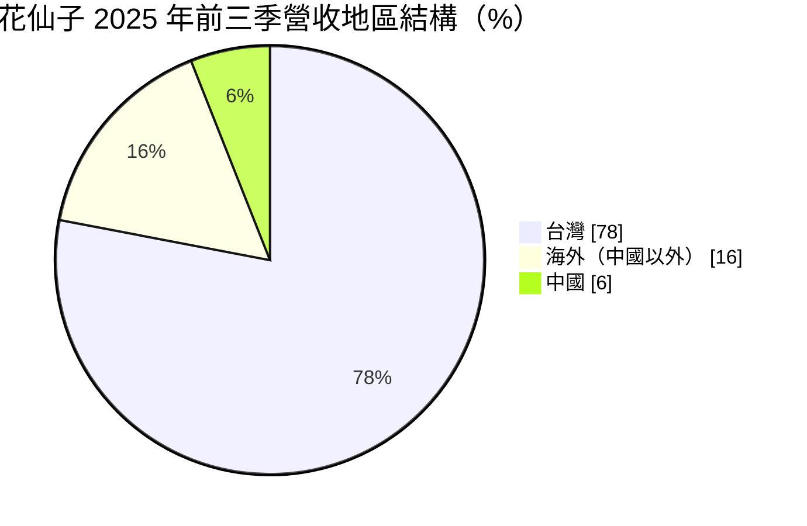
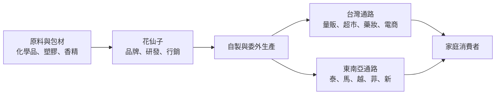
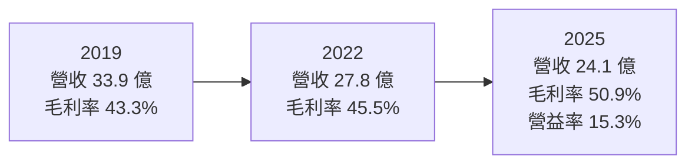
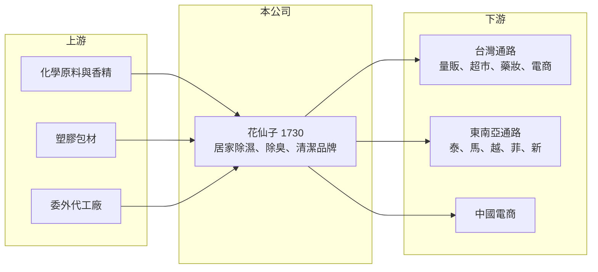

# 1730 花仙子

> 上市｜[[產業索引-化學工業|化學工業]]｜上市（櫃）日期 2001/09/17

# 第一章：企業模式與商業藍圖

> [!info] 撰寫說明
> 本文由 Claude 依公開資料整理，架構比照 [[2330台積電]] 的四章研究，資料截至 2026-10-08。財務數字來源：Goodinfo 台灣股市資訊網年度經營績效、聯合報報導（2026 年 2 月）、證交所開放資料（本筆記 _data 快照）；品牌名稱與產品比重未逐一核對公司年報，產業描述為整理性內容，尚未逐條比對原始文件。#待校對

在評估單一個股的長期投資價值時，首要步驟是拆解企業的底層獲利邏輯。本章說明花仙子企業（股票代號：1730，以下簡稱花仙子）這家台灣居家清潔與香氛品牌公司，如何在營收縮小的同時把毛利率拉高，以及它向東南亞擴張的長期方向。

## 一、核心定位：台灣居家清潔用品的品牌公司

花仙子成立於 1983 年，總部位於台北，2001 年在證交所上市，董事長蔡心心。依聯合報報導，花仙子是台灣家用清潔產品的代表性業者。公司的產品涵蓋居家除濕、除臭香氛、清潔工具與清潔劑等日常消耗品，旗下品牌包括克潮靈、去味大師、驅塵氏、好神拖等（品牌清單待校對）。

品牌消費品的商業模式和製造業不同：花仙子的核心資產不是工廠，而是品牌認知與通路上架位置。消費者在量販店、超市或電商選購除濕盒、芳香劑時，習慣挑熟悉的牌子，這讓品牌商可以維持比代工廠高得多的毛利率。花仙子的[[毛利率]]長期在 43% 至 51% 之間，就是這種商業模式的結果。

## 二、市場板塊：台灣為主，海外以東南亞為重點

依聯合報報導，2025 年前三季營收的地區結構如下：

* **台灣（78%）：** 本業基本盤。花仙子在台灣量販、超市與電商通路的鋪貨完整，品牌知名度高，是主要的獲利來源。
* **海外（16%）：** 以東南亞為主，在泰國、馬來西亞、越南設有分公司，並新進菲律賓 SM 連鎖超市與新加坡 NTUC FairPrice 通路。公司表示，中國以外的海外市場獲利率最好。
* **中國（6%）：** 公司正進行體質調整，聚焦電商經營、保守營運，以提升利潤為優先。

## 三、資本轉化邏輯：品牌、通路與產品組合

花仙子把資源集中在品牌經營、產品研發與通路管理。它的獲利邏輯有三個關鍵：

* **重複購買的消耗品：** 除濕、除臭與清潔用品用完就要補貨，需求穩定、不太受景氣影響，這是民生消費股的典型特徵。
* **產品組合優化：** 2019 年至 2025 年營收從 33.9 億元降到 24.1 億元，但毛利率從 43% 升到 51%，營業利益率也維持在 10% 至 15%。這代表公司主動退出低毛利產品與虧損客戶，把資源集中在高獲利品項與通路。
* **通路費用控制：** 品牌商的主要費用是通路上架、促銷與廣告。公司表示會聚焦高獲利通路客戶、減少虧損客戶的投資，這是營業利益率能在營收下滑時仍上升的原因。

## 四、企業長期藍圖：東南亞擴張與物流自主

* **東南亞多點布局：** 花仙子以東南亞為主要成長方向，從泰國、馬來西亞、越南延伸到菲律賓與新加坡。東南亞人口年輕、氣候濕熱，對除濕與清潔用品需求大，是台灣品牌較容易複製經驗的市場。
* **自建倉儲（2026 年）：** 花仙子與子公司帝凱國際實業在桃園楊梅購入不動產並建置倉儲，以解決長期沒有自有倉儲的物流問題。這屬於改善營運結構的長期投資。
* **資本配置習慣：** 公司章程允許每半會計年度分派盈餘，近年採半年配息。2025 年下半年度配發現金股利 3.0 元，Goodinfo 統計長期平均現金股利約 1.63 元；2026 年上半年度董事會決議不配發（原因未查得，可能與倉儲投資有關，推估）。

# 第二章：護城河深度與競爭優勢

在長期價值投資中，「護城河」指企業抵禦競爭、維持超額利潤的保護機制。本章分析花仙子的品牌護城河、主要競爭對手，以及它在國際大廠與通路自有品牌夾擊下的位置。

## 一、護城河的核心組成要素

花仙子的護城河屬於「窄護城河」，來源是品牌與通路。

* **1. 品類領導品牌：** 在除濕、除臭等細分品類，花仙子的品牌在台灣有很高的認知度。消費者對小額日用品的品牌忠誠度雖然不高，但在貨架上看到熟悉的名字時，仍傾向選擇習慣的產品，這讓花仙子能維持約五成的毛利率。
* **2. 通路關係與鋪貨規模：** 品牌商要在量販、超市、藥妝與電商同時上架，需要長期的通路關係與議價能力。小品牌很難同時取得所有通路的好位置。
* **3. 本地化產品開發：** 台灣與東南亞氣候潮濕，除濕與防霉需求特別強，花仙子熟悉亞洲家庭的使用習慣，能推出比國際大廠更貼近在地需求的產品。

## 二、全球主要競爭對手格局

| 對手 | 定位 | 對花仙子的威脅 |
|---|---|---|
| P&G、SC Johnson、花王、獅王等國際品牌 | 全球居家清潔與香氛品牌 | 行銷預算大，在芳香劑與清潔劑市場競爭（推估） |
| [[1732毛寶]] | 台灣本土清潔用品品牌 | 在清潔劑與洗衣用品重疊（推估） |
| 通路自有品牌 | 量販與超市的自有商品 | 以低價搶占基本款市場（推估） |

## 三、優勢轉化：守得住／守不住／觀察重點

* **守得住：** 除濕、除臭等花仙子具領導地位的品類，以及東南亞濕熱氣候帶來的同類需求。這些品類的使用經驗容易複製到海外。
* **守不住：** 價格競爭激烈的一般清潔劑與基本款產品，以及中國市場。中國本土品牌與電商平台價格戰激烈，花仙子已主動收縮。
* **觀察重點：** 長期可以觀察三個指標：海外營收比重能否穩定提高；營收能否止跌回升而不犧牲毛利率；以及營業利益率能否維持在 15% 左右。

# 第三章：財務體質與盈利規模

資料日期：2026-10-08。數字取自 Goodinfo 年度經營績效、聯合報報導與證交所開放資料快照，表格是撰寫當時的快照；最新月營收、毛利率、累計 EPS 由自動排程寫在本筆記的屬性欄位（月營收、毛利率、累計EPS 等）。#待校對

財務報表是檢驗護城河是否真實存在的最終標準。本章用多年度的三率、ROE 與資本報酬，檢視花仙子品牌生意的獲利品質。

## 一、獲利能力的基石：三率

| 年度 | 營收（新台幣） | [[毛利率]] | [[營業利益率]] | EPS（元） | [[ROE]] |
|---|---|---|---|---|---|
| 2018 | 29.8 億 | 43.3% | 12.1% | 4.96 | 21.1% |
| 2019 | 33.9 億 | 43.3% | 12.8% | 5.37 | 21.3% |
| 2020 | 30.6 億 | 45.7% | 10.3% | 5.51 | 21.1% |
| 2021 | 31.4 億 | 43.9% | 10.7% | 4.14 | 15.7% |
| 2022 | 27.8 億 | 45.5% | 11.6% | 4.01 | 14.9% |
| 2023 | 26.2 億 | 47.6% | 11.5% | 3.65 | 13.4% |
| 2024 | 25.3 億 | 47.9% | 12.1% | 3.95 | 13.9% |
| 2025 | 24.1 億 | 50.9% | 15.3% | 4.50 | 14.8% |

* **[[毛利率]]：** 八年從 43% 穩定上升到 51%，是產品組合優化與退出低毛利業務的結果，也證明品牌有一定定價權。
* **[[營業利益率]]：** 長期在 10% 至 15% 之間，2025 年升到 15.3% 為八年高點。2026 年上半年維持在 15.9%。
* **長期指標：** 2020 至 2025 年營收年複合成長率約 -4.7%（推算），營收規模持續縮小；但 2021 至 2025 年五年平均 ROE 約 14.5%（推算），獲利能力穩定。2025 年營收 24.1 億元、稅後淨利 2.84 億元，年增 13.6%；2026 年上半年營收 12.6 億元、EPS 2.50 元。

## 二、[[ROE]]：資本效率

花仙子的 ROE 長期在 13% 至 21% 之間，以民生消費品公司來說相當穩定。2018 至 2020 年 ROE 超過 20%，之後降到 14% 至 15%，主因是營收縮小。2026 年第二季底總資產約 33.0 億元、總負債約 11.3 億元、股東權益約 21.7 億元，財務結構保守。

## 三、資本支出與自由現金流

* **[[CapEx]]：** 品牌公司平時的資本支出不高，2026 年購入楊梅不動產建置倉儲是較大的一次性投資，具體金額未查得。
* **[[自由現金流]]：** 消耗品需求穩定、資本支出低，自由現金流長期大致為正（推估，逐年數字未查得）。公司長期穩定配發現金股利，2025 年下半年度單次即配發 3.0 元。

## 四、[[ROIC]] 與 [[WACC]]：價值創造利差

有息負債金額未查得，先以股東權益近似投入資本（為 ROIC 的上限值）。以 2025 年為例，營業利益約 3.69 億元（營收 24.1 億元 × 營業利益率 15.3%），扣除 20% 稅率後約 2.95 億元；以淨利 2.84 億元與 ROE 14.8% 回推，股東權益約 19.2 億元，ROIC 約 15.4%（推算）。2023 年營業利益約 3.01 億元，稅後約 2.41 億元，ROIC 推估約 13% 至 14%。

WACC 以 CAPM 推估：台灣 10 年期公債約 1.5% 至 2%，市場風險溢酬約 6%，β 未查得個股數值，採民生消費股常見的 0.6 至 0.8（假設），股東權益成本約 5.1% 至 6.8%。負債以營業負債為主，假設有息負債占比低，WACC 約 5% 至 6.5%（推算）。

比較兩者，花仙子的 ROIC 長期明顯高於 WACC，利差約 8 至 10 個百分點，代表品牌生意在持續創造價值。它的問題不在獲利品質，而在成長：營收連年縮小，限制了能創造的價值總量。東南亞擴張能否讓營收重新成長，是長期價值能否擴大的關鍵。

# 第四章：總體風險與地緣政治

任何企業都無法脫離宏觀環境獨立存在。本章分析花仙子長期必須面對的市場結構、營運與匯率風險。

## 一、地緣政治

* **中國市場收縮：** 中國營收比重已降到 6%，公司主動調整體質。中國市場的政策與消費環境變化，對整體影響已不大，但也代表失去一個大型市場的成長機會。
* **東南亞擴張風險：** 各國法規、通路生態與消費習慣不同，海外子公司的經營成本與匯率風險高於台灣。

## 二、產業週期與市場結構

* **台灣市場飽和：** 台灣人口成長停滯、[[少子化]]與家庭規模縮小，居家清潔用品的總需求成長有限，這是花仙子營收連年下滑的結構性原因之一。
* **通路議價力：** 大型量販與電商平台議價能力強，上架費與促銷費用持續上升，會壓縮品牌商的利潤。
* **季節性：** 除濕產品需求受梅雨季與氣候影響，天氣異常時營收會波動。

## 三、營運環境的隱性風險

* **[[原物料]]成本：** 化學原料、塑膠包材與香精價格上漲時，若無法反映在售價，毛利率會受壓。
* **營收持續縮小：** 若東南亞成長無法彌補台灣與中國的下滑，固定費用占比會上升，長期侵蝕獲利率。

## 四、科技或法規演進

* **電商與直營：** 消費者購買行為轉向電商，品牌商需要投入數位行銷與物流能力，自建倉儲就是因應這個趨勢。
* **化學品與環保法規：** 清潔與芳香產品的成分、標示與包材回收規範日益嚴格，需要持續調整配方與包裝。

# 專有名詞解析

## 金融

- **[[ROIC]]**：投入資本報酬率，稅後營業利益除以投入資本，衡量本業運用資金創造報酬的能力。
- **[[WACC]]**：加權平均資金成本，股東與債權人要求報酬率的加權平均，是 ROIC 要超過的門檻。

## 產業

- **[[品牌溢價]]**：消費者願意為熟悉或信任的品牌支付高於同類產品的價格，是品牌消費品高毛利的來源。
- **[[少子化]]**：出生率長期偏低使人口結構老化、家庭規模縮小，影響民生消費品的長期需求。
- **[[原物料]]**：生產所需的基礎材料，價格波動會直接影響製造業的成本與毛利率。

# 核心供應鏈

## 1. 上游：原料與代工
- 化學原料、香精、塑膠包材與委外代工，供應商公司未揭露

## 2. 本公司：花仙子
- 產品：除濕、除臭香氛、清潔工具與清潔劑
- 子公司：帝凱國際實業

## 3. 下游：通路
- 台灣：量販、超市、藥妝與電商平台
- 東南亞：菲律賓 SM 連鎖超市、新加坡 NTUC FairPrice 等

## 4. 同業
- 國際：P&G、SC Johnson、花王、獅王（推估）
- 台灣：[[1732毛寶]]

## 最新新聞
<!-- news:start -->
<!-- news:end -->

## 相關連結
- [公開資訊觀測站](https://mopsov.twse.com.tw/mops/web/t05st03?step=1&firstin=1&co_id=1730)
- [Goodinfo](https://goodinfo.tw/tw/StockDetail.asp?STOCK_ID=1730)
- [Yahoo 股市](https://tw.stock.yahoo.com/quote/1730)
- [鉅亨網新聞](https://www.cnyes.com/twstock/1730/news)
