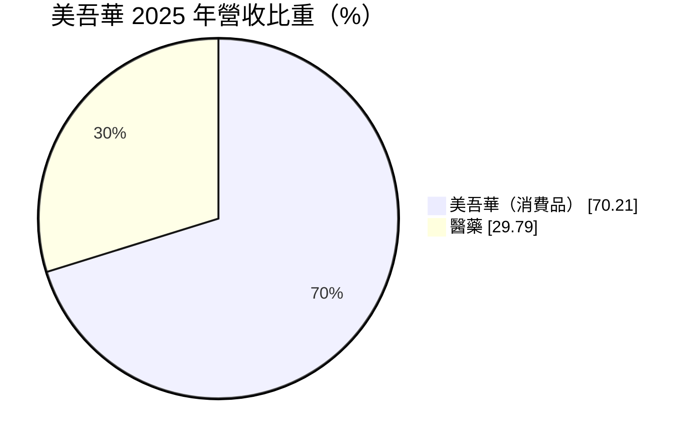
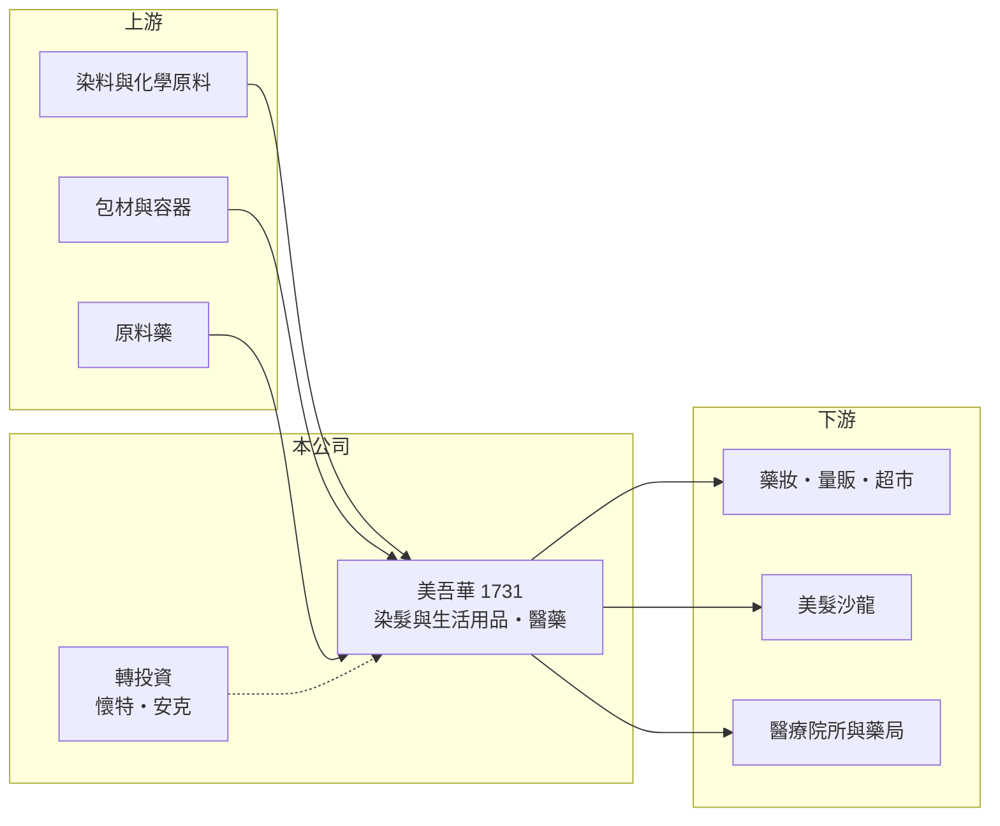

# 1731 美吾華

> 上市｜[[產業索引-生技醫療業|生技醫療業]]｜上市（櫃）日期 2001/09/17

# 第一章：企業模式與商業藍圖

> [!info] 撰寫說明
> 精簡版，由 Claude 依公開資料整理，架構比照 [[2330台積電]] 的四章研究，資料截至 2026-10-08。財務數字來源：Goodinfo 年度經營績效頁、MoneyDJ 個股基本資料（2025 年營收比重）、證交所開放資料（基本資料、2026 年第二季資產負債與綜合損益、營益分析、股利、本益比、每月營收）；品牌、集團與醫藥業務細節部分憑既有知識撰寫，已標「待校對」。公開資料有限。#待校對

本章說明美吾華（股票代號：1731）的商業模式。它雖然被歸類在生技醫療業，主要營收卻來自染髮與生活用品品牌，醫藥是第二支柱。

- **核心業務：** 美吾華成立於 1976 年，2001 年在證交所上市，董事長為李成家，實收資本額約 13.3 億元。依 MoneyDJ 的 2025 年營收分類，「美吾華」類（推估為染髮劑與洗沐、生活用品等消費品）占 70.21%、醫藥類占 29.79%。代表品牌為「美吾髮」染髮系列（憑既有知識，待校對）。
- **獲利模式：** 消費品牌的核心是品牌認知與通路上架。美吾華的毛利率高達 63% 至 67%，但營業利益率只有 14% 至 16%，中間的差距主要是廣告、通路上架與業務費用，這是品牌消費品的典型成本結構。
- **集團布局：** 美吾華是美吾華集團的母公司，集團成員包括新藥公司 [[4108懷特]] 與智慧醫療公司 [[4188安克]]（憑既有知識與集團聯合法說新聞標題，持股比例待校對）。這些轉投資讓美吾華同時具備穩定的消費品現金流與生技新藥的長期選擇權，轉投資損益推估以[[權益法]]認列在業外。
- **長期方向：** 2020 至 2025 年營收由 10.7 億元成長到 15.8 億元，年複合成長率約 8.1%（推算），成長來源包括染髮品牌擴展、醫藥業務與海外市場（細節未查得）。

# 第二章：護城河深度與競爭優勢

本章分析美吾華的護城河與競爭環境。消費品牌的護城河來自消費者習慣與通路，但也必須面對國際大品牌的資源競爭。

- **競爭優勢：** 染髮劑是重複購買的產品，消費者對色號與使用體驗形成習慣後，不容易輕易更換。美吾華在台灣經營染髮品牌多年，在藥妝、量販與超市通路都有穩定的上架位置，高毛利率反映品牌具有一定的定價能力。
- **規模限制：** 美吾華年營收約 16 億元，相較於國際日化集團，行銷資源有限。營業利益率在 2021 年後由 16% 緩降到 2025 年的 13.7%，顯示費用增加的速度略快於營收。
- **主要對手：** 花王、萊雅、漢高（施華蔻）等國際日化品牌的染髮產品，以及各類自有品牌與美髮沙龍專業產品。醫藥業務則面對國內眾多中小型藥廠。
- **觀察重點：** 一是染髮品牌在台灣與海外的市占變化；二是醫藥業務的成長與毛利；三是懷特、安克等轉投資的進展是否帶來投資收益或處分利益。

# 第三章：財務體質與盈利規模

資料日期：2026-10-08，表格是撰寫當時的快照；最新月營收、毛利率、累計 EPS 由自動排程寫在本筆記的屬性欄位（月營收、毛利率、累計EPS 等）。#待校對

本章用多年度的三率、ROE 與資本報酬，檢視美吾華的獲利穩定度。

| 年度 | 營收（新台幣） | [[毛利率]] | [[營業利益率]] | EPS（元） | [[ROE]] |
|---|---|---|---|---|---|
| 2020 | 10.7 億 | 63.5% | 16.0% | 1.29 | 9.41% |
| 2021 | 12.9 億 | 66.7% | 15.5% | 1.24 | 8.47% |
| 2022 | 12.5 億 | 65.6% | 16.0% | 1.22 | 8.09% |
| 2023 | 13.0 億 | 65.7% | 15.0% | 1.27 | 8.38% |
| 2024 | 14.9 億 | 64.7% | 13.9% | 1.30 | 8.36% |
| 2025 | 15.8 億 | 63.2% | 13.7% | 1.36 | 8.48% |
| 2026 上半年 | 8.55 億 | 62.13% | 14.44% | 0.95 | 未查得 |

註：2020 至 2025 年取自 Goodinfo，2026 上半年取自證交所營益分析與綜合損益。

- **營收規模：** 營收穩定成長，2026 年 1 至 8 月累計營收約 11.4 億元，較去年同期成長約 9%（證交所每月營收）。
- **獲利結構：** EPS 六年都在 1.22 元至 1.36 元之間，波動極小，是典型的穩定型消費品公司。2026 年上半年 EPS 已達 0.95 元，營業外收入約 0.31 億元，獲利有機會高於過去幾年。
- **長期指標：** 2021 至 2025 年平均 ROE 約 8.4%（推算），每年幾乎相同。2025 年度每股配發現金股利 1.22 元，以 EPS 1.36 元計算，[[配息率]]約 90%（推算，證交所股利資料），屬於高配息政策。
- **財務特色：** 2026 年第二季底總負債約 12.9 億元，其中非流動負債約 6.4 億元，權益約 21.9 億元，負債比約 37%（證交所開放資料）。

**[[ROIC]] 與 [[WACC]]：** 以 2025 年營收 15.8 億元乘營業利益率 13.7%，營業利益約 2.16 億元，稅後約 1.73 億元；投入資本以權益 21.9 億元加上假設占總負債五成的有息負債約 6.4 億元，合計約 28.4 億元，ROIC 約 6.1%（推算）。WACC 以 CAPM 推估：無風險利率 1.75%、市場風險溢酬 6%、β 取消費品業常見值 0.6，股東權益成本約 5.35%；負債成本 2.5%、稅後 2.0%；權益約占 77%，WACC 約 4.6%（推算）。ROIC 高出 WACC 約 1.5 個百分點，代表美吾華的消費品本業小幅創造價值；但部分資本投入在生技轉投資上，這部分的報酬要看新藥與醫療器材能否商業化。

# 第四章：總體風險與地緣政治

本章分析美吾華長期面對的風險。

- **產業週期：** 染髮與生活用品屬於民生消費，受景氣影響小，但市場成熟、成長有限。台灣人口老化會增加染髮需求，同時也讓市場競爭更集中在中高齡客群。
- **營運風險：** 品牌行銷費用高，若廣告效益下降或通路上架成本提高，營業利益率會被壓縮。轉投資的新藥與醫療器材公司研發失敗或需要增資時，可能拖累美吾華的業外損益。
- **其他風險：** 染髮劑屬於[[含藥化粧品]]，成分與標示受衛福部嚴格規範；化學原料與包材價格上漲會壓縮毛利；國際品牌的促銷與價格戰也會影響市占。

# 專有名詞解析

## 金融

- **[[權益法]]**：投資公司對被投資公司有重大影響力時，依持股比例認列被投資公司損益的會計方法。
- **[[配息率]]**：現金股利占每股盈餘的比例，反映公司把獲利發還給股東的程度。
- **[[毛利率]]**：營業毛利占營收的比例，反映產品定價能力與生產成本控制。
- **[[營業利益率]]**：扣除營業費用後的營業利益占營收的比例，衡量本業整體獲利能力。
- **[[ROE]]**：股東權益報酬率，稅後淨利除以股東權益，衡量公司運用股東資金的效率。
- **[[ROIC]]**：投入資本報酬率，稅後營業利益除以股東權益與有息負債的合計，衡量本業對所有資金提供者的報酬。
- **[[WACC]]**：加權平均資金成本，依股東權益與負債的比重加權計算的資金成本，ROIC 高於它才代表創造價值。

## 產業

- **[[含藥化粧品]]**：含有特定藥品成分的化粧品，例如染髮劑、止汗劑，在台灣須取得許可證才能上市。

# 核心供應鏈

- 上游：染料與化學原料、包材與容器、原料藥。
- 下游／客戶：藥妝、量販與超市通路，美髮沙龍，醫療院所與藥局（醫藥業務通路為推估，待校對）。
- 同業：花王、萊雅、漢高等國際日化品牌；集團相關公司 [[4108懷特]]、[[4188安克]]。

## 最新新聞
<!-- news:start -->
<!-- news:end -->

## 相關連結
- [公開資訊觀測站](https://mopsov.twse.com.tw/mops/web/t05st03?step=1&firstin=1&co_id=1731)
- [Goodinfo](https://goodinfo.tw/tw/StockDetail.asp?STOCK_ID=1731)
- [Yahoo 股市](https://tw.stock.yahoo.com/quote/1731)
- [鉅亨網新聞](https://www.cnyes.com/twstock/1731/news)
