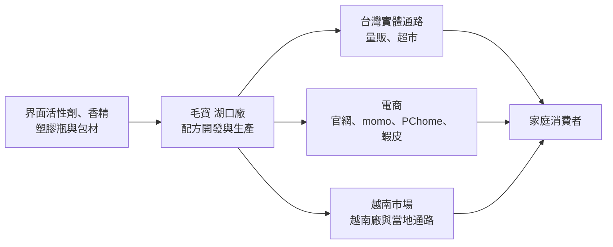
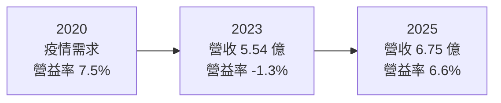
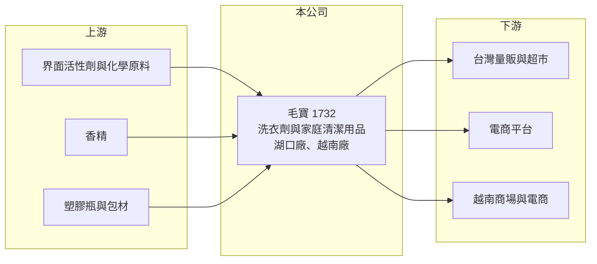

# 1732 毛寶

> 上市｜[[產業索引-化學工業|化學工業]]｜上市（櫃）日期 2001/09/17

# 第一章：企業模式與商業藍圖

> [!info] 撰寫說明
> 本文由 Claude 依公開資料整理，架構比照 [[2330台積電]] 的四章研究，資料截至 2026-10-08。財務數字來源：Goodinfo 台灣股市資訊網年度經營績效、nStock 公司資料、股感知識庫（2020 年文章）、證交所開放資料（本筆記 _data 快照）；公開資料有限，產品比重為 2020 年前後資料，產業描述為整理性內容，尚未逐條比對原始文件。#待校對

在評估單一個股的長期投資價值時，首要步驟是拆解企業的底層獲利邏輯。本章說明毛寶（股票代號：1732）這家台灣本土清潔用品品牌，如何以洗衣劑為核心，在國際大廠環伺的市場中生存，以及它向越南與電商發展的長期方向。

## 一、核心定位：台灣本土家庭清潔品牌

毛寶成立於 1978 年，原名毛寶有機化學工業，1987 年更名為毛寶股份有限公司，工廠與總部位於新竹湖口，2001 年在證交所上市。公司主要經營各種清潔用品的製造、買賣與進出口。

和許多只做行銷、生產委外的品牌商不同，毛寶擁有自己的工廠，從配方開發到生產都自己掌握。依股感知識庫整理，毛寶旗下有多個品牌，包括主品牌毛寶、全效、主打天然小蘇打的毛寶兔，以及嬰幼兒低敏的小鹿山丘。多品牌策略的用意是以不同定位占據更多貨架位置，並區隔不同的消費族群。

## 二、產品板塊：洗衣劑為核心

依股感知識庫 2020 年前後的資料，洗衣劑系列約占營收 75%，其餘為家庭清潔與個人防護產品。最新的產品比重未查得。

* **洗衣劑系列（約 75%）：** 洗衣精、冷洗精等，是毛寶的核心產品。洗衣精是家庭最大宗的清潔消耗品之一，需求穩定，但也是國際品牌競爭最激烈的品類。
* **家庭清潔系列：** 浴廁清潔劑、洗碗精等日常清潔用品。
* **個人防護系列：** 乾洗手、居家防護液等，疫情期間需求大增，之後回落。

## 三、資本轉化邏輯：自有工廠加上多通路

毛寶的獲利邏輯可以分成三點：

* **自製帶來的成本控制：** 洗衣精的主要原料是[[界面活性劑]]、香精與水，再加上塑膠瓶包材。毛寶自己生產，可以掌握品質與成本，毛利率長期維持在 38% 至 45% 之間。
* **通路費用是最大負擔：** 清潔用品在量販通路要支付上架費、促銷費與廣告費，這些費用吃掉大部分毛利。毛寶的營業利益率長期只有 -1% 至 8%，顯示在國際大廠壓力下，維持貨架位置的成本很高。
* **電商降低通路依賴：** 2016 年起毛寶開設毛寶兔官網並進駐大型電商平台，電商讓品牌可以直接觸及消費者，降低對實體通路的依賴。

## 四、企業長期藍圖：越南與電商

* **越南市場（2006 年起）：** 毛寶 2006 年開始布局越南，2012 年越南廠房完工，2013 年開始在越南內需市場銷售，產品進入 Maximark、AEON 等商場與 Tiki、Sendo 等電商。越南人口年輕、消費力成長，是毛寶長期的海外成長來源。
* **海外電商：** 透過中國天貓旗艦店等平台拓展亞洲市場。
* **資本配置習慣：** 2025 年度配發現金股利 0.6 元，約為當年淨利的 87%（推算）；2024 年度配發 0.5 元，高於當年 EPS 0.30 元。近五年平均現金股利約 0.29 元，配息金額隨獲利波動。

# 第二章：護城河深度與競爭優勢

在長期價值投資中，「護城河」指企業抵禦競爭、維持超額利潤的保護機制。本章分析毛寶在台灣清潔用品市場的位置、主要競爭對手，以及本土品牌面對國際大廠的挑戰。

## 一、護城河的核心組成要素

毛寶的護城河較淺，主要來自本土品牌認知與自有生產。

* **1. 本土品牌的長期認知：** 毛寶經營近五十年，在台灣家庭有一定知名度。但清潔用品的品牌忠誠度不高，消費者常因促銷而換牌，品牌帶來的保護有限。
* **2. 自有工廠：** 自己生產讓毛寶能快速開發利基產品，例如嬰幼兒低敏、天然成分等細分品項，這是與國際大廠差異化的主要方式。
* **3. 多品牌與多通路：** 多品牌可以占據更多貨架，電商與海外通路則分散對台灣量販通路的依賴。

## 二、全球主要競爭對手格局

| 對手 | 定位 | 對毛寶的威脅 |
|---|---|---|
| 聯合利華（白蘭、熊寶貝） | 國際清潔用品大廠 | 行銷預算大，在洗衣精市場占有率高（推估） |
| 花王（一匙靈） | 日系清潔用品大廠 | 技術與品牌強，直接競爭洗衣劑（推估） |
| [[1730花仙子]] | 台灣居家清潔品牌 | 在家用清潔品類部分重疊（推估） |
| 通路自有品牌 | 量販與超市自有商品 | 以低價搶占基本款市場（推估） |

## 三、優勢轉化：守得住／守不住／觀察重點

* **守得住：** 利基產品與熟悉毛寶的既有客群，以及越南市場的先行者優勢。
* **守不住：** 主流洗衣精市場的價格與行銷戰。國際大廠以大量廣告與促銷維持市占，毛寶難以在費用上抗衡，這是營業利益率長期偏低的原因。
* **觀察重點：** 長期可以觀察三個指標：營業利益率能否穩定在 5% 以上；越南與海外營收比重的變化；以及電商通路能否降低整體行銷費用率。

# 第三章：財務體質與盈利規模

資料日期：2026-10-08。數字取自 Goodinfo 年度經營績效、nStock 與證交所開放資料快照，表格是撰寫當時的快照；最新月營收、毛利率、累計 EPS 由自動排程寫在本筆記的屬性欄位（月營收、毛利率、累計EPS 等）。#待校對

財務報表是檢驗護城河是否真實存在的最終標準。本章用多年度的三率、ROE 與資本報酬，檢視毛寶在競爭激烈市場中的獲利品質。

## 一、獲利能力的基石：三率

| 年度 | 營收（新台幣） | [[毛利率]] | [[營業利益率]] | EPS（元） | [[ROE]] |
|---|---|---|---|---|---|
| 2018 | 5.63 億 | 42.1% | 1.8% | 0.16 | 1.6% |
| 2019 | 5.96 億 | 44.3% | 4.9% | 0.59 | 5.6% |
| 2020 | 6.21 億 | 45.0% | 7.5% | 0.91 | 8.2% |
| 2021 | 6.19 億 | 39.7% | 2.8% | 0.46 | 4.0% |
| 2022 | 5.87 億 | 37.9% | -0.6% | 0.12 | 1.1% |
| 2023 | 5.54 億 | 38.8% | -1.3% | -0.14 | -1.3% |
| 2024 | 5.93 億 | 41.0% | 1.5% | 0.30 | 2.6% |
| 2025 | 6.75 億 | 41.2% | 6.6% | 0.69 | 5.9% |

* **[[毛利率]]：** 長期在 38% 至 45% 之間。2020 年防疫產品需求帶動毛利率升到 45%，2022 至 2023 年降到 38% 左右，推估與原料上漲有關，顯示毛寶對原料成本的轉嫁能力有限。
* **[[營業利益率]]：** 八年中最高 7.5%、最低 -1.3%，多數年份在 3% 以下。高額的通路與行銷費用，是本業獲利偏低的主因。2026 年上半年營業利益率約 8.1%，毛利率 41.7%。
* **長期指標：** 2020 至 2025 年營收年複合成長率約 1.7%（推算），營收規模八年來在 5.5 億至 6.8 億元之間；2021 至 2025 年五年平均 ROE 約 2.5%（推算）。2025 年營收 6.75 億元創八年新高、EPS 0.69 元；2026 年上半年營收 3.64 億元、EPS 0.61 元。

## 二、[[ROE]]：資本效率

毛寶 ROE 長期偏低，八年中只有 2020 年超過 8%。財務結構保守，2026 年第二季底總資產約 7.07 億元、總負債約 2.02 億元、股東權益約 5.05 億元，負債比約 29%。低負債代表財務風險小，但也表示 ROE 偏低完全是本業獲利能力的問題。

## 三、資本支出與自由現金流

* **[[CapEx]]：** 清潔用品生產線的資本支出不大，主要為湖口廠與越南廠的設備維護，具體金額未查得。
* **[[自由現金流]]：** 營收規模小、獲利薄，自由現金流金額有限，但公司多數年份仍能配發現金股利，推估長期大致為正（逐年數字未查得）。

## 四、[[ROIC]] 與 [[WACC]]：價值創造利差

有息負債金額未查得，先以股東權益近似投入資本（為 ROIC 的上限值）。以 2025 年為例，營業利益約 0.45 億元（營收 6.75 億元 × 營業利益率 6.6%），扣除 20% 稅率後約 0.36 億元；以淨利約 0.29 億元與 ROE 5.9% 回推，股東權益約 5.0 億元，ROIC 約 7.2%（推算）。2020 年 ROIC 約 7.9%（推算），2022 至 2023 年營業虧損，ROIC 為負。

WACC 以 CAPM 推估：台灣 10 年期公債約 1.5% 至 2%，市場風險溢酬約 6%，β 未查得個股數值，採民生消費股常見的 0.6 至 0.8（假設），股東權益成本約 5.1% 至 6.8%。有息負債不多，WACC 約 5% 至 6.5%（推算）。

比較兩者，毛寶只有在 2020 年與 2025 年等獲利較好的年份，ROIC 略高於 WACC；整個循環平均下來，ROIC 低於 WACC，代表長期沒有穩定創造價值。2025 年營業利益率回升到 6.6%，若能透過海外與電商持續維持，才有機會讓利差轉為長期正值。

# 第四章：總體風險與地緣政治

任何企業都無法脫離宏觀環境獨立存在。本章分析毛寶長期必須面對的市場結構、營運與匯率風險。

## 一、地緣政治

* **越南經營風險：** 越南是毛寶主要的海外市場與生產據點，當地法規、匯率與勞動成本變化會影響海外獲利。
* **原料進口：** 界面活性劑等原料受國際石化行情影響，國際衝突與能源價格波動會傳導到成本。

## 二、產業週期與市場結構

* **成熟市場：** 台灣洗衣與清潔用品市場已經飽和，人口結構老化與家庭規模縮小，限制總需求成長。
* **國際品牌與通路壓力：** 國際大廠的行銷預算遠大於毛寶，加上大型通路的議價能力，使毛寶的營業利益率長期受壓。
* **疫情後需求回落：** 2020 年防疫產品帶來的營收與獲利屬於一次性需求，之後明顯回落。

## 三、營運環境的隱性風險

* **[[原物料]]成本：** 原料與包材價格上漲時，毛寶的轉嫁能力有限，2022 至 2023 年的營業虧損推估與此有關。
* **規模不足：** 年營收不到 7 億元，行銷與研發投入規模有限，難以和國際大廠長期競爭。
* **匯率：** 越南業務與原料進口會受匯率波動影響。

## 四、科技或法規演進

* **環保配方與包材：** 消費者對天然成分與環保包材的要求提高，相關法規也越來越嚴格，需要持續投資配方與包裝。
* **電商與社群行銷：** 消費者購買管道轉向電商與社群平台，品牌必須持續投入數位行銷，否則會失去年輕客群。

# 專有名詞解析

## 金融

- **[[ROIC]]**：投入資本報酬率，稅後營業利益除以投入資本，衡量本業運用資金創造報酬的能力。
- **[[WACC]]**：加權平均資金成本，股東與債權人要求報酬率的加權平均，是 ROIC 要超過的門檻。

## 產業

- **[[界面活性劑]]**：同時親水與親油的化學物質，能降低表面張力、去除油污，是清潔劑的主要成分。
- **[[原物料]]**：生產所需的基礎材料，價格波動會直接影響製造業的成本與毛利率。

# 核心供應鏈

## 1. 上游：原料與包材
- 界面活性劑、香精、塑膠瓶與包材，供應商公司未揭露

## 2. 本公司：毛寶
- 品牌：毛寶、全效、毛寶兔、小鹿山丘
- 產品：洗衣劑、家庭清潔、個人防護

## 3. 下游：通路
- 台灣：量販、超市，以及 momo、PChome、蝦皮等電商
- 海外：越南 Maximark、AEON 與 Tiki、Sendo，中國天貓

## 4. 同業
- 國際：聯合利華、花王（推估）
- 台灣：[[1730花仙子]]（推估）

## 最新新聞
<!-- news:start -->
<!-- news:end -->

## 相關連結
- [公開資訊觀測站](https://mopsov.twse.com.tw/mops/web/t05st03?step=1&firstin=1&co_id=1732)
- [Goodinfo](https://goodinfo.tw/tw/StockDetail.asp?STOCK_ID=1732)
- [Yahoo 股市](https://tw.stock.yahoo.com/quote/1732)
- [鉅亨網新聞](https://www.cnyes.com/twstock/1732/news)
