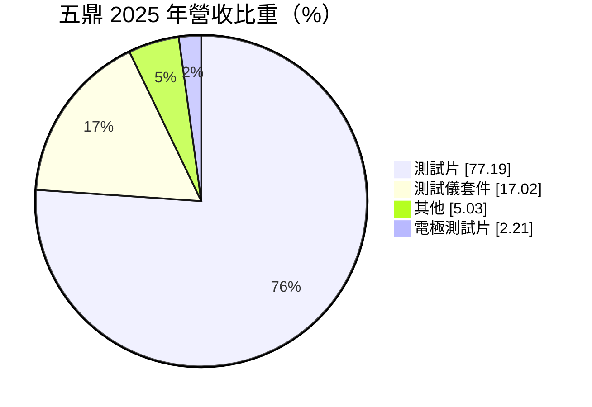
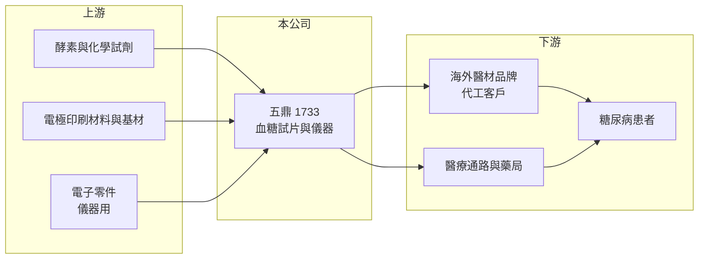

# 1733 五鼎

> 上市｜[[產業索引-生技醫療業|生技醫療業]]｜上市（櫃）日期 2001/09/17

# 第一章：企業模式與商業藍圖

> [!info] 撰寫說明
> 精簡版，由 Claude 依公開資料整理，架構比照 [[2330台積電]] 的四章研究，資料截至 2026-10-08。財務數字來源：Goodinfo 年度經營績效頁、MoneyDJ 個股基本資料（2025 年營收比重）、證交所開放資料（基本資料、2026 年第二季資產負債與綜合損益、營益分析、股利、本益比、每月營收）；客戶結構、據點與產品細節部分憑既有知識撰寫，已標「待校對」。公開資料有限。#待校對

本章說明五鼎生物技術（股票代號：1733，以下簡稱五鼎）作為血糖監測產品製造商的商業模式。它的核心是「儀器便宜、試片長期回購」的耗材型生意。

- **核心業務：** 五鼎成立於 1997 年，2001 年在證交所上市，董事長為沈燕士，實收資本額約 10.0 億元。依 MoneyDJ 的 2025 年營收分類，測試片占 77.19%、測試儀套件占 17.02%、電極測試片占 2.21%、其他占 5.03%。主要產品是糖尿病患者在家自我檢測用的[[血糖機]]與試片，並延伸到血酮、尿酸等多項目檢測（產品細節待校對）。
- **獲利模式：** 血糖機本身常以低價甚至搭贈方式推廣，真正的獲利來自病人每天消耗的試片。這種[[刮鬍刀模式]]讓營收以試片為主，只要裝機量穩定，試片訂單就能持續。
- **客戶與據點：** 公司位於新竹科學園區（憑既有知識，待校對），產品以替海外品牌與醫療通路代工為主，同時經營自有品牌，銷往歐洲、美洲、亞洲與中東等地區（客戶結構待校對）。
- **長期方向：** 全球糖尿病人口持續增加，是血糖監測市場的長期需求基礎；但[[連續血糖監測]]系統快速普及，正在改變傳統試片的市場。五鼎的長期課題是守住傳統試片的成本優勢，同時發展多項目檢測等新產品。

# 第二章：護城河深度與競爭優勢

本章分析五鼎的護城河、對手，以及連續血糖監測帶來的長期挑戰。

- **競爭優勢：** 試片的精準度、批次一致性與法規認證是進入門檻。血糖機與試片要成套取得各國[[醫療器材]]許可，客戶一旦採用某家的系統，更換供應商需要重新送審，因此代工關係通常長期穩定。
- **成本競爭：** 傳統試片已是成熟產品，國際大廠與亞洲代工廠都在拚成本。五鼎的毛利率由 2020 年的 22.6% 提高到 2023 年的 31.7%，之後維持在 28% 左右，營業利益率約 7% 至 10%，屬於中等水準。
- **主要對手：** 台灣同業 [[4737華廣]]、[[4736泰博]]，國際品牌羅氏（Accu-Chek）、亞培、Ascensia、LifeScan，以及中國的血糖儀廠商。連續血糖監測則以亞培、德康（Dexcom）為主。
- **觀察重點：** 一是主要代工客戶的訂單變化；二是連續血糖監測在各國保險給付的普及速度；三是多項目檢測與新產品的營收貢獻。

# 第三章：財務體質與盈利規模

資料日期：2026-10-08，表格是撰寫當時的快照；最新月營收、毛利率、累計 EPS 由自動排程寫在本筆記的屬性欄位（月營收、毛利率、累計EPS 等）。#待校對

本章用多年度的三率、ROE 與資本報酬，檢視五鼎的獲利品質。

| 年度 | 營收（新台幣） | [[毛利率]] | [[營業利益率]] | EPS（元） | [[ROE]] |
|---|---|---|---|---|---|
| 2020 | 20.1 億 | 22.6% | 5.15% | 0.95 | 5.70% |
| 2021 | 21.3 億 | 26.8% | 9.61% | 2.03 | 11.9% |
| 2022 | 22.4 億 | 25.7% | 7.87% | 1.82 | 10.2% |
| 2023 | 16.8 億 | 31.7% | 8.45% | 1.16 | 6.40% |
| 2024 | 18.5 億 | 28.1% | 6.94% | 1.28 | 7.08% |
| 2025 | 19.4 億 | 27.7% | 7.24% | 1.63 | 8.83% |
| 2026 上半年 | 9.90 億 | 33.72% | 13.31% | 1.18 | 未查得 |

註：2020 至 2025 年取自 Goodinfo，2026 上半年取自證交所營益分析與綜合損益。

- **營收規模：** 2020 至 2025 年營收在 16.8 億至 22.4 億元之間，年複合成長率約 -0.7%（推算）。2023 年營收大幅下滑，推估與主要客戶庫存調整有關（原因未查得）。2026 年 1 至 8 月累計營收約 12.8 億元，較去年同期減少約 3%（證交所每月營收）。
- **獲利結構：** 2026 年上半年毛利率 33.7%、營業利益率 13.3%，是近年最高水準，EPS 1.18 元已接近 2024 年全年。代工產品組合與成本控制的改善，是獲利提升的主因（推估）。
- **長期指標：** 2021 至 2025 年平均 ROE 約 8.9%（推算）。2025 年度每股配發現金股利 1.30 元，以 EPS 1.63 元計算，[[配息率]]約 80%（推算，證交所股利資料）。
- **財務特色：** 2026 年第二季底總負債約 6.9 億元、權益約 18.6 億元，負債比約 27%（證交所開放資料），財務結構保守。

**[[ROIC]] 與 [[WACC]]：** 以 2025 年營收 19.4 億元乘營業利益率 7.24%，營業利益約 1.40 億元，稅後約 1.12 億元；投入資本以權益 18.6 億元加上假設占總負債三成的有息負債約 2.1 億元，合計約 20.7 億元，ROIC 約 5.4%（推算）。WACC 以 CAPM 推估：無風險利率 1.75%、市場風險溢酬 6%、β 取醫材業常見值 0.7，股東權益成本約 5.95%；負債成本 2.5%、稅後 2.0%；權益約占 90%，WACC 約 5.6%（推算）。2025 年 ROIC 與 WACC 大致相當，代表五鼎過去幾年只是打平資金成本；若 2026 年上半年的營業利益率能延續，ROIC 有機會提高到 9% 以上（推算），轉為創造價值。

# 第四章：總體風險與地緣政治

本章分析五鼎長期面對的風險。

- **產業週期：** 血糖試片是醫療消耗品，終端需求穩定，但代工廠的訂單受客戶庫存與標案影響，年度間可能大幅波動，2023 年營收衰退就是例子。
- **營運風險：** 營收以試片為主，客戶集中度可能偏高（推估），失去單一大客戶的影響很大。連續血糖監測若在更多國家納入保險給付，傳統試片的使用量可能長期下滑。
- **其他風險：** 各國醫療器材法規（如歐盟 MDR、美國 FDA）持續加嚴，增加認證成本與時間；試片使用的酵素與電極材料價格波動；以美元、歐元計價的出口營收受新台幣匯率影響。

# 專有名詞解析

## 金融

- **[[配息率]]**：現金股利占每股盈餘的比例，反映公司把獲利發還給股東的程度。
- **[[毛利率]]**：營業毛利占營收的比例，反映產品定價能力與生產成本控制。
- **[[營業利益率]]**：扣除營業費用後的營業利益占營收的比例，衡量本業整體獲利能力。
- **[[ROE]]**：股東權益報酬率，稅後淨利除以股東權益，衡量公司運用股東資金的效率。
- **[[ROIC]]**：投入資本報酬率，稅後營業利益除以股東權益與有息負債的合計，衡量本業對所有資金提供者的報酬。
- **[[WACC]]**：加權平均資金成本，依股東權益與負債的比重加權計算的資金成本，ROIC 高於它才代表創造價值。

## 產業

- **[[血糖機]]**：糖尿病患者在家自行量測血糖的小型儀器，需搭配一次性試片使用。
- **[[刮鬍刀模式]]**：以低價銷售主機或設備，再靠長期回購的耗材賺取主要利潤的商業模式。
- **[[連續血糖監測]]**：貼在皮膚上的感測器每隔數分鐘自動量測組織液葡萄糖濃度，減少指尖採血，簡稱 CGM。
- **[[醫療器材]]**：用於診斷、治療或矯正的器具與設備，上市前需取得各國衛生主管機關許可，生產須符合品質系統規範。

# 核心供應鏈

- 上游：葡萄糖氧化酶等酵素與化學試劑、電極印刷材料與基材、儀器用電子零件。
- 下游／客戶：海外醫材品牌（代工客戶）、醫療通路與藥局、糖尿病患者。
- 同業：[[4737華廣]]、[[4736泰博]]、羅氏、亞培、Ascensia、LifeScan。

## 最新新聞
<!-- news:start -->
<!-- news:end -->

## 相關連結
- [公開資訊觀測站](https://mopsov.twse.com.tw/mops/web/t05st03?step=1&firstin=1&co_id=1733)
- [Goodinfo](https://goodinfo.tw/tw/StockDetail.asp?STOCK_ID=1733)
- [Yahoo 股市](https://tw.stock.yahoo.com/quote/1733)
- [鉅亨網新聞](https://www.cnyes.com/twstock/1733/news)
