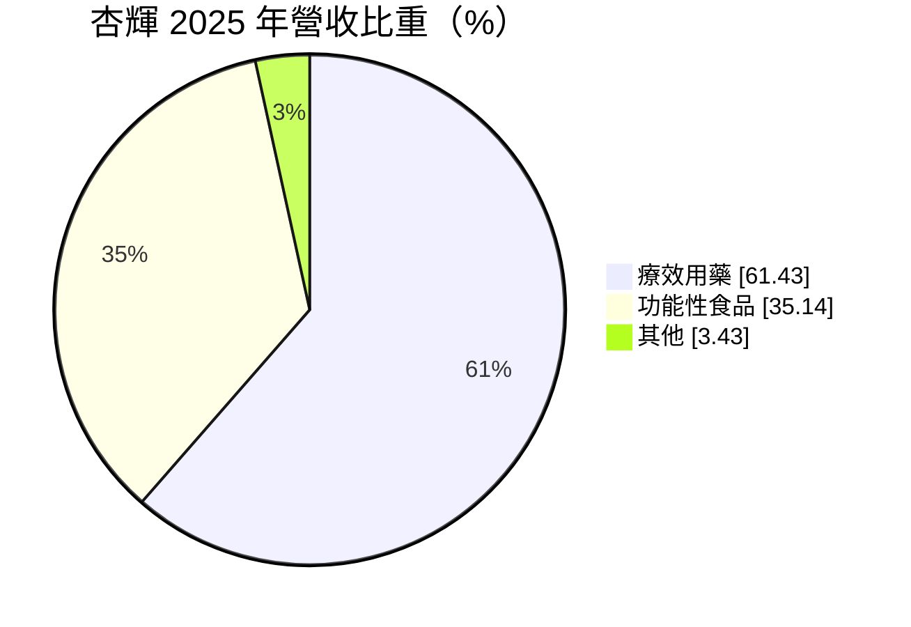
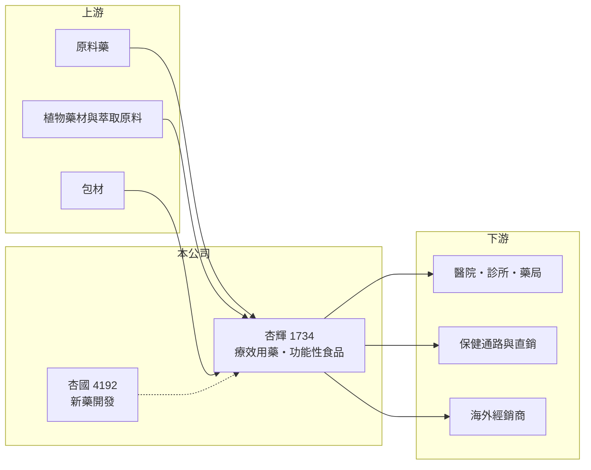

# 1734 杏輝

> 上市｜[[產業索引-生技醫療業|生技醫療業]]｜上市（櫃）日期 2002/08/26

# 第一章：企業模式與商業藍圖

> [!info] 撰寫說明
> 精簡版，由 Claude 依公開資料整理，架構比照 [[2330台積電]] 的四章研究，資料截至 2026-10-08。財務數字來源：Goodinfo 年度經營績效頁、MoneyDJ 個股基本資料（2025 年營收比重）、證交所開放資料（基本資料、2026 年第二季資產負債與綜合損益、營益分析、股利、本益比、每月營收）；子公司、產品線與新藥開發細節部分憑既有知識撰寫，已標「待校對」。公開資料有限。#待校對

本章說明杏輝藥品（股票代號：1734，以下簡稱杏輝）的商業模式。它結合處方藥、功能性食品與新藥開發，獲利結構在過去幾年經歷了由虧轉盈的變化。

- **核心業務：** 杏輝成立於 1977 年，2002 年在證交所上市，董事長為李易達，實收資本額約 20.2 億元。依 MoneyDJ 的 2025 年營收分類，療效用藥占 61.43%、功能性食品占 35.14%、其他占 3.43%。療效用藥以[[學名藥]]與中草藥製劑為主，功能性食品則是以天然植物萃取為特色的[[保健食品]]（產品線細節待校對）。
- **生產與據點：** 主要工廠位於宜蘭（憑既有知識，待校對），具備西藥與植物藥的生產能力，並透過醫院、診所、藥局與直銷等多種通路銷售。
- **新藥布局：** 杏輝透過子公司 [[4192杏國]] 從事[[新藥開發]]，研發方向包括癌症輔助治療等（憑既有知識，待校對）。新藥研發需要長期投入，臨床階段的費用會壓低合併獲利，2020 至 2021 年杏輝營業利益率為負，推估與研發支出有關。
- **長期方向：** 杏輝的長期策略是以療效用藥與功能性食品的穩定現金流，支撐新藥研發的長期選擇權。2022 年後營業利益率由 6.9% 提升到 2025 年的 12.4%，代表本業獲利已能吸收研發成本。研發費用率這次未查得，可由年報補充。

# 第二章：護城河深度與競爭優勢

本章分析杏輝的護城河、主要對手，以及新藥事業帶來的機會與不確定性。

- **競爭優勢：** 杏輝在植物萃取與中草藥製劑上累積多年技術，這類產品的品質標準化與法規認證門檻較高，和一般學名藥廠有所區隔。功能性食品以自費市場為主，不受[[健保藥價]]調整影響，讓營收來源比純處方藥廠分散。
- **獲利改善：** 毛利率由 2020 年的 36.7% 提高到 2025 年的 43.2%，營業利益率由負轉為 12.4%，顯示產品組合往高毛利品項移動，費用控制也有改善。
- **主要對手：** 學名藥同業 [[1720生達]]、[[1795美時]]、[[4120友華]]，中草藥廠如順天堂、港香蘭，以及眾多保健食品品牌。新藥領域則與國內外生技公司競爭。
- **觀察重點：** 一是功能性食品的成長與海外通路；二是子公司新藥的臨床與授權進度；三是營業利益率能否維持在 10% 以上。

# 第三章：財務體質與盈利規模

資料日期：2026-10-08，表格是撰寫當時的快照；最新月營收、毛利率、累計 EPS 由自動排程寫在本筆記的屬性欄位（月營收、毛利率、累計EPS 等）。#待校對

本章用多年度的三率、ROE 與資本報酬，檢視杏輝由虧轉盈後的獲利品質。

| 年度 | 營收（新台幣） | [[毛利率]] | [[營業利益率]] | EPS（元） | [[ROE]] |
|---|---|---|---|---|---|
| 2020 | 23.9 億 | 36.7% | -5.12% | -0.17 | -5.44% |
| 2021 | 24.3 億 | 36.5% | -7.51% | -0.23 | -6.59% |
| 2022 | 28.6 億 | 38.2% | 6.91% | 1.34 | 5.22% |
| 2023 | 29.6 億 | 36.8% | 9.65% | 2.24 | 10.8% |
| 2024 | 31.5 億 | 39.3% | 9.33% | 1.68 | 8.21% |
| 2025 | 33.7 億 | 43.2% | 12.4% | 1.92 | 9.76% |
| 2026 上半年 | 17.0 億 | 45.40% | 11.96% | 0.87 | 未查得 |

註：2020 至 2025 年取自 Goodinfo，2026 上半年取自證交所營益分析與綜合損益。2026 年 EPS 以配股後股本計算，與過去年度比較時要注意稀釋。

- **營收規模：** 2020 至 2025 年營收由 23.9 億元成長到 33.7 億元，年複合成長率約 7.1%（推算）。2026 年 1 至 8 月累計營收約 22.9 億元，較去年同期成長約 6%（證交所每月營收）。
- **獲利結構：** 2022 年起本業轉為獲利，毛利率持續提高，2026 年上半年達 45.4%。營業外收支近年金額不大，獲利主要來自本業。
- **長期指標：** 2021 至 2025 年平均 ROE 約 5.5%（推算），若只看 2022 年後約 8.5%。2025 年度配發現金股利 1.00 元與股票股利 0.60 元（證交所股利資料），以 EPS 1.92 元計算，現金[[配息率]]約 52%（推算）。
- **財務特色：** 2026 年第二季底總負債約 31.2 億元，其中非流動負債約 15.6 億元，權益總計約 37.2 億元，負債比約 46%（證交所開放資料），在藥廠中負債比偏高，推估有一定比例的長期借款。

**[[ROIC]] 與 [[WACC]]：** 以 2025 年營收 33.7 億元乘營業利益率 12.4%，營業利益約 4.18 億元，稅後約 3.34 億元；投入資本以權益 37.2 億元加上假設占總負債六成的有息負債約 18.7 億元，合計約 55.9 億元，ROIC 約 6.0%（推算）。WACC 以 CAPM 推估：無風險利率 1.75%、市場風險溢酬 6%、β 取製藥業常見值 0.7，股東權益成本約 5.95%；負債成本 2.5%、稅後 2.0%；權益約占 67%，WACC 約 4.6%（推算）。ROIC 高出 WACC 約 1.4 個百分點，代表杏輝在轉虧為盈後已開始小幅創造價值；未來利差能否擴大，取決於功能性食品的成長與新藥研發支出的控制。

# 第四章：總體風險與地緣政治

本章分析杏輝長期面對的風險。

- **產業週期：** 藥品需求穩定，但健保藥價每年檢討，學名藥價格長期下滑。功能性食品則受消費景氣與市場流行影響，成長速度可能起伏。
- **營運風險：** 新藥開發成功率低、時間長，子公司若需持續增資或臨床失敗，會影響杏輝的合併獲利與股東權益。負債比偏高，利率上升時利息負擔加重。
- **其他風險：** 植物藥材的產地、品質與價格受氣候影響；保健食品的功效宣稱與廣告受法規嚴格限制；拓展中國等海外市場須面對當地法規與地緣政治風險。

# 專有名詞解析

## 金融

- **[[配息率]]**：現金股利占每股盈餘的比例，反映公司把獲利發還給股東的程度。
- **[[毛利率]]**：營業毛利占營收的比例，反映產品定價能力與生產成本控制。
- **[[營業利益率]]**：扣除營業費用後的營業利益占營收的比例，衡量本業整體獲利能力。
- **[[ROE]]**：股東權益報酬率，稅後淨利除以股東權益，衡量公司運用股東資金的效率。
- **[[ROIC]]**：投入資本報酬率，稅後營業利益除以股東權益與有息負債的合計，衡量本業對所有資金提供者的報酬。
- **[[WACC]]**：加權平均資金成本，依股東權益與負債的比重加權計算的資金成本，ROIC 高於它才代表創造價值。

## 產業

- **[[學名藥]]**：原廠藥專利到期後，由其他藥廠生產、成分與療效相同的仿製藥，價格通常低於原廠藥。
- **[[保健食品]]**：以維持健康為訴求的膳食補充產品，受食品與廣告法規規範。
- **[[新藥開發]]**：從藥物探索、臨床前試驗到一至三期人體臨床試驗並取得藥證的過程，通常耗時十年以上、成功率低。
- **[[健保藥價]]**：全民健保給付給醫院的藥品價格，由健保署定期調查市場價格後調整，長期趨勢是逐步調降。

# 核心供應鏈

- 上游：原料藥供應商、植物藥材與萃取原料、包材。
- 下游／客戶：醫院、診所與藥局，保健食品通路與直銷，海外經銷商。
- 同業：[[1720生達]]、[[1795美時]]、[[4120友華]]、順天堂、港香蘭。

## 最新新聞
<!-- news:start -->
<!-- news:end -->

## 相關連結
- [公開資訊觀測站](https://mopsov.twse.com.tw/mops/web/t05st03?step=1&firstin=1&co_id=1734)
- [Goodinfo](https://goodinfo.tw/tw/StockDetail.asp?STOCK_ID=1734)
- [Yahoo 股市](https://tw.stock.yahoo.com/quote/1734)
- [鉅亨網新聞](https://www.cnyes.com/twstock/1734/news)
