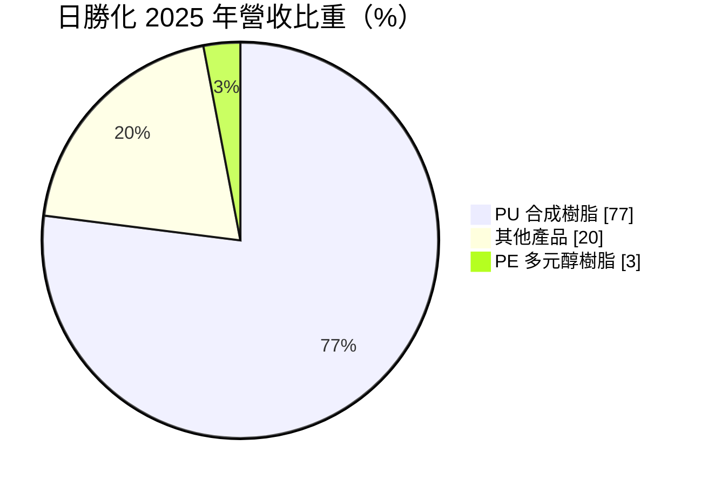
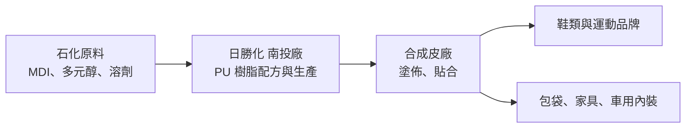
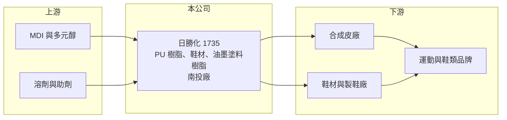

# 1735 日勝化

> 上市｜[[產業索引-化學工業|化學工業]]｜上市（櫃）日期 2002/08/26

# 第一章：企業模式與商業藍圖

> [!info] 撰寫說明
> 本文由 Claude 依公開資料整理，架構比照 [[2330台積電]] 的四章研究，資料截至 2026-10-08。財務數字來源：Goodinfo 台灣股市資訊網年度經營績效、MoneyDJ 公司基本資料（富邦證券版）、證交所開放資料（本筆記 _data 快照）；業務描述另參考聯合報、Yahoo 股市、富果法說摘要的新聞標題。公開資料有限，產業描述為整理性內容，尚未逐條比對原始文件。#待校對

在評估單一個股的長期投資價值時，首要步驟是拆解企業的底層獲利邏輯。本章說明日勝化（股票代號：1735）這家南投的 PU 樹脂製造商，如何以合成皮與鞋材用化學品為核心，在高度競爭的石化下游市場中經營。

## 一、核心定位：合成皮用 PU 樹脂專業廠

日勝化工成立於 1989 年，總部與工廠位於南投南崗工業區，2002 年在證交所上市。公司的核心產品是 [[PU樹脂]]（聚氨酯樹脂），這是製作 [[合成皮]] 的關鍵原料。合成皮廣泛用於鞋面、包袋、家具與汽車內裝，日勝化的角色是把石化原料調配成樹脂，賣給合成皮廠，合成皮廠再把樹脂塗佈在基布上，做成各種皮革替代材料。

這個位置決定了日勝化的商業性質：它不面對終端消費者，而是替合成皮與鞋材廠提供配方化的材料。客戶在意的是樹脂的手感、耐水解、環保規格與交期穩定，因此雖然產品屬於化學品，仍需要一定的配方技術與客戶服務。

## 二、產品板塊：PU 樹脂占近八成

依 MoneyDJ 整理的 2025 年營收比重，日勝化的產品結構如下：

* **PU 合成樹脂（77%）：** 合成皮用的濕式與乾式 PU 樹脂，是公司的主力產品，營收與毛利主要由此而來。合成皮的需求跟著鞋類、包袋與家具景氣起伏，因此這塊業務帶有明顯的消費週期性。
* **其他產品（20%）：** 依新聞標題，公司近年發展鞋底材料，以及油墨、塗料用的樹脂，並嘗試把油墨與塗料產品打入日本市場、再回到台灣銷售。這些延伸應用的目的，是降低對單一合成皮市場的依賴。
* **PE 多元醇樹脂（3%）：** 多元醇是 PU 的原料之一，占比很小，屬於上游延伸的產品。

## 三、資本轉化邏輯：配方化學品的價差生意

* **原料成本占比高：** PU 樹脂的主要原料是 MDI、多元醇與溶劑等石化產品，原料成本占售價的大部分。日勝化的毛利率長期只有 12% 至 20%，代表它賺的是加工與配方的價差，獲利很容易被原料價格上漲壓縮。
* **營運槓桿明顯：** 工廠、研發與管理費用相對固定，營收或價差改善時，營業利益率會放大；反之，2021 至 2022 年營收雖高，但原料價格大漲、價差收窄，營業利益率掉到 1% 以下甚至虧損。
* **客戶地理轉移：** 依新聞標題，日勝化的中國營收占比正在下降。這與全球製鞋產能從中國移往越南、印尼等東南亞國家的長期趨勢一致，材料供應商必須跟著客戶的產地移動。

## 四、企業長期藍圖：高階應用與鞋底材料

* **鞋底材料認證：** 依新聞報導，公司投入鞋底材料並進行品牌客戶認證。運動鞋品牌的材料認證時間長，一旦通過，訂單黏著度較高，是日勝化從一般合成皮樹脂往高附加價值鞋材延伸的方向。
* **油墨、塗料與日本市場：** 把樹脂技術延伸到油墨與塗料，並以日本市場作為品質背書，是分散應用領域的嘗試。
* **資本配置習慣：** 2019 至 2025 年度的現金股利分別為 0.65、0.50、0、0.50、0.50、0.80、0.65 元，除了 2021 年度獲利很低未配息外，大致把當年多數盈餘發放出去，屬於穩定但金額不高的配息模式。

# 第二章：護城河深度與競爭優勢

在長期價值投資中，「護城河」指企業抵禦競爭、維持超額利潤的保護機制。本章分析日勝化在 PU 樹脂市場的位置、主要對手，以及它面對原料與客戶議價時能守住多少利潤。

## 一、護城河的核心組成要素

日勝化的護城河較淺，主要來自配方經驗與客戶認證，而非規模或品牌。

* **1. 配方與應用經驗：** 合成皮的手感、彈性與耐用度很大程度由樹脂配方決定，日勝化經營三十多年，累積了大量配方與調色經驗。這讓它能配合合成皮廠快速打樣，是中小型樹脂廠存活的主要條件。
* **2. 品牌客戶的材料認證：** 運動與鞋類品牌會指定合成皮與鞋材的規格，材料通過認證後，供應商不容易被替換。日勝化往鞋底材料發展，目的就是取得更多這類有認證門檻的訂單。
* **3. 環保規格：** 品牌商對水性、低溶劑與可回收材料的要求逐年提高，能跟上環保規格的樹脂廠才能留在供應鏈中。這同時是門檻，也是需要持續投入的成本。

## 二、主要競爭對手格局

| 對手 | 定位 | 對日勝化的威脅 |
|---|---|---|
| 中國 PU 樹脂廠（如華峰集團） | 規模大、成本低 | 以價格搶中國與東南亞合成皮客戶（推估） |
| 台灣其他 PU 樹脂廠 | 同樣服務合成皮與鞋材客戶 | 直接競爭配方與價格（推估） |

## 三、優勢轉化：守得住／守不住／觀察重點

* **守得住：** 已通過品牌認證的鞋材與高階合成皮樹脂，以及需要配方客製的訂單。這類產品換供應商的成本高，價格壓力相對小。
* **守不住：** 一般規格的合成皮樹脂。這類產品同質性高，中國大廠產能龐大，價格競爭激烈，日勝化毛利率長期不到 20% 就是反映。
* **觀察重點：** 長期可以觀察三件事：鞋底材料與油墨塗料等新應用的營收比重是否提升；毛利率能否穩定在 18% 以上；以及東南亞客戶的占比是否持續提高，彌補中國市場的下滑。

# 第三章：財務體質與盈利規模

資料日期：2026-10-08。數字取自 Goodinfo 年度經營績效、MoneyDJ 與證交所開放資料快照，表格是撰寫當時的快照；最新月營收、毛利率、累計 EPS 由自動排程寫在本筆記的屬性欄位（月營收、毛利率、累計EPS 等）。#待校對

財務報表是檢驗護城河是否真實存在的最終標準。本章用多年度的三率、ROE 與資本報酬，檢視日勝化在原料與景氣循環中的獲利品質。

## 一、獲利能力的基石：三率

| 年度 | 營收（新台幣） | [[毛利率]] | [[營業利益率]] | EPS（元） | [[ROE]] |
|---|---|---|---|---|---|
| 2018 | 36.8 億 | 12.0% | 2.0% | 0.10 | 0.7% |
| 2019 | 31.7 億 | 20.4% | 6.3% | 1.19 | 8.3% |
| 2020 | 23.6 億 | 19.3% | 5.8% | 0.74 | 5.0% |
| 2021 | 32.0 億 | 13.5% | 1.0% | 0.10 | 0.7% |
| 2022 | 29.6 億 | 13.1% | -0.1% | 0.35 | 2.4% |
| 2023 | 23.7 億 | 18.6% | 3.9% | 0.76 | 5.0% |
| 2024 | 26.5 億 | 17.7% | 4.0% | 0.97 | 6.3% |
| 2025 | 23.0 億 | 18.1% | 2.3% | 0.78 | 5.0% |

* **[[毛利率]]：** 八年間在 12% 至 20% 之間擺盪。營收較高的 2018、2021、2022 年毛利率反而最低，顯示營收增加多半來自原料漲價轉嫁，而不是價差擴大；原料回落的年份，毛利率才會回升。
* **[[營業利益率]]：** 最高 6.3%，多數年份在 4% 以下，2022 年甚至小幅虧損。本業獲利很薄，代表日勝化對原料供應商與合成皮客戶的議價能力都有限。
* **長期指標：** 2020 至 2025 年營收年複合成長率約 -0.5%（推算），營收規模從 2018 年的 36.8 億元縮小到 23 億元左右，與中國客戶占比下降一致。2021 至 2025 年五年平均 ROE 約 3.9%（推算）。

## 二、[[ROE]]：資本效率

日勝化 ROE 長期偏低，八年中只有 2019 年超過 8%。依 2026 年第二季資產負債表，總資產約 31.0 億元、總負債約 15.6 億元、股東權益約 15.4 億元，負債比約 50%，其中流動負債約 14.0 億元，推估多為短期借款與應付帳款。ROE 偏低的主因是本業利潤率太薄，而不是財務槓桿不足。

## 三、資本支出與自由現金流

* **[[CapEx]]：** 樹脂廠以反應槽與調配設備為主，資本支出規模不大，具體金額未查得。
* **[[自由現金流]]：** 獲利規模小，加上原料價格波動會讓營運資金大幅變動，自由現金流推估逐年起伏大；公司多數年份仍配發 0.5 至 0.8 元現金股利，逐年自由現金流數字未查得。

## 四、[[ROIC]] 與 [[WACC]]：價值創造利差

有息負債金額未查得，以下用股東權益與總負債兩種口徑估算區間。以 2025 年為例，營業利益約 0.52 億元（營收 23 億元 × 營業利益率 2.27%），扣除 20% 稅率後約 0.42 億元。以股東權益約 15.4 億元為投入資本，ROIC 約 2.7%；若把總負債 15.6 億元全數計入，ROIC 約 1.4%（皆為推算）。表現最好的 2019 年，稅後營業利益約 1.6 億元，以股東權益約 14.3 億元（淨利 1.18 億元 ÷ ROE 8.28% 回推）計算，ROIC 約 11%（推算）。

WACC 以 CAPM 推估：台灣 10 年期公債約 1.5% 至 2%，市場風險溢酬約 6%，β 採 MoneyDJ 所列 0.90，股東權益成本約 6.9% 至 7.4%。負債成本假設約 2.5%，稅後約 2%，股債約各半，WACC 約 4.5% 至 5%（推算）。

比較兩者，日勝化只有在 2019、2020 年這類價差較好的年份，ROIC 高於 WACC；多數年份 ROIC 低於 WACC，代表長期而言並未穩定創造價值。若鞋底材料與高階樹脂能把營業利益率拉到 5% 以上，利差才有機會轉正。

# 第四章：總體風險與地緣政治

任何企業都無法脫離宏觀環境獨立存在。本章分析日勝化長期必須面對的原料、產業與地緣風險。

## 一、地緣政治

* **製鞋產業鏈遷移：** 美中貿易摩擦與關稅，使品牌商持續把鞋類生產從中國移往越南、印尼與印度。日勝化若無法跟著客戶在東南亞取得訂單，中國營收下滑會直接侵蝕營收規模。
* **關稅與貿易規則：** 終端鞋類與成衣受美國關稅影響時，訂單量會沿著供應鏈傳到材料商。

## 二、產業週期與市場結構

* **消費性景氣循環：** 合成皮需求跟著鞋類、包袋與家具的消費景氣變化，品牌庫存調整時，會出現 [[長鞭效應]]，材料訂單的波動比終端銷售更大。
* **中國產能壓力：** 中國的 PU 樹脂與合成皮產能龐大，在需求不振時以價格搶單，壓低整體價差。

## 三、營運環境的隱性風險

* **[[原物料]]價格：** MDI、多元醇與溶劑都來自石化產業，油價與化工景氣上升時，日勝化往往無法即時轉嫁，2021 至 2022 年獲利大幅下滑就是例子。
* **規模限制：** 年營收約 23 億元，研發與海外布局資源有限，面對中國大廠的規模競爭較吃力。
* **匯率：** 原料與外銷多以美元計價，新台幣與人民幣匯率變動會影響價差。

## 四、科技或法規演進

* **環保與溶劑法規：** 溶劑型 PU 樹脂在生產與使用時會排放揮發性有機物，各國環保法規趨嚴，品牌商也要求水性、無溶劑或可回收材料。能否持續開發環保配方，決定日勝化能否留在品牌供應鏈。
* **材料替代：** 生物基材料、回收材料與新型鞋材持續出現，可能改變合成皮與鞋底材料的配方需求。

# 專有名詞解析

## 金融

- **[[長鞭效應]]**：終端需求的小幅變動，沿供應鏈往上游傳遞時被逐級放大，造成上游庫存與訂單劇烈波動。
- **[[ROIC]]**：投入資本報酬率，稅後營業利益除以投入資本，衡量本業運用資金創造報酬的能力。
- **[[WACC]]**：加權平均資金成本，股東與債權人要求報酬率的加權平均，是 ROIC 要超過的門檻。

## 產業

- **[[PU樹脂]]**：聚氨酯樹脂，由異氰酸酯與多元醇反應而成，是合成皮、鞋材、塗料與黏著劑的主要原料。
- **[[合成皮]]**：在基布上塗佈 PU 或 PVC 樹脂做成的皮革替代材料，用於鞋面、包袋、家具與車用內裝。
- **[[原物料]]**：生產所需的基礎材料，價格波動會直接影響製造業的成本與毛利率。

# 核心供應鏈

## 1. 上游：石化原料
- MDI、多元醇、溶劑與助劑，供應商公司未揭露

## 2. 本公司：日勝化
- 產品：PU 合成樹脂、PE 多元醇樹脂、鞋底材料、油墨與塗料用樹脂
- 據點：南投南崗工業區

## 3. 下游：客戶
- 合成皮廠、鞋材廠，最終供應鞋類、包袋、家具與車用內裝市場
- 具體客戶名稱未揭露

## 4. 同業
- 台灣與中國的 PU 樹脂廠（推估），中國大廠如華峰集團

## 最新新聞
<!-- news:start -->
<!-- news:end -->

## 相關連結
- [公開資訊觀測站](https://mopsov.twse.com.tw/mops/web/t05st03?step=1&firstin=1&co_id=1735)
- [Goodinfo](https://goodinfo.tw/tw/StockDetail.asp?STOCK_ID=1735)
- [Yahoo 股市](https://tw.stock.yahoo.com/quote/1735)
- [鉅亨網新聞](https://www.cnyes.com/twstock/1735/news)
