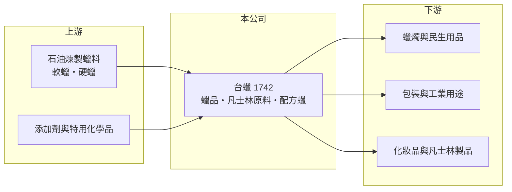

# 1742 台蠟

> 上櫃｜[[產業索引-化學工業|化學工業]]｜上市（櫃）日期 2004/05/14

# 第一章：企業模式與商業藍圖

> [!info] 撰寫說明
> 精簡版，由 Claude 依公開資料整理，架構比照 [[2330台積電]]，資料截至 2026-10-08。來源：winvest 營收快訊（公司簡介與 EPS）、富邦證券（MoneyDJ）財務比率年表、櫃買中心開放資料（2026 年第二季資產負債表）。公開資料有限，產品別營收比重與客戶名稱未查得。#待校對

台蠟（台灣蠟品）是規模很小的蠟品加工廠，把石油煉製後的蠟料調配成各種工業與民生用蠟，近年營收大幅萎縮、本業長期虧損，是一家需要先看清楚「本業還剩多少」的公司。

- **核心業務：** 公司從事軟蠟、硬蠟、凡士林原料、[[配方蠟]]與製蠟特用化學品的開發與製造。蠟品的上游是石油煉製產生的[[石蠟]]，台蠟的角色是把這些原料依客戶需求調配成不同熔點、硬度與純度的產品，用在蠟燭、包裝、化妝品與工業用途（應用別為推估）。
- **營收結構：** 營業項目還包括水產品批發與太陽能光電設備建造買賣，顯示公司曾嘗試多角化，但各項業務比重未查得。2026 年 8 月公司說明營收增加來自蠟品銷售，可推估蠟品仍是主要收入來源。
- **營運據點：** 公司登記地址在桃園大園，掛牌櫃買中心，生產以台灣為主（推估）。資本額約 9.27 億元，但年營收只有一億元上下，資產規模遠大於營業規模。
- **長期方向：** 公開資料沒有揭露明確的長期策略。從營收連續數年下滑來看，公司未來的關鍵在於蠟品本業能否止跌，或是否進行資產活化、轉型等結構性調整。

# 第二章：護城河深度與競爭優勢

蠟品屬於技術門檻不高的加工業，台蠟規模小，護城河相當有限。

- **競爭優勢：** 配方蠟需要依客戶用途調整熔點與硬度，長期合作的客戶會沿用熟悉的配方，帶來一定的黏著度。不過這類調配技術容易被同業複製，優勢主要來自客戶關係，而不是難以取代的技術。
- **主要對手：** 國內外煉油廠本身就有蠟品產出，中國大陸也有大量低價蠟品供應，台蠟在價格上沒有規模優勢（推估）。台灣上市櫃公司中沒有業務完全相同的同業。
- **經營與資本配置：** 2024 年營業利益率 -37.99%，但稅後淨利率 35.78%，表示當年獲利主要來自[[業外收益]]，例如處分資產。公司在本業虧損下多年未配發現金股利，資產帳上仍有不小的非流動資產，未來如何運用是觀察重點。
- **觀察重點：** 營收能否回到穩定水準、毛利能否覆蓋營業費用，以及多角化業務是否有實際貢獻。

# 第三章：財務體質與盈利規模

資料日期：2026-10-08，表格是撰寫當時的快照；最新月營收、毛利率、累計 EPS 由自動排程寫在本筆記的屬性欄位（月營收、毛利率、累計EPS 等）。#待校對

台蠟的財報特色是營收規模極小、本業虧損，獲利高度依賴業外。

| 年度 | 營收（億元，推算） | 營收年增率 | [[毛利率]] | [[營業利益率]] | EPS（元） | [[ROE]] |
|---|---|---|---|---|---|---|
| 2021 | 約 5.0 | 50.02% | 19.12% | 2.91% | 5.16 | 33.24% |
| 2022 | 約 4.8 | -3.69% | 20.89% | -28.04% | -1.34 | -9.33% |
| 2023 | 約 3.9 | -18.67% | 30.12% | 12.44% | 0.41 | 2.98% |
| 2024 | 約 2.3 | -41.02% | 24.76% | -37.99% | 0.89 | 6.14% |
| 2025 | 約 1.1 | -51.69% | 24.08% | -77.95% | -1.08 | -7.50% |

註：年增率、毛利率、營業利益率、EPS、ROE 取自富邦證券（MoneyDJ）財務比率年表；營收金額依 2025 年 EPS、股本與稅後淨利率推算，再以各年年增率回推，屬推算值。

- **營收規模：** 2021 至 2025 年營收從約 5 億元降到約 1.1 億元，年複合成長率約 -31%（推算）。營收縮小後，固定的營業費用占比急速上升，是營業利益率一路惡化的主因。
- **獲利：** 近 5 年平均 ROE 約 5.1%，但這個數字被 2021 年的 33.24% 拉高，而 2021 與 2024 年的獲利都來自業外。扣除業外，本業在 2022、2024、2025 年都是虧損。
- **財務特色：** 2026 年第二季底負債總計約 1.75 億元、股東權益約 12.72 億元，負債比僅約一成，財務風險低。每股淨值約 13.73 元，資產主要是非流動資產，公司的價值更多在帳上資產而非本業獲利能力。
- **[[ROIC]] 與 [[WACC]]：** 以 2025 年推算營收約 1.1 億元、營業利益率 -77.95%、稅率 20% 計算，稅後營業利益約 -0.69 億元；投入資本以股東權益 12.72 億元加有息負債（未查得，以負債總計 1.75 億元為上限）計，ROIC 約 -4.7% 至 -5.4%（推算）。WACC 以 CAPM 推估：無風險利率 1.75%、市場風險溢酬 6%、β 取化工中小型股常見值 0.9（未查得個股 β），股權成本約 7.2%；公司幾乎沒有有息負債，WACC 約 7%（推算）。ROIC 長期低於 WACC，代表目前的本業並沒有替股東創造價值。

# 第四章：總體風險與地緣政治

台蠟的風險集中在本業萎縮與原料價格波動。

- **產業週期：** 蠟品原料來自石油煉製，價格跟著原油與煉油廠產出變動。原料上漲時，小型加工廠不一定能把成本轉嫁給客戶，毛利容易被壓縮。
- **營運風險：** 營收已降到很低的水準，單一客戶或單筆訂單的變動就會造成月營收大幅起伏。若本業持續萎縮，固定費用與折舊會持續侵蝕股東權益。
- **其他風險：** 多角化業務（水產批發、太陽能）資訊揭露有限，投資人難以判斷其風險與效益。蠟品也面臨中國低價產品競爭與化石原料減碳的長期壓力。

# 專有名詞解析

## 金融

- **[[業外收益]]**：本業以外的收入，例如投資收益、處分資產利益或匯兌利益，通常不具持續性。
- **[[ROIC]]**：投入資本報酬率，稅後營業利益除以股東權益加有息負債，衡量本業運用資本的效率。
- **[[WACC]]**：加權平均資金成本，股東與債權人要求報酬率的加權平均，是 ROIC 要超過的門檻。

## 產業

- **[[石蠟]]**：石油煉製過程中分離出的固態烴類，是蠟燭、包裝與化妝品用蠟的主要原料。
- **[[配方蠟]]**：依客戶用途調配不同蠟料與添加劑製成的蠟品，可調整熔點、硬度與光澤。

# 核心供應鏈

- 上游：煉油廠產出的軟蠟、硬蠟等蠟料，以及添加劑（推估）
- 下游／客戶：蠟燭、包裝、化妝品與工業用蠟客戶（推估，公司未揭露客戶名稱）
- 同業：國內外煉油廠的蠟品部門與中國大陸蠟品廠（推估）

## 最新新聞
<!-- news:start -->
<!-- news:end -->

## 相關連結
- [公開資訊觀測站](https://mopsov.twse.com.tw/mops/web/t05st03?step=1&firstin=1&co_id=1742)
- [Goodinfo](https://goodinfo.tw/tw/StockDetail.asp?STOCK_ID=1742)
- [Yahoo 股市](https://tw.stock.yahoo.com/quote/1742)
- [鉅亨網新聞](https://www.cnyes.com/twstock/1742/news)
