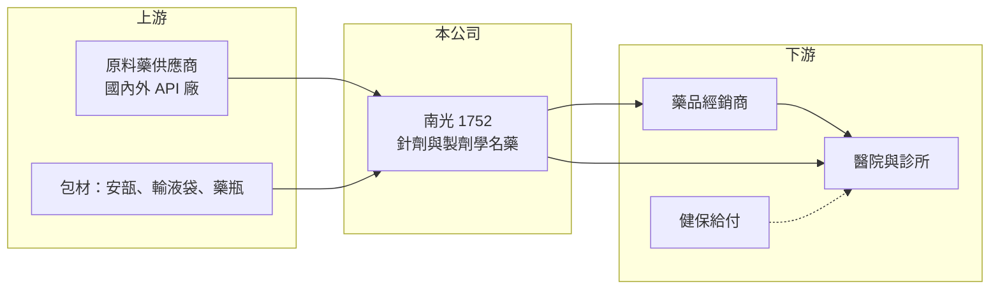

# 1752 南光

> 上市｜[[產業索引-生技醫療業|生技醫療業]]｜上市（櫃）日期 2022/01/19

# 第一章：企業模式與商業藍圖

> [!info] 撰寫說明
> 精簡版，由 Claude 依公開資料整理，架構比照 [[2330台積電]]，資料截至 2026-10-08。來源：證交所開放資料快照（基本資料、2026 上半年損益與資產負債、股利）、Goodinfo 經營績效頁、nstock 公司簡介。產品細項公開資料有限，憑記憶的描述已標待校對。#待校對

南光化學製藥是一家台南的老牌[[學名藥]]廠，本章說明它靠什麼賺錢，以及為何能在健保藥價壓力下維持穩定獲利。

- **核心業務：** 南光成立於 1973 年，主要從事西藥與醫療器材的製造、加工與買賣，2009 年在櫃買中心掛牌、2022 年轉上市。公司以醫院用的針劑、輸液等製劑為主力（產品細項待校對），屬於把[[原料藥]]做成可直接給病人使用的成品藥的製劑廠。針劑的無菌製程門檻比口服錠劑高，這讓南光在學名藥廠中有一定的技術區隔。
- **營收結構：** 公開資料未查得產品別比重，營收主要來自國內醫院與診所通路（推估）。由於台灣藥品多經由健保給付，南光的營收規模與健保藥價調整、醫院用藥量密切相關。2025 年全年營收約 21.6 億元，屬中型製藥廠。
- **營運據點：** 公司與工廠位於台南新化，生產線須符合 PIC/S GMP 規範（待校對）。單一主要廠區的好處是管理集中、成本可控，代價是產能擴充與異地備援較有限。
- **長期方向：** 學名藥廠的長期成長通常來自三條路：增加新的學名藥品項、取得海外藥證外銷，以及承接代工。南光過去五年營收從 17.5 億元成長到 21.6 億元，年複合成長約 4%，屬穩健但不高速的路線。

# 第二章：護城河深度與競爭優勢

南光的護城河不在專利，而在製程門檻、藥證數量與醫院通路的累積，本章說明這些優勢的強度與限制。

- **競爭優勢：** 無菌針劑與輸液需要專用廠房、驗證與品質系統，新進者要花數年才能取得藥證與醫院採購資格。南光經營超過五十年，累積的藥證與醫院關係構成轉換成本，醫院不會輕易更換已穩定使用的針劑供應商。
- **主要對手：** 國內同業包括 1701中化、[[1720生達]]、[[4123晟德]]、[[1734杏輝]] 等製劑廠，以及跨國藥廠的原廠藥。學名藥同質性高，同一成分常有多家廠商競標，價格競爭是常態。
- **觀察重點：** 毛利率長期穩定在 33% 至 36%，代表產品組合與成本控制大致守得住；營業利益率則在 12% 至 17% 間波動，反映費用與藥價調整的影響。未來要觀察新藥證數量、外銷比重能否提高，以及健保藥價調降對毛利的壓力。

# 第三章：財務體質與盈利規模

資料日期：2026-10-08，表格是撰寫當時的快照；最新月營收、毛利率、累計 EPS 由自動排程寫在本筆記的屬性欄位（月營收、毛利率、累計EPS 等）。#待校對

財務數字是檢驗護城河的最終標準。以下用多年度三率、ROE 與資本報酬，檢視南光的獲利品質。

| 年度 | 營收（億元） | [[毛利率]] | [[營業利益率]] | EPS（元） | [[ROE]] |
|---|---|---|---|---|---|
| 2020 | 17.5 | 34.0% | 12.7% | 1.82 | 8.35% |
| 2021 | 17.8 | 33.4% | 14.7% | 1.94 | 8.82% |
| 2022 | 19.4 | 35.8% | 16.6% | 3.49 | 15.1% |
| 2023 | 21.5 | 35.1% | 12.1% | 1.96 | 8.29% |
| 2024 | 22.0 | 34.0% | 14.1% | 2.41 | 10.1% |
| 2025 | 21.6 | 35.6% | 13.7% | 2.42 | 9.93% |
| 2026 上半年 | 10.7 | 36.1% | 13.8% | 0.84 | 未查得 |

- **營收規模：** 2020 至 2025 年營收年複合成長約 4.3%（推算），2025 年較 2024 年小幅衰退。成長平穩，沒有明顯的景氣大起大落，符合醫院用藥需求穩定的特性。
- **獲利：** 近五年（2021 至 2025）平均 ROE 約 10.4%（推算），2022 年 EPS 3.49 元是高點。毛利率長年在 34% 上下，說明南光的獲利主要來自穩定的製造利差，而非高單價新藥。
- **財務特色：** 2025 年度配發現金股利 1.6 元（盈餘 0.8 元加資本公積 0.8 元），約為當年 EPS 的 66%。2026 年第二季末權益約 24.1 億元、負債約 15.3 億元，負債比約 39%，財務結構穩健。
- **[[ROIC]] 與 [[WACC]]：** 以 2025 年營業利益約 2.96 億元（21.6 億 × 13.7%）、稅率 20% 計，稅後營業利益約 2.37 億元；投入資本以 2026 年第二季權益 24.1 億元加非流動負債 3.9 億元（有息負債未查得，以此近似）約 28.0 億元，ROIC 約 8.5%（推算）。WACC 以台灣 10 年期公債 1.75%、市場風險溢酬 6%、β 0.8（中小型製藥股常見值）得權益成本約 6.6%，負債成本 2.5%、稅率 20%、負債權重約 14%，WACC 約 5.9%（推算）。ROIC 高於 WACC 約 2 至 3 個百分點，代表南光長期仍小幅創造價值，但利差不大。

# 第四章：總體風險與地緣政治

學名藥廠的風險多半來自政策與價格，而非技術淘汰，本章列出南光長期須面對的主要風險。

- **產業週期：** 醫院用藥需求受景氣影響小，但健保每隔一段時間調降藥價，會直接壓縮學名藥廠毛利。這種「政策週期」比景氣週期更影響南光的獲利。
- **營運風險：** 針劑與輸液對無菌品質要求極高，一旦發生品質事件或稽核缺失，可能導致停產或回收，影響營收與商譽。單一主要廠區也意味著天災或停工的集中風險。
- **其他風險：** 部分原料藥仰賴進口，原物料價格與匯率波動會影響成本；人力與能源成本上升則持續墊高製造費用。

# 專有名詞解析

## 金融

- **[[ROIC]]**：投入資本報酬率，衡量公司用股東與債權人的錢，每年賺回多少稅後營業利益。
- **[[WACC]]**：加權平均資金成本，股東與債權人要求報酬率的加權平均，是 ROIC 要跨過的門檻。

## 產業

- **[[學名藥]]**：原廠藥專利到期後，由其他藥廠以相同成分、劑型生產的藥品，價格較低、競爭較激烈。
- **[[原料藥]]**：具有藥理活性的化學成分，是製成錠劑、針劑等成品藥的原料。
- **[[PIC S GMP]]**：國際醫藥品稽查協約組織的藥品優良製造規範，台灣製藥廠須符合此標準才能生產販售。

# 核心供應鏈

- 上游：國內外[[原料藥]]廠，例如 [[1789神隆]]、[[1762中化生]]、[[1777生泰]]（是否為南光供應商未查得，僅列產業上游）。
- 下游／客戶：醫院、診所與藥品經銷商，最終由健保給付。
- 同業：1701中化、[[1720生達]]、[[4123晟德]]、[[1734杏輝]]。

## 最新新聞
<!-- news:start -->
<!-- news:end -->

## 相關連結
- [公開資訊觀測站](https://mopsov.twse.com.tw/mops/web/t05st03?step=1&firstin=1&co_id=1752)
- [Goodinfo](https://goodinfo.tw/tw/StockDetail.asp?STOCK_ID=1752)
- [Yahoo 股市](https://tw.stock.yahoo.com/quote/1752)
- [鉅亨網新聞](https://www.cnyes.com/twstock/1752/news)
