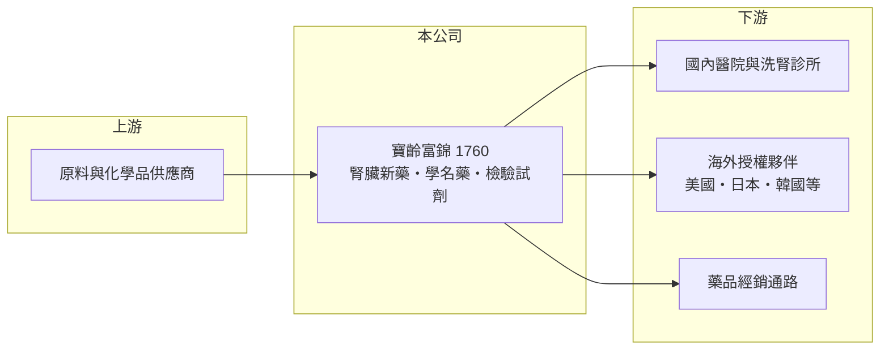

# 1760 寶齡富錦

> 上市｜[[產業索引-生技醫療業|生技醫療業]]｜上市（櫃）日期 2018/01/23

# 第一章：企業模式與商業藍圖

> [!info] 撰寫說明
> 精簡版，由 Claude 依公開資料整理，架構比照 [[2330台積電]]，資料截至 2026-10-08。來源：證交所開放資料快照（基本資料、2026 上半年損益與資產負債、股利）、Goodinfo 經營績效頁、nstock 公司簡介、CMoney 研究報告標題。授權細節為憑記憶整理，已標待校對。#待校對

寶齡富錦是兼具新藥授權與學名藥製造的台灣藥廠，本章拆解它「自有藥廠＋國際授權」的雙軌商業模式。

- **核心業務：** 公司成立於 1976 年，2001 年改為現名，是 PIC/S GMP 藥廠，經營西藥、檢驗試劑、化粧品與食品的製造與經銷。最具代表性的產品是治療洗腎病人高血磷的新藥「拿百磷」（檸檬酸鐵），這是少數由台灣藥廠開發並授權到美、日等國際市場的新藥（授權對象細節待校對）。
- **營收結構：** 公開資料未查得產品別比重。營收大致可分為三塊：國內處方藥銷售、檢驗試劑，以及新藥授權衍生的權利金與原料供應收入（推估）。2021 至 2022 年營收跳升，一部分來自新冠快篩試劑需求（依 CMoney 研究報告標題），屬一次性的成長。
- **營運據點：** 總部位於台北南港，旗下有符合國際規範的製藥廠（廠區地點待校對）。2022 年拿百磷取得韓國核准（依 nstock 所列新聞標題，年份推估）。
- **長期方向：** 公司的長期價值在於把腎臟科領域的新藥經驗延伸到更多市場與適應症，同時用國內學名藥與試劑業務提供穩定現金流。這種「授權收入＋自有製造」的組合，讓它比純研發新藥公司更早獲利，也比純學名藥廠有更高的毛利率。

# 第二章：護城河深度與競爭優勢

寶齡富錦的護城河主要來自新藥專利與腎臟科專業，本章評估這些優勢能維持多久。

- **競爭優勢：** 新藥受專利保護，授權夥伴負責海外臨床與銷售，寶齡富錦只需提供技術與原料，就能收取權利金，屬於資本需求低、毛利高的收入。這也是公司毛利率長年在 48% 至 55%，明顯高於一般學名藥廠的原因。
- **主要對手：** 國際上治療高血磷的藥物還有其他磷結合劑，專利到期後也會面臨學名藥競爭。國內製劑市場的同業包括 [[1720生達]]、[[1752南光]]、1701中化 等。
- **觀察重點：** 拿百磷各市場的專利年限與學名藥進入時點，決定授權收入能持續多久；另一個重點是公司能否推出下一個能授權海外的產品，否則長期成長會回到學名藥廠的水準。

# 第三章：財務體質與盈利規模

資料日期：2026-10-08，表格是撰寫當時的快照；最新月營收、毛利率、累計 EPS 由自動排程寫在本筆記的屬性欄位（月營收、毛利率、累計EPS 等）。#待校對

以下用多年度數據檢視寶齡富錦的獲利品質與資本效率。

| 年度 | 營收（億元） | [[毛利率]] | [[營業利益率]] | EPS（元） | [[ROE]] |
|---|---|---|---|---|---|
| 2020 | 15.7 | 50.7% | 6.66% | 0.36 | 2.15% |
| 2021 | 19.0 | 48.0% | 8.70% | 1.32 | 6.58% |
| 2022 | 24.0 | 55.0% | 17.3% | 2.13 | 9.26% |
| 2023 | 18.8 | 51.8% | 8.33% | 0.90 | 3.94% |
| 2024 | 20.3 | 52.2% | 10.1% | 1.45 | 6.50% |
| 2025 | 20.6 | 54.1% | 14.9% | 2.22 | 9.81% |
| 2026 上半年 | 10.3 | 51.3% | 14.1% | 1.06 | 未查得 |

- **營收規模：** 2020 至 2025 年營收年複合成長約 5.6%（推算），但 2022 年的高點有快篩的一次性貢獻，2023 年隨即回落。扣除這段特殊期間，營收約在 19 億至 21 億元之間。
- **獲利：** 毛利率穩定在 50% 以上，但營業利益率只有 7% 至 17%，代表研發與行銷費用占比高。近五年平均 ROE 約 7.2%（推算），偏低，顯示高毛利尚未完全轉化為高資本報酬。
- **財務特色：** 2025 年度配發現金股利 2.0 元（盈餘 1.8 元加資本公積 0.2 元），約為 EPS 的九成，配息率高。2026 年第二季末權益約 18.7 億元、負債約 13.5 億元。
- **[[ROIC]] 與 [[WACC]]：** 2025 年營業利益約 3.07 億元（20.6 億 × 14.9%），稅後約 2.46 億元；投入資本以權益 18.7 億元加非流動負債 2.3 億元（有息負債未查得，以此近似）約 21.1 億元，ROIC 約 11.6%（推算）。WACC 以無風險利率 1.75%、市場風險溢酬 6%、β 0.8（製藥同業常見值）得權益成本約 6.6%，負債成本 2.5%、稅率 20%、負債權重約 11%，WACC 約 6.0%（推算）。2025 年 ROIC 明顯高於 WACC，但 2020、2023 年獲利低的年份利差接近零，價值創造仍不穩定。

# 第四章：總體風險與地緣政治

新藥授權公司最大的風險是專利到期與單一產品依賴，本章整理寶齡富錦的長期風險。

- **產業週期：** 處方藥需求穩定，但健保藥價調降與國際藥價壓力會逐年侵蝕毛利。授權收入則取決於夥伴的銷售表現與當地保險給付。
- **營運風險：** 獲利高度依賴拿百磷相關收入，若授權夥伴調整策略或專利到期後學名藥進入，權利金可能明顯下降。新品研發需要多年且成功率不確定。
- **其他風險：** 海外收入以外幣計價，匯率波動會影響認列金額；美國藥價政策與關稅也可能影響授權夥伴的銷售。

# 專有名詞解析

## 應用

- **[[高血磷症]]**：腎功能衰竭病人無法排出磷而使血磷過高，洗腎病人常需服用磷結合劑控制。

## 金融

- **[[ROIC]]**：投入資本報酬率，衡量公司用股東與債權人的錢，每年賺回多少稅後營業利益。
- **[[WACC]]**：加權平均資金成本，股東與債權人要求報酬率的加權平均，是 ROIC 要跨過的門檻。

## 產業

- **[[新藥授權]]**：藥廠把研發中或已上市新藥的海外開發、銷售權利授權給他人，換取簽約金、里程碑金與權利金。
- **[[權利金]]**：被授權方依產品銷售額按比例支付給授權方的費用，幾乎沒有對應的生產成本。
- **[[PIC S GMP]]**：國際醫藥品稽查協約組織的藥品優良製造規範，台灣製藥廠須符合此標準才能生產販售。

# 核心供應鏈

- 上游：[[原料藥]]與化學品供應商（具體廠商未查得）。
- 下游／客戶：國內醫院、洗腎診所，以及海外[[新藥授權]]夥伴。
- 同業：[[1720生達]]、[[1752南光]]、1701中化、[[4123晟德]]。

## 最新新聞
<!-- news:start -->
<!-- news:end -->

## 相關連結
- [公開資訊觀測站](https://mopsov.twse.com.tw/mops/web/t05st03?step=1&firstin=1&co_id=1760)
- [Goodinfo](https://goodinfo.tw/tw/StockDetail.asp?STOCK_ID=1760)
- [Yahoo 股市](https://tw.stock.yahoo.com/quote/1760)
- [鉅亨網新聞](https://www.cnyes.com/twstock/1760/news)
