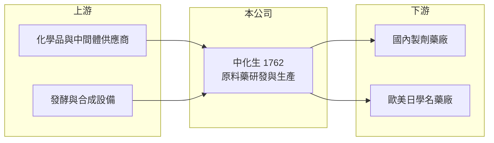

# 1762 中化生

> 上市｜[[產業索引-生技醫療業|生技醫療業]]｜上市（櫃）日期 2010/12/20

# 第一章：企業模式與商業藍圖

> [!info] 撰寫說明
> 精簡版，由 Claude 依公開資料整理，架構比照 [[2330台積電]]，資料截至 2026-10-08。來源：證交所開放資料快照（基本資料、2026 上半年損益與資產負債、股利）、Goodinfo 經營績效頁、nstock 公司簡介。公開資料有限，產品細項與虧損原因未查得。#待校對

中化合成生技是台灣歷史最久的[[原料藥]]廠之一，本章說明原料藥廠的商業模式，以及中化生如何從穩定獲利走到虧損再轉盈。

- **核心業務：** 公司 1964 年設立，原名中國化學合成工業，2003 年更名，2010 年在證交所上市。主要從事原料藥的研究開發、生產與銷售，也就是製造藥品中真正發揮療效的化學成分，再賣給國內外製劑藥廠做成錠劑或針劑。與 1701中化 屬同一集團淵源（關係細節待校對）。
- **營收結構：** 公開資料未查得產品別與地區別比重。原料藥廠的客戶通常是全球學名藥廠，要進入歐美市場必須通過當地主管機關的查廠與 [[DMF]] 登錄，因此少數大客戶與大產品常占營收很高比例（推估）。
- **營運據點：** 生產基地位於台灣（廠區地點待校對）。原料藥製造涉及化學合成或發酵、純化等多段製程，需要大型反應設備與環保處理設施，固定成本高。
- **長期方向：** 2024 至 2025 年營收從 20 億元以上快速下滑到約 8 億元，2025 年出現虧損；2026 年上半年營收回升、恢復獲利。長期能否穩定，取決於公司能否開發新的利基產品、分散客戶與產品集中度。

# 第二章：護城河深度與競爭優勢

原料藥的護城河來自法規認證與製程技術，但也容易受到單一產品價格變動的衝擊，本章分析中化生的競爭地位。

- **競爭優勢：** 原料藥一旦登錄在客戶的藥證中，客戶要更換供應商必須重新申請變更與驗證，耗時一至兩年，因此具有一定的轉換成本。中化生六十年的製程經驗與國際查廠紀錄，是新進者短期難以複製的資產。
- **主要對手：** 國內有 [[1789神隆]]、[[1777生泰]] 等原料藥廠，國際上則面對中國與印度的大型原料藥廠。中印廠商規模大、成本低，常在專利到期後的通用品項以價格搶市。
- **觀察重點：** 2023 至 2025 年毛利率從 49% 一路降到負值，反映主要產品的需求或價格大幅轉弱（原因未查得）。2026 年上半年毛利率回到約 40%，未來要觀察這是產品組合真正改善，還是短期訂單回補。

# 第三章：財務體質與盈利規模

資料日期：2026-10-08，表格是撰寫當時的快照；最新月營收、毛利率、累計 EPS 由自動排程寫在本筆記的屬性欄位（月營收、毛利率、累計EPS 等）。#待校對

中化生近年的財務數字起伏很大，是觀察原料藥廠「產品集中風險」的好例子。

| 年度 | 營收（億元） | [[毛利率]] | [[營業利益率]] | EPS（元） | [[ROE]] |
|---|---|---|---|---|---|
| 2020 | 15.4 | 44.5% | 17.4% | 6.86 | 23.6% |
| 2021 | 19.3 | 49.1% | 22.7% | 5.17 | 14.9% |
| 2022 | 21.2 | 45.4% | 21.9% | 6.01 | 15.3% |
| 2023 | 20.9 | 36.3% | 13.5% | 3.42 | 8.1% |
| 2024 | 13.5 | 29.3% | 0.47% | 0.95 | 1.58% |
| 2025 | 8.05 | -1.1% | -39.7% | -4.39 | -7.57% |
| 2026 上半年 | 6.66 | 40.0% | 17.2% | 2.39 | 未查得 |

- **營收規模：** 2020 至 2025 年營收年複合成長約 -12%（推算），2022 年 21.2 億元的高點到 2025 年剩下不到四成。2026 年 1 至 8 月累計營收約 8.15 億元，已超過 2025 年全年，顯示營運正在回升。
- **獲利：** 2020 至 2022 年 ROE 維持 15% 以上，是體質良好的原料藥廠；2024 年起獲利崩落，2025 年 EPS 為 -4.39 元（Goodinfo 數字；股利公告所列 2025 年淨損約 2.44 億元，換算每股約 -3.2 元，兩者不一致，待校對）。近五年（2021 至 2025）平均 ROE 約 6.5%（推算），被虧損年份拉低。
- **財務特色：** 2025 年因虧損未配發股利，2024 年度現金股利僅約 0.19 元。2026 年第二季末權益約 32.0 億元、負債約 11.6 億元，保留盈餘約 21.5 億元，財務底子仍厚，足以承受虧損期。
- **[[ROIC]] 與 [[WACC]]：** 2025 年營業利益約 -3.20 億元（8.05 億 × -39.7%），稅後約 -2.56 億元；投入資本以權益 32.0 億元加非流動負債 8.7 億元（有息負債未查得，以此近似）約 40.8 億元，2025 年 ROIC 約 -6.3%（推算）。若以 2026 年上半年營業利益 1.15 億元年化，ROIC 約 4.5%（推算）。WACC 以無風險利率 1.75%、市場風險溢酬 6%、β 0.9（考量獲利波動較同業高）得權益成本約 7.2%，負債成本 2.5%、稅率 20%、負債權重約 21%，WACC 約 6.0%（推算）。2025 年 ROIC 為負，代表公司當年在侵蝕股東價值；2026 年雖轉正，仍低於 WACC，要回到 2022 年以前的水準才算重新創造價值。

# 第四章：總體風險與地緣政治

原料藥廠的風險主要來自產品集中、國際價格競爭與法規查核，本章整理中化生的主要風險。

- **產業週期：** 原料藥需求跟著下游學名藥的庫存週期波動，客戶一次去化庫存就可能讓訂單短期大減。專利到期後的新品項會吸引大量廠商投入，價格往往在數年內大幅下滑。
- **營運風險：** 2024 至 2025 年的營收崩落顯示公司對少數產品或客戶的依賴度高。工廠查核若出現缺失，可能被禁止出口到特定市場，影響是全面性的。
- **其他風險：** 外銷以美元計價，新台幣升值會壓縮營收與毛利；中國與印度原料藥廠的擴產則長期壓低全球報價。

# 專有名詞解析

## 金融

- **[[ROIC]]**：投入資本報酬率，衡量公司用股東與債權人的錢，每年賺回多少稅後營業利益。
- **[[WACC]]**：加權平均資金成本，股東與債權人要求報酬率的加權平均，是 ROIC 要跨過的門檻。

## 產業

- **[[原料藥]]**：具有藥理活性的化學成分，是製成錠劑、針劑等成品藥的原料。
- **[[DMF]]**：藥物主檔案，原料藥廠向各國主管機關登錄製程與品質資料，讓使用其原料的製劑廠引用申請藥證。
- **[[學名藥]]**：原廠藥專利到期後，由其他藥廠以相同成分、劑型生產的藥品，價格較低、競爭較激烈。

# 核心供應鏈

- 上游：化學品、中間體與溶劑供應商（具體廠商未查得）。
- 下游／客戶：國內外製劑藥廠與[[學名藥]]廠（客戶名稱未查得）。
- 同業：[[1789神隆]]、[[1777生泰]]，國際上有中國、印度原料藥廠。

## 最新新聞
<!-- news:start -->
<!-- news:end -->

## 相關連結
- [公開資訊觀測站](https://mopsov.twse.com.tw/mops/web/t05st03?step=1&firstin=1&co_id=1762)
- [Goodinfo](https://goodinfo.tw/tw/StockDetail.asp?STOCK_ID=1762)
- [Yahoo 股市](https://tw.stock.yahoo.com/quote/1762)
- [鉅亨網新聞](https://www.cnyes.com/twstock/1762/news)
