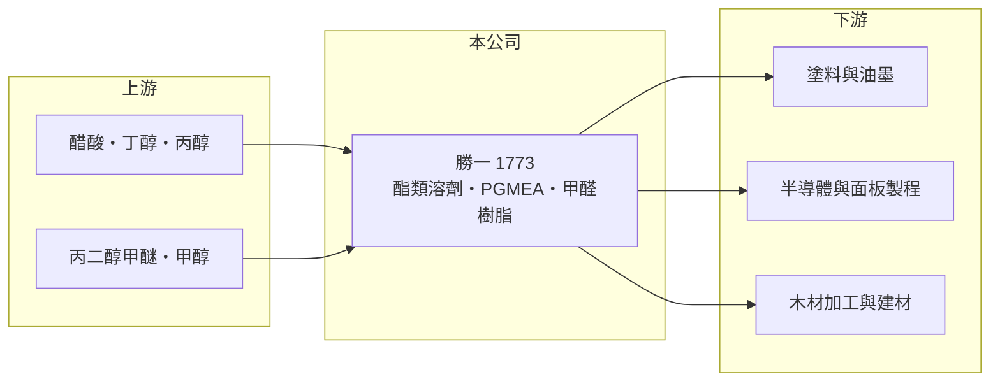

# 1773 勝一

> 上市｜[[產業索引-化學工業|化學工業]]｜上市（櫃）日期 2009/02/27

# 第一章：企業模式與商業藍圖

> [!info] 撰寫說明
> 精簡版，由 Claude 依公開資料整理，架構比照 [[2330台積電]]，資料截至 2026-10-08。來源：winvest 營收快訊（公司簡介與 EPS）、富邦證券（MoneyDJ）財務比率年表、證交所開放資料（2026 年上半年損益、資產負債與股利）。產品別營收比重未查得。#待校對

勝一化工是台灣主要的酯類溶劑製造商，產品從傳統塗料、油墨用溶劑延伸到半導體與面板使用的電子級溶劑，是少數能長期維持兩成上下營業利益率的基礎化工公司。

- **核心業務：** 主要產品包括醋酸丁酯、醋酸丙酯、丙二醇甲醚醋酸酯（[[PGMEA]]）、丙二醇甲醚丙酸酯，以及甲醛、尿素甲醛樹脂等有機化學溶劑。酯類溶劑用來溶解樹脂、調整塗料與油墨的揮發速度；PGMEA 則是光阻與顯影製程常用的溶劑，品質要求比一般工業溶劑高得多。
- **營收結構：** 產品別比重未查得。可以理解為兩大塊：一塊是跟著塗料、油墨、建材景氣走的一般工業溶劑與甲醛樹脂，另一塊是跟著半導體與面板產能走的[[電子級溶劑]]，後者附加價值較高（推估）。
- **營運據點：** 公司 1979 年成立，2009 年上市，資本額 30 億元，工廠位於高雄永安工業區，產品兼顧內銷與外銷。
- **長期方向：** 毛利率從 2018 年約 25% 提升到 2025 年約 35%，顯示產品組合逐年往高純度、高附加價值移動。未來成長的關鍵，是電子級溶劑能否跟著晶圓廠與面板廠的擴產持續放量。

# 第二章：護城河深度與競爭優勢

勝一的護城河來自規模、純化技術與客戶驗證，在大宗化學品中屬於少見的穩定獲利型公司。

- **競爭優勢：** 電子級溶劑對金屬離子與微粒的含量要求極嚴，供應商必須通過晶圓廠與面板廠的長期驗證，一旦導入就不容易被替換。這種驗證門檻讓勝一在電子應用上享有較高的議價能力，也解釋了它的毛利率為何能高於一般溶劑廠。
- **主要對手：** 國內外的酯類溶劑與乙二醇醚廠，包括中國大陸的大型溶劑廠，以及歐美日化工集團的電子化學品部門（推估）。在一般工業溶劑上，中國產能擴張帶來價格競爭；在電子級產品上，競爭者主要是少數通過驗證的國際廠。
- **經營與資本配置：** 2025 年度配發現金股利 4 元，以當年 EPS 6.81 元計算，配息率約 59%。公司保留約四成盈餘，用於擴產與提升純化能力，屬於「穩定配息、穩健再投資」的資本配置風格。
- **觀察重點：** 電子級溶劑的營收占比、毛利率能否守在三成以上，以及中國大宗溶劑產能對報價的壓力。

# 第三章：財務體質與盈利規模

資料日期：2026-10-08，表格是撰寫當時的快照；最新月營收、毛利率、累計 EPS 由自動排程寫在本筆記的屬性欄位（月營收、毛利率、累計EPS 等）。#待校對

勝一過去 5 年營收大致持平，但毛利率與營業利益率持續墊高，獲利品質在化工類股中相對突出。

| 年度 | 營收（億元，推算） | 營收年增率 | [[毛利率]] | [[營業利益率]] | EPS（元） | [[ROE]] |
|---|---|---|---|---|---|---|
| 2021 | 約 111 | 43.27% | 28.11% | 17.12% | 8.08 | 25.77% |
| 2022 | 約 113 | 1.81% | 29.80% | 18.48% | 7.30 | 24.63% |
| 2023 | 約 99 | -13.15% | 32.03% | 18.68% | 6.31 | 18.86% |
| 2024 | 約 111 | 12.22% | 32.58% | 19.14% | 7.21 | 19.52% |
| 2025 | 約 115 | 4.01% | 34.62% | 20.69% | 6.81 | 19.31% |

註：年增率、毛利率、營業利益率、EPS、ROE 取自富邦證券（MoneyDJ）財務比率年表（合併報表）；營收金額依 2025 年 EPS、股本 30 億元與稅後淨利率推算，再以各年年增率回推，屬推算值。

- **營收規模：** 2021 至 2025 年營收年複合成長率約 0.8%（推算），成長來自價格與產品組合，而不是大幅擴產。2023 年營收衰退 13%，但營業利益率仍維持 18.68%，顯示獲利對景氣的敏感度比一般大宗化工低。
- **獲利：** 近 5 年平均 ROE 約 21.6%，即使在 2023 年化工景氣低谷也有 18.86%。2025 年 EPS 略低於 2024 年，主要是股本與營收變動，營業利益率反而創下 5 年新高。
- **財務特色：** 2026 年第二季底股東權益約 115.9 億元、負債總計約 70.8 億元，負債比約 38%，財務結構穩健。每股淨值約 38.12 元。
- **[[ROIC]] 與 [[WACC]]：** 以 2025 年推算營收約 115 億元、營業利益率 20.69%、稅率 20% 計算，稅後營業利益約 19 億元；投入資本以股東權益 115.9 億元加有息負債（未查得，介於 0 與負債總計 70.8 億元之間）計，ROIC 約 10% 至 16%（推算）。WACC 以 CAPM 推估：無風險利率 1.75%、市場風險溢酬 6%、β 取化工股常見值 0.9（未查得個股 β），股權成本約 7.2%；稅前負債成本假設 2.5%、稅後 2.0%，以有息負債約占資本兩成多推估，WACC 約 6%（推算）。ROIC 明顯高於 WACC，代表勝一長期在替股東創造價值，這也是它與多數大宗化工股最大的差別。

# 第四章：總體風險與地緣政治

勝一的風險來自原料價格、大宗溶劑的價格競爭，以及電子產業的資本支出週期。

- **產業週期：** 醋酸、丁醇、丙二醇甲醚等原料價格跟著石化景氣波動，溶劑售價調整往往落後於原料，短期會影響毛利率。一般工業溶劑的需求則跟著塗料、建材與營建景氣起伏。
- **營運風險：** 電子級溶劑的成長仰賴半導體與面板廠擴產，若下游資本支出放緩或產能利用率下降，耗材需求也會減少，屬於[[長鞭效應]]的一環。化工廠也必須面對工安、廢水與揮發性有機物排放的管制。
- **其他風險：** 中國大陸溶劑產能擴張可能壓低區域報價；匯率變動影響外銷利潤；台灣[[碳費]]與減碳法規會提高化工廠的長期營運成本。

# 專有名詞解析

## 金融

- **[[長鞭效應]]**：終端需求的小幅變動，沿供應鏈往上游傳遞時被逐級放大，造成上游庫存與訂單劇烈波動。
- **[[ROIC]]**：投入資本報酬率，稅後營業利益除以股東權益加有息負債，衡量本業運用資本的效率。
- **[[WACC]]**：加權平均資金成本，股東與債權人要求報酬率的加權平均，是 ROIC 要超過的門檻。

## 產業

- **[[PGMEA]]**：丙二醇甲醚醋酸酯，揮發性與溶解力適中的溶劑，是半導體與面板光阻製程常用的溶劑。
- **[[電子級溶劑]]**：金屬離子與微粒含量極低的高純度溶劑，用於半導體與面板製程，需通過客戶長期驗證。
- **[[碳費]]**：政府依企業碳排放量收取的費用，台灣已開徵，高耗能產業成本將上升。

# 核心供應鏈

- 上游：醋酸、丁醇、丙醇、甲醇與丙二醇甲醚等石化原料供應商（推估）
- 下游／客戶：塗料、油墨、黏著劑廠，半導體與面板廠的製程溶劑需求，以及使用甲醛樹脂的木材加工業（推估，公司未揭露客戶名稱）
- 同業：中國大陸酯類溶劑廠與國際化工集團的電子化學品部門（推估）

## 供應鏈關係
- 供應給 [[2330台積電]]：半導體級溶劑 (清洗液)（台積電供應鏈 › 上游：關鍵耗材、特用化學品與氣體）

## 最新新聞
<!-- news:start（自動產生，請勿手動編輯此範圍） -->
- 2026-10-08 📰 媒體 13:11｜勝一營收／9月12.99億元、年增35.23%｜[UDN](https://news.google.com/rss/articles/CBMiUEFVX3lxTE9iLTBZalE5UV9ENElLVlh2eUl2a0VWVDRhQU5nbTJzVDVrYUh1VW0yVF85d0RCX3lHZjVQQTYxd0tKSXU2UWR1Q1YtczdRMGhK0gFWQVVfeXFMT0NMMUNnU0VnT2M1NVk5VHV6R0lONl9mSEp6VjFFcDFrM1hyT1F4ZE00emp1cXk0ZUp6YmhUZHl3RENZRW82ZWNJSC1YWE9tMUM2SFRQRFE?oc=5)
- 2026-10-07 📰 媒體 10:57｜勝一(1773)8月營收連三月創高年增44.62%，半導體溶劑放量撐盤、IPA新產能2027年接棒／ 優分析｜[LINE TODAY](https://news.google.com/rss/articles/CBMiVkFVX3lxTE5YdnVPM01jelFKZ1g4VkNTUGxFTFlDZGRveHhBRklGNXpzSU5hbzdCZFJ0SU9NODdmSTF4YmNNMjdITU5yVTBORktodENrLWFTS2U3b2VR?oc=5)
- 2026-10-07 📰 媒體 10:30｜勝一(1773)8月營收連三月創高年增44.62%，半導體溶劑放量撐盤、IPA新產能2027年接棒｜[鉅亨網](https://news.google.com/rss/articles/CBMiT0FVX3lxTE52QTNtQzdlUWpsN3M1YjhrVk1BZ0JycFBQbXhBUzFGZWdaTWtJYTFiZ3JLOXZ6U1ZtQTNtcS1MSGNsWUhodU04RFJRbXpiRTA?oc=5)
- 2026-10-07 📰 媒體 09:40｜《台北股市》不斷更新！勝一、長華*等營收創高 5年平均殖利率逾5%｜[富聯網](https://news.google.com/rss/articles/CBMiiAFBVV95cUxNVnJUdWZJcUk1cVgxRFhfMkZ6Ry1PMXVUUndpQ0pyWWRuTkJJeFNLbEZUR2lnVlY5Q0xXODJ6emtwOXFaeHktT2ZJbXg0WkQ3dUV6TjhyRzNmYWg2MmFOdE4tcTdtaUtWVlRyTVBuODJybWpRbTY4bG84ZVFHU0g0d0lFbDQ5czFH?oc=5)
- 2026-10-06 📰 媒體 23:07｜勝一(1773) 個股概覽 ／ 個股 - 股市｜[CMoney](https://news.google.com/rss/articles/CBMiU0FVX3lxTE5JTHByTC1pQnN0S1VwbDNPLUpYU3hRQ296R3dwZmJQX0pHSDh0V00wM0VsZXNqZkJ1M2dqRXU3RFVCV0t1SWRCMHgyaU1HRTRXZk5Z?oc=5)

完整紀錄：[[1773勝一 新聞]]
<!-- news:end -->

## 相關連結
- [公開資訊觀測站](https://mopsov.twse.com.tw/mops/web/t05st03?step=1&firstin=1&co_id=1773)
- [Goodinfo](https://goodinfo.tw/tw/StockDetail.asp?STOCK_ID=1773)
- [Yahoo 股市](https://tw.stock.yahoo.com/quote/1773)
- [鉅亨網新聞](https://www.cnyes.com/twstock/1773/news)
