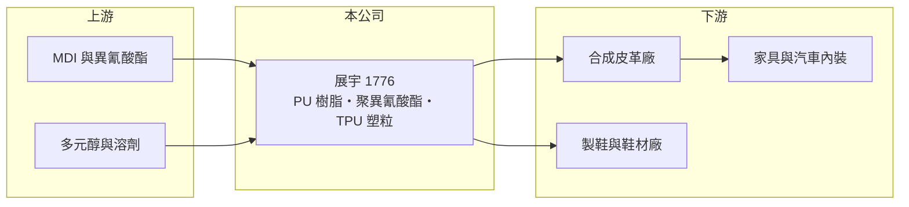

# 1776 展宇

> 上市｜[[產業索引-化學工業|化學工業]]｜上市（櫃）日期 2016/05/09

# 第一章：企業模式與商業藍圖

> [!info] 撰寫說明
> 精簡版，由 Claude 依公開資料整理，架構比照 [[2330台積電]]，資料截至 2026-10-08。來源：winvest 營收快訊（公司簡介與 EPS）、富邦證券（MoneyDJ）財務比率年表、證交所開放資料（基本資料、2026 年上半年損益、資產負債與股利）。產品別營收比重與客戶名稱未查得。#待校對

展宇科技材料是專做聚氨酯（PU）材料的中型化工廠，產品從合成皮革用的 PU 樹脂延伸到 TPU 塑粒，屬於典型「跟著鞋材與紡織景氣走」的配方型化學品公司。

- **核心業務：** 主要產品包括溶劑型、水性與無溶劑型 [[PU樹脂]]，聚異氰酸酯，以及熱可塑性聚氨酯（[[TPU]]）塑粒。PU 樹脂塗布在布料上就成為合成皮革，廣泛用於鞋材、包袋、家具與汽車內裝；TPU 則可以射出或押出成鞋底、薄膜與管材。
- **營收結構：** 產品別比重未查得。從產品線判斷，營收主要來自合成皮革與鞋材相關的 PU 樹脂，TPU 與水性、無溶劑等環保型產品是較新的成長項目（推估）。
- **營運據點：** 公司 1976 年成立，2016 年上市，總部與工廠位於新竹湖口，資本額約 6.01 億元。合成皮革與製鞋產業多數已移往中國大陸與東南亞，展宇的客戶也有相當比例在海外（推估）。
- **長期方向：** 品牌鞋廠與服飾業要求降低揮發性有機溶劑，水性與無溶劑 PU 是產業共同的轉型方向。展宇能否把產品組合轉向環保型與 TPU，決定它未來十年的獲利水準。

# 第二章：護城河深度與競爭優勢

PU 樹脂是配方型產品，展宇的優勢在配方與客戶配合度，但同業眾多，議價能力有限。

- **競爭優勢：** 合成皮革的手感、耐磨與耐水解性都由樹脂配方決定，皮革廠換樹脂供應商需要重新打樣與驗證，因此有一定的轉換成本。展宇橫跨溶劑型、水性與無溶劑型產品，可以配合客戶的環保轉型提供完整方案。
- **主要對手：** 台灣同業包括 [[4714永捷]]、[[1721三晃]] 等 PU 與樹脂廠，以及中國大陸大型 PU 樹脂廠（推估）。中國同業規模大、成本低，在一般溶劑型樹脂上的價格競爭激烈。
- **經營與資本配置：** 2025 年度配發現金股利 0.1 元，以 EPS 0.28 元計算配息率約 36%，在獲利偏低的年度維持小額配息。公司的股本與負債規模都不大，資本配置偏保守。
- **觀察重點：** 環保型 PU 與 TPU 的營收占比，以及毛利率能否從過去 13% 至 21% 的區間往上移動。

# 第三章：財務體質與盈利規模

資料日期：2026-10-08，表格是撰寫當時的快照；最新月營收、毛利率、累計 EPS 由自動排程寫在本筆記的屬性欄位（月營收、毛利率、累計EPS 等）。#待校對

展宇近 5 年營收逐步縮小，營業利益率多在 1% 至 6% 之間，屬於低利潤的材料加工業。

| 年度 | 營收（億元，推估） | 營收年增率 | [[毛利率]] | [[營業利益率]] | EPS（元） | [[ROE]] |
|---|---|---|---|---|---|---|
| 2021 | 約 14.5 | 6.89% | 19.25% | 6.13% | 2.05 | 4.15% |
| 2022 | 約 14.2 | -1.90% | 13.41% | 1.01% | 0.27 | 1.84% |
| 2023 | 約 11.8 | -16.65% | 15.24% | 1.03% | 0.39 | 2.85% |
| 2024 | 約 12.0 | 1.54% | 18.33% | 3.23% | 0.78 | 4.00% |
| 2025 | 約 10.1 | -15.76% | 17.25% | 3.36% | 0.28 | 1.36% |

註：年增率、毛利率、營業利益率、EPS、ROE 取自富邦證券（MoneyDJ）財務比率年表；2025 年營收以 1 至 8 月約 6.76 億元年化推估，再以各年年增率回推，屬推估值。

- **營收規模：** 2021 至 2025 年營收年複合成長率約 -8.6%（推算）。營收下滑反映鞋材與合成皮革需求疲弱，以及中國同業的價格競爭。
- **獲利：** 近 5 年平均 ROE 約 2.8%，遠低於一般股權投資人要求的報酬。2021 年 EPS 2.05 元明顯高於營業利益可解釋的水準，推估有業外收益挹注。
- **財務特色：** 2026 年第二季底股東權益約 9.49 億元、負債總計約 5.11 億元，負債比約 35%。每股淨值約 14.74 元。
- **[[ROIC]] 與 [[WACC]]：** 以 2025 年推估營收約 10.1 億元、營業利益率 3.36%、稅率 20% 計算，稅後營業利益約 0.27 億元；投入資本以股東權益 9.49 億元加有息負債（未查得，介於 0 與負債總計 5.11 億元之間）計，ROIC 約 1.9% 至 2.9%（推算）。WACC 以 CAPM 推估：無風險利率 1.75%、市場風險溢酬 6%、β 取化工中小型股常見值 0.9（未查得個股 β），股權成本約 7.2%；稅前負債成本假設 2.5%、稅後 2.0%，有息負債約占資本兩成，WACC 約 6.1%（推算）。ROIC 長期低於 WACC，代表目前的獲利水準還不足以替股東創造價值，提升產品附加價值是關鍵。

# 第四章：總體風險與地緣政治

展宇的風險集中在下游鞋材景氣、原料價格與環保轉型的速度。

- **產業週期：** 合成皮革與鞋材需求跟著品牌鞋廠的庫存循環起伏，品牌去化庫存時，訂單會沿供應鏈放大縮減，形成[[長鞭效應]]。消費景氣轉弱時，PU 樹脂通常最先受到影響。
- **營運風險：** PU 樹脂的主要原料是 MDI、多元醇與溶劑，價格跟著石化景氣波動；原料上漲時，小型樹脂廠不一定能即時轉嫁，毛利率會被壓縮。
- **其他風險：** 製鞋與合成皮產業持續往東南亞移動，展宇需要跟著客戶布局；各國對揮發性有機物與化學品的管制趨嚴，若環保型產品轉型落後，可能失去品牌供應鏈的資格。

# 專有名詞解析

## 金融

- **[[長鞭效應]]**：終端需求的小幅變動，沿供應鏈往上游傳遞時被逐級放大，造成上游庫存與訂單劇烈波動。
- **[[ROIC]]**：投入資本報酬率，稅後營業利益除以股東權益加有息負債，衡量本業運用資本的效率。
- **[[WACC]]**：加權平均資金成本，股東與債權人要求報酬率的加權平均，是 ROIC 要超過的門檻。

## 產業

- **[[PU樹脂]]**：聚氨酯樹脂，塗布在布料上可製成合成皮革，也用於塗料、黏著劑與鞋材。
- **[[TPU]]**：熱可塑性聚氨酯，兼具橡膠彈性與塑膠加工性的高分子材料，可做成薄膜、鞋材與醫療耗材。

# 核心供應鏈

- 上游：MDI、多元醇、溶劑等石化原料供應商（推估）
- 下游／客戶：合成皮革廠、製鞋與鞋材廠，終端為運動鞋、包袋、家具與汽車內裝（推估，公司未揭露客戶名稱）
- 同業：[[4714永捷]]、[[1721三晃]]，以及中國大陸 PU 樹脂廠（推估）

## 最新新聞
<!-- news:start -->
<!-- news:end -->

## 相關連結
- [公開資訊觀測站](https://mopsov.twse.com.tw/mops/web/t05st03?step=1&firstin=1&co_id=1776)
- [Goodinfo](https://goodinfo.tw/tw/StockDetail.asp?STOCK_ID=1776)
- [Yahoo 股市](https://tw.stock.yahoo.com/quote/1776)
- [鉅亨網新聞](https://www.cnyes.com/twstock/1776/news)
