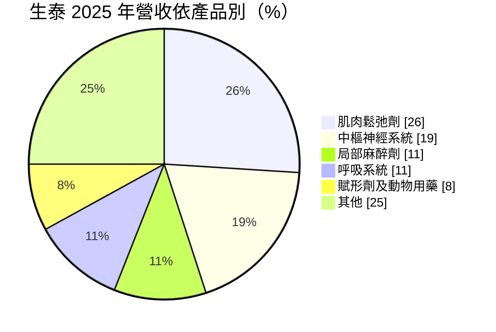
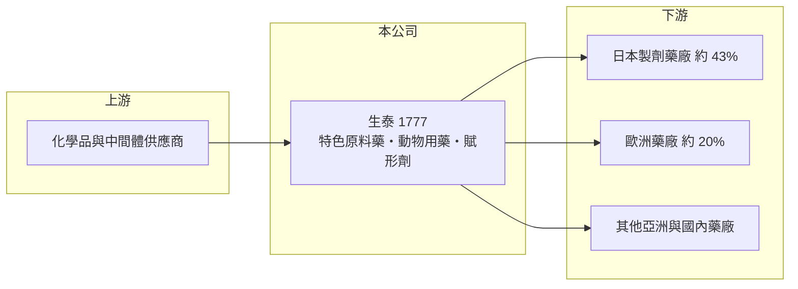

# 1777 生泰

> 上櫃｜[[產業索引-生技醫療業|生技醫療業]]｜上市（櫃）日期 2005/10/19

# 第一章：企業模式與商業藍圖

> [!info] 撰寫說明
> 精簡版，由 Claude 依公開資料整理，架構比照 [[2330台積電]]，資料截至 2026-10-08。來源：櫃買中心開放資料快照（基本資料、2026 上半年損益與資產負債、本益比殖利率）、Goodinfo 經營績效頁、富果 2026 年 5 月法說會備忘錄。#待校對

生泰合成是台南的特色[[原料藥]]廠，以多品項、小批量的利基產品外銷日本與歐洲。本章說明它的產品組合與商業模式。

- **核心業務：** 生泰成立於 1982 年，2005 年在櫃買中心掛牌，以西藥原料藥為核心，另有動物用藥與[[賦形劑]]。產品應用於肌肉鬆弛、中樞神經、呼吸系統、局部麻醉、心血管等領域，穩定產品包括過動症用藥原料、鎮咳祛痰劑等。這些都是產量不大、但需要合成技術與法規文件的利基品項。
- **營收結構：** 依 2025 年產品別，肌肉鬆弛劑約 26%、中樞神經系統約 19%、局部麻醉劑約 11%、呼吸系統約 11%、賦形劑及動物用藥約 8%。依 2026 年第一季地區別，日本約 43% 是最大市場，歐洲約 20%，其他亞洲地區約 19%。

- **營運據點：** 公司與工廠位於台南新營（依登記地址），一廠已完成廠房與設備升級，並透過製程自動化降低約 3% 生產成本（依法說會）。單一地區生產有助於品質管理，但產能擴充需逐步進行。
- **長期方向：** 公司持續開發新品項，包括升壓劑、抗凝血劑、心臟用藥、白內障與帕金森氏症等[[特色原料藥]]，部分品項列在政府必要藥品清單中；並與 [[1720生達]] 合作開發新藥原料，由生泰供應原料、生達製成製劑外銷日本。

# 第二章：護城河深度與競爭優勢

生泰的護城河來自日本客戶的嚴格認證與多品項的利基組合，本章分析其競爭地位。

- **競爭優勢：** 日本藥廠對原料藥供應商的品質與文件要求極嚴，一旦通過查核並以 [[DMF]] 等文件登錄於藥證，客戶很少更換供應商，形成高轉換成本。生泰多年來以日本為最大市場，代表它在品質系統上已取得信任；法說會也提到曾接受國際大藥廠的品質查核。
- **主要對手：** 國內原料藥同業有 [[1789神隆]]、[[1762中化生]]，國際上則是中國與印度的原料藥廠。生泰選擇的品項多屬小眾，大廠投入意願低，價格競爭相對溫和，但部分產品仍面臨激烈價格戰（依法說會）。
- **觀察重點：** 新品項能否順利取得各國登錄並放量，是營收能否擺脫 13 億元上下的關鍵；另外要觀察日本市場占比過高的集中度，以及中國市場的開拓成效。

# 第三章：財務體質與盈利規模

資料日期：2026-10-08，表格是撰寫當時的快照；最新月營收、毛利率、累計 EPS 由自動排程寫在本筆記的屬性欄位（月營收、毛利率、累計EPS 等）。#待校對

生泰是高營益率、低負債的典型利基型原料藥廠，以下用多年度數據檢視其獲利品質。

| 年度 | 營收（億元） | [[毛利率]] | [[營業利益率]] | EPS（元） | [[ROE]] |
|---|---|---|---|---|---|
| 2020 | 9.84 | 37.7% | 26.7% | 6.21 | 15.6% |
| 2021 | 8.93 | 32.6% | 18.9% | 5.77 | 11.0% |
| 2022 | 9.86 | 37.3% | 24.2% | 6.62 | 14.1% |
| 2023 | 11.1 | 36.7% | 25.3% | 5.63 | 11.1% |
| 2024 | 12.6 | 38.7% | 27.9% | 8.82 | 16.1% |
| 2025 | 13.0 | 34.6% | 24.6% | 5.87 | 10.2% |
| 2026 上半年 | 6.12 | 41.2% | 29.9% | 3.64 | 未查得 |

- **營收規模：** 2020 至 2025 年營收年複合成長約 5.7%（推算），2025 年約 13 億元、年增 3%。2026 年第一季因客戶採購時程調整，營收年減約 13%（依法說會），顯示單季波動仍大。
- **獲利：** 營業利益率長年在 19% 至 30%，費用率很低（2026 年上半年營業費用僅占營收約 11%），是小而精的經營模式。近五年平均 ROE 約 12.5%（推算）。2025 年稅後淨利約 2.61 億元、年減 33%，主因 2024 年基期較高（依法說會）。
- **財務特色：** 2025 年度配發現金股利 4.0 元，約為 EPS 的 68%。2026 年第二季末權益約 25.8 億元、負債僅約 5.9 億元，幾乎沒有長期負債，財務非常保守。
- **[[ROIC]] 與 [[WACC]]：** 2025 年營業利益約 3.20 億元（13.0 億 × 24.6%），稅後約 2.56 億元；投入資本以權益 25.8 億元加非流動負債 0.65 億元（有息負債未查得，以此近似）約 26.4 億元，ROIC 約 9.7%（推算）；以 2026 年上半年年化則約 11.1%（推算）。WACC 以無風險利率 1.75%、市場風險溢酬 6%、β 0.8（製藥同業常見值）得權益成本約 6.6%，負債權重僅約 2%，WACC 約 6.4%（推算）。ROIC 穩定高於 WACC 3 至 5 個百分點，代表生泰長期持續創造價值；ROIC 不算極高，是因為帳上累積大量權益與現金，資本使用偏保守。

# 第四章：總體風險與地緣政治

利基型原料藥廠的風險在於市場集中、匯率與新品開發進度，本章整理生泰的長期風險。

- **產業週期：** 原料藥訂單跟著客戶的生產與庫存計畫走，大客戶調整採購時程就會造成單季營收大幅波動，但長期需求相對穩定。
- **營運風險：** 日本市場占比超過四成，若日本藥價政策或主要客戶策略改變，影響會被放大。新品從開發、登錄到放量通常需要數年，進度落後會使成長停滯。
- **其他風險：** 外銷以日圓、美元、歐元計價，匯率波動直接影響營收與毛利；中國與印度廠商的低價競爭則持續壓縮通用品項的利潤。

# 專有名詞解析

## 金融

- **[[ROIC]]**：投入資本報酬率，衡量公司用股東與債權人的錢，每年賺回多少稅後營業利益。
- **[[WACC]]**：加權平均資金成本，股東與債權人要求報酬率的加權平均，是 ROIC 要跨過的門檻。

## 產業

- **[[原料藥]]**：具有藥理活性的化學成分，是製成錠劑、針劑等成品藥的原料。
- **[[特色原料藥]]**：產量小、合成難度或法規門檻較高的利基原料藥品項，競爭者少、價格較穩定。
- **[[賦形劑]]**：藥品中不具療效、用來幫助成形、穩定或溶解的輔助成分。
- **[[DMF]]**：藥物主檔案，原料藥廠向各國主管機關登錄製程與品質資料，讓使用其原料的製劑廠引用申請藥證。

# 核心供應鏈

- 上游：化學品、中間體與溶劑供應商（具體廠商未查得）。
- 下游／客戶：日本、歐洲與亞洲製劑藥廠；新藥原料合作夥伴 [[1720生達]]。
- 同業：[[1789神隆]]、[[1762中化生]]，國際上有中國、印度原料藥廠。

## 最新新聞
<!-- news:start -->
<!-- news:end -->

## 相關連結
- [公開資訊觀測站](https://mopsov.twse.com.tw/mops/web/t05st03?step=1&firstin=1&co_id=1777)
- [Goodinfo](https://goodinfo.tw/tw/StockDetail.asp?STOCK_ID=1777)
- [Yahoo 股市](https://tw.stock.yahoo.com/quote/1777)
- [鉅亨網新聞](https://www.cnyes.com/twstock/1777/news)
